# Contributing to csilk

Thank you for your interest in contributing to csilk! We welcome all contributions, from bug reports and documentation improvements to new features and performance optimizations.

## Table of Contents

- [Prerequisites](#prerequisites)
- [Getting Started](#getting-started)
- [Code Architecture Overview](#code-architecture-overview)
- [Coding Standards](#coding-standards)
- [Testing Guide](#testing-guide)
- [Debugging Guide](#debugging-guide)
- [CI/CD Pipeline](#cicd-pipeline)
- [Pull Request Process](#pull-request-process)
- [Bug Reports](#bug-reports)
- [License](#license)

## Prerequisites

**Required dependencies:**

| Dependency | Ubuntu/Debian | macOS (Homebrew) |
|---|---|---|
| C23 compiler (gcc/clang) | `build-essential` | Xcode CLT |
| CMake >= 3.11 | `cmake` | `cmake` |
| libuv >= 1.48 | fetched automatically | fetched automatically |
| llhttp >= 9.4 | `libllhttp-dev` or fetched | fetched automatically |
| cJSON >= 1.7 | fetched automatically | fetched automatically |
| libyaml | `libyaml-dev` | `libyaml` |
| zlib | `zlib1g-dev` | `zlib` |
| OpenSSL | `libssl-dev` | `openssl` |
| SQLite3 | `libsqlite3-dev` | `sqlite3` |
| libcurl | `libcurl4-openssl-dev` | `curl` |
| pthreads | `libpthread-stubs0-dev` | (system) |

**Optional dependencies:**

| Dependency | Ubuntu/Debian | Feature |
|---|---|---|
| `clang-format` | `clang-format` | Code formatting |
| `clang-tidy` | `clang-tidy` | Static analysis |
| `gcovr` | `pip install gcovr` | Coverage reports |
| `doxygen` | `doxygen` | API docs generation |
| `python3` | `python3` | Mermaid validation |
| libmongoc + libbson | `libmongoc-dev libbson-dev` | MongoDB driver |
| hiredis | `libhiredis-dev` | Redis driver |
| libpq | `libpq-dev` | PostgreSQL driver |
| libmysqlclient | `default-libmysqlclient-dev` | MySQL driver |

**One-liner for Ubuntu:**
```bash
sudo apt-get install -y cmake clang clang-format clang-tidy libyaml-dev \
  zlib1g-dev libcurl4-openssl-dev libpq-dev libmongoc-dev libbson-dev \
  libhiredis-dev libssl-dev libsqlite3-dev doxygen python3
```

## Getting Started

1. **Fork the repository** on GitHub.
2. **Clone your fork** locally:
   ```bash
   git clone https://github.com/yourusername/csilk.git
   cd csilk
   ```
3. **Build the project** and run tests to ensure everything is working:
   ```bash
   mkdir build && cd build
   cmake -DCMAKE_BUILD_TYPE=Debug -DUSE_ASAN=ON ..
   make -j$(nproc)
   ctest --output-on-failure
   ```
4. **Optional: Enable all features**:
   ```bash
   cmake -DCMAKE_BUILD_TYPE=Debug -DUSE_ASAN=ON -DENABLE_OOM_TEST=ON -DUSE_FUZZER=ON ..
   ```

## Code Architecture Overview

```
csilk/
├── include/           # Public API headers
│   ├── csilk.h        # Main framework API
│   └── csilk/         # Module headers
│       ├── app/       # Application layer (admin, workflow)
│       ├── core/      # Internal structures
│       ├── drivers/   # DB/AI driver interfaces
│       └── reflection/ # Runtime reflection
├── src/               # Implementation
│   ├── core/          # Engine: server, router, context, arena, config, logger, URL
│   ├── app/           # High-level API: app, admin dashboard, workflow engine
│   ├── middleware/    # Built-in middleware (16 modules)
│   ├── protocols/     # WebSocket, Swagger
│   ├── drivers/       # DB (SQLite/MySQL/PG/Mongo/Redis) & AI (OpenAI/Ollama)
│   ├── ai/            # AI unified interface
│   ├── crypto/        # Encryption utilities
│   ├── data/          # Database abstraction
│   ├── messaging/     # Message Queue (MQ)
│   ├── reflection/    # Runtime type reflection
│   └── security/      # Permission system
├── tests/             # 120+ unit/integration tests
├── examples/          # Example applications
├── share/             # Runtime assets (admin UI, Swagger UI)
├── docs/              # Documentation (architecture.md, user-manual)
├── scripts/           # Utility scripts (Mermaid validation)
└── cmake/             # CMake modules (sources, tests)
```

**Key architectural concepts:**

- **Onion middleware model**: Requests pass through a chain of handlers, each can pre-process, call `csilk_next()`, and post-process.
- **Radix Tree router**: Prefix tree with fixed-array child nodes for O(k) lookup by path.
- **Arena allocator**: Request-scoped memory pool for zero-fragmentation allocations, reset between keep-alive requests.
- **libuv event loop**: Single-threaded by default; multi-worker via `SO_REUSEPORT` with configurable `worker_threads`.

## Coding Standards

- **C23**: Use standard C23 features. Prefer `static constexpr` over `#define` for constants, `[[nodiscard]]` for error-returning functions. Avoid platform-specific extensions unless necessary (and provide fallbacks).
- **Style**: We use `clang-format` to maintain consistent code style. Run `cmake --build build --target format` before committing.
- **Memory Safety**: Always check memory allocation results. Use the request-scoped `arena` whenever possible for temporary data.
- **Naming**: Functions use `csilk_` prefix. Internal functions use `_csilk_` prefix. Types use `_t` suffix. Macros use `CSILK_` prefix.
- **Documentation**: Document all new public APIs and internal functions using Doxygen comments (`/** ... */` style). Public APIs go in `include/` with `@brief`, `@param`, `@return` tags. Implementation files in `src/` should include `@file` and `@brief` at minimum. Use `@copyright MIT License` for license attribution.

## Testing Guide

The framework has **120+ tests** across core, app, middleware, protocol, security, data, AI, reflection, and messaging modules.

**Run all tests:**
```bash
cd build && ctest --output-on-failure
```

**Run a single test:**
```bash
cd build && ./test_router
```

**Run tests by category:**
```bash
# Core tests only
ctest -R "^test_arena|^test_config|^test_context|^test_router|^test_server|^test_url"

# Middleware tests
ctest -R "^test_auth|^test_cors|^test_csrf|^test_gzip|^test_jwt|^test_session|^test_sse"

# Memory leak detection (ASan)
cmake -DUSE_ASAN=ON .. && ctest --output-on-failure

# OOM (Out-of-Memory) simulation tests
cmake -DENABLE_OOM_TEST=ON .. && ctest -R test_oom

# Fuzz testing
cmake -DUSE_FUZZER=ON .. && cmake --build . --target fuzz_test && ./fuzz_test -max_total_time=30
```

**Code coverage:**
```bash
cmake -DUSE_COVERAGE=ON -DCMAKE_BUILD_TYPE=Debug ..
cmake --build . --target coverage
# Open build/coverage/index.html in browser
```

**Add a new test:**
1. Create `tests/test_your_feature.c` with a `main()` returning 0 on success.
2. Add the test name to the appropriate list in `cmake/tests.cmake`.
3. Build and run: `ctest -R test_your_feature`.

## Debugging Guide

**AddressSanitizer (ASan):**
```bash
cmake -DUSE_ASAN=ON -DCMAKE_BUILD_TYPE=Debug ..
cmake --build . -j$(nproc)
./build/test_xxx  # ASan reports leaks/overruns on exit
```

**Debug with GDB:**
```bash
cmake -DCMAKE_BUILD_TYPE=Debug ..
cmake --build . -j$(nproc)
gdb --args ./build/test_router
(gdb) run
(gdb) bt  # backtrace on crash
```

**Valgrind (slower, more thorough):**
```bash
cmake -DCMAKE_BUILD_TYPE=Debug ..
cmake --build . -j$(nproc)
valgrind --leak-check=full --show-leak-kinds=all ./build/test_router
```

**Enable verbose logging:**
```c
// In your test or application:
csilk_log_set_level(CSILK_LOG_DEBUG);
// Or via config.yaml:
// logger:
//   level: debug
```

**Static analysis:**
```bash
cmake --build build --target tidy
```

**Understanding test failures:**
- Tests exit with code 0 on pass, non-zero on failure.
- Each test prints `PASS`/`FAIL` per sub-case.
- ASan failures print a detailed stack trace of the memory error.
- Use `ctest --output-on-failure -V` for verbose test output.

## CI/CD Pipeline

The project uses GitHub Actions (`.github/workflows/ci.yml`) with three jobs:

1. **build_and_test** (on push/PR to `main`):
   - Install dependencies (clang, cmake, libyaml, zlib, curl, postgres)
   - Validate Mermaid diagrams in documentation
   - Configure with ASan + OOM test enabled
   - Build all targets
   - Run clang-tidy static analysis
   - Run all 96+ tests with `ctest`

2. **fuzz** (on push/PR to `main`):
   - Build fuzz test binary
   - Run libFuzzer for 10 seconds per input

**Before submitting a PR**, ensure your branch passes:
- [ ] `cmake --build build --target format` (code style)
- [ ] `cmake --build build --target tidy` (static analysis)
- [ ] `ctest --output-on-failure` (all tests pass)

## Pull Request Process

```mermaid
%%{init: {'theme': 'base', 'themeVariables': {'background': '#2E3440','primaryColor':'#81A1C1','primaryBorderColor':'#4C566A','primaryTextColor':'#ECEFF4','secondaryColor':'#3B4252','secondaryBorderColor':'#434C5E','secondaryTextColor':'#D8DEE9','lineColor':'#81A1C1','textColor':'#ECEFF4','mainBkg':'#3B4252','nodeBorder':'#4C566A','clusterBkg':'#2E3440','clusterBorder':'#4C566A','titleColor':'#ECEFF4','edgeLabelBackground':'#3B4252','nodeTextColor':'#ECEFF4'}, 'flowchart': {'htmlLabels': true, 'curve': 'basis'}}}%%
graph LR
    A["fa:fa-code-fork Create feature branch<br/>git checkout -b feat/xxx"] --> B["fa:fa-wrench Implement + test<br/>Add tests & verify locally"]
    B --> C["fa:fa-check-circle Verify<br/>ctest --output-on-failure<br/>cmake --build . --target tidy<br/>cmake --build . --target format"]
    C --> D["fa:fa-upload Push to fork<br/>git push origin feat/xxx"]
    D --> E{"fa:fa-github Open PR<br/>against main branch"}
    E --> F["fa:fa-robot CI Checks<br/>build + test + fuzz<br/>Mermaid validation<br/>clang-tidy"]
    F --> G{"fa:fa-comments Code Review"}
    G -- "Changes requested" --> B
    G -- "Approved" --> H["fa:fa-check-square-o Merge<br/>Squash & merge"]
    H --> I["fa:fa-trash Clean up<br/>Delete feature branch"]

    style A fill:#3B4252,stroke:#81A1C1,color:#ECEFF4
    style B fill:#3B4252,stroke:#81A1C1,color:#ECEFF4
    style C fill:#3B4252,stroke:#81A1C1,color:#ECEFF4
    style D fill:#3B4252,stroke:#81A1C1,color:#ECEFF4
    style E fill:#3B4252,stroke:#81A1C1,color:#ECEFF4
    style F fill:#3B4252,stroke:#81A1C1,color:#ECEFF4
    style G fill:#3B4252,stroke:#81A1C1,color:#ECEFF4
    style H fill:#3B4252,stroke:#A3BE8C,color:#ECEFF4
    style I fill:#3B4252,stroke:#BF616A,color:#ECEFF4
```



1. **Create a new branch** for your work:
   ```bash
   git checkout -b feature/your-feature-name
   ```
2. **Implement your changes** and add tests if applicable.
3. **Verify your changes**:
   - Run `ctest --output-on-failure` to ensure no regressions.
   - Run `cmake --build build --target tidy` to check for static analysis issues.
   - Run `cmake --build build --target format` to ensure code style consistency.
4. **Commit your changes** with a clear and concise message:
   ```bash
   git add -A && git commit -m "feat: brief description of changes"
   ```
5. **Push to your fork** and **open a Pull Request** against the `main` branch.

**PR title conventions:**
- `feat:` — New feature
- `fix:` — Bug fix
- `test:` — Test additions or improvements
- `docs:` — Documentation changes
- `perf:` — Performance improvements
- `refactor:` — Code restructuring
- `ci:` — CI/CD changes

## Bug Reports

If you find a bug, please open an issue on GitHub with:
- A clear description of the problem.
- Steps to reproduce the issue.
- Expected vs. actual behavior.
- Your environment (OS, compiler version, libuv version).

## License

By contributing to csilk, you agree that your contributions will be licensed under the project's [MIT License](LICENSE).
