# 为 csilk 贡献代码

感谢您对 csilk 的兴趣！我们欢迎各种形式的贡献，从错误报告和文档改进到新功能和性能优化。

## 目录

- [先决条件](#先决条件)
- [快速开始](#快速开始)
- [代码架构概览](#代码架构概览)
- [编码规范](#编码规范)
- [测试指南](#测试指南)
- [调试指南](#调试指南)
- [CI/CD 流水线](#cicd-流水线)
- [Pull Request 流程](#pull-request-流程)
- [错误报告](#错误报告)
- [许可证](#许可证)

## 先决条件

**必需依赖：**

| 依赖 | Ubuntu/Debian | macOS (Homebrew) |
|---|---|---|
| C23 编译器 (gcc/clang) | `build-essential` | Xcode CLT |
| CMake >= 3.11 | `cmake` | `cmake` |
| libuv >= 1.48 | 自动获取 | 自动获取 |
| llhttp >= 9.4 | `libllhttp-dev` 或自动获取 | 自动获取 |
| cJSON >= 1.7 | 自动获取 | 自动获取 |
| libyaml | `libyaml-dev` | `libyaml` |
| zlib | `zlib1g-dev` | `zlib` |
| OpenSSL | `libssl-dev` | `openssl` |
| SQLite3 | `libsqlite3-dev` | `sqlite3` |
| libcurl | `libcurl4-openssl-dev` | `curl` |
| pthreads | `libpthread-stubs0-dev` | (系统自带) |

**可选依赖：**

| 依赖 | Ubuntu/Debian | 用途 |
|---|---|---|
| `clang-format` | `clang-format` | 代码格式化 |
| `clang-tidy` | `clang-tidy` | 静态分析 |
| `gcovr` | `pip install gcovr` | 覆盖率报告 |
| `doxygen` | `doxygen` | API 文档生成 |
| `python3` | `python3` | Mermaid 验证 |
| libmongoc + libbson | `libmongoc-dev libbson-dev` | MongoDB 驱动 |
| hiredis | `libhiredis-dev` | Redis 驱动 |
| libpq | `libpq-dev` | PostgreSQL 驱动 |
| libmysqlclient | `default-libmysqlclient-dev` | MySQL 驱动 |

**Ubuntu 一键安装：**
```bash
sudo apt-get install -y cmake clang clang-format clang-tidy libyaml-dev \
  zlib1g-dev libcurl4-openssl-dev libpq-dev libmongoc-dev libbson-dev \
  libhiredis-dev libssl-dev libsqlite3-dev doxygen python3
```

## 快速开始

1. 在 GitHub 上 **Fork 仓库**。
2. **克隆你的 Fork** 到本地：
   ```bash
   git clone https://github.com/yourusername/csilk.git
   cd csilk
   ```
3. **构建项目** 并运行测试确保一切正常：
   ```bash
   mkdir build && cd build
   cmake -DCMAKE_BUILD_TYPE=Debug -DUSE_ASAN=ON ..
   make -j$(nproc)
   ctest --output-on-failure
   ```
4. **可选：启用所有特性**：
   ```bash
   cmake -DCMAKE_BUILD_TYPE=Debug -DUSE_ASAN=ON -DENABLE_OOM_TEST=ON -DUSE_FUZZER=ON ..
   ```

## 代码架构概览

```
csilk/
├── include/           # 公共 API 头文件
│   ├── csilk.h        # 主框架 API
│   └── csilk/         # 模块头文件
│       ├── app/       # 应用层（admin, workflow）
│       ├── core/      # 内部结构
│       ├── drivers/   # 数据库/AI 驱动接口
│       └── reflection/ # 运行时反射
├── src/               # 实现
│   ├── core/          # 引擎：server, router, context, arena, config, logger, URL
│   ├── app/           # 高层 API：app, admin dashboard, workflow engine
│   ├── middleware/    # 内置中间件（16 个模块）
│   ├── protocols/     # WebSocket, Swagger
│   ├── drivers/       # 数据库（SQLite/MySQL/PG/Mongo/Redis）& AI（OpenAI/Ollama）
│   ├── ai/            # AI 统一接口
│   ├── crypto/        # 加密工具
│   ├── data/          # 数据库抽象层
│   ├── messaging/     # 消息队列（MQ）
│   ├── reflection/    # 运行时类型反射
│   └── security/      # 权限系统
├── tests/             # 120+ 单元/集成测试
├── examples/          # 示例应用
├── share/             # 运行时资源（admin UI, Swagger UI）
├── docs/              # 文档（architecture.md, user-manual）
├── scripts/           # 工具脚本（Mermaid 验证）
└── cmake/             # CMake 模块（sources, tests）
```

**关键架构概念：**

- **洋葱中间件模型**：请求通过处理器链，每个处理器可以预处理、调用 `csilk_next()` 和后处理。
- **Radix Tree 路由**：前缀树配合固定数组子节点，O(k) 路径查找。
- **Arena 分配器**：请求级内存池，零碎片分配，在 keep-alive 请求间重置。
- **libuv 事件循环**：默认单线程；通过 `SO_REUSEPORT` 支持多 worker，可配置 `worker_threads`。

## 编码规范

- **C23**：使用标准 C23 特性。常量优先使用 `static constexpr` 而非 `#define`，错误返回函数使用 `[[nodiscard]]`。除非必要且提供备选方案，避免平台特定扩展。
- **风格**：使用 `clang-format` 保持代码风格一致。提交前运行 `cmake --build build --target format`。
- **内存安全**：始终检查内存分配结果。临时数据尽可能使用请求级 `arena`。
- **命名**：函数使用 `csilk_` 前缀。内部函数使用 `_csilk_` 前缀。类型使用 `_t` 后缀。宏使用 `CSILK_` 前缀。
- **文档**：使用 Doxygen 注释（`/** ... */` 风格）记录所有新的公共 API 和内部函数。公共 API 放在 `include/` 中，包含 `@brief`、`@param`、`@return` 标签。`src/` 中的实现文件至少包含 `@file` 和 `@brief`。使用 `@copyright MIT License` 进行许可证归属。

## 测试指南

框架拥有 **120+ 测试**，覆盖核心、应用、中间件、协议、安全、数据、AI、反射和消息模块。

**运行所有测试：**
```bash
cd build && ctest --output-on-failure
```

**运行单个测试：**
```bash
cd build && ./test_router
```

**按类别运行测试：**
```bash
# 仅核心测试
ctest -R "^test_arena|^test_config|^test_context|^test_router|^test_server|^test_url"

# 中间件测试
ctest -R "^test_auth|^test_cors|^test_csrf|^test_gzip|^test_jwt|^test_session|^test_sse"

# 内存泄漏检测（ASan）
cmake -DUSE_ASAN=ON .. && ctest --output-on-failure

# OOM（内存耗尽）模拟测试
cmake -DENABLE_OOM_TEST=ON .. && ctest -R test_oom

# Fuzz 测试
cmake -DUSE_FUZZER=ON .. && cmake --build . --target fuzz_test && ./fuzz_test -max_total_time=30
```

**代码覆盖率：**
```bash
cmake -DUSE_COVERAGE=ON -DCMAKE_BUILD_TYPE=Debug ..
cmake --build . --target coverage
# 在浏览器中打开 build/coverage/index.html
```

**添加新测试：**
1. 创建 `tests/test_your_feature.c`，其中 `main()` 在成功时返回 0。
2. 将测试名称添加到 `cmake/tests.cmake` 中的相应列表。
3. 构建并运行：`ctest -R test_your_feature`。

## 调试指南

**AddressSanitizer（ASan）：**
```bash
cmake -DUSE_ASAN=ON -DCMAKE_BUILD_TYPE=Debug ..
cmake --build . -j$(nproc)
./build/test_xxx  # ASan 在退出时报告泄漏/越界
```

**使用 GDB 调试：**
```bash
cmake -DCMAKE_BUILD_TYPE=Debug ..
cmake --build . -j$(nproc)
gdb --args ./build/test_router
(gdb) run
(gdb) bt  # 崩溃时的回溯
```

**Valgrind（较慢但更彻底）：**
```bash
cmake -DCMAKE_BUILD_TYPE=Debug ..
cmake --build . -j$(nproc)
valgrind --leak-check=full --show-leak-kinds=all ./build/test_router
```

**启用详细日志：**
```c
// 在测试或应用中：
csilk_log_set_level(CSILK_LOG_DEBUG);
// 或通过 config.yaml：
// logger:
//   level: debug
```

**静态分析：**
```bash
cmake --build build --target tidy
```

**理解测试失败：**
- 测试退出码 0 表示通过，非零表示失败。
- 每个测试打印每个子用例的 `PASS`/`FAIL`。
- ASan 失败会打印内存错误的详细堆栈跟踪。
- 使用 `ctest --output-on-failure -V` 获取详细测试输出。

## CI/CD 流水线

项目使用 GitHub Actions（`.github/workflows/ci.yml`），包含三个任务：

1. **build_and_test**（push/PR 到 `main` 时触发）：
   - 安装依赖（clang, cmake, libyaml, zlib, curl, postgres）
   - 验证文档中的 Mermaid 图表
   - 使用 ASan + OOM 测试进行配置
   - 构建所有目标
   - 运行 clang-tidy 静态分析
   - 使用 `ctest` 运行所有 96+ 测试

2. **fuzz**（push/PR 到 `main` 时触发）：
   - 构建 fuzz 测试二进制文件
   - 对每个输入运行 libFuzzer 10 秒

**提交 PR 前**，确保你的分支通过以下检查：
- [ ] `cmake --build build --target format`（代码风格）
- [ ] `cmake --build build --target tidy`（静态分析）
- [ ] `ctest --output-on-failure`（所有测试通过）

## Pull Request 流程

```mermaid
%%{init: {'theme': 'base', 'themeVariables': {'background': '#2E3440','primaryColor':'#81A1C1','primaryBorderColor':'#4C566A','primaryTextColor':'#ECEFF4','secondaryColor':'#3B4252','secondaryBorderColor':'#434C5E','secondaryTextColor':'#D8DEE9','lineColor':'#81A1C1','textColor':'#ECEFF4','mainBkg':'#3B4252','nodeBorder':'#4C566A','clusterBkg':'#2E3440','clusterBorder':'#4C566A','titleColor':'#ECEFF4','edgeLabelBackground':'#3B4252','nodeTextColor':'#ECEFF4'}, 'flowchart': {'htmlLabels': true, 'curve': 'basis'}}}%%
graph LR
    A["fa:fa-code-fork 创建功能分支<br/>git checkout -b feat/xxx"] --> B["fa:fa-wrench 实现 + 测试<br/>添加测试并本地验证"]
    B --> C["fa:fa-check-circle 验证<br/>ctest --output-on-failure<br/>cmake --build . --target tidy<br/>cmake --build . --target format"]
    C --> D["fa:fa-upload 推送到 Fork<br/>git push origin feat/xxx"]
    D --> E{"fa:fa-github 提交 PR<br/>目标: main 分支"}
    E --> F["fa:fa-robot CI 检查<br/>build + test + fuzz<br/>Mermaid 验证<br/>clang-tidy"]
    F --> G{"fa:fa-comments 代码审查"}
    G -- "请求修改" --> B
    G -- "批准" --> H["fa:fa-check-square-o 合并<br/>Squash & merge"]
    H --> I["fa:fa-trash 清理<br/>删除功能分支"]

    style A fill:#3B4252,stroke:#81A1C1,color:#ECEFF4
    style B fill:#3B4252,stroke:#81A1C1,color:#ECEFF4
    style C fill:#3B4252,stroke:#81A1C1,color:#ECEFF4
    style D fill:#3B4252,stroke:#81A1C1,color:#ECEFF4
    style E fill:#3B4252,stroke:#81A1C1,color:#ECEFF4
    style F fill:#3B4252,stroke:#81A1C1,color:#ECEFF4
    style G fill:#3B4252,stroke:#81A1C1,color:#ECEFF4
    style H fill:#3B4252,stroke:#A3BE8C,color:#ECEFF4
    style I fill:#3B4252,stroke:#BF616A,color:#ECEFF4
```



1. **为你的工作创建新分支**：
   ```bash
   git checkout -b feature/your-feature-name
   ```
2. **实现你的更改**，并在适用时添加测试。
3. **验证你的更改**：
   - 运行 `ctest --output-on-failure` 确保没有回归。
   - 运行 `cmake --build build --target tidy` 检查静态分析问题。
   - 运行 `cmake --build build --target format` 确保代码风格一致。
4. **提交你的更改**，使用清晰简洁的提交信息：
   ```bash
   git add -A && git commit -m "feat: brief description of changes"
   ```
5. **推送到你的 Fork** 并 **针对 `main` 分支提交 Pull Request**。

**PR 标题约定：**
- `feat:` — 新功能
- `fix:` — 错误修复
- `test:` — 测试添加或改进
- `docs:` — 文档更改
- `perf:` — 性能改进
- `refactor:` — 代码重构
- `ci:` — CI/CD 更改

## 错误报告

如果你发现错误，请在 GitHub 上提交 issue，包含：
- 问题的清晰描述。
- 复现问题的步骤。
- 预期行为与实际行为。
- 你的环境（操作系统、编译器版本、libuv 版本）。

## 许可证

通过为 csilk 贡献代码，你同意你的贡献将按照项目的 [MIT 许可证](LICENSE) 进行许可。
