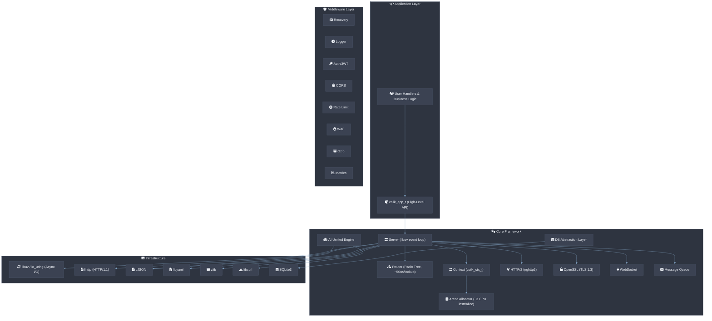

# csilk


A lightweight (~150KB static binary, < 2 MB RSS per 10K keep-alive connections) HTTP web framework written in C, delivering **P99 latency ≤ 5ms under 10K QPS** on commodity hardware. Inspired by Gin (Golang) and built on top of **libuv (default) or io_uring (optional, Linux-only)**, llhttp, nghttp2, and cJSON.


## Features

- 🚀 **P99 latency ≤ 5ms under 10K QPS** using libuv (default) or io_uring (optional, Linux-only) for asynchronous I/O
- **Zero-copy HTTP Parsing** — Directly references TCP/SSL receive buffers using string views (`csilk_str_view_t`), avoiding heap `malloc`/`free` churn for HTTP URLs, headers, and bodies.
- **Zero-copy Static File Serving** via `sendfile` integration
- **SIMD-accelerated routing** — AVX2 (x86_64): ~50ns/route, NEON (aarch64): ~80ns/route
- **Lock-free per-worker connection pool** for multi-core scaling (linear ~200K QPS on 16 cores)
- **Real-time CPU Flame Graph** — Backtrace sampling for performance profiling in admin dashboard
- **Hot Reload** — Swap router at runtime without restart
- 📬 **Internal Event Bus** - Asynchronous, thread-safe Message Queue with middleware and subscriber support
- 📈 **Native Prometheus Metrics** - Built-in observability for QPS, latency, and status codes
- 🖥️ **Unified Admin Dashboard** - Web-based real-time monitoring of HTTP, AI Workflows, MQ, and CPU flame graphs
- 🛡️ **Native HTTPS/TLS support** via OpenSSL integration (TLS 1.3 **MUST** be used in production)
- 🌐 **HTTP/2 support** via nghttp2 (ALPN negotiation, multiplexing, HPACK, Server Push)
- 🔑 **JWT (JSON Web Token)** authentication middleware (HS256)
- 🔌 **Extensible Hook system** for lifecycle events (Server, Connection, Request)
- 🔧 **Pluggable Crypto Driver** for custom hashing and UUID algorithms
- 🔐 **Pluggable Cipher Driver** for AES-256-GCM, RSA-OAEP, and RSA-PSS
- 🗄️ **Pluggable Database Drivers** - SQLite, MySQL, PostgreSQL, MongoDB, Redis
- 🔧 Middleware support (logger, recovery, auth, CORS, CSRF, rate limiting, static files)
- 🌐 RESTful API routing with parameter handling and route groups
- 📦 JSON support via cJSON (parse, serialize, error responses, reflection binding)
- 🍪 Cookie parsing and setting (with Max-Age, Secure, HttpOnly, etc.)
- 🔌 WebSocket support (RFC 6455 handshake, frame send/receive)
- 📡 Server-Sent Events (SSE) with csilk_sse_init/send/close
- 📦 Gzip response compression middleware (with intelligent skipping for media)
- 📤 Multipart/form-data file upload parsing
- 🔍 URL parsing and query string handling
- 📝 URL-encoded form body parsing (`csilk_parse_form_urlencoded`, `csilk_for_each_form_field`)
- ⚡ Keep-alive connection support
- 🛡️ Graceful error handling with crash recovery (setjmp/longjmp)
- 📋 YAML configuration (server, logger, CORS, rate limit, static files, middleware)
- 🏗️ Arena allocator for request-scoped memory management (~3 CPU instructions per alloc, ≤ 5ns reset)
- **Deferred Cleanup API** (`csilk_ctx_defer`) — panic-safe resource management
- **Opaque Context API** for ABI stability
- **Built-in Health Check** handler (/healthz)
- **Request ID middleware** for end-to-end tracing (X-Request-Id)
- **WAF (Web Application Firewall)** middleware

## Architecture Overview



## Framework Comparison

| Dimension | csilk (C) | Gin (Go) | Express (Node.js) |
|:----------|:---------:|:--------:|:-----------------:|
| **Binary Size** | ~150 KB | ~15 MB | N/A (interpreted) |
| **P99 Latency (10K QPS)** | ≤ 5 ms | ~3 ms | ~50 ms |
| **Max Throughput (4 cores)** | ~50K QPS | ~80K QPS | ~10K QPS |
| **Memory per 10K connections** | ≤ 2 MB RSS | ~20 MB RSS | ~50 MB RSS |

## Dependencies

- [libuv](https://github.com/libuv/libuv) or [liburing](https://github.com/axboe/liburing) - Asynchronous I/O library
- [llhttp](https://github.com/nodejs/llhttp) - HTTP/1.1 parser
- [nghttp2](https://github.com/nghttp2/nghttp2) - HTTP/2 library
- [cJSON](https://github.com/DaveGamble/cJSON) - JSON parser
- [libyaml](https://github.com/yaml/libyaml) - YAML parser
- [OpenSSL](https://www.openssl.org/) - TLS/SSL and Cryptographic library
- [zlib](https://www.zlib.net/) - Gzip compression
- [libcurl](https://curl.se/libcurl/) - HTTP client (AI drivers)
- [sqlite3](https://www.sqlite.org/) - Embedded SQL database

libuv (default), liburing (optional, `-DCSILK_USE_URING=ON`), nghttp2, and cJSON are automatically fetched during build via CMake's FetchContent. llhttp is used from the system if available, otherwise fetched. libyaml, OpenSSL, zlib, libcurl, and sqlite3 must be installed as system dependencies.

### Installation (Debian/Ubuntu)
```bash
sudo apt install libyaml-dev libssl-dev zlib1g-dev libcurl4-openssl-dev libsqlite3-dev
```

## Supported Platforms

csilk **MUST** be compiled with a C23-compatible compiler (`static constexpr`, `nullptr`, `bool` keywords). GCC 13+ and Clang 19+ are the only supported compilers.

### Compilers

| Compiler        | Minimum Version | Notes                                                    |
|-----------------|:--------------:|----------------------------------------------------------|
| **GCC**         | 13+            | Full C23 support. Primary CI target on Ubuntu 24.04.     |
| **Clang**       | 19+            | C23 `constexpr` support. libFuzzer fuzzing.              |
| **Apple Clang** | —              | Not supported — lacks C23 `constexpr` and `nullptr`.     |
| **MSVC**        | —              | Not supported — POSIX APIs (libuv, pthread, sys/socket). |

### Operating Systems

| Platform          | Status      | Notes                                                       |
|-------------------|:-----------:|-------------------------------------------------------------|
| **Linux**         | Supported   | Ubuntu 24.04 (CI), Debian 12+, any glibc-based distro.      |
| **macOS**         | Supported (single-worker) | Missing `pthread_barrier_t` in multi-worker mode on macOS-14. |
| **Windows**       | Not planned | POSIX dependency surface too large (libuv may enable).      |
| **musl / Alpine** | Untested    | Likely compatible; no CI coverage.                          |

### Dependency Versions

| Dependency     | Minimum   | Purpose                        |
|----------------|:---------:|--------------------------------|
| CMake          | 3.11      | Build system                   |
| OpenSSL        | 1.1.1     | TLS, crypto, JWT (HS256)       |
| libcurl        | 7.80.0    | HTTP client (AI drivers)       |
| libyaml        | 0.2.0     | Configuration parsing          |
| zlib           | 1.2.0     | Gzip compression               |
| sqlite3        | 3.20.0    | Embedded database              |
| pthread        | —         | Threading (system)             |

## Building

### Prerequisites

- CMake 3.11 or higher (**MUST** be available in `$PATH`)
- C compiler with C23 support (GCC 13+ or Clang 19+)
- Git (for fetching dependencies)
- System dependencies: `sudo apt install libyaml-dev libssl-dev zlib1g-dev libcurl4-openssl-dev libsqlite3-dev`
- OpenSSL 1.1.1+ (**MUST** for TLS/HTTPS and JWT support)
- libcurl 7.80.0+ (**MUST** for AI driver HTTP transport)

### Build Steps

```bash
# Clone the repository
git clone https://github.com/yourusername/csilk.git
cd csilk

# Create a build directory
mkdir build && cd build

# Configure with CMake
cmake ..

# Build
make

# By default, csilk builds as a static library with the libuv backend.
# To build the io_uring backend (Linux-only), use:
# cmake .. -DCSILK_USE_URING=ON
#
# To build as a shared library, use:
# cmake .. -DCSILK_BUILD_SHARED=ON
#
# Other available options:
#   -DUSE_ASAN=ON          Enable AddressSanitizer (default OFF)
#   -DCSILK_BUILD_SHARED=ON Build shared library (default OFF)
#   -DUSE_FUZZER=ON        Enable libFuzzer (default OFF)

# Optional: Run tests
make run_tests     # Runs all tests via ctest
# or: ctest --test-dir . --output-on-failure

# Optional: Run individual test
./tests/test_logger
# ... other test executables

# Optional: Build documentation
make docs  # Requires Doxygen

# Optional: Format code
make format  # Requires clang-format
```

### Docker

```bash
# Build the Docker image
docker build -t csilk .

# Run a container
docker run -p 8080:8080 csilk

# Override config
docker run -p 8080:8080 -v $(pwd)/custom_config.yaml:/etc/csilk/config.yaml csilk
```

## Project Scaffolding

Csilk provides a scaffolding tool (`csilkskel`) to quickly bootstrap a new project with a professional layered architecture, built-in Swagger UI, and Admin Dashboard.

```bash
# Generate a new project (interactive Python tool)
python3 tools/csilk-scaffold/csilk-scaffold -n my-service
```

Or use the shortcut script:

```bash
python3 scripts/csilkskel -n my-service
```

## Documentation

API documentation is written using **Doxygen** comments throughout the codebase. All public API functions, types, enums, and macros in the headers (`include/csilk/csilk.h`, `include/csilk/app/app.h`, `include/csilk/core/internal.h`, `include/csilk/reflection/reflect.h`) are fully documented with `@brief`, `@param`, and `@return` tags. Implementation files in `src/` subdirectories also carry complete Doxygen documentation with consistent `@copyright` and license annotations.

Online documentation is available at: **[https://quintin-lee.github.io/csilk/](https://quintin-lee.github.io/csilk/)**

To generate HTML documentation locally:

```bash
cd build && cmake .. && make docs     # Or: doxygen Doxyfile
```

Open `docs/html/index.html` in your browser to browse the API reference.

### Module Design Documents

Deep-dive architectural documentation for each core subsystem is available under `docs/module-design/`:

| Module | Document | Covers |
|--------|----------|--------|
| Server Core | [server.md](docs/module-design/server.md) | libuv event loop, TLS/ALPN, HTTP/2, worker pool, graceful shutdown |
| App Layer | [app.md](docs/module-design/app.md) | csilk_app_t facade, bootstrap sequence, route group matching, static files |
| Router | [router.md](docs/module-design/router.md) | Radix tree (Patricia trie), SIMD-accelerated matching, param extraction |
| Context | [context.md](docs/module-design/context.md) | Request/response lifecycle, arena allocator, deferred cleanup |
| Arena | [arena.md](docs/module-design/arena.md) | Bump allocator, zero-copy headers, SIMD memcpy |
| Middleware | [middleware.md](docs/module-design/middleware.md) | Onion model, chain assembly, 16 built-in middleware modules |
| Data | [data.md](docs/module-design/data.md) | DB abstraction, pluggable drivers, connection pool, cJSON results |
| Messaging | [messaging.md](docs/module-design/messaging.md) | Event bus, pub/sub, uv_async_t dispatch, WAL persistence |
| Security | [security.md](docs/module-design/security.md) | RBAC, JWT, CSRF, CORS, WAF, rate limiter |
| Protocols | [protocols.md](docs/module-design/protocols.md) | WebSocket, SSE, Swagger UI, WebSocket Rooms |
| Drivers | [drivers.md](docs/module-design/drivers.md) | AI/Cipher/DB/Perm/Vector DB pluggable driver lifecycle |
| Metrics | [metrics.md](docs/module-design/metrics.md) | Prometheus, lock-free counters, latency histograms |
| AI Engine | [ai.md](docs/module-design/ai.md) | Unified chat/embeddings, tool calls, streaming |
| Workflow | [workflow.md](docs/module-design/workflow.md) | DAG scheduler, hot reload, WAL resume, interactive nodes |
| Reflection | [reflection.md](docs/module-design/reflection.md) | Runtime type introspection, JSON binding |
| Crypto | [crypto.md](docs/module-design/crypto.md) | SHA-256, HMAC, UUID, random |
| Hooks | [hooks.md](docs/module-design/hooks.md) | Server/Connection/Request lifecycle hooks |

### Documentation Coverage

| Component | Status |
|-----------|--------|
| `include/csilk/` (public API hierarchy) | Fully documented |
| `src/core/` (kernel implementation) | Fully documented |
| `src/app/` (app layer) | Fully documented |
| `src/ai/`, `src/data/`, `src/security/` | Fully documented |
| `src/middleware/` (middleware) | Fully documented |
| `src/drivers/` (driver implementations) | Fully documented |
| `examples/` (example code) | Fully documented |

## Usage

### Simple Server Example

```c
#include "csilk/csilk.h"

void hello_handler(csilk_ctx_t* c) {
    csilk_string(c, 200, "Hello World!");
}

void ping_handler(csilk_ctx_t* c) {
    csilk_string(c, 200, "pong");
}

int main() {
    // Create router
    csilk_router_t* router = csilk_router_new();

    // Define routes
    csilk_handler_t hello_handlers[] = {hello_handler};
    csilk_router_add(router, "GET", "/", hello_handlers, 1);

    csilk_handler_t ping_handlers[] = {ping_handler};
    csilk_router_add(router, "GET", "/ping", ping_handlers, 1);

    // Create and run server
    csilk_server_t* server = csilk_server_new(router);
    csilk_server_run(server, 8080);

    // Cleanup (never reached in this example)
    csilk_server_free(server);
    csilk_router_free(router);

    return 0;
}
```

### Route Groups

```c
// Define handlers
void data_handler(csilk_ctx_t* c) {
    csilk_string(c, 200, "data response");
}

int main() {
    csilk_router_t* router = csilk_router_new();

    // Create a route group with "/api" prefix
    csilk_group_t* api = csilk_group_new(router, "/api");

    // Use convenience macros to add routes
    csilk_GET(api, "/data", data_handler);
    // -> matches GET /api/data

    // ...
}
```

### Middleware Usage

```c
void my_middleware(csilk_ctx_t* c) {
    // Custom logic before next handler
    csilk_next(c);
}

// Built-in middleware handlers:
//   csilk_logger_handler   - Request logging
//   csilk_recovery_handler - Panic recovery (500 on panic)
//   csilk_auth_middleware  - Token authentication (with validator callback)
//   csilk_static           - Static file serving (with root directory)

// Middleware is applied to route groups:
csilk_group_t* group = csilk_group_new(router, "/api");
csilk_group_use(group, csilk_logger_handler);
csilk_group_use(group, csilk_recovery_handler);
```

### HTTPS & JWT Example

```c
#include "csilk/csilk.h"

void secure_handler(csilk_ctx_t* c) {
    cJSON* payload = (cJSON*)csilk_get(c, "jwt_payload");
    const char* user = cJSON_GetObjectItem(payload, "sub")->valuestring;
    char msg[64];
    snprintf(msg, sizeof(msg), "Hello secure user: %s", user);
    csilk_string(c, 200, msg);
}

int main() {
    csilk_router_t* router = csilk_router_new();
    csilk_group_t* api = csilk_group_new(router, "/api");
    
    // Apply JWT middleware to /api group
    csilk_group_use(api, (csilk_handler_t)csilk_jwt_middleware, "secret_key");
    csilk_GET(api, "/profile", secure_handler);

    csilk_server_t* server = csilk_server_new(router);
    
    // Configure HTTPS
    csilk_server_config_t config = {0};
    config.enable_tls = 1;
    config.tls_cert_file = "cert.pem";
    config.tls_key_file = "key.pem";
    csilk_server_set_config(server, &config);

    csilk_server_run(server, 443);
    return 0;
}
```

## Project Structure

```
src/
   ├── core/           # Kernel (libuv/io_uring TCP, Router, Arena, Logger, Config)
   │   └── uring/      # io_uring backend (Linux-only, optional)
   ├── app/            # Application Layer (app, admin dashboard, workflow engine)
   ├── ai/             # AI Unified Interface Engine
   ├── data/           # Database Abstraction Layer
   │   └── drivers/    # Concrete DB Drivers (SQLite, MySQL, PostgreSQL, MongoDB, Redis)
   ├── messaging/      # Internal Event Bus (Message Queue)
   ├── security/       # Permission & Security Core
   ├── reflection/     # Reflection Engine implementation
   ├── protocols/      # Protocol Extensions (WebSocket, Swagger)
   └── middleware/     # 16 built-in middleware modules

include/csilk/        # Public Hierarchical Headers
  ├── core/           # Core internal definitions
  ├── app/            # App API, Admin, Workflow, WAL
  ├── drivers/        # Driver interfaces (AI, Cipher, DB, Perm)
  ├── reflection/     # Reflection engine API
  ├── test/           # OOM simulation test framework
  └── csilk.h         # Main entry point (includes all modules)

tools/                  # Developer tools (csilkskel scaffold generator)
tests/                  # 120+ comprehensive unit tests
examples/               # Functional usage examples (Server, App, AI, WS/TLS/MQ, etc.)
```

## Testing

The project includes a comprehensive test suite. After building, run individual test executables:

```bash
./tests/test_context
./tests/test_router
./tests/test_server
# ... and others
```

### Features Legend

| Emoji | Meaning |
|-------|---------|
| 🚀 | Performance / Async I/O |
| 📬 | Internal Event Bus (MQ) |
| 📈 | Prometheus Metrics |
| 🌐 | Networking / Routing / HTTP/2 |
| 🔧 | Middleware / Tooling |
| 📦 | JSON / Data serialization |
| 🍪 | Cookie management |
| 🔌 | WebSocket support |
| 📡 | Server-Sent Events (SSE) |
| 📤 | File upload / Multipart |
| 🔍 | URL / Query parsing |
| ⚡ | Connection keep-alive |
| 🛡️ | Error handling / Security |
| 🔐 | Crypto / Cipher drivers |
| 📋 | Configuration (YAML) |
| 🏗 | Memory management (Arena) |
| 🗂️ | Reflection engine |
| 🤖 | AI Unified Interface |
| 🔐 | CSRF / CORS / Rate limiting |
| 📝 | Documentation (Doxygen) |
| 🧵 | Thread-safe logging |
| 🔍 | Timeouts / Limits |
| 🎯 | Per-route middleware |
| 🌲 | Radix Tree router |
| 📝 | Form URL-encoded parsing |
| 🍪 | Session management |
| 🔀 | HTTP redirect |
| 📄 | HTTP Range / 206 Partial Content |
| ✅ | Parameter validation |

## Python Bindings

`csilk` provides high-performance, developer-friendly Python bindings out of the box (using the standard library `ctypes` module).
All core features — including app routing, middlewares, session management, SSE event streams, DB pooling, and AI workflow pipelines — are fully supported in Python.

### Quick Start

```python
from csilk import App, Context

app = App()

@app.get("/hello")
def hello(ctx: Context):
    ctx.string(200, "Hello World from Python!")

if __name__ == "__main__":
    app.run(8080)
```

Refer to the [Python Bindings Manual](docs/user-manual/python.md) and [python/README.md](python/README.md) for more details.

## Changelog

See [CHANGELOG.md](CHANGELOG.md) for the full history of changes.

## Contributing

We welcome contributions! Please see [CONTRIBUTING.md](CONTRIBUTING.md) for guidelines on how to contribute, report issues, and submit pull requests.

## License

This project is licensed under the MIT License - see the [LICENSE](LICENSE) file for details.

## Acknowledgments

- Inspired by [Gin](https://github.com/gin-gonic/gin) web framework
- Built upon excellent C libraries: libuv, llhttp, nghttp2, and cJSON