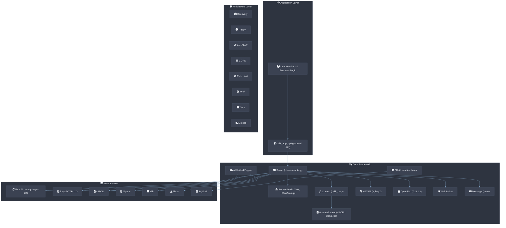

# csilk

[English](README.md) | [中文](README.zh-CN.md)


一个轻量级（静态二进制文件约 150KB，10K 长连接时 RSS 小于 2 MB）的 HTTP Web 框架，用 C 语言编写，在普通硬件上 **10K QPS 下 P99 延迟 ≤ 5ms**。灵感来自 Gin（Golang），构建于 **libuv（默认）或 io_uring（可选，仅 Linux）**、llhttp、nghttp2 和 cJSON 之上。


## 特性

- 🚀 **10K QPS 下 P99 延迟 ≤ 5ms** — 使用 libuv（默认）或 io_uring（可选，仅 Linux）进行异步 I/O
- **零拷贝 HTTP 解析** — 直接引用 TCP/SSL 接收缓冲区（使用 `csilk_str_view_t`），避免 HTTP URL、请求头和请求体的堆内存 `malloc`/`free` 开销
- **零拷贝静态文件服务** — 通过 `sendfile` 集成实现
- **SIMD 加速路由** — AVX2（x86_64）：约 50ns/路由，NEON（aarch64）：约 80ns/路由
- **无锁 per-worker 连接池** — 多核线性扩展（16 核约 200K QPS）
- **实时 CPU 火焰图** — 管理后台的 Backtrace 采样性能剖析
- **热重载** — 运行时替换路由，无需重启
- 📬 **内部事件总线** — 异步、线程安全的消息队列，支持中间件和订阅者
- 📈 **原生 Prometheus 指标** — 内置 QPS、延迟和状态码可观测性
- 🖥️ **统一管理后台** — 基于 Web 的 HTTP、AI 工作流、MQ 和 CPU 火焰图实时监控
- 🛡️ **原生 HTTPS/TLS 支持** — 通过 OpenSSL 集成（生产环境 **MUST** 使用 TLS 1.3）
- 🌐 **HTTP/2 支持** — 通过 nghttp2（ALPN 协商、多路复用、HPACK、Server Push）
- 🔑 **JWT（JSON Web Token）** 认证中间件（HS256）
- 🔌 **可扩展 Hook 系统** — 覆盖生命周期事件（Server、Connection、Request）
- 🔧 **可插拔加密驱动** — 用于自定义哈希和 UUID 算法
- 🔐 **可插拔密码驱动** — 支持 AES-256-GCM、RSA-OAEP 和 RSA-PSS
- 🗄️ **可插拔数据库驱动** — SQLite、MySQL、PostgreSQL、MongoDB、Redis
- 🔧 中间件支持（logger、recovery、auth、CORS、CSRF、限流、静态文件）
- 🌐 RESTful API 路由，支持参数处理和路由组
- 📦 JSON 支持（通过 cJSON 解析、序列化、错误响应、反射绑定）
- 🍪 Cookie 解析和设置（支持 Max-Age、Secure、HttpOnly 等）
- 🔌 WebSocket 支持（RFC 6455 握手、帧发送/接收）
- 📡 Server-Sent Events（SSE），支持 `csilk_sse_init/send/close`
- 📦 Gzip 响应压缩中间件（智能跳过媒体类型）
- 📤 Multipart/form-data 文件上传解析
- 🔍 URL 解析和查询字符串处理
- 📝 URL-encoded 表单体解析（`csilk_parse_form_urlencoded`、`csilk_for_each_form_field`）
- ⚡ Keep-alive 连接支持
- 🛡️ 完善的错误处理与崩溃恢复（setjmp/longjmp）
- 📋 YAML 配置（server、logger、CORS、限流、静态文件、中间件）
- 🏗️ Arena 分配器，用于请求级内存管理（每次分配约 3 条 CPU 指令，≤ 5ns 重置）
- **延迟清理 API**（`csilk_ctx_defer`）— panic 安全的资源管理
- **不透明上下文 API**（Opaque Context API）— 确保 ABI 稳定性
- **内置健康检查** 处理器（/healthz）
- **请求 ID 中间件** — 端到端追踪（X-Request-Id）
- **WAF（Web 应用防火墙）** 中间件

## 架构概览



## 框架对比

| Dimension | csilk (C) | Gin (Go) | Express (Node.js) |
|:----------:|:---------:|:--------:|:-----------------:|
| **二进制大小** | ~150 KB | ~15 MB | N/A（解释型） |
| **P99 延迟（10K QPS）** | ≤ 5 ms | ~3 ms | ~50 ms |
| **最大吞吐量（4 核）** | ~50K QPS | ~80K QPS | ~10K QPS |
| **10K 连接内存占用** | ≤ 2 MB RSS | ~20 MB RSS | ~50 MB RSS |

## 依赖

- [libuv](https://github.com/libuv/libuv) 或 [liburing](https://github.com/axboe/liburing) — 异步 I/O 库
- [llhttp](https://github.com/nodejs/llhttp) — HTTP/1.1 解析器
- [nghttp2](https://github.com/nghttp2/nghttp2) — HTTP/2 库
- [cJSON](https://github.com/DaveGamble/cJSON) — JSON 解析器
- [libyaml](https://github.com/yaml/libyaml) — YAML 解析器
- [OpenSSL](https://www.openssl.org/) — TLS/SSL 和加密库
- [zlib](https://www.zlib.net/) — Gzip 压缩
- [libcurl](https://curl.se/libcurl/) — HTTP 客户端（AI 驱动）
- [sqlite3](https://www.sqlite.org/) — 嵌入式 SQL 数据库

libuv（默认）、liburing（可选，`-DCSILK_USE_URING=ON`）、nghttp2 和 cJSON 会在构建时通过 CMake 的 FetchContent 自动获取。llhttp 优先使用系统版本，否则自动获取。libyaml、OpenSSL、zlib、libcurl 和 sqlite3 必须作为系统依赖安装。

### 安装（Debian/Ubuntu）
```bash
sudo apt install libyaml-dev libssl-dev zlib1g-dev libcurl4-openssl-dev libsqlite3-dev
```

## 支持的平台

csilk **MUST** 使用支持 C23 的编译器编译（`static constexpr`、`nullptr`、`bool` 关键字）。仅支持 GCC 13+ 和 Clang 19+。

### 编译器

| 编译器        | 最低版本 | 备注                                                    |
|----------------|:--------:|----------------------------------------------------------|
| **GCC**        | 13+      | 完整 C23 支持。Ubuntu 24.04 上的主要 CI 目标。           |
| **Clang**      | 19+      | 支持 C23 `constexpr`。libFuzzer 模糊测试。               |
| **Apple Clang**| —        | 不支持 — 缺少 C23 `constexpr` 和 `nullptr`。             |
| **MSVC**       | —        | 不支持 — 依赖 POSIX API（libuv、pthread、sys/socket）。  |

### 操作系统

| 平台               | 状态          | 备注                                                       |
|--------------------|:-------------:|-------------------------------------------------------------|
| **Linux**          | 支持          | Ubuntu 24.04（CI）、Debian 12+、任意 glibc 发行版。        |
| **macOS**          | 支持（单 worker） | 多 worker 模式下 macOS-14 缺少 `pthread_barrier_t`。        |
| **Windows**        | 计划中         | POSIX 依赖面太大（libuv 可能使其成为可能）。                |
| **musl / Alpine**  | 未测试        | 可能兼容；无 CI 覆盖。                                      |

### 依赖版本

| 依赖     | 最低版本 | 用途                        |
|----------|:-------:|----------------------------|
| CMake    | 3.11    | 构建系统                   |
| OpenSSL  | 1.1.1   | TLS、加密、JWT（HS256）     |
| libcurl  | 7.80.0  | HTTP 客户端（AI 驱动）      |
| libyaml  | 0.2.0   | 配置解析                   |
| zlib     | 1.2.0   | Gzip 压缩                  |
| sqlite3  | 3.20.0  | 嵌入式数据库               |
| pthread  | —       | 线程（系统级）             |

## 构建

### 前提条件

- CMake 3.11 或更高版本（**MUST** 在 `$PATH` 中可用）
- 支持 C23 的 C 编译器（GCC 13+ 或 Clang 19+）
- Git（用于获取依赖）
- 系统依赖：`sudo apt install libyaml-dev libssl-dev zlib1g-dev libcurl4-openssl-dev libsqlite3-dev`
- OpenSSL 1.1.1+（**MUST**，用于 TLS/HTTPS 和 JWT 支持）
- libcurl 7.80.0+（**MUST**，用于 AI 驱动 HTTP 传输）

### 构建步骤

```bash
# 克隆仓库
git clone https://github.com/yourusername/csilk.git
cd csilk

# 创建构建目录
mkdir build && cd build

# 使用 CMake 配置
cmake ..

# 构建
make

# 默认情况下，csilk 构建为静态库，使用 libuv 后端。
# 要构建 io_uring 后端（仅 Linux），使用：
# cmake .. -DCSILK_USE_URING=ON
#
# 要构建为共享库，使用：
# cmake .. -DCSILK_BUILD_SHARED=ON
#
# 其他可用选项：
#   -DUSE_ASAN=ON          启用 AddressSanitizer（默认 OFF）
#   -DCSILK_BUILD_SHARED=ON 构建共享库（默认 OFF）
#   -DUSE_FUZZER=ON        启用 libFuzzer（默认 OFF）

# 可选：运行测试
make run_tests     # 通过 ctest 运行所有测试
# 或：ctest --test-dir . --output-on-failure

# 可选：运行单个测试
./tests/test_logger
# ... 其他测试可执行文件

# 可选：构建文档
make docs  # 需要 Doxygen

# 可选：格式化代码
make format  # 需要 clang-format
```

### Docker

```bash
# 构建 Docker 镜像
docker build -t csilk .

# 运行容器
docker run -p 8080:8080 csilk

# 覆盖配置
docker run -p 8080:8080 -v $(pwd)/custom_config.yaml:/etc/csilk/config.yaml csilk
```

## 项目结构

```
src/
   ├── core/           # 内核（libuv/io_uring TCP、Router、Arena、Logger、Config）
   │   └── uring/      # io_uring 后端（仅 Linux，可选）
   ├── app/            # 应用层（app、admin dashboard、workflow engine）
   ├── ai/             # AI 统一接口引擎
   ├── data/           # 数据库抽象层
   │   └── drivers/    # 具体数据库驱动（SQLite、MySQL、PostgreSQL、MongoDB、Redis）
   ├── messaging/      # 内部事件总线（消息队列）
   ├── security/       # 权限与安全内核
   ├── reflection/     # 反射引擎实现
   ├── protocols/      # 协议扩展（WebSocket、Swagger）
   └── middleware/     # 16 个内置中间件模块

include/csilk/        # 公共分层头文件
  ├── core/           # 核心内部定义
  ├── app/            # App API、Admin、Workflow、WAL
  ├── drivers/        # 驱动接口（AI、Cipher、DB、Perm）
  ├── reflection/     # 反射引擎 API
  ├── test/           # OOM 模拟测试框架
  └── csilk.h         # 主入口（包含所有模块）

tools/                  # 开发者工具（csilkskel 脚手架生成器）
tests/                  # 120+ 个全面的单元测试
examples/               # 功能示例（Server、App、AI、WS/TLS/MQ 等）
```

## 测试

项目包含一个全面的测试套件。构建后，运行各个测试可执行文件：

```bash
./tests/test_context
./tests/test_router
./tests/test_server
# ... 等等
```

### 特性图例

| Emoji | 含义 |
|-------|------|
| 🚀 | 性能 / 异步 I/O |
| 📬 | 内部事件总线（MQ） |
| 📈 | Prometheus 指标 |
| 🌐 | 网络 / 路由 / HTTP/2 |
| 🔧 | 中间件 / 工具 |
| 📦 | JSON / 数据序列化 |
| 🍪 | Cookie 管理 |
| 🔌 | WebSocket 支持 |
| 📡 | Server-Sent Events（SSE） |
| 📤 | 文件上传 / Multipart |
| 🔍 | URL / 查询解析 |
| ⚡ | 连接保持活跃（Keep-alive） |
| 🛡️ | 错误处理 / 安全 |
| 🔐 | 加密 / 密码驱动 |
| 📋 | 配置（YAML） |
| 🏗 | 内存管理（Arena） |
| 🗂️ | 反射引擎 |
| 🤖 | AI 统一接口 |
| 🔐 | CSRF / CORS / 限流 |
| 📝 | 文档（Doxygen） |
| 🧵 | 线程安全日志 |
| 🔍 | 超时 / 限制 |
| 🎯 | 每路由中间件 |
| 🌲 | Radix Tree 路由 |
| 📝 | Form URL-encoded 解析 |
| 🍪 | 会话管理 |
| 🔀 | HTTP 重定向 |
| 📄 | HTTP Range / 206 Partial Content |
| ✅ | 参数验证 |

## Python 绑定

`csilk` 提供开箱即用的高性能、开发者友好的 Python 绑定（使用标准库 `ctypes` 模块）。
所有核心功能 — 包括 app 路由、中间件、会话管理、SSE 事件流、DB 连接池和 AI 工作流管道 — 在 Python 中均完全支持。

### 快速开始

```python
from csilk import App, Context

app = App()

@app.get("/hello")
def hello(ctx: Context):
    ctx.string(200, "Hello World from Python!")

if __name__ == "__main__":
    app.run(8080)
```

更多细节请参阅 [Python 绑定手册](docs/user-manual/python.md) 和 [python/README.md](python/README.md)。

## 更新日志

完整的变更历史请参阅 [CHANGELOG.md](CHANGELOG.md)。

## 贡献

欢迎贡献！请参阅 [CONTRIBUTING.md](CONTRIBUTING.md) 了解如何贡献、报告问题和提交拉取请求的准则。

## 许可证

本项目采用 MIT 许可证 — 详情请参阅 [LICENSE](LICENSE) 文件。

## 致谢

- 灵感来自 [Gin](https://github.com/gin-gonic/gin) Web 框架
- 构建于优秀的 C 语言库之上：libuv、llhttp、nghttp2 和 cJSON
