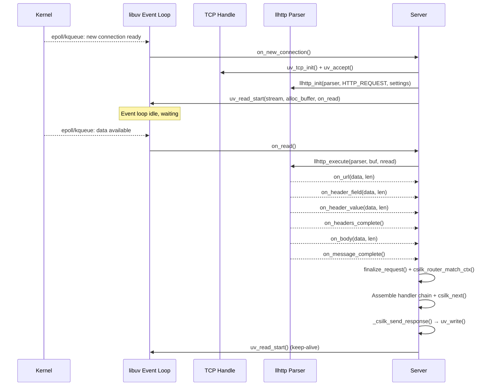
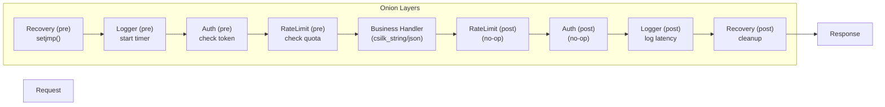
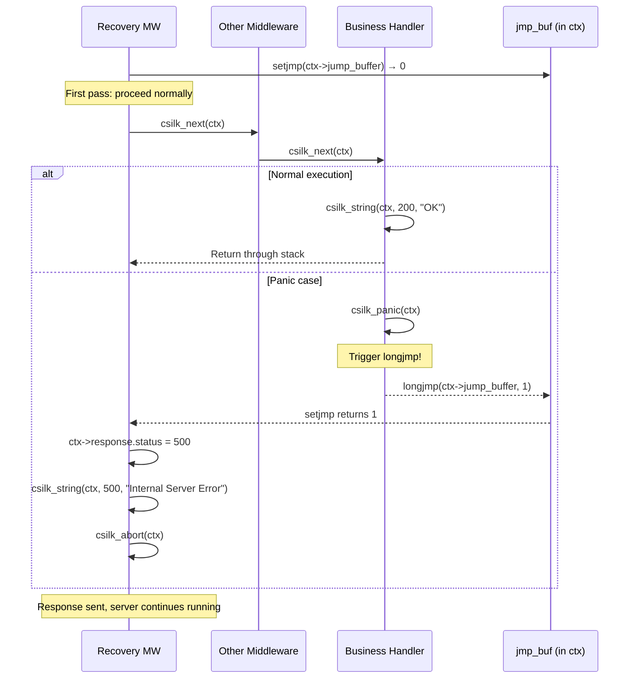
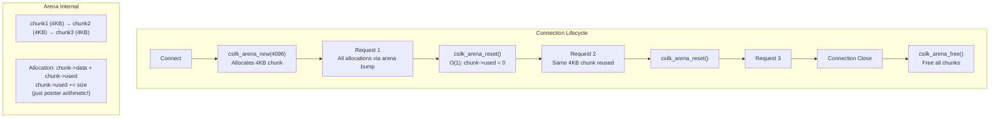
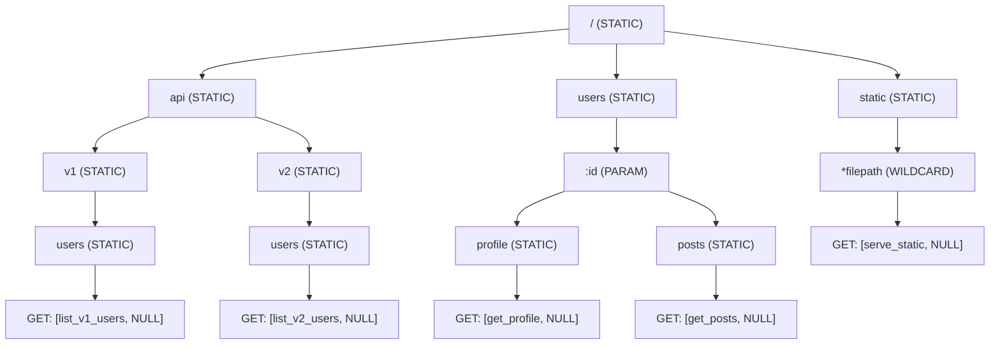
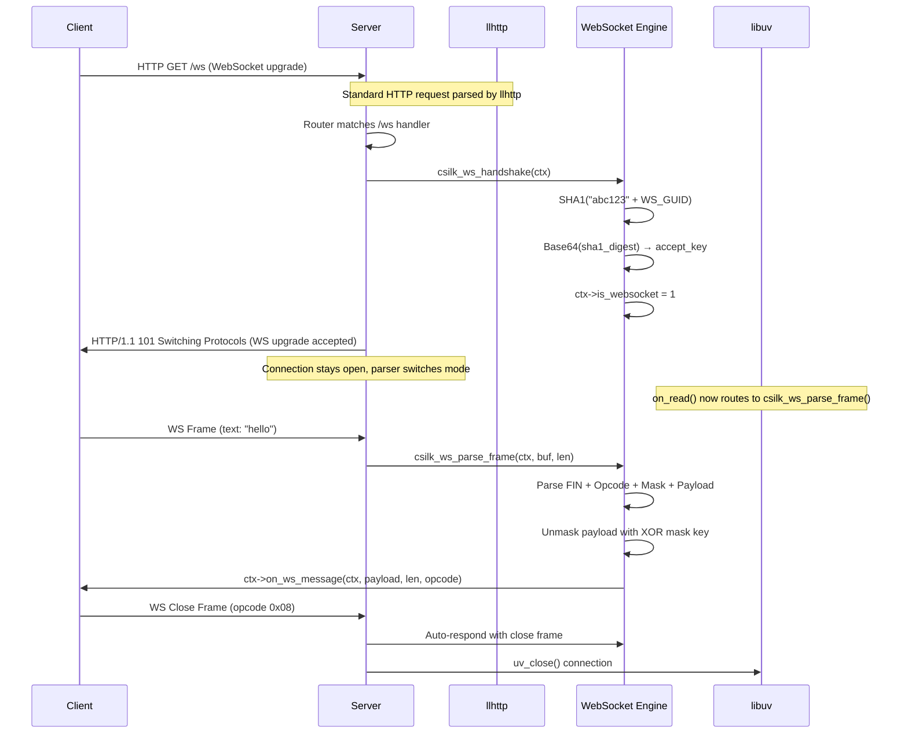
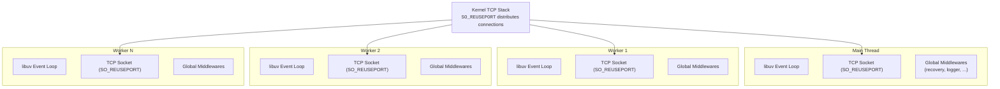

# csilk Architecture Whitepaper

> **Last updated**: 2026-05-24 | **Version**: 0.2.1

## 1. Core Architecture Design

csilk adopts the classic **Reactor Event-Driven Model**, combined with an **Onion Model** middleware mechanism inspired by Go's Gin framework.

### 1.1 System Architecture Overview

```mermaid
graph TB
    subgraph External
        CLI["HTTP Clients<br/>(browsers, curl, SDKs)"]
    end

    subgraph "csilk Framework"
        subgraph "Transport Layer"
            TCP["TCP Server (libuv)"]
            HTTP["HTTP/1.1 Parser (llhttp)"]
            SSL["(Future: TLS via OpenSSL)"]
        end

        subgraph "Core Engine"
            SRV["csilk_server_s<br/>Event Loop + Config + Global MW"]
            RTR["Radix Tree Router<br/>Static + :param + *wildcard"]
            GRP["Group Router<br/>Hierarchical prefix + MW"]
            CTX["csilk_ctx_s<br/>Request/Response State Machine"]
            ARENA["Arena Allocator<br/>Bump allocator per-connection"]
            MQ["Message Queue<br/>Thread-safe Event Bus"]
        end

        subgraph "Middleware Chain"
            REC["Recovery<br/>(setjmp/longjmp)"]
            LOG["Logger<br/>(structured JSON)"]
            MET["Metrics<br/>(Prometheus/Observability)"]
            AUTH["Auth<br/>(token validation)"]
            CORS["CORS<br/>(cross-origin)"]
            RATE["RateLimit<br/>(sliding window)"]
            CSRF["CSRF<br/>(token anti-forgery)"]
            STATIC["Static Files<br/>(thread pool I/O)"]
            GZIP["Gzip<br/>(zlib + thread pool)"]
            SSE["SSE<br/>(Server-Sent Events)"]
            MPART["Multipart<br/>(form-data parser)"]
        end

        subgraph "Protocol Upgrade"
            WS["WebSocket Engine<br/>Handshake + Frame + Close"]
        end
    end

    subgraph "Dependencies"
        UV["libuv v1.48<br/>Event Loop + Thread Pool"]
        LLHTTP["llhttp v9.4<br/>Streaming HTTP Parser"]
        CJ["cJSON v1.7<br/>JSON Parse/Serialize"]
        YAML["libyaml<br/>Config Parse"]
        ZLIB["zlib<br/>Gzip Compression"]
    end

    CLI --> TCP
    TCP --> HTTP
    HTTP --> SRV
    SRV --> RTR
    SRV --> GRP
    SRV --> CTX
    SRV --> REC
    SRV --> LOG
    SRV --> AUTH
    SRV --> CORS
    SRV --> RATE
    SRV --> CSRF
    SRV --> STATIC
    SRV --> GZIP
    SRV --> SSE
    SRV --> MPART
    CTX --> ARENA
    SRV --> WS
    SRV --> UV
    HTTP --> LLHTTP
    GZIP --> ZLIB
    STATIC --> ZLIB
    WS --> CJ
    SRV --> YAML
```



### 1.2 Event-Driven Base

The framework is built on `libuv`:
- All network I/O is non-blocking.
- Uses `llhttp` for state-machine-driven HTTP protocol parsing, ensuring high parsing efficiency and low memory footprint.



### 1.3 Onion Model Middleware

Middleware implements bidirectional interception through the `csilk_next()` mechanism:



### 1.4 Crash Recovery Mechanism (setjmp/longjmp)

Lightweight exception handling using C's `setjmp`/`longjmp`:



This ensures a single request crash never takes down the entire server process.

## 2. Memory Management Strategy

### 2.1 Per-Connection Arena Allocator



**Advantages**:
- Memory allocation is just **pointer offset** (extremely fast, no malloc/free per allocation)
- O(1) reset between requests (just set `used = 0`)
- Zero memory leaks: entire arena freed at connection close
- No heap fragmentation from per-request small allocations

## 3. Routing Engine: Radix Tree

### 3.1 Tree Structure



### 3.2 Matching Complexity

- **O(K)** where K = path length (number of segments)
- Fixed-size children array (`CSILK_MAX_CHILDREN = 128`) for CPU cache locality
- Backtracking for parameter nodes if recursive match fails

## 4. WebSocket Support

### 4.1 Handshake & Upgrade Flow



### 4.2 Protocol Specification

- **Handshake**: RFC 6455 compliant SHA1 + Base64 key exchange
- **Frame Parsing**: Supports text (opcode 0x1) and binary (opcode 0x2) frames
- **Close Handshake**: Auto-detects close frames and responds per RFC 6455 Section 5.5.1
- **Async API**: `csilk_ws_send()` writes frames asynchronously via `uv_write()`

### 4.3 Internal Event Bus (Message Queue)

Csilk provides a built-in, asynchronous, topic-based Message Queue (`csilk_mq`) that facilitates communication between different parts of the application or bridging external events into the main loop.


- **Thread-Safety**: `csilk_mq_publish` is safe to call from any thread. It uses `uv_async_send` to notify the main event loop.
- **Onion Model for Events**: The MQ system implements the same middleware pattern as the HTTP router. You can use `csilk_mq_use` for cross-cutting concerns (logging, validation) and `csilk_mq_subscribe` for final processing.
- **Low Overhead**: Messages are queued internally and processed in batches when the event loop wakes up, minimizing system call overhead.

## 5. Document Generation

csilk uses **Doxygen** for API documentation:
- All public header files (`include/`) include complete `@brief`, `@param`, `@return` annotations
- All implementation files (`src/`) include `@file`, `@brief` header comments, key functions have `@brief` and `@param` docs
- Example code (`examples/`) also includes Doxygen annotations
- Documentation generation command: `make docs` (requires Doxygen 1.12+)
- CI is configured for GitHub Pages auto-deployment of generated HTML documentation

## 6. Developer Guide

### 6.1 Writing WebSocket Handlers
```c
void ws_on_message(csilk_ctx_t* c, const uint8_t* payload, size_t len, int opcode) {
    csilk_ws_send(c, (uint8_t*)"Hello Client", 12, 1);
}

void ws_handler(csilk_ctx_t* c) {
    csilk_ws_handshake(c);
    if (c->is_websocket) {
        c->on_ws_message = ws_on_message;
    }
}
```

### 6.2 Writing Middleware
```c
void my_middleware(csilk_ctx_t* c) {
    // Pre-logic: e.g., check Token
    csilk_next(c);
    // Post-logic: e.g., log latency
}
```

### 6.3 Starting the Server
```c
int main() {
    csilk_router_t* r = csilk_router_new();
    csilk_group_t* g = csilk_group_new(r, "/api");
    csilk_GET(g, "/ping", handler);

    csilk_server_t* s = csilk_server_new(r);
    csilk_server_run(s, 8080);
    return 0;
}
```

## 7. Multi-Worker Architecture



Each worker thread runs its own libuv event loop with the same port bound via `SO_REUSEPORT`. The kernel distributes incoming connections across worker threads, enabling multi-core utilization without explicit inter-thread synchronization.

## 8. Observability (Prometheus Metrics)

csilk includes a native metrics module for real-time monitoring of server health and performance.

### 8.1 Metrics Collected

- **`http_requests_total`**: Counter of all processed HTTP requests, partitioned by `method`, `path`, and `status`.
- **`http_request_duration_seconds`**: Histogram of request latencies, useful for calculating P99/P95 response times.
- **`http_active_connections`**: Gauge of currently open TCP connections.

### 8.2 Exposition Format

Metrics are exposed via the `/metrics` endpoint (using `csilk_metrics_handler`) in the standard Prometheus text-based format:

```text
# HELP http_requests_total Total number of HTTP requests.
# TYPE http_requests_total counter
http_requests_total{method="GET",path="/api/ping",status="200"} 1243
# HELP http_request_duration_seconds HTTP request latency histogram.
# TYPE http_request_duration_seconds histogram
http_request_duration_seconds_bucket{le="0.01"} 1100
http_request_duration_seconds_sum 45.2
http_request_duration_seconds_count 1243
```

By integrating `csilk_metrics_middleware` at the start of the middleware chain, every request is automatically timed and recorded.

## 9. Performance Features

### 9.1 Zero-copy Static File Serving

For static files, Csilk implements a zero-copy mechanism using the `sendfile` system call (abstracted via `uv_fs_sendfile`).

- **Mechanism**: When a static file is requested, the server opens the file and stores the file descriptor in the context. Instead of reading the file into a buffer and writing it to the socket, the server calls `uv_fs_sendfile`, which directs the kernel to transfer data directly from the file system cache to the network socket.
- **Benefits**: Reduces CPU usage and memory bandwidth by eliminating data copying between kernel space and user space.

### 9.2 Request Tracing (Request ID)

The `csilk_request_id_middleware` ensures every request is assigned a unique UUID v4.

- **Propagation**: The ID is injected into the "X-Request-Id" response header and the thread-local logger state.
- **Correlation**: This allows all log entries generated during the processing of a single request to be correlated, even in a highly concurrent environment.
