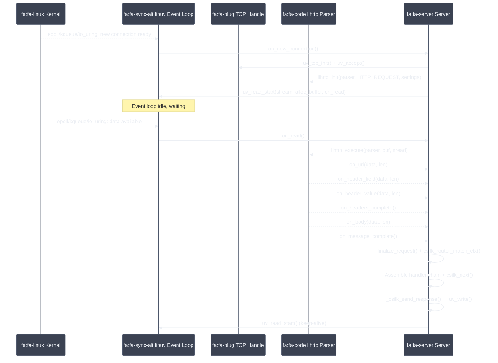
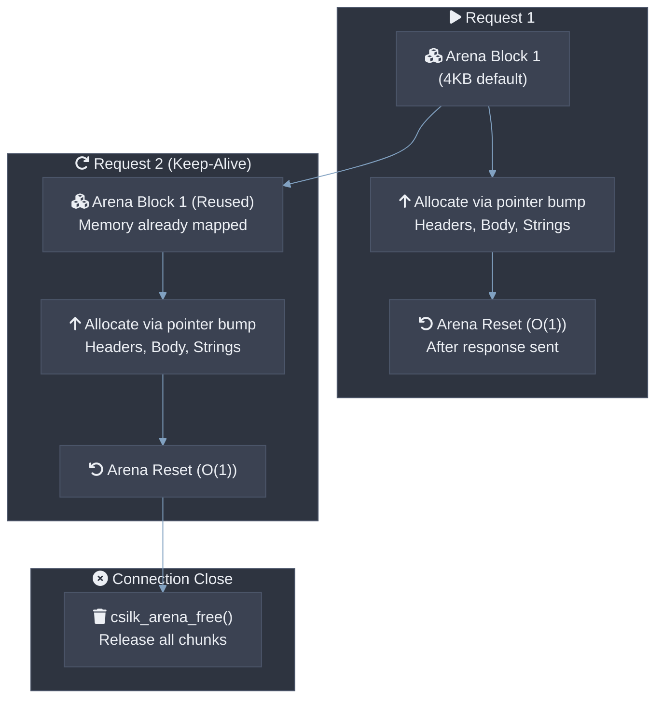
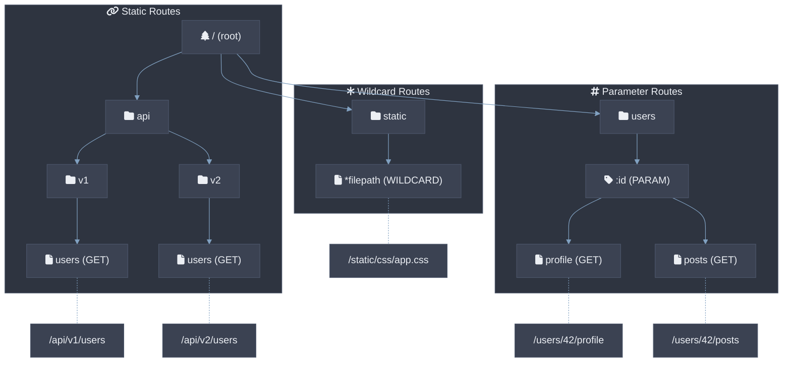
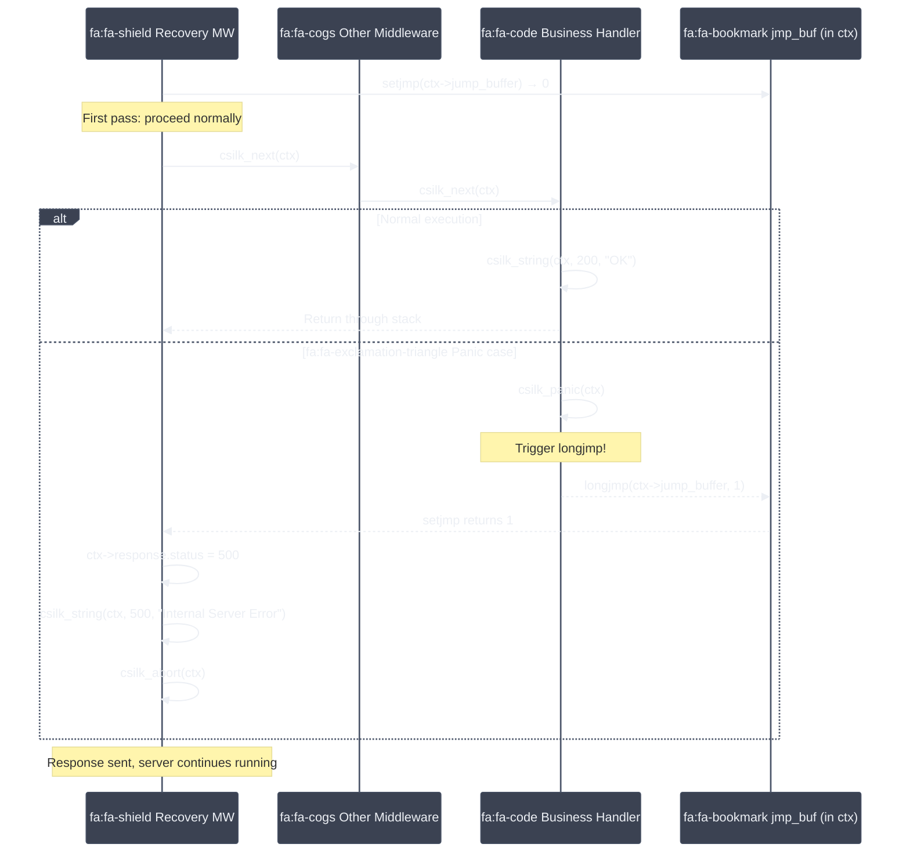
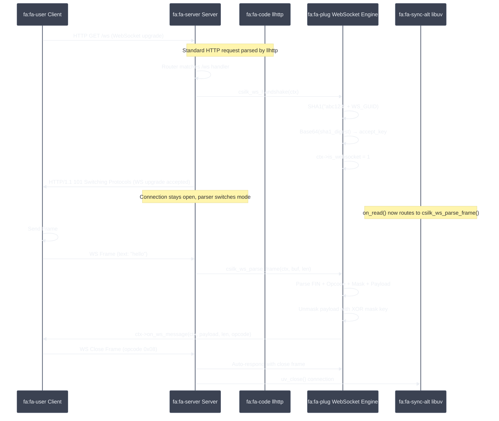
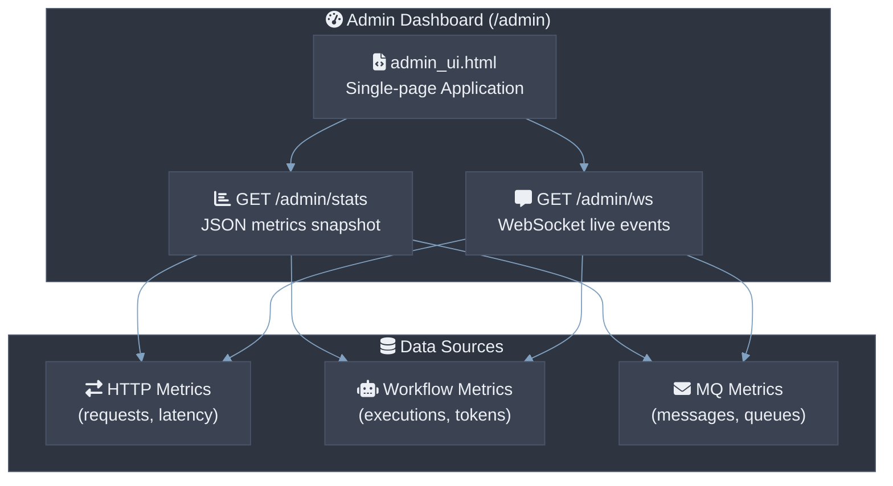

# csilk Architecture Whitepaper & Technical Manual

> **Version**: 0.5.0-dev | **Last updated**: 2026-06-24

csilk is a lightweight (~150KB static binary, < 2MB RSS per 10K keep-alive connections) HTTP web framework written in C, delivering **P99 latency ≤ 5ms under 10K QPS** on commodity hardware. It adopts a **layered event-driven architecture** combined with an **onion middleware model**, inspired by Go's Gin framework and powered by libuv (default) or io_uring (optional, Linux-only), llhttp, nghttp2, and cJSON. The framework supports zero-copy HTTP parsing, SIMD-accelerated radix-tree routing, and lock-free per-worker connection pools for multi-core scalability.

---

## 1. Layer Architecture

```mermaid
%%{init: {
  'theme': 'base',
  'themeVariables': {
    'background': '#2E3440',
    'primaryColor': '#81A1C1',
    'primaryBorderColor': '#4C566A',
    'primaryTextColor': '#ECEFF4',
    'secondaryColor': '#3B4252',
    'secondaryBorderColor': '#434C5E',
    'secondaryTextColor': '#D8DEE9',
    'lineColor': '#81A1C1',
    'textColor': '#ECEFF4',
    'mainBkg': '#3B4252',
    'nodeBorder': '#4C566A',
    'clusterBkg': '#2E3440',
    'clusterBorder': '#4C566A',
    'titleColor': '#ECEFF4',
    'edgeLabelBackground': '#3B4252',
    'nodeTextColor': '#ECEFF4'
  },
  'flowchart': {'htmlLabels': true, 'curve': 'basis'}
}}%%
graph TB
    subgraph layer1["fa:fa-code Layer 1: Application"]
        H["fa:fa-users User Handlers & Business Logic"]
        APP["fa:fa-cube csilk_app_t (Convenience Wrapper)"]
    end

    subgraph layer2["fa:fa-layer-group Layer 2: Middleware"]
        MW["fa:fa-plug Recovery | Logger | CORS | Auth | JWT | WAF<br/>RateLimit | CSRF | Static | Gzip | SSE | Multipart<br/>Metrics | RequestID | Validate | Session"]
    end

    subgraph layer3["fa:fa-cogs Layer 3: Core Engine"]
        subgraph req_proc["fa:fa-bolt Request Processing"]
            CTX["fa:fa-exchange-alt Context (csilk_ctx_t)"]
            ARENA["fa:fa-memory Arena Allocator"]
            HOOKS["fa:fa-anchor Hook System"]
        end
        subgraph ai_data["fa:fa-brain AI & Data"]
            AI["fa:fa-robot AI Unified Engine"]
            DB["fa:fa-database DB Abstraction (SQLite/MySQL/PG/MongoDB)"]
            REFL["fa:fa-magic Reflection Engine"]
        end
        subgraph routing["fa:fa-random Routing"]
            RTR["fa:fa-sitemap Router (Radix Tree)"]
            GRP["fa:fa-folder-open Group (Hierarchical)"]
        end
        subgraph network["fa:fa-network-wired Network & Protocol"]
            SRV["fa:fa-server Server (libuv TCP / io_uring)"]
            HTTP["fa:fa-code llhttp Parser"]
            TLS["fa:fa-lock OpenSSL (TLS/SSL)"]
            WS["fa:fa-plug WebSocket Engine"]
        end
    end

    subgraph layer4["fa:fa-hdd Layer 4: Infrastructure"]
        UV["fa:fa-sync-alt libuv / io_uring\n(Event Loop + Thread Pool)"]
        CJ["fa:fa-file-code cJSON"]
        YAML["fa:fa-file-alt libyaml"]
        ZLIB["fa:fa-compress zlib"]
        SSL["fa:fa-key OpenSSL"]
        CURL["fa:fa-download libcurl"]
        MQ["fa:fa-envelope csilk_mq_t\n(Message Queue)"]
    end

    subgraph observability["fa:fa-chart-line Observability"]
        METRICS["fa:fa-chart-bar Prometheus /metrics"]
        ADMIN["fa:fa-tachometer-alt Admin Dashboard /admin"]
        ADMIN_STATS["fa:fa-chart-pie Admin Stats /admin/stats"]
        ADMIN_WS["fa:fa-comment-alt Admin WS /admin/ws"]
    end

    H --> CTX
    APP --> SRV
    MW --> CTX
    SRV --> RTR
    SRV --> CTX
    SRV --> HTTP
    SRV --> TLS
    SRV --> WS
    AI --> CURL
    AI --> CJ
    GRP --> RTR
    CTX --> ARENA
    SRV --> UV
    HTTP --> UV
    TLS --> SSL
    WS --> UV
    SRV --> CJ
    SRV --> YAML
    SRV --> ZLIB
    SRV --> MQ
    ADMIN --> METRICS
    ADMIN --> SRV
    ADMIN --> MQ
```



---

## 2. Core Design Principles

### 2.1 Reactor Event-Driven Model with Native TLS & ALPN
The framework is built on `libuv` (default) or `io_uring` (optional, Linux-only via `-DCSILK_USE_URING=ON`), ensuring all network I/O is non-blocking. An abstract `csilk_io_loop_t` type (`include/csilk/core/sys_io.h`) wraps either `uv_loop_t*` or `struct io_uring*`, allowing the server core to be compiled against either backend without source changes.

* **Protocol Dispatcher**: During TLS ALPN negotiation, a dispatcher routes decrypted traffic to either `llhttp` (HTTP/1.1) or `nghttp2` (HTTP/2) based on ALPN (`h2` vs `http/1.1`). The dispatcher **MUST** negotiate ALPN before any application data is processed.
* **HTTP/1.1 parsing**: `llhttp` drives a state-machine parser to process HTTP/1.1 requests. During parsing callbacks, `csilk` uses **Zero-copy HTTP parsing** using string views (`csilk_str_view_t`) that directly reference raw network receive buffers, completely eliminating dynamic `malloc`/`realloc`/`free` heap allocations for HTTP headers, URLs, and bodies. This achieves ~0 allocs per request for header processing (P99 ≤ 1µs parsing overhead).
* **HTTP/2 parsing**: `nghttp2` processes binary HTTP/2 frames, HPACK headers, and handles multiplexed streams. Clients **SHOULD** use HTTP/2 for latency-sensitive applications requiring multiplexing.
* **Native TLS integration**: OpenSSL BIO-pairs handle encrypted network traffic directly on the event loop. TLS 1.3 **MUST** be used for production deployments; TLS 1.2 **SHOULD** be accepted for legacy compatibility:
  - **Encrypted read** -> `on_read` -> `BIO_write` -> `SSL_read` -> `llhttp_execute` / `csilk_h2_process_data`
  - **Encrypted write** -> `SSL_write` -> `BIO_read` -> `uv_write`



### 2.2 Onion Middleware Model
Middleware implements bidirectional request interception through the `csilk_next()` mechanism.

```mermaid
%%{init: {
  'theme': 'base',
  'themeVariables': {
    'background': '#2E3440',
    'primaryColor': '#81A1C1',
    'primaryBorderColor': '#4C566A',
    'primaryTextColor': '#ECEFF4',
    'secondaryColor': '#3B4252',
    'secondaryBorderColor': '#434C5E',
    'secondaryTextColor': '#D8DEE9',
    'lineColor': '#81A1C1',
    'textColor': '#ECEFF4',
    'mainBkg': '#3B4252',
    'nodeBorder': '#4C566A',
    'clusterBkg': '#2E3440',
    'clusterBorder': '#4C566A',
    'titleColor': '#ECEFF4',
    'edgeLabelBackground': '#3B4252',
    'nodeTextColor': '#ECEFF4'
  },
  'flowchart': {'htmlLabels': true, 'curve': 'basis'}
}}%%
flowchart LR
    REQ["fa:fa-arrow-right Request"]

    subgraph onion["fa:fa-circle-nodes Onion Layers"]
        direction LR
        L1i["fa:fa-shield Recovery (pre)<br/>setjmp()"] --> L2i["fa:fa-clock Logger (pre)<br/>start timer"]
        L2i --> L3i["fa:fa-shield-halved WAF (pre)<br/>check rules"]
        L3i --> L4i["fa:fa-key Auth (pre)<br/>check token"]
        L4i --> L5i["fa:fa-gauge-high RateLimit (pre)<br/>check quota"]
        L5i --> CORE["fa:fa-gem Business Handler<br/>(csilk_string/json)"]
        CORE --> L5o["RateLimit (post)<br/>(no-op)"]
        L5o --> L4o["Auth (post)<br/>(no-op)"]
        L4o --> L3o["WAF (post)<br/>(no-op)"]
        L3o --> L2o["fa:fa-clock Logger (post)<br/>log latency"]
        L2o --> L1o["fa:fa-shield Recovery (post)<br/>cleanup"]
    end

    L1o --> RES["fa:fa-arrow-left Response"]
```



### 2.3 Hook System
In addition to onion middleware, a hook system allows non-blocking observation of global lifecycle events:
* `CSILK_HOOK_SERVER_START` / `CSILK_HOOK_SERVER_STOP`
* `CSILK_HOOK_CONN_OPEN` / `CSILK_HOOK_CONN_CLOSE`
* `CSILK_HOOK_REQUEST_BEGIN` / `CSILK_HOOK_REQUEST_END`

### 2.4 Opaque Context & ABI Stability
Starting from v0.3.0, `csilk_ctx_t` is defined as an **opaque pointer**. The internal structure layout is hidden in `include/csilk/core/ctx_types.h`. Third-party middleware **MUST NOT** directly access `csilk_ctx_t` internals — all access goes through the public API (`csilk_get`/`csilk_set`/`csilk_string`). This guarantees binary compatibility (ABI stability) across minor version bumps.

### 2.5 Pluggable Drivers
Services are pluggable through clean vtables. Each driver **MUST** implement the interface defined in `include/csilk/drivers/`. Drivers **MAY** be registered at runtime via `csilk_driver_register()`. Driver selection is resolved at build time; providers not selected **SHOULD NOT** be linked into the final binary:
* **Storage Driver**: Backing store for `csilk_set/get` session variables (e.g. SQLite, Redis).
* **Crypto/Cipher Driver**: Interchangeable cryptography backends (e.g. OpenSSL).
* **AI Driver**: Interface to generic LLM providers (e.g. OpenAI, Ollama).
* **Vector DB Driver**: Interface to vector databases (e.g. Qdrant, Milvus).

### 2.6 Per-Connection Arena Memory Management
An Arena Allocator maps blocks (4KB default) per-connection. All allocations during request processing (headers, JSON parsing, URL splits) use pointer bump allocation.



**Key Advantages:**
* Allocation is reduced to simple pointer arithmetic (~3 CPU instructions per alloc, no call to malloc/free per request object).
* O(1) reset between requests (setting offset pointer `used = 0`) — typical cost ≤ 5ns.
* Avoids heap fragmentation. Entire memory pool is freed in one pass when the TCP connection closes.
* Users **MUST** avoid holding arena pointers across `csilk_next()` boundaries if the callee may reset the arena.
* Long-lived allocations **SHOULD** use `malloc` directly or `csilk_arena_dup()` to copy out of the arena.

### 2.7 Radix Tree Routing
Prefix tree (Patricia trie) routing with O(path_length) matching, support for static, parameterized, and wildcard routes. On x86_64 with AVX2, SIMD-accelerated path matching achieves ~50ns per route lookup. Routes **MUST** be registered before server start; the router is read-only during request processing (lock-free reads). Wildcard routes **SHOULD** be placed last in the registration order to ensure static routes take priority.



---

## 3. Crash Recovery Mechanism (setjmp/longjmp)

Lightweight exception handling routes panics cleanly back to the recovery middleware:



---

## 4. WebSocket & Message Queue

### 4.1 WebSocket Upgrade Flow



* **WebSocket Framing**: Full support for text (opcode 0x1), binary (opcode 0x2), and close frames (opcode 0x8) under RFC 6455.
* **Asynchronous delivery**: `csilk_ws_send` runs asynchronously via `uv_write`.

### 4.2 Thread-Safe Message Queue (csilk_mq)
csilk provides a built-in topic-based message queue system enabling thread-safe communication:


* `csilk_mq_publish` is safe to call from any thread. It signals the main loop using `uv_async_send`.
* The MQ system implements the onion middleware pattern (`csilk_mq_use`) to process topics uniformly.

---

## 5. Multi-Worker Architecture


### Client Pool Thread Safety
Since connection requests run on whatever worker thread accepted them, a lock-free per-worker connection pool is implemented. Each worker loop manages its own `csilk_client_t` freelist, eliminating mutex contention and guaranteeing thread safety when workers construct client structures.

---

## 6. Request Lifecycle

The sequence diagram below shows the complete lifecycle of a request from client to network response:

```mermaid
%%{init: {
  'theme': 'base',
  'themeVariables': {
    'background': '#2E3440',
    'primaryColor': '#81A1C1',
    'primaryBorderColor': '#4C566A',
    'primaryTextColor': '#ECEFF4',
    'secondaryColor': '#3B4252',
    'secondaryBorderColor': '#434C5E',
    'secondaryTextColor': '#D8DEE9',
    'lineColor': '#81A1C1',
    'textColor': '#ECEFF4',
    'mainBkg': '#3B4252',
    'nodeBorder': '#4C566A',
    'clusterBkg': '#2E3440',
    'clusterBorder': '#4C566A',
    'titleColor': '#ECEFF4',
    'edgeLabelBackground': '#3B4252',
    'nodeTextColor': '#ECEFF4'
  }
}}%%
sequenceDiagram
    participant Client as fa:fa-user Client
    participant UV as fa:fa-sync-alt libuv / io_uring Event Loop
    participant SSL as fa:fa-lock OpenSSL (TLS)
    participant HTTP as fa:fa-code llhttp Parser
    participant Server as fa:fa-server csilk_server_t
    participant Router as fa:fa-sitemap Radix Tree Router
    participant MW as fa:fa-layer-group Middleware Chain
    participant Arena as fa:fa-memory Arena Allocator
    participant Response as fa:fa-reply Response

    Client->>UV: TCP SYN
    UV->>Server: on_new_connection()
    Server->>Arena: csilk_arena_new(4096)
    
    alt is_tls
        Server->>SSL: SSL_do_handshake()
    end

    Server->>UV: uv_read_start()
    UV->>Server: on_read(encrypted_buf)
    
    alt is_tls
        Server->>SSL: SSL_read()
    end
    
    loop HTTP Parsing
        Server->>HTTP: llhttp_execute()
        HTTP-->>Server: on_url()
        HTTP-->>Server: on_header_field() / on_header_value()
        HTTP-->>Server: on_headers_complete()
        HTTP-->>Server: on_body()
        HTTP-->>Server: on_message_complete()
    end

    Server->>Server: finalize_request()
    Server->>Router: csilk_router_match_ctx()
    Router-->>Server: handler chain found
    Server->>Server: Prepend global middlewares
    Server->>MW: csilk_next(ctx)

    loop Onion Chain
        MW->>MW: Middleware N (pre-logic)
        MW->>MW: csilk_next()
        MW->>MW: Handler (business logic)
        MW->>MW: csilk_next()
        MW->>MW: Middleware N (post-logic)
    end

    alt is_async
        MW-->>Server: return (response deferred)
    else synchronous
        MW->>Server: csilk_string/json is set
        Server->>Response: _csilk_send_response()
        alt is_tls
            Server->>SSL: SSL_write()
        end
    end

    Server->>Arena: csilk_arena_reset()
    Note over Server: Keep-Alive: wait for next request<br>Non-Keep-Alive: close connection
```



---

## 7. Database Driver Matrix

Unified database drivers implement a standard interface (`csilk/drivers/db.h`):

| 维度 | SQLite | MySQL | PostgreSQL | MongoDB |
|:-----|:------:|:-----:|:----------:|:------:|
| **系统复杂度** | ⭐ 1/5 嵌入本地 | ⭐⭐⭐ 3/5 独立服务 | ⭐⭐⭐ 3/5 独立服务 | ⭐⭐⭐ 3/5 独立服务 |
| **运维成本** | ⭐ 1/5 无守护进程 | ⭐⭐⭐ 3/5 连接池管理 | ⭐⭐⭐ 3/5 连接池管理 | ⭐⭐⭐ 3/5 驱动池管理 |
| **读写吞吐量** | ~10K QPS (单写入) | ~50K QPS (集群) | ~80K QPS (集群) | ~60K QPS (分片集群) |
| **数据一致性** | 强一致 (单文件) | 最终一致 (异步复制) | 强一致 (WAL + Raft) | 最终一致 (副本集) |

---

## 8. Observability & Dashboard

### 8.1 Prometheus Metrics
Native metrics exposition format:
* `http_requests_total`: Counter partitioned by method, path, and status code.
* `http_request_duration_seconds`: Histogram bucket for request latency calculations (P99, P95).
* `http_active_connections`: Current active connection counts.

### 8.2 Admin Dashboard (/admin)



---

## 9. Performance Features

* **Zero-copy Static File Serving**: Serves files using `sendfile` system calls (abstracted as `uv_fs_sendfile`). Transmit calls happen directly from the kernel cache to the socket descriptor, avoiding user-space context switches.
* **Trace correlation**: Request ID middleware injects a unique UUID v4 into the request headers and logging telemetry.

---

## 10. Developer Guide

### 10.1 Writing WebSocket Handlers
```c
void ws_on_message(csilk_ctx_t* c, const uint8_t* payload, size_t len, int opcode) {
    csilk_ws_send(c, (uint8_t*)"Hello Client", 12, 1);
}

void ws_handler(csilk_ctx_t* c) {
    csilk_ws_handshake(c);
    if (c->is_websocket) {
        c->on_ws_message = ws_on_message;
    }
}
```

### 10.2 Writing Middleware
```c
void my_middleware(csilk_ctx_t* c) {
    // Pre-logic: e.g., check Token
    csilk_next(c);
    // Post-logic: e.g., log latency
}
```

### 10.3 Starting the Server
```c
int main() {
    csilk_router_t* r = csilk_router_new();
    csilk_group_t* g = csilk_group_new(r, "/api");
    csilk_GET(g, "/ping", handler);

    csilk_server_t* s = csilk_server_new(r);
    csilk_server_run(s, 8080);
    return 0;
}
```

---

## 11. Component Dependency Map

```mermaid
%%{init: {
  'theme': 'base',
  'themeVariables': {
    'background': '#2E3440',
    'primaryColor': '#81A1C1',
    'primaryBorderColor': '#4C566A',
    'primaryTextColor': '#ECEFF4',
    'secondaryColor': '#3B4252',
    'secondaryBorderColor': '#434C5E',
    'secondaryTextColor': '#D8DEE9',
    'lineColor': '#81A1C1',
    'textColor': '#ECEFF4',
    'mainBkg': '#3B4252',
    'nodeBorder': '#4C566A',
    'clusterBkg': '#2E3440',
    'clusterBorder': '#4C566A',
    'titleColor': '#ECEFF4',
    'edgeLabelBackground': '#3B4252',
    'nodeTextColor': '#ECEFF4'
  },
  'flowchart': {'htmlLabels': true, 'curve': 'basis'}
}}%%
graph TB
    csilk_h["fa:fa-book csilk.h<br/>(Public API)"] --> internal_h["fa:fa-cogs csilk/core/internal.h<br/>(Internal API umbrella)"]
    internal_h --> hash_h["fa:fa-hashtag hash.h<br/>(SHA-1/SHA-256/HMAC)"]
    internal_h --> codec_h["fa:fa-exchange-alt codec.h<br/>(Base64/URL-decode)"]
    internal_h --> ws_h["fa:fa-plug ws_frame.h<br/>(WebSocket frames)"]
    internal_h --> crypto_h["fa:fa-lock crypto_dispatch.h<br/>(Crypto stubs)"]
    internal_h --> mq_h["fa:fa-envelope mq_types.h<br/>(Message Queue)"]
    app_h["fa:fa-cube csilk/app/app.h<br/>(High-Level API)"]
    admin_h["fa:fa-tachometer-alt csilk/app/admin.h<br/>(Admin Dashboard API)"]

    subgraph src_core["fa:fa-server src/core/"]
        server_c["fa:fa-cogs server.c<br/>TCP + HTTP + libuv/io_uring"] --> router_c["fa:fa-sitemap router.c<br/>Radix Tree"]
        server_c --> context_c["fa:fa-exchange-alt context.c<br/>Req/Res + Handlers"]
        server_c --> ws_c["fa:fa-plug websocket.c<br/>WS Handshake + Frames"]
        context_c --> arena_c["fa:fa-memory arena.c<br/>Memory Pool"]
        context_c --> url_c["fa:fa-link url.c<br/>URL Parsing"]
        server_c --> config_c["fa:fa-file-alt config.c<br/>YAML Config"]
        server_c --> logger_c["fa:fa-clock logger.c<br/>Structured Logging"]
        server_c --> reflect_c["fa:fa-magic reflect.c<br/>JSON <-> C Struct"]
        ai_c["fa:fa-robot ai.c<br/>Unified AI Engine"] --> ai_openai_c["fa:fa-cloud ai_openai.c<br/>OpenAI Driver"]
        ai_c --> ai_ollama_c["fa:fa-box ai_ollama.c<br/>Ollama Driver"]
        utils_c["fa:fa-tools utils.c<br/>SHA1 + Base64"]
    end

    subgraph middleware_src["fa:fa-layer-group src/middleware/ (15 modules)"]
        logger_mw["fa:fa-clock logger.c"] --> context_c
        auth_mw["fa:fa-key auth.c"] --> context_c
        jwt_mw["fa:fa-id-card jwt.c<br/>JWT Auth"] --> context_c
        cors_mw["fa:fa-globe cors.c"] --> context_c
        rl_mw["fa:fa-gauge ratelimit.c"] --> context_c
        csrf_mw["fa:fa-shield csrf.c"] --> context_c
        static_mw["fa:fa-folder static.c"] --> context_c
        gzip_mw["fa:fa-compress gzip.c"] --> context_c
        sse_mw["fa:fa-broadcast-tower sse.c"] --> context_c
        multipart_mw["fa:fa-upload multipart.c"] --> context_c
        metrics_mw["fa:fa-chart-bar metrics.c<br/>Prometheus"] --> context_c
        reqid_mw["fa:fa-tag request_id.c"] --> context_c
        session_mw["fa:fa-user session.c"] --> context_c
        validate_mw["fa:fa-check-circle validate.c"] --> context_c
    end

    subgraph app_src["fa:fa-cube src/app/"]
        app_c["fa:fa-cubes app.c<br/>High-Level Wrapper"] --> server_c
        app_c --> router_c
        app_c --> config_c
        admin_c["fa:fa-tachometer-alt admin.c<br/>Dashboard"] --> server_c
        admin_c --> mq_c["fa:fa-envelope mq.c<br/>Message Queue"]
    end

    subgraph drivers_src["fa:fa-database src/drivers/"]
        sqlite["fa:fa-database sqlite.c"] --> db_c["fa:fa-cogs data/db.c"]
        mysql["fa:fa-database mysql.c"] --> db_c
        postgres["fa:fa-database postgres.c"] --> db_c
        mongodb["fa:fa-leaf mongodb.c"] --> db_c
    end

    server_c --> libuv["fa:fa-sync-alt libuv / io_uring"]
    server_c --> llhttp["fa:fa-code llhttp"]
    context_c --> cjson["fa:fa-file-code cJSON"]
```



---

## 12. Directory Tree Structure

```
csilk/
├── include/
│   ├── csilk.h                    # Umbrella (includes all module headers)
│   └── csilk/
│       ├── types.h                # Core types, constants, driver vtables
│       ├── context.h              # Request context accessor API
│       ├── response.h             # Response writing (status/JSON/redirect/chunked)
│       ├── router.h               # Radix-tree router
│       ├── server.h               # Server lifecycle + config
│       ├── middleware.h            # Built-in middleware function declarations
│       ├── websocket.h            # WebSocket API
│       ├── sse.h                  # Server-Sent Events API
│       ├── mq.h                   # Message Queue pub/sub API
│       ├── group.h                # Route groups
│       ├── hooks.h                # Lifecycle hook system
│       ├── workflow.h             # Workflow engine umbrella
│       ├── admin.h                # Admin dashboard umbrella
│       ├── errors.h               # HTTP status code constants
│       ├── config.h               # Server/app configuration structs
│       ├── crypto.h               # Cryptographic utility functions
│       ├── hot_reload.h           # Hot-reload API
│       ├── version.h              # CSILK_VERSION macro (generated)
│       ├── app/
│       │   ├── app.h              # High-level app API
│       │   ├── workflow.h         # Workflow engine public API
│       │   └── workflow_wal.h     # WAL persistence API
│       ├── core/
│       │   ├── internal.h         # Internal umbrella
│       │   ├── hash.h             # SHA-1, SHA-256, HMAC-SHA256
│       │   ├── codec.h            # Base64, Base64URL, URL decode
│       │   ├── bounded_buf.h      # Stack-only bounded string/JSON builder
│       │   ├── ws_frame.h         # WebSocket frame parsing
│       │   ├── crypto_dispatch.h  # Crypto/cipher dispatch stubs
│       │   ├── mq_types.h         # Internal MQ data structures
│       │   ├── ctx_types.h        # csilk_ctx_s struct layout
│       │   └── srv_types.h        # csilk_server_s / csilk_client_s layouts
│       ├── drivers/
│       │   ├── ai.h               # AI driver interface
│       │   ├── db.h               # DB driver interface
│       │   ├── cipher.h           # Cipher driver interface
│       │   ├── perm.h             # Permission driver interface
│       │   └── vector.h           # Vector DB driver interface
│       ├── test/
│       │   └── test.h             # Test utilities (OOM simulation, context helpers)
│       └── reflection/
│           └── reflect.h          # Runtime type reflection
├── src/
│   ├── core/                      # Server engine
│   │   ├── server.c               # Lifecycle: create/run/stop/free/hooks/workers
│   │   ├── connection.c           # Pool, accept, I/O, timers, on_read
│   │   ├── http1.c                # llHTTP callbacks, dispatch, response serialization
│   │   ├── tls.c                  # OpenSSL init, BIO-pair, ALPN negotiation
│   │   ├── context.c              # Request reading, lifecycle, binding, cookies
│   │   ├── response.c             # Response writing (status/JSON/redirect/chunked)
│   │   ├── router.c               # Radix-tree route matching
│   │   ├── arena.c                # Bump allocator
│   │   ├── config.c               # YAML configuration loader
│   │   ├── h2.c                   # HTTP/2 integration (nghttp2)
│   │   ├── h2.h                   # HTTP/2 internal header
│   │   ├── logger.c               # Structured logging
│   │   ├── recovery.c             # setjmp/longjmp error recovery
│   │   ├── url.c                  # URL parsing and splitting
│   │   ├── utils.c                # misc utility functions
│   │   ├── base64.c               # Base64/Base64URL encode/decode
│   │   ├── sha1.c                 # SHA-1 hash (WebSocket handshake)
│   │   ├── uuid.c                 # UUID v4 generation
│   │   ├── bounded_buf.c          # Stack-only bounded string/JSON builder
│   │   ├── hot_reload.c           # File-watch hot-reload (inotify)
│   │   ├── test_utils.c           # Test OOM utilities
│   │   ├── admin.c                # Admin dashboard
│   │   ├── srv_impl.h             # Cross-file declarations for server split
│   │   └── srv_internal.h         # Internal server types
│   │   └── uring/                 # io_uring backend (Linux-only, optional)
│   │       ├── uring_server.c
│   │       ├── uring_connection.c
│   │       ├── uring_thread_pool.c
│   │       ├── uring_internal.h
│   │       └── uv_stubs.c
│   ├── app/                       # Thin app wrappers
│   │   ├── app.c
│   │   └── group.c
│   ├── data/                      # Database abstraction
│   │   ├── db.c                   # Pool lifecycle, query/exec dispatch
│   │   └── db_internal.h          # csilk_db_pool_s private struct
│   ├── ai/                        # AI unified interface
│   │   └── ai.c
│   ├── workflow/                  # AI workflow engine
│   │   ├── wf_ai.c                # AI chat nodes, memory helper, templates
│   │   ├── wf_lifecycle.c         # Lifecycle: creation, destruction, registration
│   │   ├── wf_monitor.c           # Real-time monitor events
│   │   ├── wf_scheduler.c         # Execution engine, DAG scheduling, WAL restore
│   │   ├── wf_trace.c             # Execution trace recording
│   │   ├── workflow_internal.h    # Internal structures & stubs
│   │   ├── workflow_loader.c      # JSON/YAML parser loaders
│   │   └── workflow_wal.c         # WAL persistence engine
│   ├── middleware/                # Built-in middleware modules
│   ├── protocols/                 # WebSocket, Swagger
│   ├── drivers/                   # Driver implementations
│   ├── messaging/                 # Message Queue
│   ├── reflection/                # Runtime type reflection
│   ├── security/                  # Permission system
│   └── util/                      # Utility modules
├── tests/                         # Unit/integration/fuzz tests
├── examples/                      # Example applications
├── docs/                          # Architecture, research, analysis docs
├── cmake/                         # CMake modules
└── CMakeLists.txt                 # C23, version 0.5.0-dev
```

---

## 13. Document Generation

csilk uses **Doxygen** to build API documentation from annotated files:
* All public headers in `include/` and implementation files in `src/` include full Doxygen tags (`@brief`, `@param`, `@return`).
* Command to generate documentation locally: `make docs` (requires Doxygen 1.12+).
* CI is configured for GitHub Pages auto-deployment of the generated HTML docs.
