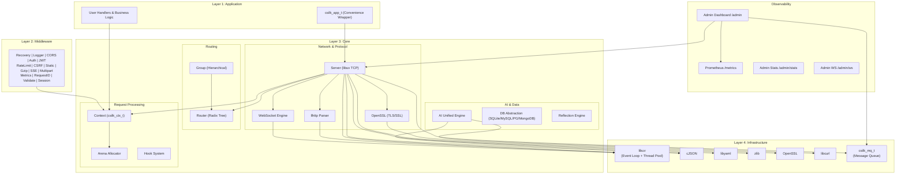
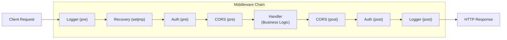
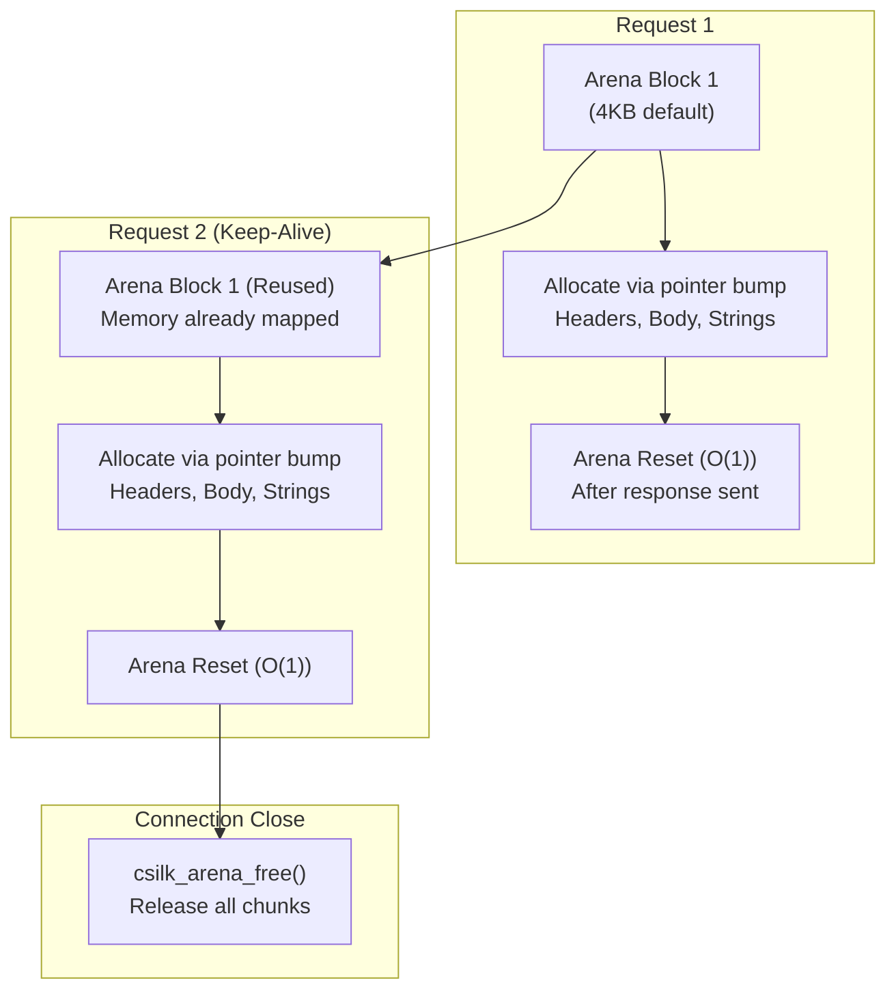
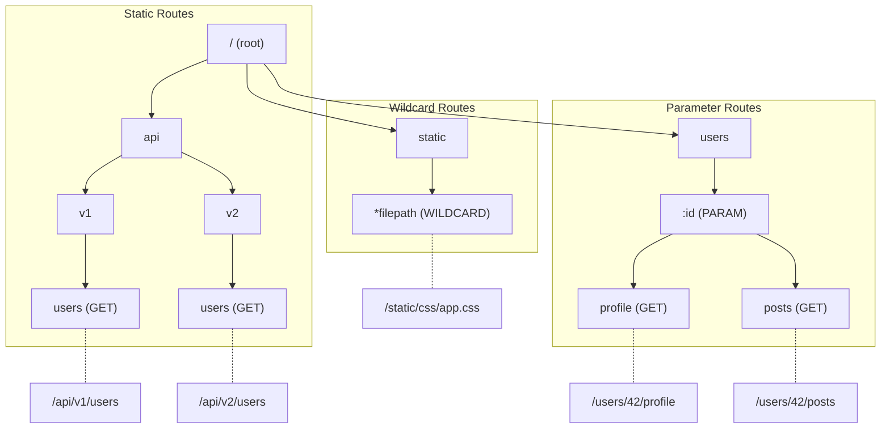
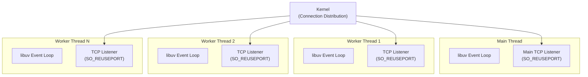
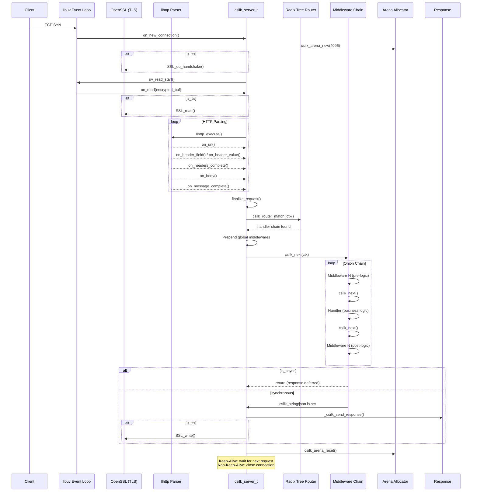

# Architecture

csilk follows a **layered event-driven architecture** with an **onion middleware model**, inspired by Go's Gin framework.

## Layer Architecture



## Core Design Principles

### 1. Reactor Event-Driven Model with Native TLS

csilk uses libuv's event loop as its execution core. All I/O is non-blocking. Since v0.4.0, native TLS support is integrated via OpenSSL BIOs:

- **Encrypted read** -> `on_read` -> `BIO_write` -> `SSL_read` -> `llhttp_execute`
- **Encrypted write** -> `SSL_write` -> `BIO_read` -> `uv_write`

### 2. Onion Middleware & Hook System

#### Onion Middleware Model

Middleware forms a concentric "onion" where each layer wraps the next:



#### Hook System

In addition to the Onion model, a **Hook System** allows listening to global events without intercepting the request flow:
- `CSILK_HOOK_SERVER_START / STOP`
- `CSILK_HOOK_CONN_OPEN / CLOSE`
- `CSILK_HOOK_REQUEST_BEGIN / END`

### 3. Opaque Context & ABI Stability

Starting from v0.3.0, `csilk_ctx_t` is an **opaque type**. The internal structure is hidden in `include/csilk/core/context_internal.h`, ensuring that changes to the core engine do not break binary compatibility for third-party middleware and applications.

### 4. Pluggable Drivers

The framework now supports pluggable drivers for core services:
- **Storage Driver**: Customize how `csilk_set/get` values are stored (e.g., Redis for distributed sessions).
- **Crypto Driver**: Replace default hashing (SHA256, HMAC) and UUID generation with custom or hardware-accelerated implementations.

### 5. Arena Memory Management

Per-connection Arena Allocator eliminates malloc/free overhead:



### 6. Radix Tree Routing

Prefix tree routing with O(path_length) matching:



### 7. Multi-Worker SO_REUSEPORT

For multi-core utilization, csilk supports worker threads each with their own event loop:



## Request Lifecycle



## Key Data Structures

### csilk_ctx_t (Opaque Pointer)
The internal structure (hidden from public API) includes:
```c
struct csilk_ctx_s {
  int handler_index;              // Current position in handler chain
  csilk_handler_t* handlers;      // NULL-terminated handler array
  csilk_arena_t* arena;           // Per-connection arena allocator
  csilk_request_t request;        // Incoming request data
  csilk_response_t response;      // Outgoing response data
  char request_id[37];            // Unique Trace ID (UUID v4)
  csilk_storage_driver_t* storage_driver; // Custom storage backend
  csilk_crypto_driver_t* crypto_driver;   // Custom crypto backend (hash/HMAC/UUID)
  csilk_cipher_driver_t* cipher_driver;   // Custom cipher backend (AES/RSA/sign)
};
```

### csilk_server_s (server instance)
```c
struct csilk_server_s {
  uv_loop_t* loop;                // libuv event loop
  csilk_server_config_t config;   // Server configuration (including TLS)
  SSL_CTX* ssl_ctx;               // OpenSSL context
  csilk_hook_node_t* hooks[HOOK_COUNT]; // Registered event listeners
  atomic_int active_connections;  // Thread-safe connection count
  csilk_mq_t* mq;                 // Internal event bus
};
```

## Component Dependency Map

```mermaid
graph TB
    csilk.h["csilk.h<br/>(Public API)"] --> csilk/core/internal.h["csilk/core/internal.h<br/>(Internal API)"]
    csilk/app/app.h["csilk/app/app.h<br/>(High-Level API)"]
    csilk/app/admin.h["csilk/app/admin.h<br/>(Admin Dashboard API)"]

    subgraph src/core/
        server.c["server.c<br/>TCP + HTTP + libuv"] --> router.c["router.c<br/>Radix Tree"]
        server.c --> context.c["context.c<br/>Req/Res + Handlers"]
        server.c --> websocket.c["websocket.c<br/>WS Handshake + Frames"]
        context.c --> arena.c["arena.c<br/>Memory Pool"]
        context.c --> url.c["url.c<br/>URL Parsing"]
        server.c --> config.c["config.c<br/>YAML Config"]
        server.c --> logger.c["logger.c<br/>Structured Logging"]
        server.c --> reflect.c["reflect.c<br/>JSON <-> C Struct"]
        ai.c["ai.c<br/>Unified AI Engine"] --> ai_openai.c["ai_openai.c<br/>OpenAI Driver"]
        ai.c --> ai_ollama.c["ai_ollama.c<br/>Ollama Driver"]
        utils.c["utils.c<br/>SHA1 + Base64"]
    end

    subgraph src/middleware/ (15 modules)
        logger_mw.c["logger.c"] --> context.c
        auth.c --> context.c
        jwt.c["jwt.c<br/>JWT Auth"] --> context.c
        cors.c --> context.c
        ratelimit.c --> context.c
        csrf.c --> context.c
        static_mw.c["static.c"] --> context.c
        gzip.c --> context.c
        sse.c --> context.c
        multipart.c --> context.c
        metrics.c["metrics.c<br/>Prometheus"] --> context.c
        request_id.c["request_id.c"] --> context.c
        session.c["session.c"] --> context.c
        validate.c["validate.c"] --> context.c
    end

    subgraph src/app/
        app.c["app.c<br/>High-Level Wrapper"] --> server.c
        app.c --> router.c
        app.c --> config.c
        admin.c["admin.c<br/>Dashboard"] --> server.c
        admin.c --> mq.c["mq.c<br/>Message Queue"]
    end

    subgraph src/drivers/
        sqlite.c["sqlite.c"] --> data/db.c
        mysql.c["mysql.c"] --> data/db.c
        postgres.c["postgres.c"] --> data/db.c
        mongodb.c["mongodb.c"] --> data/db.c
    end

    server.c --> libuv[libuv]
    server.c --> llhttp[llhttp]
    context.c --> cjson[cJSON]
```
