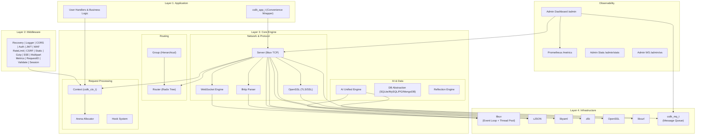
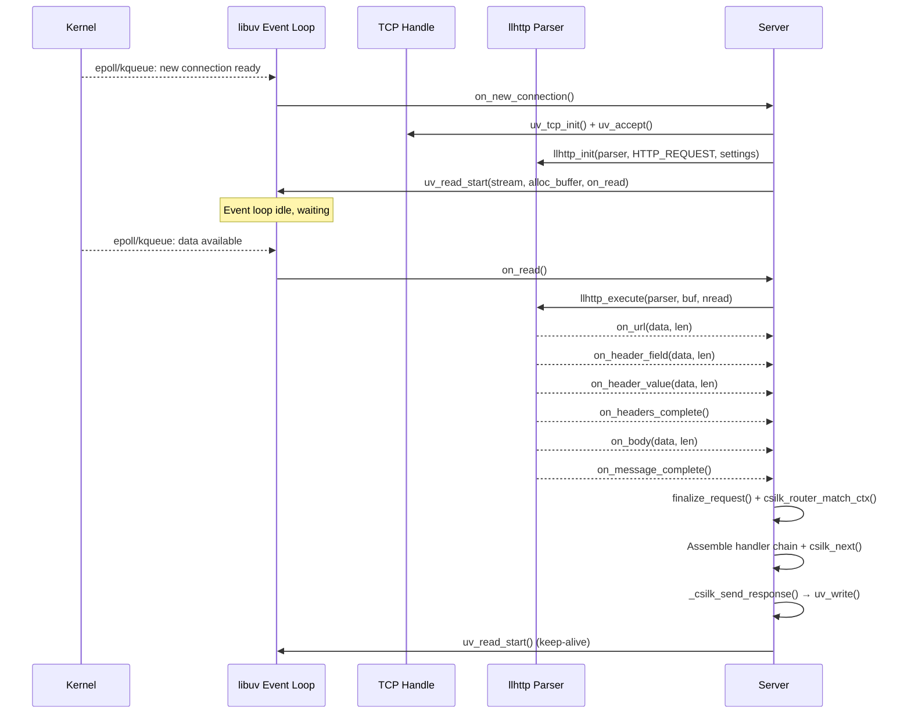
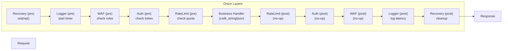
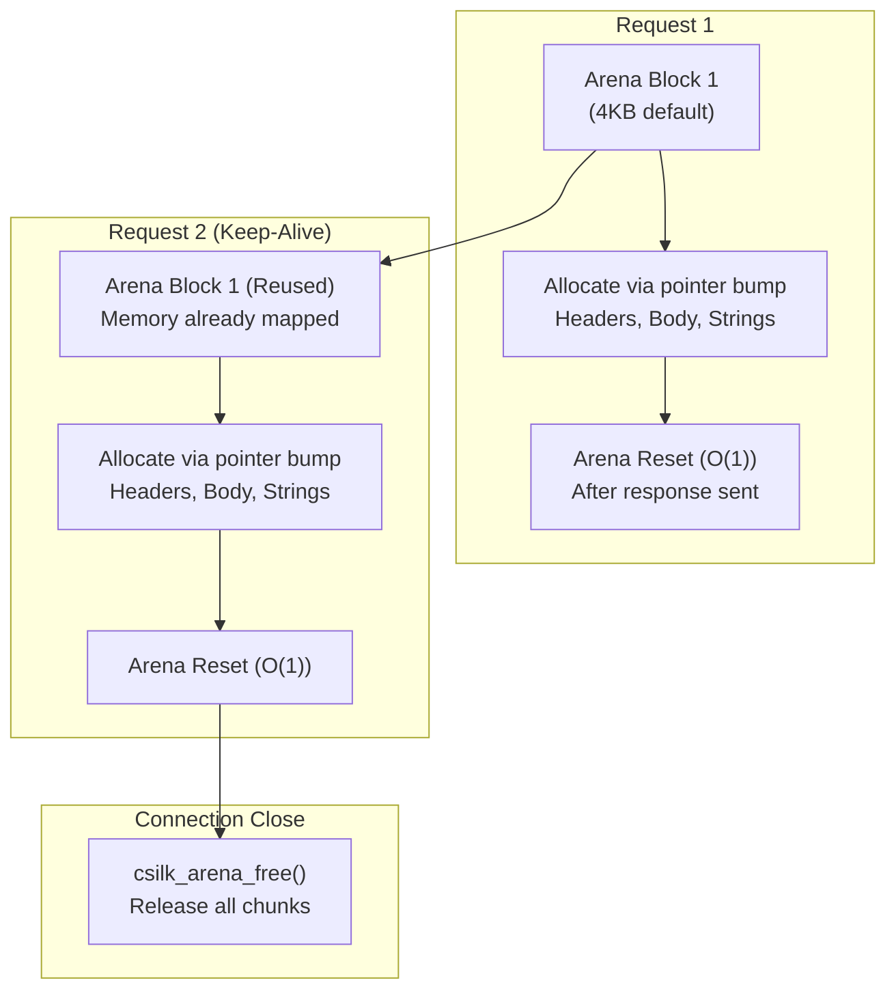
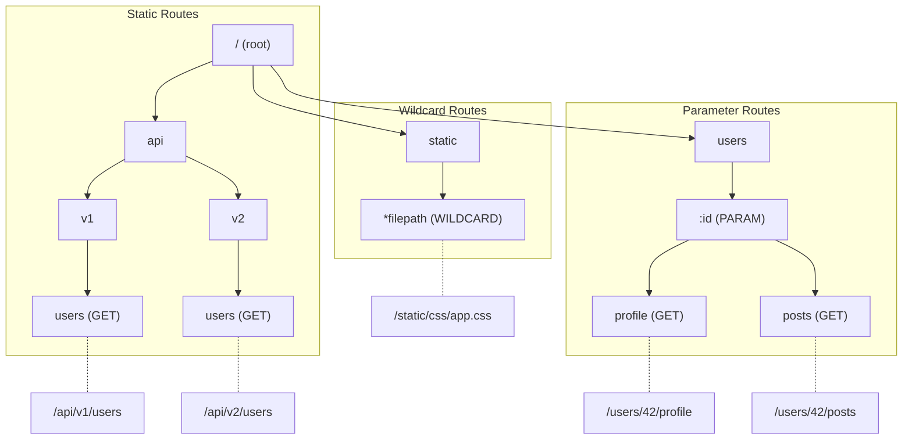
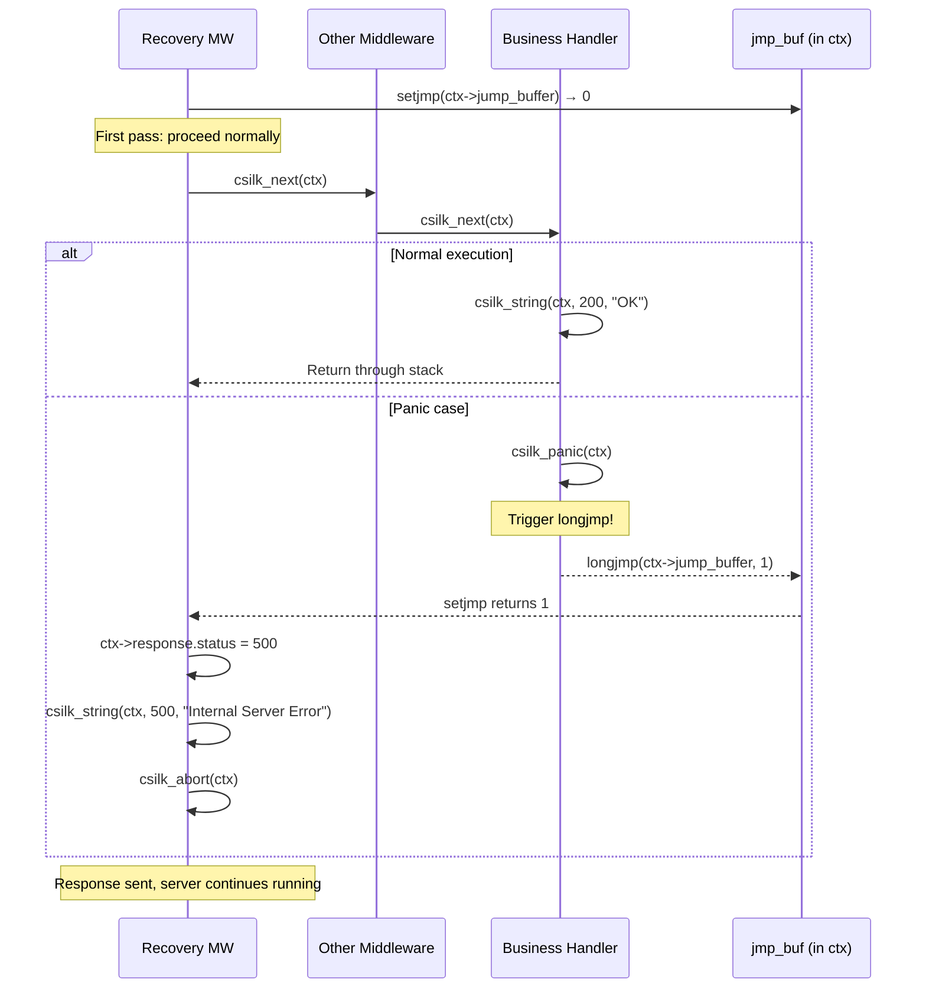
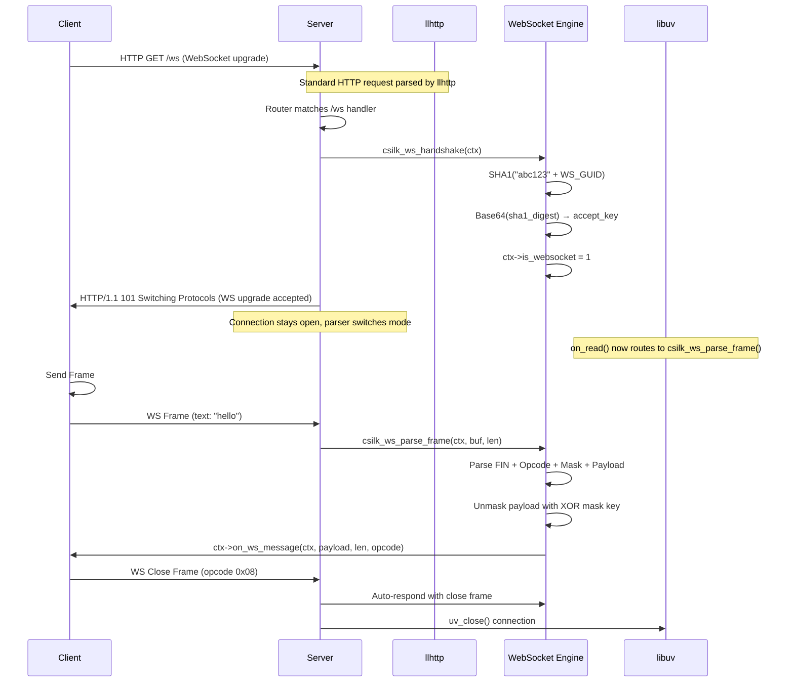
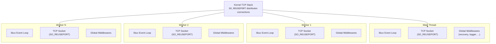
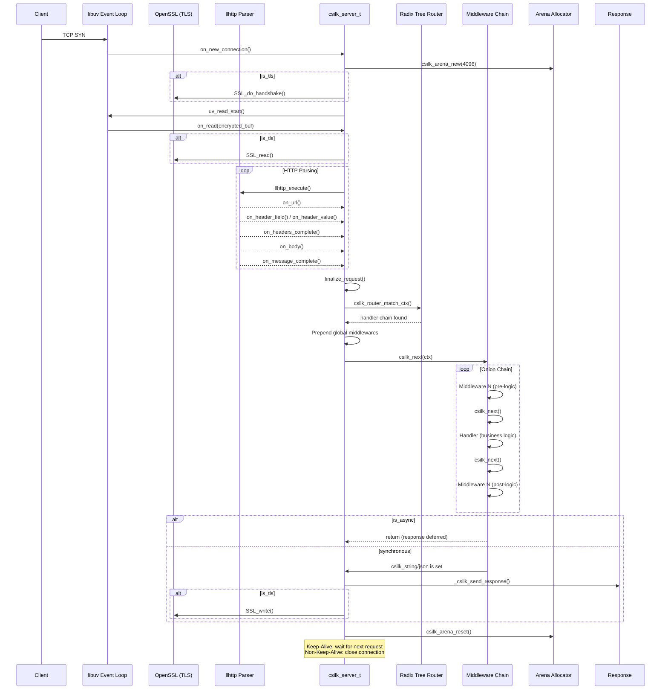
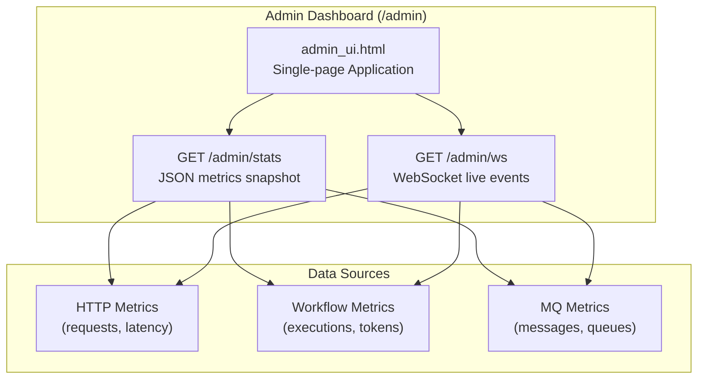

# csilk Architecture Whitepaper & Technical Manual

> **Version**: 0.5.0-dev | **Last updated**: 2026-06-24

csilk is a lightweight, high-performance HTTP web framework written in C, adopting a **layered event-driven architecture** combined with an **onion middleware model**, inspired by Go's Gin framework and powered by libuv, llhttp, nghttp2, and cJSON.

---

## 1. Layer Architecture



---

## 2. Core Design Principles

### 2.1 Reactor Event-Driven Model with Native TLS & ALPN
The framework is built on `libuv`, ensuring all network I/O is non-blocking. 

* **Protocol Dispatcher**: During TLS ALPN negotiation, a dispatcher routes decrypted traffic to either `llhttp` (HTTP/1.1) or `nghttp2` (HTTP/2) based on ALPN (`h2` vs `http/1.1`).
* **HTTP/1.1 parsing**: `llhttp` drives a state-machine parser to process HTTP/1.1 requests. During parsing callbacks, `csilk` uses **Zero-copy HTTP parsing** using string views (`csilk_str_view_t`) that directly reference raw network receive buffers, completely eliminating dynamic `malloc`/`realloc`/`free` heap allocations for HTTP headers, URLs, and bodies.
* **HTTP/2 parsing**: `nghttp2` processes binary HTTP/2 frames, HPACK headers, and handles multiplexed streams.
* **Native TLS integration**: OpenSSL BIO-pairs handle encrypted network traffic directly on the event loop:
  - **Encrypted read** -> `on_read` -> `BIO_write` -> `SSL_read` -> `llhttp_execute` / `csilk_h2_process_data`
  - **Encrypted write** -> `SSL_write` -> `BIO_read` -> `uv_write`



### 2.2 Onion Middleware Model
Middleware implements bidirectional request interception through the `csilk_next()` mechanism.



### 2.3 Hook System
In addition to onion middleware, a hook system allows non-blocking observation of global lifecycle events:
* `CSILK_HOOK_SERVER_START` / `CSILK_HOOK_SERVER_STOP`
* `CSILK_HOOK_CONN_OPEN` / `CSILK_HOOK_CONN_CLOSE`
* `CSILK_HOOK_REQUEST_BEGIN` / `CSILK_HOOK_REQUEST_END`

### 2.4 Opaque Context & ABI Stability
Starting from v0.3.0, `csilk_ctx_t` is defined as an **opaque pointer**. The internal structure layout is hidden in `include/csilk/core/ctx_types.h`. This guarantees binary compatibility (ABI stability) for third-party middleware and user applications when the core engine structure undergoes internal modifications.

### 2.5 Pluggable Drivers
Services are pluggable through clean interfaces:
* **Storage Driver**: Backing store for `csilk_set/get` session variables (e.g. SQLite, Redis).
* **Crypto/Cipher Driver**: Interchangeable cryptography backends (e.g. OpenSSL).
* **AI Driver**: Interface to generic LLM providers (e.g. OpenAI, Ollama).
* **Vector DB Driver**: Interface to vector databases (e.g. Qdrant, Milvus).

### 2.6 Per-Connection Arena Memory Management
An Arena Allocator maps blocks (4KB default) per-connection. All allocations during request processing (headers, JSON parsing, URL splits) use pointer bump allocation.



**Key Advantages:**
* Allocation is reduced to simple pointer arithmetic (no call to malloc/free per request object).
* O(1) reset between requests (setting offset pointer `used = 0`).
* Avoids heap fragmentation. Entire memory pool is freed in one pass when the TCP connection closes.

### 2.7 Radix Tree Routing
Prefix tree routing with O(path_length) matching, support for static, parameterized, and wildcard routes.



---

## 3. Crash Recovery Mechanism (setjmp/longjmp)

Lightweight exception handling routes panics cleanly back to the recovery middleware:



---

## 4. WebSocket & Message Queue

### 4.1 WebSocket Upgrade Flow



* **WebSocket Framing**: Full support for text (opcode 0x1), binary (opcode 0x2), and close frames (opcode 0x8) under RFC 6455.
* **Asynchronous delivery**: `csilk_ws_send` runs asynchronously via `uv_write`.

### 4.2 Thread-Safe Message Queue (csilk_mq)
csilk provides a built-in topic-based message queue system enabling thread-safe communication:


* `csilk_mq_publish` is safe to call from any thread. It signals the main loop using `uv_async_send`.
* The MQ system implements the onion middleware pattern (`csilk_mq_use`) to process topics uniformly.

---

## 5. Multi-Worker Architecture



### Client Pool Thread Safety
Since connection requests run on whatever worker thread accepted them, a lock-free per-worker connection pool is implemented. Each worker loop manages its own `csilk_client_t` freelist, eliminating mutex contention and guaranteeing thread safety when workers construct client structures.

---

## 6. Request Lifecycle

The sequence diagram below shows the complete lifecycle of a request from client to network response:



---

## 7. Database Driver Matrix

Unified database drivers implement a standard interface (`csilk/drivers/db.h`):

| Driver | Source File | Protocol/Dependency | Connection Model |
|--------|-------------|---------------------|------------------|
| **SQLite** | `src/drivers/sqlite.c` | Local File (sqlite3) | Local DB instance |
| **MySQL** | `src/drivers/mysql.c` | TCP Socket (libmysqlclient) | Thread pool connection pool |
| **PostgreSQL** | `src/drivers/postgres.c` | TCP Socket (libpq) | Thread pool connection pool |
| **MongoDB** | `src/drivers/mongodb.c` | TCP Socket (libmongoc) | Driver pool manager |

---

## 8. Observability & Dashboard

### 8.1 Prometheus Metrics
Native metrics exposition format:
* `http_requests_total`: Counter partitioned by method, path, and status code.
* `http_request_duration_seconds`: Histogram bucket for request latency calculations (P99, P95).
* `http_active_connections`: Current active connection counts.

### 8.2 Admin Dashboard (/admin)



---

## 9. Performance Features

* **Zero-copy Static File Serving**: Serves files using `sendfile` system calls (abstracted as `uv_fs_sendfile`). Transmit calls happen directly from the kernel cache to the socket descriptor, avoiding user-space context switches.
* **Trace correlation**: Request ID middleware injects a unique UUID v4 into the request headers and logging telemetry.

---

## 10. Developer Guide

### 10.1 Writing WebSocket Handlers
```c
void ws_on_message(csilk_ctx_t* c, const uint8_t* payload, size_t len, int opcode) {
    csilk_ws_send(c, (uint8_t*)"Hello Client", 12, 1);
}

void ws_handler(csilk_ctx_t* c) {
    csilk_ws_handshake(c);
    if (c->is_websocket) {
        c->on_ws_message = ws_on_message;
    }
}
```

### 10.2 Writing Middleware
```c
void my_middleware(csilk_ctx_t* c) {
    // Pre-logic: e.g., check Token
    csilk_next(c);
    // Post-logic: e.g., log latency
}
```

### 10.3 Starting the Server
```c
int main() {
    csilk_router_t* r = csilk_router_new();
    csilk_group_t* g = csilk_group_new(r, "/api");
    csilk_GET(g, "/ping", handler);

    csilk_server_t* s = csilk_server_new(r);
    csilk_server_run(s, 8080);
    return 0;
}
```

---

## 11. Component Dependency Map

```mermaid
graph TB
    csilk.h["csilk.h<br/>(Public API)"] --> csilk/core/internal.h["csilk/core/internal.h<br/>(Internal API umbrella)"]
    csilk/core/internal.h["csilk/core/internal.h"] --> csilk/core/hash.h["hash.h<br/>(SHA-1/SHA-256/HMAC)"]
    csilk/core/internal.h --> csilk/core/codec.h["codec.h<br/>(Base64/URL-decode)"]
    csilk/core/internal.h --> csilk/core/ws_frame.h["ws_frame.h<br/>(WebSocket frames)"]
    csilk/core/internal.h --> csilk/core/crypto_dispatch.h["crypto_dispatch.h<br/>(Crypto stubs)"]
    csilk/core/internal.h --> csilk/core/mq_types.h["mq_types.h<br/>(Message Queue)"]
    csilk/app/app.h["csilk/app/app.h<br/>(High-Level API)"]
    csilk/app/admin.h["csilk/app/admin.h<br/>(Admin Dashboard API)"]

    subgraph src/core/
        server.c["server.c<br/>TCP + HTTP + libuv"] --> router.c["router.c<br/>Radix Tree"]
        server.c --> context.c["context.c<br/>Req/Res + Handlers"]
        server.c --> websocket.c["websocket.c<br/>WS Handshake + Frames"]
        context.c --> arena.c["arena.c<br/>Memory Pool"]
        context.c --> url.c["url.c<br/>URL Parsing"]
        server.c --> config.c["config.c<br/>YAML Config"]
        server.c --> logger.c["logger.c<br/>Structured Logging"]
        server.c --> reflect.c["reflect.c<br/>JSON <-> C Struct"]
        ai.c["ai.c<br/>Unified AI Engine"] --> ai_openai.c["ai_openai.c<br/>OpenAI Driver"]
        ai.c --> ai_ollama.c["ai_ollama.c<br/>Ollama Driver"]
        utils.c["utils.c<br/>SHA1 + Base64"]
    end

    subgraph src/middleware/ (15 modules)
        logger_mw.c["logger.c"] --> context.c
        auth.c --> context.c
        jwt.c["jwt.c<br/>JWT Auth"] --> context.c
        cors.c --> context.c
        ratelimit.c --> context.c
        csrf.c --> context.c
        static_mw.c["static.c"] --> context.c
        gzip.c --> context.c
        sse.c --> context.c
        multipart.c --> context.c
        metrics.c["metrics.c<br/>Prometheus"] --> context.c
        request_id.c["request_id.c"] --> context.c
        session.c["session.c"] --> context.c
        validate.c["validate.c"] --> context.c
    end

    subgraph src/app/
        app.c["app.c<br/>High-Level Wrapper"] --> server.c
        app.c --> router.c
        app.c --> config.c
        admin.c["admin.c<br/>Dashboard"] --> server.c
        admin.c --> mq.c["mq.c<br/>Message Queue"]
    end

    subgraph src/drivers/
        sqlite.c["sqlite.c"] --> data/db.c
        mysql.c["mysql.c"] --> data/db.c
        postgres.c["postgres.c"] --> data/db.c
        mongodb.c["mongodb.c"] --> data/db.c
    end

    server.c --> libuv[libuv]
    server.c --> llhttp[llhttp]
    context.c --> cjson[cJSON]
```

---

## 12. Directory Tree Structure

```
csilk/
├── include/
│   ├── csilk.h                    # Umbrella (includes all module headers)
│   └── csilk/
│       ├── types.h                # Core types, constants, driver vtables
│       ├── context.h              # Request context accessor API
│       ├── response.h             # Response writing (status/JSON/redirect/chunked)
│       ├── router.h               # Radix-tree router
│       ├── server.h               # Server lifecycle + config
│       ├── middleware.h            # Built-in middleware function declarations
│       ├── websocket.h            # WebSocket API
│       ├── sse.h                  # Server-Sent Events API
│       ├── mq.h                   # Message Queue pub/sub API
│       ├── group.h                # Route groups
│       ├── hooks.h                # Lifecycle hook system
│       ├── workflow.h             # Workflow engine umbrella
│       ├── admin.h                # Admin dashboard umbrella
│       ├── errors.h               # HTTP status code constants
│       ├── config.h               # Server/app configuration structs
│       ├── crypto.h               # Cryptographic utility functions
│       ├── hot_reload.h           # Hot-reload API
│       ├── version.h              # CSILK_VERSION macro (generated)
│       ├── app/
│       │   ├── app.h              # High-level app API
│       │   ├── workflow.h         # Workflow engine public API
│       │   └── workflow_wal.h     # WAL persistence API
│       ├── core/
│       │   ├── internal.h         # Internal umbrella
│       │   ├── hash.h             # SHA-1, SHA-256, HMAC-SHA256
│       │   ├── codec.h            # Base64, Base64URL, URL decode
│       │   ├── bounded_buf.h      # Stack-only bounded string/JSON builder
│       │   ├── ws_frame.h         # WebSocket frame parsing
│       │   ├── crypto_dispatch.h  # Crypto/cipher dispatch stubs
│       │   ├── mq_types.h         # Internal MQ data structures
│       │   ├── ctx_types.h        # csilk_ctx_s struct layout
│       │   └── srv_types.h        # csilk_server_s / csilk_client_s layouts
│       ├── drivers/
│       │   ├── ai.h               # AI driver interface
│       │   ├── db.h               # DB driver interface
│       │   ├── cipher.h           # Cipher driver interface
│       │   ├── perm.h             # Permission driver interface
│       │   └── vector.h           # Vector DB driver interface
│       ├── test/
│       │   └── test.h             # Test utilities (OOM simulation, context helpers)
│       └── reflection/
│           └── reflect.h          # Runtime type reflection
├── src/
│   ├── core/                      # Server engine
│   │   ├── server.c               # Lifecycle: create/run/stop/free/hooks/workers
│   │   ├── connection.c           # Pool, accept, I/O, timers, on_read
│   │   ├── http1.c                # llHTTP callbacks, dispatch, response serialization
│   │   ├── tls.c                  # OpenSSL init, BIO-pair, ALPN negotiation
│   │   ├── context.c              # Request reading, lifecycle, binding, cookies
│   │   ├── response.c             # Response writing (status/JSON/redirect/chunked)
│   │   ├── router.c               # Radix-tree route matching
│   │   ├── arena.c                # Bump allocator
│   │   ├── config.c               # YAML configuration loader
│   │   ├── h2.c                   # HTTP/2 integration (nghttp2)
│   │   ├── h2.h                   # HTTP/2 internal header
│   │   ├── logger.c               # Structured logging
│   │   ├── recovery.c             # setjmp/longjmp error recovery
│   │   ├── url.c                  # URL parsing and splitting
│   │   ├── utils.c                # misc utility functions
│   │   ├── base64.c               # Base64/Base64URL encode/decode
│   │   ├── sha1.c                 # SHA-1 hash (WebSocket handshake)
│   │   ├── uuid.c                 # UUID v4 generation
│   │   ├── bounded_buf.c          # Stack-only bounded string/JSON builder
│   │   ├── hot_reload.c           # File-watch hot-reload (inotify)
│   │   ├── test_utils.c           # Test OOM utilities
│   │   ├── admin.c                # Admin dashboard
│   │   ├── srv_impl.h             # Cross-file declarations for server split
│   │   └── srv_internal.h         # Internal server types
│   ├── app/                       # Thin app wrappers
│   │   ├── app.c
│   │   └── group.c
│   ├── data/                      # Database abstraction
│   │   ├── db.c                   # Pool lifecycle, query/exec dispatch
│   │   └── db_internal.h          # csilk_db_pool_s private struct
│   ├── ai/                        # AI unified interface
│   │   └── ai.c
│   ├── workflow/                  # AI workflow engine
│   │   ├── wf_ai.c                # AI chat nodes, memory helper, templates
│   │   ├── wf_lifecycle.c         # Lifecycle: creation, destruction, registration
│   │   ├── wf_monitor.c           # Real-time monitor events
│   │   ├── wf_scheduler.c         # Execution engine, DAG scheduling, WAL restore
│   │   ├── wf_trace.c             # Execution trace recording
│   │   ├── workflow_internal.h    # Internal structures & stubs
│   │   ├── workflow_loader.c      # JSON/YAML parser loaders
│   │   └── workflow_wal.c         # WAL persistence engine
│   ├── middleware/                # Built-in middleware modules
│   ├── protocols/                 # WebSocket, Swagger
│   ├── drivers/                   # Driver implementations
│   ├── messaging/                 # Message Queue
│   ├── reflection/                # Runtime type reflection
│   ├── security/                  # Permission system
│   └── util/                      # Utility modules
├── tests/                         # Unit/integration/fuzz tests
├── examples/                      # Example applications
├── docs/                          # Architecture, research, analysis docs
├── cmake/                         # CMake modules
└── CMakeLists.txt                 # C23, version 0.5.0-dev
```

---

## 13. Document Generation

csilk uses **Doxygen** to build API documentation from annotated files:
* All public headers in `include/` and implementation files in `src/` include full Doxygen tags (`@brief`, `@param`, `@return`).
* Command to generate documentation locally: `make docs` (requires Doxygen 1.12+).
* CI is configured for GitHub Pages auto-deployment of the generated HTML docs.
