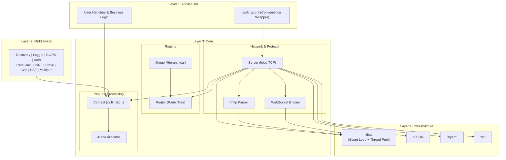
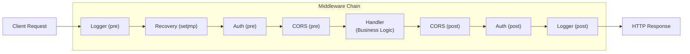
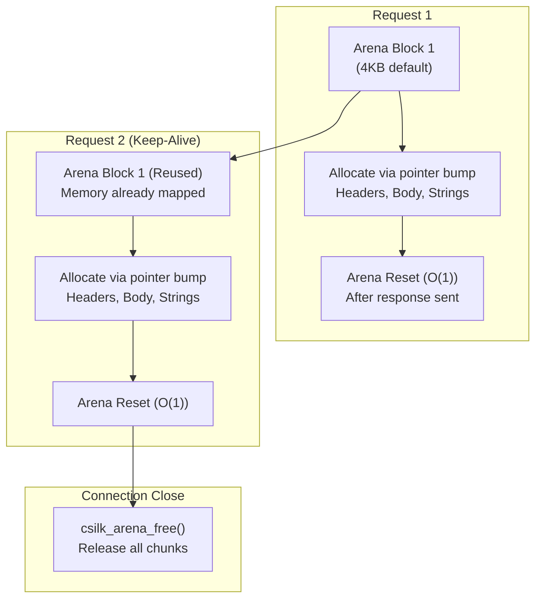
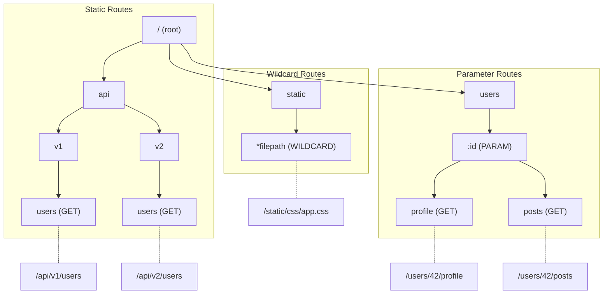
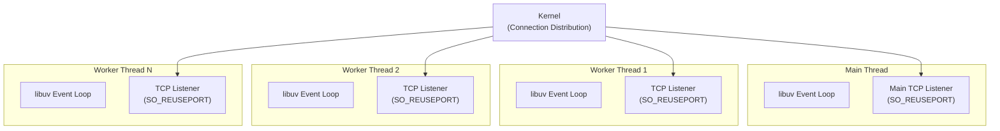
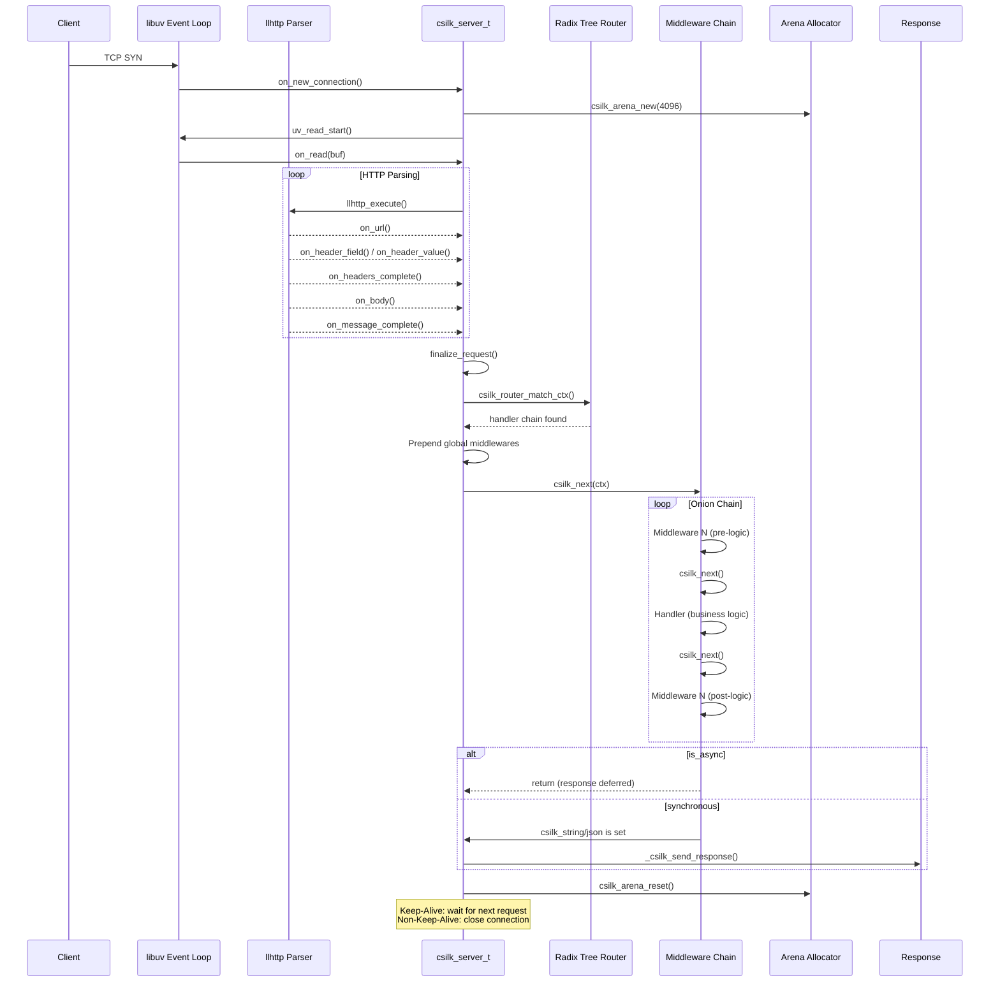
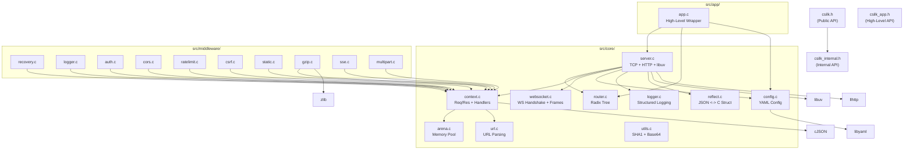

# Architecture

csilk follows a **layered event-driven architecture** with an **onion middleware model**, inspired by Go's Gin framework.

## Layer Architecture



## Core Design Principles

### 1. Reactor Event-Driven Model

csilk uses libuv's event loop as its execution core. All I/O is non-blocking:

- **Client connections** -> `on_new_connection` callback
- **Data reception** -> `on_read` callback
- **HTTP parsing** -> llhttp callbacks (6 state-machine callbacks)
- **Response writes** -> `on_write` callback
- **Idle timeouts** -> `on_timeout` callback

### 2. Onion Middleware Model

Middleware forms a concentric "onion" where each layer wraps the next:



### 3. Arena Memory Management

Per-connection Arena Allocator eliminates malloc/free overhead:



### 4. Radix Tree Routing

Prefix tree routing with O(path_length) matching:



### 5. Multi-Worker SO_REUSEPORT

For multi-core utilization, csilk supports worker threads each with their own event loop:



## Request Lifecycle



## Key Data Structures

### csilk_ctx_t (per-request context)
```c
struct csilk_ctx_s {
  int handler_index;              // Current position in handler chain
  csilk_handler_t* handlers;      // NULL-terminated handler array
  int aborted;                    // Chain execution aborted
  jmp_buf jump_buffer;            // For panic recovery (setjmp/longjmp)
  csilk_arena_t* arena;           // Per-connection arena allocator
  csilk_request_t request;        // Incoming request data
  csilk_response_t response;      // Outgoing response data
  csilk_param_t params[20];       // URL path parameters
  int is_websocket;               // WebSocket upgrade flag
  int is_sse;                     // SSE initialization flag
  void (*on_ws_message)(...);     // WebSocket message callback
};
```

### csilk_server_s (server instance)
```c
struct csilk_server_s {
  uv_loop_t* loop;                // libuv event loop
  csilk_router_t* router;         // Route table
  uv_tcp_t server_handle;         // TCP server
  llhttp_settings_t settings;     // HTTP parser callbacks
  csilk_server_config_t config;   // Server configuration
  csilk_handler_t middlewares[32]; // Global middleware chain (max 32)
  int middleware_count;
  int max_connections;            // Connection limit (0 = unlimited)
  int active_connections;         // Current connection count
};
```

## Component Dependency Map


