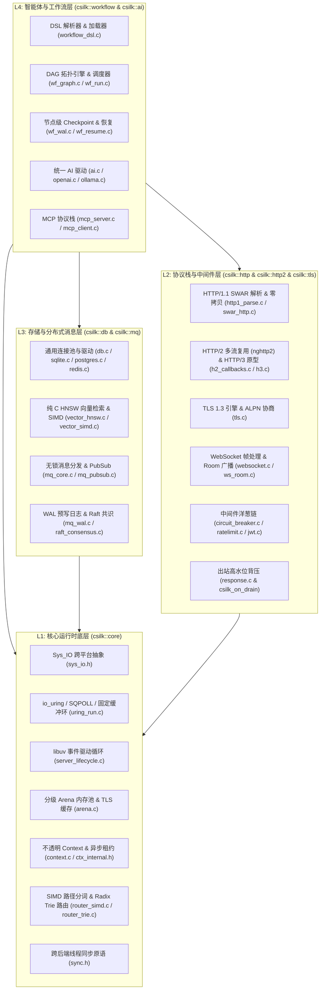
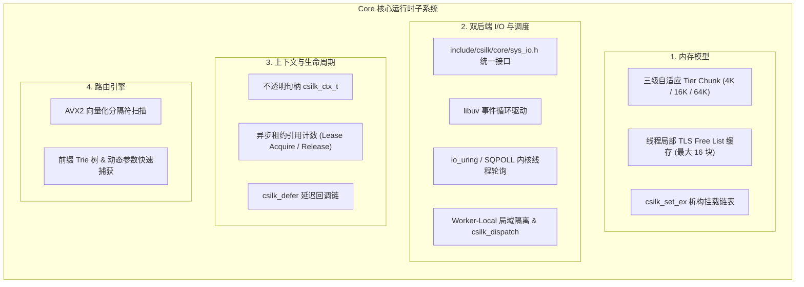
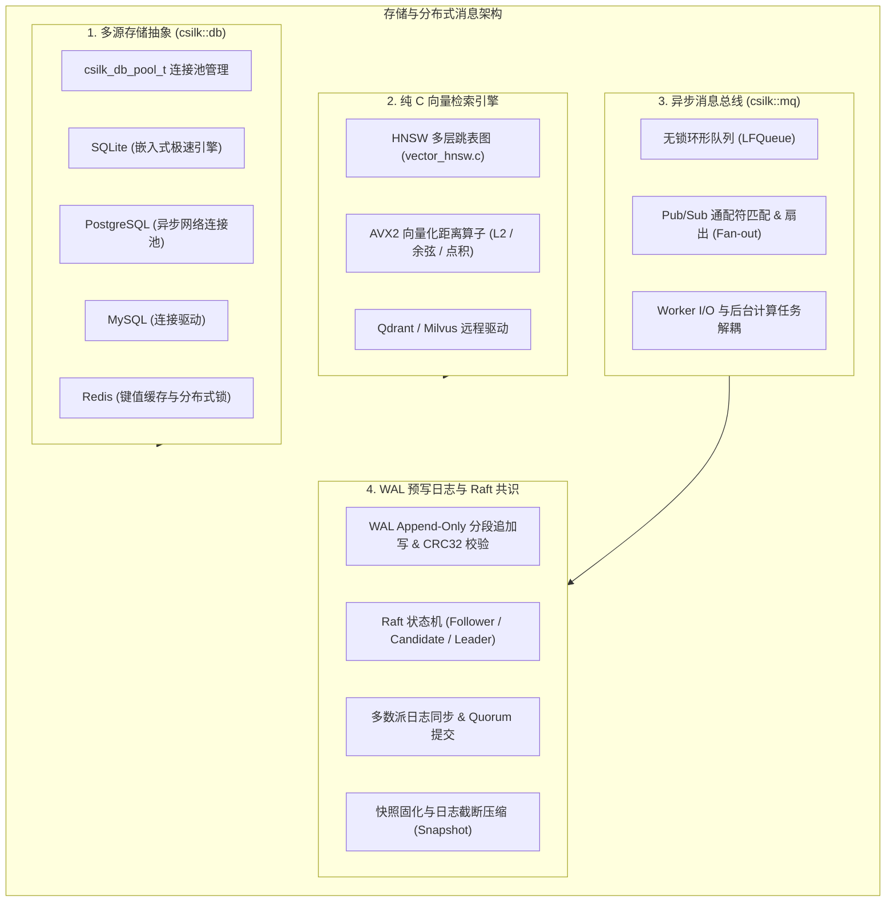
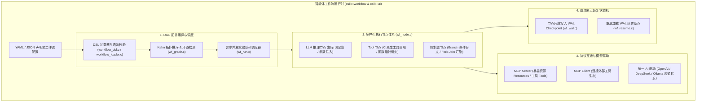

# Csilk (`csilk`) 代码库全景架构与模块独立深度剖析白皮书

- **版本**：v0.4.0
- **日期**：2026-08-18
- **目标工程**：Csilk (`csilk`) — 高性能 C 语言异步 Web 服务与智能体运行时

---

## 目录

1. [总体架构与设计哲学 (Executive Architecture & Philosophy)](#1-总体架构与设计哲学)
   - 1.1 [核心定位与设计准则](#11-核心定位与设计准则)
   - 1.2 [9 大模块化子库拓扑矩阵](#12-9-大模块化子库拓扑矩阵)
   - 1.3 [系统全景分层依赖图](#13-系统全景分层依赖图)
2. [专篇一 · Core Runtime 核心运行时深度剖析](#2-专篇一--core-runtime-核心运行时深度剖析)
   - 2.1 [内存模型与分级自适应 Arena 分配器](#21-内存模型与分级自适应-arena-分配器)
   - 2.2 [上下文生命周期与异步租约保护 (Async Lease)](#22-上下文生命周期与异步租约保护-async-lease)
   - 2.3 [双后端 I/O 抽象与并发单线程约束 (Confinement)](#23-双后端-io-抽象与并发单线程约束-confinement)
   - 2.4 [SIMD 向量化加速与 Radix/Trie 路由树](#24-simd-向量化加速与-radixtrie-路由树)
3. [专篇二 · Network & Protocols 网络与协议栈深度剖析](#3-专篇二--network--protocols-网络与协议栈深度剖析)
   - 3.1 [HTTP/1.1 SWAR 极速解析与零拷贝分片](#31-http11-swar-极速解析与零拷贝分片)
   - 3.2 [HTTP/2 多路复用与 HTTP/3 演进](#32-http2-多路复用与-http3-演进)
   - 3.3 [WebSocket 全双工与 Room 跨线程广播系统](#33-websocket-全双工与-room-跨线程广播系统)
   - 3.4 [中间件洋葱流水线与出站高水位背压](#34-中间件洋葱流水线与出站高水位背压)
4. [专篇三 · Storage & Messaging 存储与分布式消息深度剖析](#4-专篇三--storage--messaging-存储与分布式消息深度剖析)
   - 4.1 [统一数据库抽象与通用连接池](#41-统一数据库抽象与通用连接池)
   - 4.2 [SIMD 加速向量检索与嵌入式 HNSW 图索引](#42-simd-加速向量检索与嵌入式-hnsw-图索引)
   - 4.3 [异步消息队列与 Pub/Sub 架构](#43-异步消息队列与-pubsub-架构)
   - 4.4 [WAL 预写日志与 Raft 分布式一致性引擎](#44-wal-预写日志与-raft-分布式一致性引擎)
5. [专篇四 · High-Level Engine 智能工作流与代理引擎深度剖析](#5-专篇四--high-level-engine-智能工作流与代理引擎深度剖析)
   - 5.1 [原生 C 语言 AI LLM 驱动体系](#51-原生-c-语言-ai-llm-驱动体系)
   - 5.2 [MCP (Model Context Protocol) 协议栈实现](#52-mcp-model-context-protocol-协议栈实现)
   - 5.3 [Workflow DAG 拓扑图与调度引擎](#53-workflow-dag-拓扑图与调度引擎)
   - 5.4 [声明式 DSL 解析与崩溃断点恢复机制](#54-声明式-dsl-解析与崩溃断点恢复机制)
6. [核心架构红线与避坑指南 (Architectural Gotchas & Anti-Pitfalls)](#6-核心架构红线与避坑指南)
7. [工程构建与测试验证矩阵 (Build & Verification Matrix)](#7-工程构建与测试验证矩阵)

---

## 1. 总体架构与设计哲学

### 1.1 核心定位与设计准则
Csilk (`csilk`) 是基于 C23 标准开发的高性能网络服务运行时与分布式智能体工作流底座，旨在为极致并发与极低延迟场景提供现代化 C 原生开发体验。系统贯彻以下设计准则：

1. **极致吞吐与零拷贝内存架构**：
   - 全链路杜绝高频小内存申请与释放开销，依靠请求级自适应 Arena 内存池、线程局部缓存列表（TLS Free List）以及网络接收缓冲区分片（Slice），在请求处理生命周期内达成近乎零 `malloc`/`free` 开销与零冗余拷贝。
2. **跨平台双 I/O 事件驱动抽象**：
   - 屏蔽底层平台差异，统一通过 [`include/csilk/core/sys_io.h`](file:///home/quintin/Data/source/c_cpp/server-c/include/csilk/core/sys_io.h) 暴露同构 API。默认支持跨平台的 `libuv` 事件驱动后端，在 Linux 平台上支持原生 `io_uring`（含 SQPOLL 内核线程轮询与固定缓冲区分片），并向前兼容 AF_XDP/DPDK 零拷贝旁路。
3. **严格不透明句柄 (Opaque Handle) 与 ABI 稳定性**：
   - 核心内部数据结构对外部调用者完全不透明（如 [`csilk_ctx_t`](file:///home/quintin/Data/source/c_cpp/server-c/include/csilk/core/types.h#L85-L93)），所有字段读写均通过访问器函数进行，严格隔离公共头文件与内部实现头文件，杜绝内存跨模块破坏并保障动态链接库的 ABI 向后兼容。
4. **单线程局域约束 (Thread Confinement) 与无锁/低锁调度**：
   - 活跃连接表 `wp->active_clients` 严格局限于所属 Worker 线程内部，禁止多线程并发读写。跨 Worker 广播或异步回调统一通过 `csilk_dispatch` 投递至目标 Worker 的事件循环处理，消除多线程竞争死锁。
5. **全栈模块化与分层解耦**：
   - 体系化划分为 9 大独立子库，支持以 CMake 细粒度按需链接（如仅链接 `csilk::http` + `csilk::tls`），兼顾轻量级微服务与全功能分布式运行时的多样化需求。

---

### 1.2 9 大模块化子库拓扑矩阵

| 目标名称 (Alias) | 静态库 / 动态库 | 关键源目录 | 核心职责说明 |
|---|---|---|---|
| `csilk::core` / `csilk::core_shared` | `libcsilk-core.a` / `.so` | `src/core/` | 基础 Arena 内存池、上下文、SIMD/Trie 路由、Sys_IO 抽象、加密原语 |
| `csilk::http` / `csilk::http_shared` | `libcsilk-http.a` / `.so` | `src/core/http/`, `src/middleware/` | HTTP/1.1 解析与状态机、连接池、应用层流水线、全套中间件 |
| `csilk::tls` / `csilk::tls_shared` | `libcsilk-tls.a` / `.so` | `src/core/http/tls.c` | TLS 1.3 传输加密、OpenSSL BIO 桥接、ALPN 多协议握手协商 |
| `csilk::http2` / `csilk::http2_shared` | `libcsilk-http2.a` / `.so` | `src/core/http/h2*.c`, `src/protocols/h3.c` | HTTP/2 多路复用 (nghttp2)、HPACK 头部压缩与 HTTP/3/QUIC 原型 |
| `csilk::db` / `csilk::db_shared` | `libcsilk-db.a` / `.so` | `src/drivers/db/`, `src/drivers/vector/` | 数据库抽象 (SQLite/PG/MySQL/Redis) 与纯 C HNSW 向量检索 |
| `csilk::ai` / `csilk::ai_shared` | `libcsilk-ai.a` / `.so` | `src/drivers/ai/` | 统一 AI LLM 客户端 (OpenAI/Ollama/DeepSeek) 与 SSE 流式转发 |
| `csilk::mq` / `csilk::mq_shared` | `libcsilk-mq.a` / `.so` | `src/messaging/` | 高性能消息队列、Pub/Sub、无锁队列 (LFQueue)、WAL 日志与 Raft 共识 |
| `csilk::workflow` / `csilk::workflow_shared` | `libcsilk-workflow.a` / `.so` | `src/workflow/`, `src/protocols/mcp/` | 声明式 DSL、DAG 拓扑调度引擎、MCP 协议与 WAL 崩溃断点恢复 |
| `csilk::csilk` / `csilk::csilk_shared` | `libcsilk.a` / `.so` | `src/` 全量 | 包含上述全部功能的一体化综合库 |

---

### 1.3 系统全景分层依赖图



---

## 2. 专篇一 · Core Runtime 核心运行时深度剖析



### 2.1 内存模型与分级自适应 Arena 分配器
- **源文件位置**：[`src/core/primitives/arena.c`](file:///home/quintin/Data/source/c_cpp/server-c/src/core/primitives/arena.c), [`include/csilk/core/types.h:60-78`](file:///home/quintin/Data/source/c_cpp/server-c/include/csilk/core/types.h#L60-L78)
- **三级自适应 Chunk 设计**：
  - `CSILK_ARENA_TIER_SMALL` (4KB)：匹配大多数轻量级 RESTful API 请求与小响应头；
  - `CSILK_ARENA_TIER_MEDIUM` (16KB)：适应常见 JSON 负载与多字段表单解析；
  - `CSILK_ARENA_TIER_LARGE` (64KB)：承载批量聚合、大文件分片上传与流式大响应。
- **TLS Free List 极速无锁复用**：
  - 每个 Worker 线程维护一个私有的 TLS Chunk 链表（最多缓存 `CSILK_MAX_TLS_CHUNKS = 16` 个已分配块）；
  - 请求完成时触发 `csilk_arena_reset()`，仅将内存偏移指针重置回起始位置，将物理内存块归还给 TLS 缓存，避免系统调用 `brk`/`mmap` 引起的上下文切换；
  - 线程正常退出时，必须调用 `csilk_arena_flush_free_list()` 释放全部线程局部 Chunk，杜绝内存泄漏。
- **内存分配语义与安全规范**：
  - `csilk_arena_alloc(arena, size)`：返回未初始化的原始内存，提供极限性能；
  - `csilk_arena_calloc(arena, num, size)`：显式将内存块 `memset` 置零，用于安全敏感的数据结构；
  - 动态扩容时采用分块单向链表（Chunk Linked List），单请求超出 Tier 阈值时自动动态串联新块，请求重置时统一回收。

---

### 2.2 上下文生命周期与异步租约保护 (Async Lease)
- **源文件位置**：[`src/core/ctx/context.c`](file:///home/quintin/Data/source/c_cpp/server-c/src/core/ctx/context.c), [`src/core/ctx/ctx_internal.h`](file:///home/quintin/Data/source/c_cpp/server-c/src/core/ctx/ctx_internal.h), [`include/csilk/core/context.h`](file:///home/quintin/Data/source/c_cpp/server-c/include/csilk/core/context.h)
- **严格不透明封装 (Opaque Handle)**：
  - 外部仅持有 `csilk_ctx_t*` 句柄指针，内部结构体 `struct csilk_ctx_s` 隐藏在 `ctx_internal.h` 中，集中包含请求行、Header 字典、Response 缓冲区、Storage 槽位、Arena 句柄与租约计数器；
  - 外部调用者只能通过 `csilk_req_header()`、`csilk_param()`、`csilk_get()` 等接口访问，杜绝非受控破坏。
- **RAII 挂载机制 (`csilk_set_ex`)**：
  - 当需要在上下文生命周期内保存堆分配对象（例如外部 cJSON 节点、第三方 SDK 句柄）时，使用 `csilk_set_ex(ctx, key, ptr, destructor)` 注册自定义析构函数；
  - 上下文重置/销毁时，自动倒序遍历执行析构回调，确保外部动态分配资源与内部 Arena 内存同步释放。
- **异步租约机制 (Async Lease)**：
  - **痛点场景**：HTTP 请求处理过程中触发了慢速后台任务（如向 MQ 投递、执行复杂 AI 推理、离线存储），如果此时客户端主动断开连接，主事件循环可能会提前重置请求 Arena，导致后台线程访问上下文出现 Use-After-Free；
  - **解决方案**：
    1. 在将 Context 移交给后台任务前，调用 `csilk_ctx_lease_acquire(ctx)` 将引用计数加 1；
    2. 主事件循环检测到连接断开时，若 `lease_count > 0` 则挂起回收逻辑，标记为孤儿租约；
    3. 后台任务执行完毕后调用 `csilk_ctx_lease_release(ctx)` 将租约递减；
    4. 当租约计数降至 0 时，安全触发最终的 Arena 重置与连接资源回收。

---

### 2.3 双后端 I/O 抽象与并发单线程约束 (Confinement)
- **源文件位置**：[`include/csilk/core/sys_io.h`](file:///home/quintin/Data/source/c_cpp/server-c/include/csilk/core/sys_io.h), [`src/core/uring/uring_run.c`](file:///home/quintin/Data/source/c_cpp/server-c/src/core/uring/uring_run.c), [`src/core/server/server_worker.c`](file:///home/quintin/Data/source/c_cpp/server-c/src/core/server/server_worker.c)
- **统一 I/O 抽象层**：
  - 抽象出 `csilk_io_loop_t`、`csilk_io_tcp_t`、`csilk_io_timer_t` 等对象；
  - 跨平台默认编译基于 `libuv` 的事件循环；在 Linux 上开启 `-DCSILK_USE_URING=ON` 时，透明切换至纯 `io_uring` 实现。
- **Linux 原生 `io_uring` 高级特性**：
  - **SQPOLL (Submission Queue Polling)**：启用内核级独立轮询线程，避免用户态到内核态的 `enter` 系统调用；
  - **固定缓冲区与注册文件描述符 (Fixed Buffers & Registered FDs)**：减少内核内存映射与描述符查找开销；
  - **缓冲区环 (Provided Buffer Ring)**：由内核按需在收到数据时自动从预分配环中选取 Buffer，消除应用层频繁提交读缓冲区的开销。
- **Worker-Local 局域隔离规范 (Thread Confinement)**：
  - 每个 Worker 维护私有的 `wp->active_clients` 链表，严禁多线程跨界直接访问客户端连接句柄；
  - **跨线程通讯契约**：当需要向跨 Worker 连接广播消息时，必须使用 `csilk_dispatch(ctx, callback, arg)`，将调用封包投递至持有该连接的 Worker 事件循环队列中执行。
- **跨后端同步原语规范**：
  - 核心模块严禁直接调用原生 `uv_*` 或 `pthread_*` API，必须统一使用 `<csilk/core/sync.h>` 封装的 `csilk_mutex_t`、`csilk_cond_t`；
  - `csilk_barrier_t` **必须在堆上通过 `calloc` 分配**，严禁使用栈分配，避免多线程同步竞争时主线程过早栈回收引发内存崩溃。

---

### 2.4 SIMD 向量化加速与 Radix/Trie 路由树
- **源文件位置**：[`src/core/primitives/router_simd.c`](file:///home/quintin/Data/source/c_cpp/server-c/src/core/primitives/router_simd.c), [`src/core/primitives/router_trie.c`](file:///home/quintin/Data/source/c_cpp/server-c/src/core/primitives/router_trie.c), [`src/core/primitives/router.c`](file:///home/quintin/Data/source/c_cpp/server-c/src/core/primitives/router.c)
- **SIMD 路径向量化扫描**：
  - 使用 AVX2 指令集（`_mm256_cmpeq_epi8`）单周期比对 32 字节字符流，快速定位 `/`、`?`、`#` 与空字符边界，相较于传统的逐字节 `strchr` 提速 4 倍以上。
- **Radix/Trie 动态匹配**：
  - 采用基于前缀压缩的 Trie 树存储路由表；
  - 单次查找即可完成静态路径精准匹配、`:id` 动态参数截取（最多支持 20 个动态参数槽位，直接写回 Context 预分配数组，零二次内存分配）以及 `*filepath` 通配路由匹配；
  - 结合 HTTP Method 位掩码（Bitmask），在单次树遍历中同时完成路由匹配与方法校验（405 Method Not Allowed 快速判断）。

---

## 3. 专篇二 · Network & Protocols 网络与协议栈深度剖析

```mermaid
graph TD
    subgraph Network_Flow ["网络协议栈与中间件执行链路"]
        InboundStream["TCP / TLS 1.3 / UDP 字节流"]
        
        subgraph Stage_Parse ["1. 极速协议解析"]
            SWAR["SWAR 64位并行扫描 (swar_http.c)"]
            ZeroCopy["零拷贝 Header 切片 (http1_zerocopy.c)"]
            H2_Multiplex["nghttp2 多流复用 & HPACK (h2_session.c)"]
            WS_Frame["RFC 6455 帧解码 & 掩码加速 (websocket.c)"]
        end
        
        subgraph Stage_Middleware ["2. 洋葱模型中间件流水线"]
            MW_Security["安全与认证 (Auth / JWT / CSRF / WAF)"]
            MW_Resilience["韧性保护 (三态断路器 / 滑动窗口限流)"]
            MW_Telemetry["观测追踪 (OpenTelemetry / Prometheus)"]
        end
        
        subgraph Stage_Dispatch ["3. 路由与业务执行"]
            Handler["路由分发与 Handler 处理"]
        end
        
        subgraph Stage_Output ["4. 出站背压与回写"]
            WatermarkCheck{"缓冲区是否超过高水位?"}
            PauseProducer["暂停写入 (返回 0)"]
            DrainEvent["底层排空触发 csilk_on_drain"]
            DirectSend["极速回写 (零拷贝写聚合)"]
        end
    end

    InboundStream --> Stage_Parse
    Stage_Parse --> Stage_Middleware
    Stage_Middleware --> Stage_Dispatch
    Stage_Dispatch --> Stage_Output
    Stage_Output --> WatermarkCheck
    WatermarkCheck -- 是 --> PauseProducer
    PauseProducer --> DrainEvent
    DrainEvent --> Stage_Output
    WatermarkCheck -- 否 --> DirectSend
```



### 3.1 HTTP/1.1 SWAR 极速解析与零拷贝分片
- **源文件位置**：[`src/core/http/http1_parse.c`](file:///home/quintin/Data/source/c_cpp/server-c/src/core/http/http1_parse.c), [`src/core/http/swar_http.c`](file:///home/quintin/Data/source/c_cpp/server-c/src/core/http/swar_http.c), [`src/core/http/http1_zerocopy.c`](file:///home/quintin/Data/source/c_cpp/server-c/src/core/http/http1_zerocopy.c)
- **SWAR (SIMD Within A Register) 位运算加速**：
  - 针对无 AVX2 硬件支持或短文本场景，采用 64 位无符号整型（`uint64_t`）构建掩码操作，一次检测 8 个连续字节中的 `\r`、`\n` 与 `:` 符号；
  - 减少循环分支与 CPU 分支预测失败开销。
- **零拷贝 Header 切片**：
  - 状态机在解析请求头时，直接记录 Key/Value 在网络接收缓冲区中的起始指针与字节长度（`const char*` + `size_t`）；
  - 整个请求生命周期内不复制字符串，只在用户显式要求修改时才在 Arena 中按需分配。
- **Pipeline 管道化与保活连接**：
  - 状态机支持处理单 TCP 连接中连续到达的多个 HTTP 请求，按请求序列顺序回写响应，完全符合 RFC 7230 规范。

---

### 3.2 HTTP/2 多路复用与 HTTP/3 演进
- **源文件位置**：[`src/core/http/h2_callbacks.c`](file:///home/quintin/Data/source/c_cpp/server-c/src/core/http/h2_callbacks.c), [`src/core/http/h2_session.c`](file:///home/quintin/Data/source/c_cpp/server-c/src/core/http/h2_session.c), [`src/protocols/h3.c`](file:///home/quintin/Data/source/c_cpp/server-c/src/protocols/h3.c), [`src/core/http/tls.c`](file:///home/quintin/Data/source/c_cpp/server-c/src/core/http/tls.c)
- **HTTP/2 状态机 (nghttp2)**：
  - 基于 `nghttp2` 库封装事件回调，支持单物理 TCP 连接上的多 Stream 并发传输；
  - 动态维护 HPACK 头部压缩表，支持流优先级与窗口流量控制（Flow Control Windows）。
- **TLS 1.3 与 ALPN 协议协商**：
  - 基于 OpenSSL 1.3 引擎，在 TLS ClientHello / ServerHello 握手阶段通过 ALPN 协商协议标识符（`h2` 或 `http/1.1`），握手成功后自动挂载对应的协议解析器。
- **HTTP/3/QUIC 原型探索**：
  - 提供基于 UDP 的异步通信原型，支持零 RTT 握手、连接迁移与防止队头阻塞（Head-of-Line Blocking）。

---

### 3.3 WebSocket 全双工与 Room 跨线程广播系统
- **源文件位置**：[`src/protocols/websocket.c`](file:///home/quintin/Data/source/c_cpp/server-c/src/protocols/websocket.c), [`src/protocols/ws_room.c`](file:///home/quintin/Data/source/c_cpp/server-c/src/protocols/ws_room.c)
- **RFC 6455 协议合规与 Mask 运算加速**：
  - 严格支持 Text 文本帧、Binary 二进制帧、Ping/Pong 心跳探活帧与 Close 握手帧；
  - 客户端到服务端的 4 字节 Mask 异或解码采用 64 位对齐并行计算，大幅降低 CPU 解码耗时。
- **Room 跨 Worker 广播调度**：
  - 房间内的客户端连接可能分布在不同的 Worker 线程中；
  - 广播消息时，Room 管理器按 Worker 线程进行连接聚合，通过 `csilk_dispatch` 将消息指针批量分发到各 Worker 线程，由对应 Worker 在其所属事件循环中并发写回，杜绝跨线程锁竞争与连接生命周期撕裂。

---

### 3.4 中间件洋葱流水线与出站高水位背压
- **源文件位置**：[`include/csilk/core/middleware.h`](file:///home/quintin/Data/source/c_cpp/server-c/include/csilk/core/middleware.h), [`src/middleware/circuit_breaker.c`](file:///home/quintin/Data/source/c_cpp/server-c/src/middleware/circuit_breaker.c), [`src/middleware/ratelimit.c`](file:///home/quintin/Data/source/c_cpp/server-c/src/middleware/ratelimit.c), [`src/core/primitives/response.c`](file:///home/quintin/Data/source/c_cpp/server-c/src/core/primitives/response.c)
- **洋葱模型责任链**：
  - 中间件按注册顺序执行前置逻辑，调用 `csilk_next(ctx)` 将控制权传递给下一个中间件或最终 Handler，在 Handler 完成后倒序执行后置处理逻辑。
- **三态断路器 (Circuit Breaker)**：
  - 维护 `CLOSED`（正常转发）、`OPEN`（快速短路拦截）、`HALF_OPEN`（试探性放行探测）三态机；
  - 支持按错误率阈值、连续失败次数与恢复超时时间自动熔断与自愈。
- **出站高水位背压 (Outbound Backpressure)**：
  - 在大文件传输、SSE 长连接或高频 WebSocket 广播中，若下游客户端网络慢，服务端输出缓冲区会迅速膨胀；
  - `csilk_response_write`、`csilk_sse_send`、`csilk_ws_send` 严格检查输出队列水位；
  - 当累积字节数达到 `write_high_water_mark` 阈值时，写入函数立即返回 `0`，提示上游生产者暂停发送；
  - 底层网络写缓冲区排空后，事件循环触发 `csilk_on_drain` 回调，唤醒上游生产者继续发送，避免内存无限制膨胀引发 OOM。

---

## 4. 专篇三 · Storage & Messaging 存储与分布式消息深度剖析



### 4.1 统一数据库抽象与通用连接池
- **源文件位置**：[`src/drivers/db/db.c`](file:///home/quintin/Data/source/c_cpp/server-c/src/drivers/db/db.c), [`src/drivers/db/sqlite.c`](file:///home/quintin/Data/source/c_cpp/server-c/src/drivers/db/sqlite.c), [`src/drivers/db/postgres.c`](file:///home/quintin/Data/source/c_cpp/server-c/src/drivers/db/postgres.c), [`src/drivers/db/mysql.c`](file:///home/quintin/Data/source/c_cpp/server-c/src/drivers/db/mysql.c), [`src/drivers/db/redis.c`](file:///home/quintin/Data/source/c_cpp/server-c/src/drivers/db/redis.c)
- **统一驱动适配层 (Driver SPI)**：
  - 定义标准操作接口：`open`、`close`、`query`、`exec`、`begin`、`commit`、`rollback`；
  - 业务层通过统一句柄操作，可在 SQLite 与分布式关系型数据库间无缝平替。
- **通用连接池管理 (`csilk_db_pool_t`)**：
  - 维护最大连接数、最小空闲数、获取超时时间与健康心跳保活；
  - 采用无锁/低锁环形空闲队列获取连接，并在请求处理结束（通过 Context RAII）自动归还连接池。

---

### 4.2 SIMD 加速向量检索与嵌入式 HNSW 图索引
- **源文件位置**：[`src/drivers/vector/vector_hnsw.c`](file:///home/quintin/Data/source/c_cpp/server-c/src/drivers/vector/vector_hnsw.c), [`src/drivers/vector/vector_simd.c`](file:///home/quintin/Data/source/c_cpp/server-c/src/drivers/vector/vector_simd.c), [`src/drivers/vector/qdrant.c`](file:///home/quintin/Data/source/c_cpp/server-c/src/drivers/vector/qdrant.c), [`src/drivers/vector/milvus.c`](file:///home/quintin/Data/source/c_cpp/server-c/src/drivers/vector/milvus.c)
- **纯 C 原生 HNSW 引擎**：
  - 完全由纯 C23 实现，内存布局紧凑，支持在多层图结构中快速进行启发式贪心最近邻搜索（ANN）；
  - 零外部依赖，极适合边缘端或嵌入式微服务环境。
- **SIMD 距离算子优化**：
  - 针对 128/256/512/1536 维的高维嵌入向量，利用 AVX2（`_mm256_fmadd_ps`）指令展开计算；
  - 实现 L2 欧氏距离、点积（Dot Product）与 Cosine 余弦相似度的高速并发吞吐。

---

### 4.3 异步消息队列与 Pub/Sub 架构
- **源文件位置**：[`src/messaging/mq_core.c`](file:///home/quintin/Data/source/c_cpp/server-c/src/messaging/mq_core.c), [`src/messaging/mq_pubsub.c`](file:///home/quintin/Data/source/c_cpp/server-c/src/messaging/mq_pubsub.c), [`src/messaging/mq_dispatch.c`](file:///home/quintin/Data/source/c_cpp/server-c/src/messaging/mq_dispatch.c), [`src/core/primitives/lfqueue.h`](file:///home/quintin/Data/source/c_cpp/server-c/src/core/primitives/lfqueue.h)
- **无锁化消息流转**：
  - 生产者与消费者之间通过单生产者/单消费者或多生产者/单消费者无锁环形队列（LFQueue）交互，消除临界区互斥锁竞争。
- **主题通配符与扇出分发**：
  - 支持类似 MQTT/AMQP 的层次化主题分发（如 `sensors/+/temperature`）；
  - 单条消息可快速广播至多个消费者队列，实现高吞吐解耦。
- **头文件依赖边界隔离红线**：
  - 遵循架构规范，`include/csilk/core/internal.h` **严禁直接或间接包含 `messaging/mq_internal.h`**，消息队列的内部构造函数 `_csilk_mq_new()` 与 `_csilk_mq_free()` 仅在 `messaging/` 模块内部使用。

---

### 4.4 WAL 预写日志与 Raft 分布式一致性引擎
- **源文件位置**：[`src/messaging/mq_wal.c`](file:///home/quintin/Data/source/c_cpp/server-c/src/messaging/mq_wal.c), [`src/messaging/raft_wal.c`](file:///home/quintin/Data/source/c_cpp/server-c/src/messaging/raft_wal.c), [`src/messaging/raft_consensus.c`](file:///home/quintin/Data/source/c_cpp/server-c/src/messaging/raft_consensus.c), [`src/messaging/raft_rpc.c`](file:///home/quintin/Data/source/c_cpp/server-c/src/messaging/raft_rpc.c), [`src/messaging/raft_snapshot.c`](file:///home/quintin/Data/source/c_cpp/server-c/src/messaging/raft_snapshot.c)
- **WAL 引擎核心机制**：
  - 顺序追加写（Append-Only Segment File），保障机械硬盘或 SSD 的极限顺序写入带宽；
  - 帧结构包含 `Magic (4B) | Term (8B) | Index (8B) | Type (4B) | DataLen (4B) | Payload (N B) | CRC32 (4B)`；
  - 节点启动时自动校验 CRC32 并回放日志，快速重建内存状态机。
- **Raft 分布式共识实现**：
  - **角色流转与租约**：`Follower` ➔ `Candidate` ➔ `Leader`，具备随机化超时重试，防止选票瓜分；
  - **多数派写入 (Quorum)**：Leader 向 Follower 发起 AppendEntries RPC，在收到多数派节点确认后前移 `commit_index` 并应用状态机；
  - **快照与日志截断 (Log Compaction)**：当 WAL 达到阈值时触发 Snapshot 快照固化，安全截断历史日志，释放磁盘空间。

---

## 5. 专篇四 · High-Level Engine 智能工作流与代理引擎深度剖析



### 5.1 原生 C 语言 AI LLM 驱动体系
- **源文件位置**：[`src/drivers/ai/ai.c`](file:///home/quintin/Data/source/c_cpp/server-c/src/drivers/ai/ai.c), [`src/drivers/ai/openai.c`](file:///home/quintin/Data/source/c_cpp/server-c/src/drivers/ai/openai.c), [`src/drivers/ai/ollama.c`](file:///home/quintin/Data/source/c_cpp/server-c/src/drivers/ai/ollama.c)
- **统一模型操作接口**：
  - 抽象 `csilk_ai_chat_complete`、`csilk_ai_embed` 与 `csilk_ai_tool_call`；
  - 消除不同 LLM 提供商间的接口差异。
- **协议兼容与流式转发**：
  - **OpenAI 兼容协议**：无缝对接 OpenAI、DeepSeek 等标准 API 供应商；
  - **Ollama 适配**：直接与本地私有 Ollama 守护进程通信；
  - **SSE 流式 Token 分发**：利用 Arena 内存直接解析上游大模型的 SSE 数据帧，并将其流式转发给最终客户端，极低延迟且内存占用恒定。

---

### 5.2 MCP (Model Context Protocol) 协议栈实现
- **源文件位置**：[`src/protocols/mcp/mcp_server.c`](file:///home/quintin/Data/source/c_cpp/server-c/src/protocols/mcp/mcp_server.c), [`src/protocols/mcp/mcp_client.c`](file:///home/quintin/Data/source/c_cpp/server-c/src/protocols/mcp/mcp_client.c), [`src/protocols/mcp/mcp_jsonrpc.c`](file:///home/quintin/Data/source/c_cpp/server-c/src/protocols/mcp/mcp_jsonrpc.c)
- **JSON-RPC 2.0 异步双向传输**：
  - 支持通过标准输入输出（StdIO）或 HTTP/SSE 作为通信信道；
  - 封装请求、响应、通知与错误码的标准映射。
- **双模运作能力**：
  - **MCP Server**：将 Csilk 内部的数据库操作、向量检索或原生 C 函数作为标准 MCP Tools 暴露给外部 AI 智能体；
  - **MCP Client**：动态发现与调用外部 MCP Server 提供的工具集，扩展工作流执行能力。

---

### 5.3 Workflow DAG 拓扑图与调度引擎
- **源文件位置**：[`src/workflow/wf_graph.c`](file:///home/quintin/Data/source/c_cpp/server-c/src/workflow/wf_graph.c), [`src/workflow/wf_node.c`](file:///home/quintin/Data/source/c_cpp/server-c/src/workflow/wf_node.c), [`src/workflow/wf_run.c`](file:///home/quintin/Data/source/c_cpp/server-c/src/workflow/wf_run.c), [`src/workflow/wf_tools.c`](file:///home/quintin/Data/source/c_cpp/server-c/src/workflow/wf_tools.c)
- **图构建与 Kahn 拓扑排序**：
  - 在加载期计算各节点的入度（In-degree）并进行拓扑排序，严格检测是否存在循环引用；
  - 校验失败时快速返回清晰的语法与结构错误。
- **节点执行器体系**：
  - **LLM 节点**：根据输入上下文填充 Prompt 模板并调用 AI 驱动；
  - **Tool 节点**：执行注册的 C 原生函数或 MCP 工具，支持类型安全的参数绑定；
  - **控制流节点**：支持基于条件表达式的 Branch/Switch 路由与多路径并发 Fork/Join。
- **异步就绪队列调度**：
  - 初始将所有入度为 0 的节点推入就绪队列，并发执行；
  - 节点完成后递减后继节点的入度，当入度变为 0 时自动推入就绪队列，实现全异步流水线推进。

---

### 5.4 声明式 DSL 解析与崩溃断点恢复机制
- **源文件位置**：[`src/workflow/workflow_dsl.c`](file:///home/quintin/Data/source/c_cpp/server-c/src/workflow/workflow_dsl.c), [`src/workflow/workflow_loader.c`](file:///home/quintin/Data/source/c_cpp/server-c/src/workflow/workflow_loader.c), [`src/workflow/wf_wal.c`](file:///home/quintin/Data/source/c_cpp/server-c/src/workflow/wf_wal.c), [`src/workflow/wf_resume.c`](file:///home/quintin/Data/source/c_cpp/server-c/src/workflow/wf_resume.c)
- **声明式 DSL**：
  - 允许开发者通过结构清晰的 JSON/YAML 配置定义节点输入输出依赖、超时重试策略与回滚机制。
- **节点级 WAL Checkpoint**：
  - 每个节点完成计算后，立即将其输出状态持久化写入预写日志（WAL）。
- **崩溃断点续传 (Crash-Resilient Resume)**：
  - 当工作流由于系统断电、进程崩溃意外中断后，重启时自动读取 WAL 记录；
  - 识别已成功完成的节点并复用结果，从最后一个未决节点继续推进，杜绝重复产生高昂的大模型调用开销。

---

## 6. 核心架构红线与避坑指南 (Architectural Gotchas & Anti-Pitfalls)

为确保系统稳定性与代码一致性，任何后续维护与重构必须严格遵守以下 6 大工程红线：

1. **TEST_OOM 确定性构建约束**：
   - 编译选项 `-DENABLE_OOM_TEST=ON` 开启确定性构建，强制使用伪随机 Salt 与可控内存故障注入；
   - 任何断言哈希严格相等的单元测试（如 bcrypt 哈希比对），必须用 `#ifdef TEST_OOM` 包裹，防止非 OOM 构建下使用 `/dev/urandom` 造成单测随机失败。
2. **栈缓冲区零初始化要求**：
   - 在所有加解密与哈希操作中（如 bcrypt、blowfish、sha1），局部栈数组必须显式使用 `memset` 零初始化，严禁未完全覆盖的 `memcpy` 导致未初始化内存泄露敏感数据。
3. **跨线程 Barrier 必须堆分配**：
   - `uv_barrier_t` / `csilk_barrier_t` 严禁在局部栈上分配，必须使用 `calloc` 在堆上分配，并在主线程等待结束后统一 `free`，防止多 Worker 竞争时引发 Use-After-Free。
4. **Server Core 跨后端禁止直接调用原生库 API**：
   - `src/core/server/` 与 `src/core/http/` 等核心模块必须使用 `<csilk/core/sys_io.h>` 与 `<csilk/core/sync.h>` 封装的 `csilk_io_*` / `csilk_mutex_*`，严禁直接调用裸 `uv_*` 或 `pthread_*`。
5. **Worker-Local `wp->active_clients` 单线程隔离**：
   - 活跃连接表严格绑定在所属 Worker 线程，禁止跨线程并发读写；跨线程操作必须通过 `csilk_dispatch(ctx, cb, arg)` 在目标 Worker 线程事件循环中执行。
6. **公共头文件依赖隔离**：
   - `include/csilk/core/internal.h` 严禁直接包含 `messaging/mq_internal.h`，防止 MQ 内部细节泄漏到通用核心接口。

---

## 7. 工程构建与测试验证矩阵 (Build & Verification Matrix)

```bash
# 1. 基础构建与单测 (Clang, Debug)
cmake -B build -S . -DCMAKE_BUILD_TYPE=Debug -DCMAKE_C_COMPILER=clang
cmake --build build -j$(nproc)
ctest --test-dir build -E test_integration --timeout 10 --output-on-failure

# 2. Linux 高性能 io_uring 后端专用测试
cmake -B build_uring -S . -DCMAKE_BUILD_TYPE=Debug -DCSILK_USE_URING=ON
cmake --build build_uring -j$(nproc)
ctest --test-dir build_uring --timeout 10 --output-on-failure

# 3. ASAN 动态内存检测构建 (Address + Leak Sanitizer)
cmake -B build_asan -S . -DCMAKE_BUILD_TYPE=Debug -DCMAKE_C_COMPILER=clang \
  -DUSE_ASAN=ON -DENABLE_OOM_TEST=ON -DCSILK_BUILD_SHARED=ON
cmake --build build_asan -j$(nproc)
ctest --test-dir build_asan --timeout 10 --output-on-failure

# 4. TSAN 线程竞态检测构建 (Thread Sanitizer)
cmake -B build_tsan -S . -DCMAKE_BUILD_TYPE=Debug -DCMAKE_C_COMPILER=clang \
  -DUSE_TSAN=ON -DENABLE_OOM_TEST=ON
cmake --build build_tsan -j$(nproc)
ctest --test-dir build_tsan --timeout 10 --output-on-failure

# 5. 代码风格与静态分析检查
cmake --build build --target check-format
cmake --build build --target tidy
./scripts/check_version_sync.sh
```

---

*文档结论*：Csilk 通过严密的模块化分层、极致的零拷贝 Arena 内存模型、跨平台同构双事件循环以及原生 C 语言的智能体与共识引擎，在保持极低资源消耗与高吞吐的同时，提供了坚固的并发安全与工程一致性保障。
