# Admin Dashboard — Unified Monitoring Controller

> **Status**: Implemented (v0.4.0+) | **Last updated**: 2026-06-29
>
> **Admin Rules**: The admin panel **MUST** be disabled by default in production — opt-in via `csilk_admin_serve`. All admin routes **SHOULD** be protected by authentication in production environments. The stats endpoint **MUST** aggregate data from all instrumented subsystems without blocking the event loop. Lock-free counters **MUST** be used for all hot-path metrics.

## 1. Overview

The Admin Dashboard provides a single web interface for real-time monitoring of all csilk subsystems:

- **HTTP Metrics**: Request rate, latency distribution, connection pool
- **Message Queue**: Published/delivered rates, queue depth
- **AI Engine**: Token consumption, request count, error rate
- **Database**: Query volume, write volume, error rate
- **Security**: Rate-limit blocks, CSRF violations, auth failures
- **Process**: RSS memory, CPU time, uptime
- **Flame Graph**: On-demand CPU profiling (100 Hz stack sampling, 5 s window)

## 2. Architecture

```mermaid
graph TB
    subgraph Frontend["fa:fa-html5 Frontend (share/csilk/admin_ui.html)"]
        HTML["fa:fa-file-code HTML + Tailwind CSS"]
        CHARTS["fa:fa-chart-bar Chart.js (real-time charts)"]
        WS_CLIENT["fa:fa-plug WebSocket Client (live updates)"]
    end

    subgraph Backend["fa:fa-server Backend (src/core/admin.c)"]
        UI["GET /admin/ui<br/>Serves HTML template"]
        STATS["GET /admin/stats<br/>Aggregated JSON metrics"]
        TOPO["GET /admin/topology<br/>Router route listing"]
        FG["GET /admin/flamegraph<br/>5s CPU flame graph SVG"]
        WS["GET /admin/ws<br/>WebSocket live push (1Hz)"]
    end

    subgraph Sources["fa:fa-database Metric Sources"]
        HTTP_MET["fa:fa-tachometer csilk_metrics_*<br/>Lock-free counters"]
        MQ_STAT["fa:fa-envelope csilk_mq_stats_t"]
        AI_STAT["fa:fa-robot csilk_ai_stats_t"]
        DB_STAT["fa:fa-database csilk_db_stats_t"]
        SEC_STAT["fa:fa-shield csilk_security_stats_t"]
        PROC["fa:fa-microchip csilk_process_stats_t<br/>(/proc/self/stat)"]
        FLAME["fa:fa-fire flamegraph.c<br/>perf_event_open sampling"]
    end

    WS --> WS_CLIENT
    UI --> HTML
    STATS --> HTTP_MET & MQ_STAT & AI_STAT & DB_STAT & SEC_STAT & PROC
    FG --> FLAME
    TOPO --> ROUTER

    style Frontend fill:#2E3440,stroke:#81A1C1
    style Backend fill:#3B4252,stroke:#81A1C1
    style Sources fill:#434C5E,stroke:#81A1C1
```



## 3. Route Table

| Method | Path | Handler | Description |
|:-------|:-----|:--------|:------------|
| GET | `{path}` | `admin_ui_handler` | Serve HTML dashboard |
| GET | `{path}/stats` | `admin_stats_handler` | Full JSON metrics snapshot |
| GET | `{path}/topology` | `admin_topology_handler` | Router route listing |
| GET | `{path}/flamegraph` | `admin_flamegraph_handler` | 5-second CPU flame graph SVG |
| WS | `{path}/ws` | `admin_ws_handler` | WebSocket live push (1 Hz) |

When using `csilk_admin_serve_secure`, all routes are wrapped in the provided auth middleware.

## 4. Metrics Aggregation

### 4.1 Stats JSON Structure

```json
{
  "total_requests": 15234,
  "avg_latency": 1.20,
  "mq":     { "published": 8921, "delivered": 8890, "depth": 15 },
  "ai":     { "requests": 567, "tokens": 125000, "errors": 3 },
  "db":     { "queries": 45000, "execs": 12000, "errors": 0 },
  "sys":    { "active_connections": 128, "pooled_connections": 64,
              "arena_size_kb": 4096, "arena_used_kb": 2048 },
  "security": { "rate_limit_blocks": 12, "csrf_violations": 0,
                "auth_failures": 3 },
  "process":  { "rss_kb": 24576, "cpu_user": 120.5, "cpu_sys": 30.2 }
}
```

### 4.2 Metric Sources

| Section | Source | Collection Method |
|:--------|:-------|:------------------|
| `total_requests` | `csilk_metrics_get_total_requests()` | Lock-free atomic |
| `avg_latency` | `csilk_metrics_get_total_duration()` | Lock-free atomic |
| `mq` | `csilk_mq_get_stats()` | Mutex-protected (caller holds lock) |
| `ai` | `csilk_ai_get_stats()` | Lock-free atomic counters |
| `db` | `csilk_db_get_stats()` | Lock-free atomic counters |
| `sys.connections` | `csilk_server_get_stats()` | Read from server struct |
| `sys.arena` | `csilk_arena_get_stats()` | Read from active arena chunk |
| `security` | `csilk_security_get_stats()` | Lock-free atomic counters |
| `process` | `csilk_process_get_stats()` | `/proc/self/stat` parsing |

### 4.3 Thread Safety

All metric sources use **lock-free atomic counters** (`atomic_fetch_add`) on hot paths.
The stats handler is called from the event-loop thread — no additional synchronization is needed.

## 5. WebSocket Live Stream

The `/admin/ws` endpoint establishes a WebSocket connection and pushes a JSON stats
snapshot every **second**:

```
1. Client connects: ws://host:{port}/admin/ws
2. Server registers monitor:
   - csilk_mq_register_monitor(mq, c) for MQ events
   - csilk_wf_register_monitor(wf, c) for workflow events
3. A uv_timer_t fires every 1000 ms, calling admin_stats_handler logic
   and sending the JSON payload via csilk_ws_send.
4. Client receives live data and updates charts.
```

## 6. Flame Graph Profiling

The flame graph endpoint uses Linux `perf_event_open` to sample all threads:

| Parameter | Value |
|:----------|:------|
| Sampling frequency | 100 Hz |
| Duration | 5 seconds |
| Output format | SVG (via Brendan Gregg's FlameGraph) |
| Concurrency | Single session (409 if already running) |
| Implementation | `src/util/flamegraph.c` |

```
1. Client sends GET /admin/flamegraph
2. Server calls perf_event_open for each online CPU
3. Samples for 5 seconds (mmap ring buffer)
4. Stops, generates SVG flame graph
5. Returns image/svg+xml
```

## 7. Frontend Architecture

The admin UI is a single static HTML file (`share/csilk/admin_ui.html`) with embedded CSS and JavaScript:

| Library | Purpose |
|:--------|:--------|
| **Tailwind CSS** (CDN) | Utility-first styling |
| **Chart.js** | Real-time line charts (QPS, latency) |
| **Mermaid.js** | Workflow DAG visualization |
| **Lucide Icons** | SVG icon set |

The frontend connects to `/admin/ws` for live data and falls back to
polling `/admin/stats` every 5 seconds if WebSocket is unavailable.

## 8. Secure Mode

`csilk_admin_serve_secure(app, path, auth_mw)` wraps all admin routes with
an authentication middleware:

```c
void csilk_admin_serve_secure(csilk_app_t* app, const char* path,
                               csilk_handler_t auth_middleware) {
    // Register group under path with auth middleware
    csilk_app_use_group(app, path, auth_middleware);

    // Register routes (same as csilk_admin_serve)
    csilk_app_get(app, ui_path, admin_ui_handler);
    csilk_app_get(app, stats_path, admin_stats_handler);
    // ...
}
```

## 9. Related

| Document | Content |
|:---------|:--------|
| [User Manual — Admin Dashboard](../user-manual/admin.md) | Usage guide, custom endpoints, protecting admin |
| [Module Design — App Layer](../module-design/app.md) | App layer bootstrap, admin integration |
| [Source — admin.c](../../src/core/admin.c) | Implementation |
| [Source — flamegraph.c](../../src/util/flamegraph.c) | perf_event_open profiling |
| [Admin UI HTML](../../share/csilk/admin_ui.html) | Frontend template |
