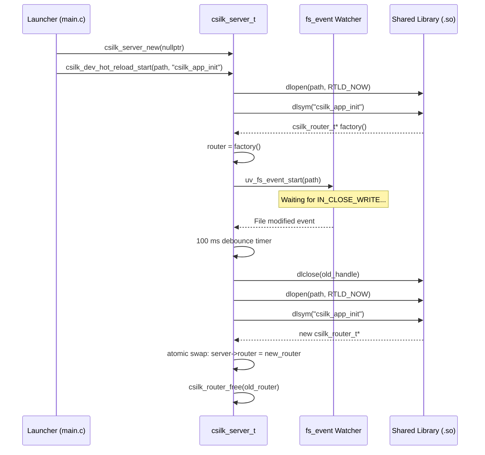

# Hot Reload — Live Router Swapping

> **Status**: Implemented (v0.3.0+) | **Last updated**: 2026-06-29
>
> **Hot-Reload Rules**: The entry function **MUST** have signature `csilk_router_t* (*)(void)`. ABI compatibility between the loaded `.so` and the server binary **MUST** be maintained. The listening socket **MUST NOT** be closed during reload. Router swap **MUST** be atomic (pointer assignment, no lock). File-system events **MUST** be debounced (100 ms window).

## 1. Overview

The Hot-Reload mechanism lets developers update route handlers without restarting the server process. The workflow is:

1. Routes are compiled into a **shared library** (`.so`/`.dylib`) exposing a factory function.
2. A launcher process loads the library via `dlopen()`, calls the factory, and attaches the returned router to the server.
3. A **libuv `fs_event` watcher** monitors the `.so` file for modifications.
4. On file change, the old library is `dlclose()`-d, the new one is `dlopen()`-d, and the router pointer is swapped atomically.

## 2. Architecture



## 3. Key Data Structures

```c
// include/csilk/hot_reload.h
int csilk_dev_hot_reload_start(csilk_server_t* server,
                                const char* lib_path,
                                const char* init_sym);
```

### Internal State

```c
// src/core/hot_reload.c
typedef struct {
    csilk_server_t* server;           // Owning server instance
    char* lib_path;                   // Path to .so (arena-duped)
    char* init_sym;                   // Factory function symbol name
    void* dl_handle;                  // Current dlopen() handle
    csilk_io_fs_event_t fs_event;     // libuv filesystem watcher
    csilk_io_timer_t debounce_timer;  // 100 ms debounce timer
} hot_reload_ctx_t;
```

## 4. Core Algorithm

### 4.1 Initialization (`csilk_dev_hot_reload_start`)

```
1. Allocate hot_reload_ctx_t (heap).
2. Store server pointer, dup lib_path and init_sym.
3. Call load_and_swap_router() to do the initial load.
4. Create uv_fs_event_t, start watching lib_path.
5. On event → debounce → reload.
```

### 4.2 Loading and Swapping (`load_and_swap_router`)

```
1. dlopen(lib_path, RTLD_NOW | RTLD_LOCAL)
   - RTLD_NOW: resolve all symbols immediately (fail fast).
   - RTLD_LOCAL: symbols not exported to subsequently loaded libraries
     (prevents symbol collision across reloads).
2. dlsym(handle, init_sym)
3. Call init_fn() → get new csilk_router_t*.
4. csilk_server_set_router(server, new_router)
   - Internally swaps the router pointer (atomic store).
   - Frees the old router (csilk_router_free).
5. If dl_handle was previously set, dlclose(old_handle).
6. Store new dl_handle in ctx->dl_handle.
```

### 4.3 File Event Handling

```
1. uv_fs_event_t callback fires (IN_CLOSE_WRITE on Linux).
2. Start (or restart) a 100 ms debounce timer.
3. On timer expiry, call load_and_swap_router().
   - If loading the new library fails, log error and keep the old one.
   - The server continues serving with the previous router.
```

## 5. Thread Safety

The hot-reload mechanism runs entirely on the **libuv event loop thread**. The router pointer swap is an **atomic store** (single pointer assignment). Since the router is **read-only** during request processing (no concurrent mutations), no lock is needed:

- **Before swap**: `server->router` points to the old router. In-flight requests continue using it.
- **After swap**: New requests see the new router. In-flight requests that already read `server->router` into a local variable continue with the old pointer (arena-backed, still valid).

## 6. Error Handling

| Scenario | Behaviour |
|:---------|:----------|
| `.so` not found at startup | `csilk_dev_hot_reload_start` returns -1, server can't start |
| `.so` deleted after startup | File watcher loses target; next write won't trigger |  
| `dlopen` fails on reload | Error logged, old router kept, server continues |
| `dlsym` fails on reload | Old router kept, `dlclose` new library |
| Factory returns `nullptr` | Old router kept, `dlclose` new library |
| Rapid file writes | Debounce timer coalesces multiple events |

## 7. Platform Notes

| Platform | Dynamic Loading | File Events |
|:---------|:---------------|:------------|
| Linux | `dlopen` / `dlsym` / `dlclose` (`libdl`) | `inotify` via `uv_fs_event_t` |
| macOS | `dlopen` / `dlsym` / `dlclose` (built-in) | `kqueue` / `FSEvents` via `uv_fs_event_t` |
| Windows | `LoadLibrary` / `GetProcAddress` / `FreeLibrary` | `ReadDirectoryChangesW` via `uv_fs_event_t` |

## 8. ABI Compatibility

The shared library **MUST** link against the same version of `libcsilk` as the launcher. Incompatible struct layouts or function signatures will cause undefined behaviour. Best practices:

- Use the **same build** of csilk for both launcher and shared library.
- Avoid changing `csilk_router_t` or `csilk_ctx_t` internal layout across reloads.
- For production, use static linking (disable hot reload).

## 9. Related

| Document | Content |
|:---------|:--------|
| [User Manual — Hot Reload](../user-manual/hot-reload.md) | Usage guide, development workflow, Makefile |
| [Module Design — Server](../module-design/server.md) | Router swap mechanism in server lifecycle |
| [Source — hot_reload.c](../../src/core/hot_reload.c) | Implementation |
| [Example — hot_reload_app.c](../../examples/advanced/hot_reload_app.c) | Hot-reloadable module template |
