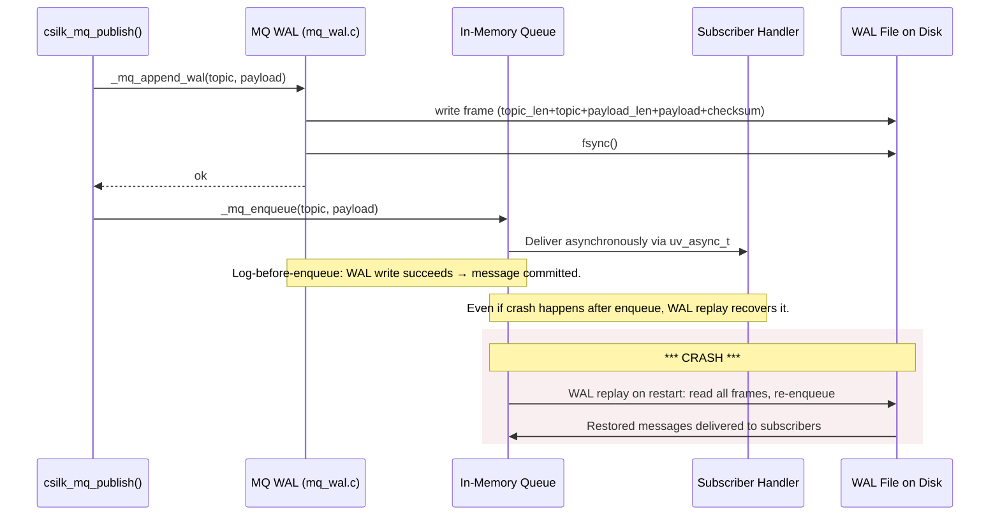
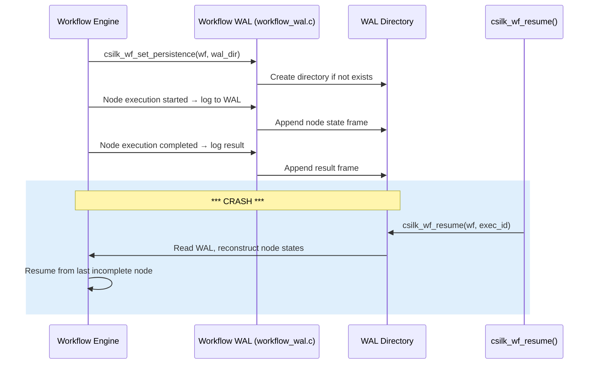

# WAL Persistence — Write-Ahead Log for Message Queue & Workflow

> **Status**: Implemented (v0.4.0+) | **Last updated**: 2026-06-29
>
> **WAL Rules**: Every message **MUST** be appended to the WAL before it is enqueued in memory. WAL frames **MUST** include a checksum for integrity verification. Recovery **MUST** replay frames in append order. The WAL file **MUST** be fsync()'d after every write for durability.

## 1. Overview

csilk implements Write-Ahead Log (WAL) persistence in two subsystems:

| Subsystem | WAL File | Purpose |
|:----------|:---------|:--------|
| **Message Queue** | Single file per MQ instance | Durable message delivery — recover undelivered messages after crash |
| **Workflow** | Directory per workflow execution | Crash recovery of in-flight DAG executions |

The core principle: **log before you act**. Every message/node-state change is written to stable storage before the in-memory data structure is updated.

## 2. MQ WAL Architecture



### 2.1 Frame Format

Each WAL frame has a compact binary encoding:

```
+0: topic_len   (uint32_t, 4 bytes, little-endian)
+4: topic       (topic_len bytes, NOT null-terminated)
+N: payload_len (uint32_t, 4 bytes, little-endian)
+M: payload     (payload_len bytes)
+K: checksum    (uint32_t, 4 bytes, XOR of all topic + payload bytes)

Total overhead: 16 bytes per message
```

### 2.2 Write Path

```
_mq_append_wal(mq, topic, payload, len)
  1. Acquire wal_mutex (serialises concurrent publishes)
  2. Compute XOR checksum over topic + payload bytes
  3. Build 5-element iovec: [topic_len, topic, payload_len, payload, checksum]
  4. Single uv_fs_write call (scatter/gather, no extra copy)
  5. uv_fs_fsync for durability
  6. Release wal_mutex
  7. Return 0 on success, -1 on write/fsync failure
```

### 2.3 Recovery Path (`_mq_recovery`)

```
On server start, if WAL file exists:
  1. Open WAL file for reading
  2. Loop:
     a. Read topic_len (4 bytes)
     b. Read topic (topic_len bytes)
     c. Read payload_len (4 bytes)
     d. Read payload (payload_len bytes)
     e. Read stored_checksum (4 bytes)
     f. Compute XOR checksum over topic + payload
     g. If checksums match:
        - Call _mq_enqueue(mq, topic, payload, payload_len)
        h. If checksum mismatch: log warning, stop replay
  3. Close WAL file
  4. Truncate WAL to 0 bytes (replayed messages are now in-memory)
```

## 3. Workflow WAL Architecture



### 3.1 Workflow WAL Directory Structure

```
wal_dir/
├── exec_abc123.wal       # Execution log for one run
├── exec_def456.wal
└── ...
```

Each execution produces one `.wal` file containing a sequence of frames,
one per node lifecycle event (started, completed, failed).

## 4. Thread Safety

| Component | Synchronisation | Notes |
|:----------|:----------------|:------|
| MQ WAL write | `wal_mutex` | Per-MQ-instance mutex protects WAL fd and writes |
| MQ WAL recovery | Single-threaded at startup | Runs before event loop starts |
| Workflow WAL | Single-threaded on event loop | All workflow operations happen on the event-loop thread |

## 5. Performance Considerations

| Aspect | Characteristic | Guidance |
|:-------|:---------------|:---------|
| Per-message overhead | 16 bytes + fsync | ~10-50 µs per write on SSD |
| Write amplification | 1 fsync per message | For high throughput, batch with periodic fsync |
| Recovery cost | O(n) scan of WAL file | Typically <1 ms for 10K messages |
| Checksum cost | O(n) XOR over payload | ~100 MB/s per core |

### 5.1 Write Batching (Future)

The current implementation fsync()'s every frame. For high-throughput scenarios
(>10K msg/s), a batched approach should batch N frames and fsync periodically:

```
batch: append N frames without fsync
then: single fsync after Nth frame
trade-off: up to N frames lost on crash vs N× higher throughput
```

## 6. Integrity Checks

| Layer | Check | Detection |
|:------|:------|:----------|
| Frame | XOR checksum over topic+payload | Single-bit flips, short truncations |
| Recovery | Checksum mismatch → stop replay | Corrupted WAL doesn't produce phantom messages |
| File | O_SYNC / fsync | Survives kernel crash (data on media) |

## 7. Related

| Document | Content |
|:---------|:--------|
| [User Manual — Message Queue](../user-manual/message-queue.md) | MQ usage, WAL enablement |
| [User Manual — Workflow](../user-manual/workflow.md) | Workflow WAL recovery |
| [Module Design — Messaging](../module-design/messaging.md) | MQ architecture, dispatch |
| [Module Design — Workflow](../module-design/workflow.md) | DAG scheduler, WAL recovery |
| [Source — mq_wal.c](../../src/messaging/mq_wal.c) | MQ WAL implementation (376 lines) |
| [Source — workflow_wal.c](../../src/workflow/workflow_wal.c) | Workflow WAL implementation |
