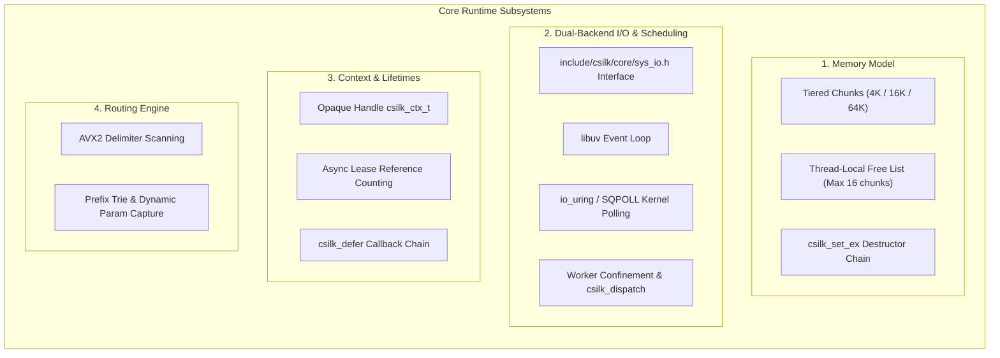

# Csilk (`csilk`) Codebase Architecture & Subsystem Deep-Dive Whitepaper

- **Version**: v0.5.1
- **Date**: 2026-08-22
- **Target Project**: Csilk (`csilk`) — High-Performance C23 Asynchronous Web Service & Agentic Runtime

---

## Table of Contents

1. [Executive Architecture & Philosophy](#1-executive-architecture--philosophy)
   - 1.1 [Core Positioning & Design Principles](#11-core-positioning--design-principles)
   - 1.2 [9 Modular Sub-Library Topology](#12-9-modular-sub-library-topology)
   - 1.3 [System Layered Dependency Graph](#13-system-layered-dependency-graph)
2. [Section I · Core Runtime Deep Dive](#2-section-i--core-runtime-deep-dive)
   - 2.1 [Memory Model & Tiered Adaptive Arena Allocator](#21-memory-model--tiered-adaptive-arena-allocator)
   - 2.2 [Context Lifecycle & Async Lease Protection](#22-context-lifecycle--async-lease-protection)
   - 2.3 [Dual Backend I/O & Thread Confinement](#23-dual-backend-io--thread-confinement)
   - 2.4 [SIMD Acceleration & Radix/Trie Routing Tree](#24-simd-acceleration--radixtrie-routing-tree)
3. [Section II · Network & Protocol Stack Deep Dive](#3-section-ii--network--protocol-stack-deep-dive)
   - 3.1 [HTTP/1.1 SWAR Fast Parsing & Zero-Copy Slicing](#31-http11-swar-fast-parsing--zero-copy-slicing)
   - 3.2 [HTTP/2 Multiplexing & HTTP/3 Evolution](#32-http2-multiplexing--http3-evolution)
   - 3.3 [WebSocket Full-Duplex & Cross-Thread Room Broadcast](#33-websocket-full-duplex--cross-thread-room-broadcast)
   - 3.4 [Middleware Onion Pipeline & Outbound Backpressure](#34-middleware-onion-pipeline--outbound-backpressure)
4. [Section III · Storage & Messaging Subsystems Deep Dive](#4-section-iii--storage--messaging-subsystems-deep-dive)
   - 4.1 [Unified Database Abstraction & Connection Pool](#41-unified-database-abstraction--connection-pool)
   - 4.2 [SIMD Vector Index & Pure C Embedded HNSW Graph](#42-simd-vector-index--pure-c-embedded-hnsw-graph)
   - 4.3 [Asynchronous Message Queue & Pub/Sub Engine](#43-asynchronous-message-queue--pubsub-engine)
   - 4.4 [Write-Ahead Logging (WAL) & Raft Consensus](#44-write-ahead-logging-wal--raft-consensus)
5. [Section IV · High-Level Engine: Agent & Workflow Engine Deep Dive](#5-section-iv--high-level-engine-agent--workflow-engine-deep-dive)
   - 5.1 [Native C AI LLM Driver Architecture](#51-native-c-ai-llm-driver-architecture)
   - 5.2 [Model Context Protocol (MCP) Implementation](#52-model-context-protocol-mcp-implementation)
   - 5.3 [Workflow DAG Topology & Scheduling Engine](#53-workflow-dag-topology--scheduling-engine)
   - 5.4 [Declarative DSL & Checkpoint Resume Mechanism](#54-declarative-dsl--checkpoint-resume-mechanism)
6. [Architectural Invariants & Anti-Pitfalls](#6-architectural-invariants--anti-pitfalls)
7. [Build & Verification Matrix](#7-build--verification-matrix)

---

## 1. Executive Architecture & Philosophy

### 1.1 Core Positioning & Design Principles
Csilk (`csilk`) is a high-performance C23 asynchronous web runtime and distributed agentic workflow foundation. It is built upon the following core engineering pillars:

1. **Ultra Throughput & Zero-Copy Memory Architecture**: Eliminates frequent small allocations via per-request tiered Arenas, thread-local chunk caches (TLS Free Lists), and parser slicing, achieving virtually zero `malloc`/`free` overhead in the request hot path.
2. **Dual-Backend Event-Driven I/O**: Exposes a unified interface via [`include/csilk/core/sys_io.h`](file:///home/quintin/Data/source/c_cpp/server-c/include/csilk/core/sys_io.h). Supports cross-platform `libuv` by default and native Linux `io_uring` with SQPOLL and fixed buffers.
3. **Strict Opaque Handles & ABI Stability**: Internal structures (e.g. `csilk_ctx_t`) are opaque handles, ensuring forward and backward binary compatibility.
4. **Thread Confinement & Lock-Free Dispatch**: Client structures and worker queues are strictly confined to their owning worker thread. Cross-thread notifications utilize generation-tagged `csilk_dispatch()`.
5. **Modular Sub-Library Decoupling**: Composed of 9 modular CMake targets that can be linked independently or as a composite umbrella library.

---

## 2. Section I · Core Runtime Deep Dive



### 2.1 Memory Model & Tiered Adaptive Arena Allocator
- **Source Files**: `src/core/primitives/arena.c`, `include/csilk/core/types.h`
- **3-Tier Chunk Design**:
  - `CSILK_ARENA_TIER_SMALL` (4KB): Standard RESTful requests and headers.
  - `CSILK_ARENA_TIER_MEDIUM` (16KB): Multi-field forms and typical JSON payloads.
  - `CSILK_ARENA_TIER_LARGE` (64KB): Large file uploads and streaming aggregates.
- **TLS Free List Caching**: Each worker maintains up to 16 cached chunks. `csilk_arena_reset()` resets offset pointers without invoking system `brk`/`mmap`. Worker exit invokes `csilk_arena_flush_free_list()` to release chunks.

### 2.2 Context Lifecycle & Async Lease Protection
- **Source Files**: `src/core/ctx/context.c`, `src/core/ctx/ctx_internal.h`, `include/csilk/core/context.h`
- **Opaque Handle Model**: Public headers expose `csilk_ctx_t*` while `struct csilk_ctx_s` remains in `ctx_internal.h`.
- **RAII Storage (`csilk_set_ex`)**: Destructor functions automatically execute in reverse order upon request completion.
- **Async Lease (`csilk_ctx_lease_acquire`/`release`)**: Protects contexts passed to background AI, MQ, or DB workers from premature reclamation if the client disconnects.

---

## 3. Section II · Network & Protocol Stack Deep Dive

### 3.1 HTTP/1.1 & HTTP/2 Multiplexing
- **HTTP/1.1 SWAR & Zero-Copy**: 64-bit parallel word scanning for delimiters (`\r\n`) and zero-copy string views (`csilk_view_t`).
- **HTTP/2 nghttp2 Integration**: Multiplexed stream management with `csilk_h2_stream_map_t` (16 inline buckets, `free_list` recycling), HPACK compression, and RST_STREAM / GOAWAY graceful handling.

### 3.2 Outbound Streaming Backpressure
- Configurable high (`64KB`) and low (`16KB`) watermarks enforce connection-level flow control across Chunked, SSE, and WebSocket responses. Exceeding high watermark pauses output until `csilk_on_drain()` fires.

---

## 4. Section III · Storage & Messaging Subsystems Deep Dive

- **Database Abstraction**: Pluggable drivers (`sqlite`, `postgres`, `mysql`, `redis`) with built-in connection pooling.
- **Embedded HNSW Vector DB**: Pure C SIMD-accelerated (`AVX2`/`NEON`) L2 and Cosine distance calculation with graph-based approximate nearest neighbor search.
- **Message Queue & Raft Consensus**: Lock-free MPSC queues (`lfqueue`), WAL persistence, and distributed Raft leader election.

---

## 5. Section IV · High-Level Engine: Agent & Workflow Deep Dive

- **AI LLM Drivers**: Provider-agnostic abstraction (`OpenAI`, `Ollama`, `DeepSeek`) with async thread-pool offloading.
- **Model Context Protocol (MCP)**: Server and client implementations supporting STDIO and SSE transports over JSON-RPC 2.0.
- **Workflow DAG Engine**: Declarative AST evaluation, parallel topological execution, and WAL checkpoint resume.

---

## 6. Architectural Invariants & Anti-Pitfalls

1. **Owner Worker Confinement**: `client_destroy()` runs exclusively on the owning worker loop. Non-owner threads must dispatch recycle tasks tagged with `client->generation`.
2. **RCU Writer Serialization**: `csilk_server_set_router_full()` holds `server->config_mutex` during epoch advancement and retired list updates.
3. **Barrier Heap Allocation**: `csilk_barrier_t` must be heap-allocated via `calloc`, never on the stack.
4. **Ordered Teardown Sequence**: Server stop drains active clients, timers, and dispatch queues before worker thread joins, deferring MQ free past worker termination.

---

## 7. Build & Verification Matrix

```bash
# Debug Build with Clang
cmake -B build -S . -DCMAKE_BUILD_TYPE=Debug -DCMAKE_C_COMPILER=clang
cmake --build build -j$(nproc)

# Run full unit and stress test suite
ctest --test-dir build -E test_integration -j$(nproc) --timeout 30 --output-on-failure
```
