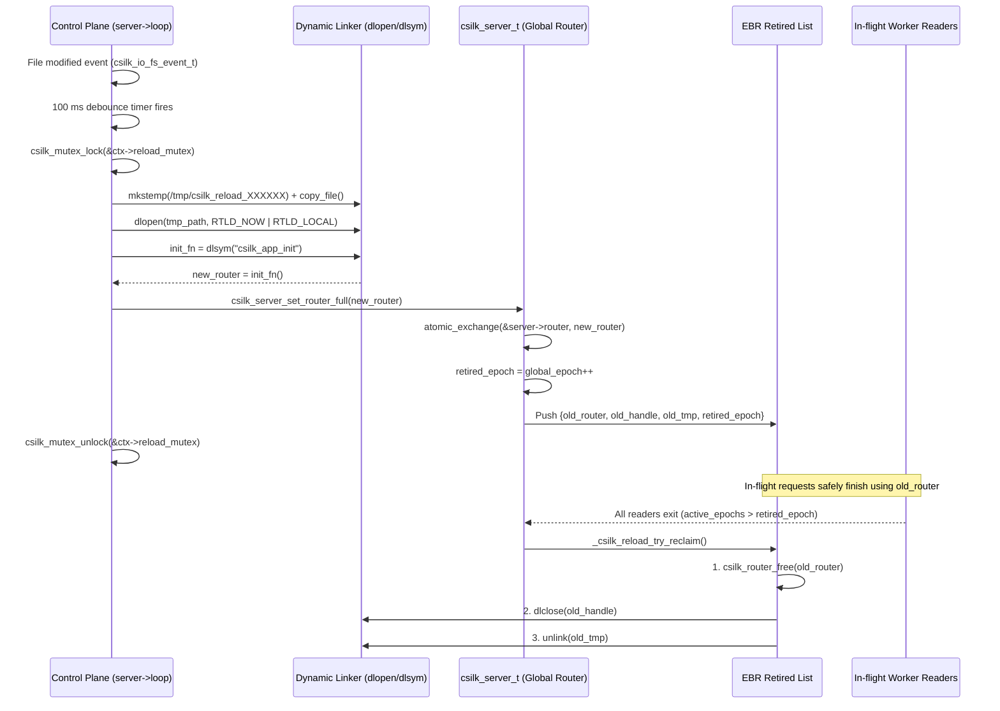

# Hot Reload — Live Router Swapping (RCU & EBR)

> **Status**: Implemented (v0.5.1) | **Last updated**: 2026-08-22
>
> **Hot-Reload Rules**: The entry function **MUST** have signature `csilk_router_t* (*)(void)`. ABI compatibility between the loaded `.so` and the server binary **MUST** be maintained. The listening socket **MUST NOT** be closed during reload. Router swap **MUST** be atomic (`atomic_exchange`, lock-free reading). Control plane reload executions **MUST** be mutex-serialized (`reload_mutex`). File-system events **MUST** be debounced (100 ms window). Dynamic libraries **MUST** be copied to isolated temporary files via `mkstemp(0600)` to bypass dynamic linker caching. Old routers and `.so` handles **MUST** be reclaimed via Epoch-Based Reclamation (EBR) grace period.

## 1. Overview

The Hot-Reload mechanism lets developers update route handlers without restarting the server process or dropping active connections:

1. Routes are compiled into a **shared library** (`.so`/`.dylib`) exposing a factory function (e.g. `csilk_app_init`).
2. A uniquely named temp copy of the library is created via `mkstemp(0600)` to bypass dynamic linker (`dlopen`) handle caching.
3. The launcher process loads the library via `dlopen(..., RTLD_NOW | RTLD_LOCAL)`, calls the factory, and attaches the returned router to the server.
4. A **`csilk_io_fs_event_t` watcher** monitors the `.so` file on the control plane event loop (`server->loop`).
5. On file change (debounced for 100 ms), the new library is loaded, the new router is atomically published, and the old router, library handle, and temp file are queued into the **EBR (Epoch-Based Reclamation)** retired list for safe reclamation after in-flight requests finish.

## 2. Architecture



## 3. Key Data Structures

```c
// include/csilk/core/hot_reload.h
int csilk_dev_hot_reload_start(csilk_server_t* server,
                               const char*     lib_path,
                               const char*     init_sym);
int csilk_dev_hot_reload_trigger(csilk_server_t* server);
void csilk_dev_hot_reload_stop(csilk_server_t* server);
```

### Internal State (`src/core/config/hot_reload.c`)

```c
typedef struct {
    csilk_server_t*     server;         // Owning server instance
    char*               lib_path;       // Path to .so (heap allocated)
    char*               init_sym;       // Factory function symbol name
    void*               dl_handle;      // Current dlopen() handle
    char*               tmp_path;       // Current loaded temp file path
    csilk_io_fs_event_t fs_event;       // Cross-backend filesystem watcher
    csilk_io_timer_t    debounce_timer; // 100 ms debounce timer
    int                 is_watching;    // 1 if filesystem watcher is active
    csilk_mutex_t       reload_mutex;   // Mutex ensuring serialized reload executions
} hot_reload_ctx_t;
```

## 4. Core Algorithms & Guarantees

### 4.1 Safe Loading & Swapping (`load_and_swap_router`)

1. **Mutex Serialization**: Acquires `ctx->reload_mutex` to protect `hot_reload_ctx_t` from concurrent trigger calls.
2. **Isolated Temp Copy**: Calls `create_temp_lib_copy()` using `mkstemp(0600)` to generate a unique temp file, failing fast on error.
3. **Dynamic Loading**:
   - `dlopen(tmp_path, RTLD_NOW | RTLD_LOCAL)`: Resolves all symbols immediately and keeps them local.
   - `dlsym(handle, init_sym)`: Resolves the factory symbol.
   - `init_fn()`: Instantiates the new router.
4. **Strict OOM Rollback**: If `dlsym`, `init_fn`, or `strdup(tmp_path)` fails, cleanly rolls back via `dlclose`, `unlink`, `csilk_router_free` and releases the mutex.
5. **EBR Atomic Publish**: Invokes `csilk_server_set_router_full()`, atomically swapping the pointer and queuing the previous generation for deferred reclamation.

### 4.2 Epoch-Based Reclamation (EBR)

- Each Worker reading routes holds an RCU read token registered in its thread-local `csilk_rcu_slot_t`.
- When an old router is replaced, it is timestamped with `retired_epoch = global_epoch++`.
- Background / opportunistic reclamation inspects all active reader slots; once $\min(\text{active\_epochs}) > \text{retired\_epoch}$, the old router, `dl_handle`, and temp file are safely destroyed.

## 5. Thread Safety

The hot-reload mechanism runs entirely on the **libuv event loop thread**. The router pointer swap is an **atomic store** (single pointer assignment). Since the router is **read-only** during request processing (no concurrent mutations), no lock is needed:

- **Before swap**: `server->router` points to the old router. In-flight requests continue using it.
- **After swap**: New requests see the new router. In-flight requests that already read `server->router` into a local variable continue with the old pointer (arena-backed, still valid).

## 6. Error Handling

| Scenario | Behaviour |
|:---------|:----------|
| `.so` not found at startup | `csilk_dev_hot_reload_start` returns -1, server can't start |
| `.so` deleted after startup | File watcher loses target; next write won't trigger |  
| `dlopen` fails on reload | Error logged, old router kept, server continues |
| `dlsym` fails on reload | Old router kept, `dlclose` new library |
| Factory returns `nullptr` | Old router kept, `dlclose` new library |
| Rapid file writes | Debounce timer coalesces multiple events |

## 7. Platform Notes

| Platform | Dynamic Loading | File Events |
|:---------|:---------------|:------------|
| Linux | `dlopen` / `dlsym` / `dlclose` (`libdl`) | `inotify` via `uv_fs_event_t` |
| macOS | `dlopen` / `dlsym` / `dlclose` (built-in) | `kqueue` / `FSEvents` via `uv_fs_event_t` |
| Windows | `LoadLibrary` / `GetProcAddress` / `FreeLibrary` | `ReadDirectoryChangesW` via `uv_fs_event_t` |

## 8. ABI Compatibility

The shared library **MUST** link against the same version of `libcsilk` as the launcher. Incompatible struct layouts or function signatures will cause undefined behaviour. Best practices:

- Use the **same build** of csilk for both launcher and shared library.
- Avoid changing `csilk_router_t` or `csilk_ctx_t` internal layout across reloads.
- For production, use static linking (disable hot reload).

## 9. Related

| Document | Content |
|:---------|:--------|
| [User Manual — Hot Reload](../user-manual/hot-reload.md) | Usage guide, development workflow, Makefile |
| [Module Design — Server](../module-design/server.md) | Router swap mechanism in server lifecycle |
| [Source — hot_reload.c](../../src/core/hot_reload.c) | Implementation |
| [Example — hot_reload_app.c](../../examples/advanced/hot_reload_app.c) | Hot-reloadable module template |
