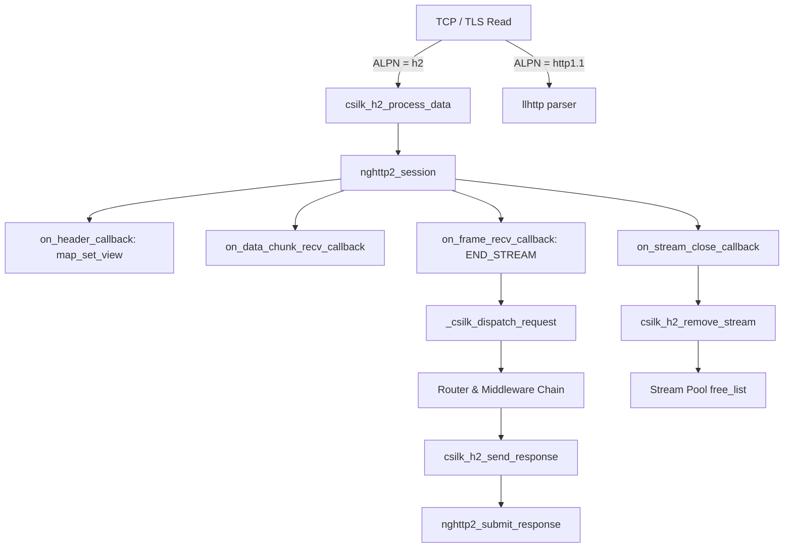

# HTTP/2 Integration — Implementation Status

> **Status**: Phase 1 (Session scaffolding), Phase 2 (Request dispatch/response), Phase 3 (Server Push), Phase 4 (Adaptive Stream Map & Zero-Syscall Pool), Phase 5 (Zero-Copy Header Materialization), and Phase 6 (Reference Counted Lifecycle & Async Safety) complete.  
> **Version**: v0.5.2+ | **Last updated**: 2026-08-30
>
> **HTTP/2 Rules**: ALPN negotiation **MUST** complete before any data routing. Stream contexts **MUST** use per-connection stream pool and arena allocation — zero `malloc`/`free` per stream reuse. Server Push **MUST NOT** be advertised on HTTP/1.1 connections. HPACK dynamic table size **SHOULD** be tuned per deployment (default: nghttp2 4096 bytes).

## 1. Overview
HTTP/2 (RFC 7540) introduces binary framing, multiplexing, and header compression (HPACK). The csilk framework integrates `nghttp2` with an adaptive stream map, a lock-free stream recycling pool, and a zero-copy header materialization pipeline.

## 2. Implementation Status

### Phase 1 — Session Scaffolding ✅
- **ALPN negotiation**: `src/core/server/` configures OpenSSL ALPN to offer `h2` and `http/1.1`. After TLS handshake, `alpn_select_cb` detects the negotiated protocol and sets `client->protocol`.
- **nghttp2 session**: `csilk_h2_init_session()` creates an nghttp2 session in server mode, registers callbacks (`on_header`, `on_frame_recv`, `on_data_chunk_recv`, `on_stream_close`, `send_callback`), and configures standard HTTP/2 settings (max concurrent streams, initial window size).
- **Data routing**: After ALPN negotiation, `process_tls_read()` routes decrypted data to `csilk_h2_process_data()` for HTTP/2 connections, or to `llhttp` for HTTP/1.1.
- **`csilk/http/h2.h` public API**: Exposes `csilk_h2_init_session`, `csilk_h2_process_data`, `csilk_h2_get_stream`, `csilk_h2_get_or_create_stream`, `csilk_h2_free_streams`, `csilk_h2_remove_stream`, `csilk_h2_send_response`, `csilk_h2_submit_push`.

### Phase 2 — Request Dispatch and Response ✅
- **Unified dispatch**: `_csilk_dispatch_request()` handles routing, middleware chain, and hook triggering identically for HTTP/1.1 and HTTP/2.
- **Header parsing** (`on_header_callback`): Parses `:method`, `:path`, `:scheme`, `:authority` pseudo-headers and regular headers into arena-backed `csilk_request_t` fields.
- **Frame completion** (`on_frame_recv_callback`): When `NGHTTP2_FLAG_END_STREAM` is set on HEADERS or DATA frames, the request is dispatched via `_csilk_dispatch_request()`.
- **Trailers support**: Strictly differentiates initial request HEADERS from trailing HEADERS (category `NGHTTP2_HCAT_HEADERS`), guaranteeing exactly-once application dispatch.
- **Body accumulation** (`on_data_chunk_recv_callback`): Incoming DATA frame payloads are concatenated into `c->request.body`.
- **Stream cleanup** (`on_stream_close_callback`): Marks `stream_closed = 1`, unrefs `stream_ref`, and returns the context to the per-connection stream pool when all asynchronous operations finish.

### Phase 3 — Server Push ✅
- **`csilk_push_promise` / `csilk_h2_submit_push`**: Public API for sending `PUSH_PROMISE` frames to clients.
- **Response dispatch**: Pushed resources are dispatched through the router automatically, with responses sent on the promised stream.

### Phase 4 — Adaptive Stream Map & Zero-Syscall Pool ✅
- **Adaptive Stream Map (`csilk_h2_stream_map_t`)**: 16 embedded fast-path buckets dynamically scaling to power-of-two heap capacity with load-factor threshold resizing.
- **Recycling Pool (`map->free_list`)**: Stream contexts and their arena chunk chains are retained and reset in-place (`csilk_arena_reset()`), achieving **4.47 M stream-cycles/sec** with zero runtime syscalls.
- **Full Field Reset Contract**: Monotonically increments `stream_gen` and `request_seq` while zeroing all request/response state to eliminate ABA and stale callback execution.

### Phase 5 — Zero-Copy Header Materialization ✅
- **`map_set_view` zero-copy ingestion**: Passes string views referencing nghttp2 memory buffers directly into `map_set_view()`, eliminating intermediate `malloc`/`free` or duplicate string copies.
- **Single-Pass Response Encoding**: Response headers use $O(1)$ pre-counting and single-pass `nghttp2_nv` encoding directly into nghttp2 frames.

### Phase 6 — Reference Counted Stream Lifetime & Async Safety ✅
- **Atomic Stream Refcounting (`stream_ref`)**: Retains stream memory while active asynchronous operations (`csilk_async_op_t`) execute across background worker threads.
- **Safe Dispatch Recycling**: Cross-worker unrefs dispatch physical destruction back to the owning worker event loop.

## 3. Architecture

## 4. Dependencies
- **nghttp2** (v1.52+): Frame parsing, HPACK, session management.
- **OpenSSL**: TLS 1.3 with ALPN extension.

## 5. Performance Notes
- Header materialization achieves **7.93 M req/s (36 ns p50)** for 0-header and **830 K req/s (931 ns p50)** for 5-header requests.
- Multi-stream lookup latency is **26.2 ns** (38.13 M ops/s) for 10 streams and **62.8 ns** (15.92 M ops/s) for 10,000 streams.
- Zero-fragmentation arena allocation combined with free-list context reuse delivers linear scaling across multiple CPU cores.
