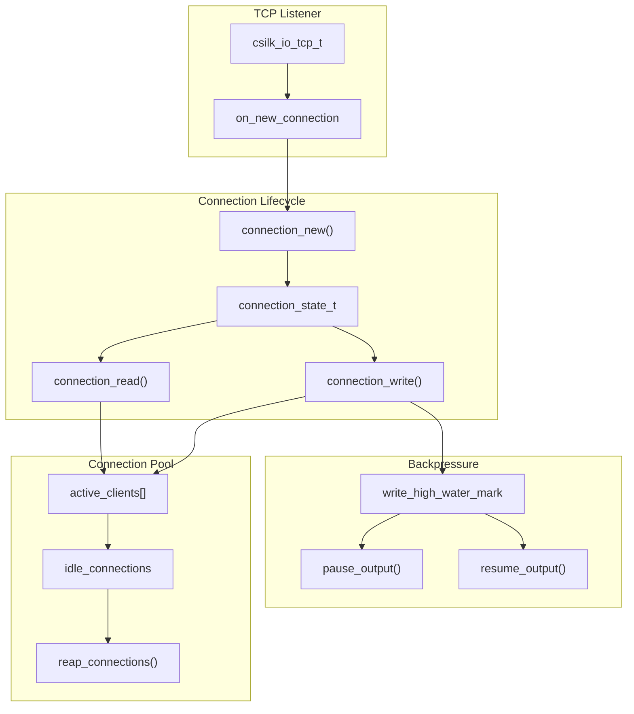
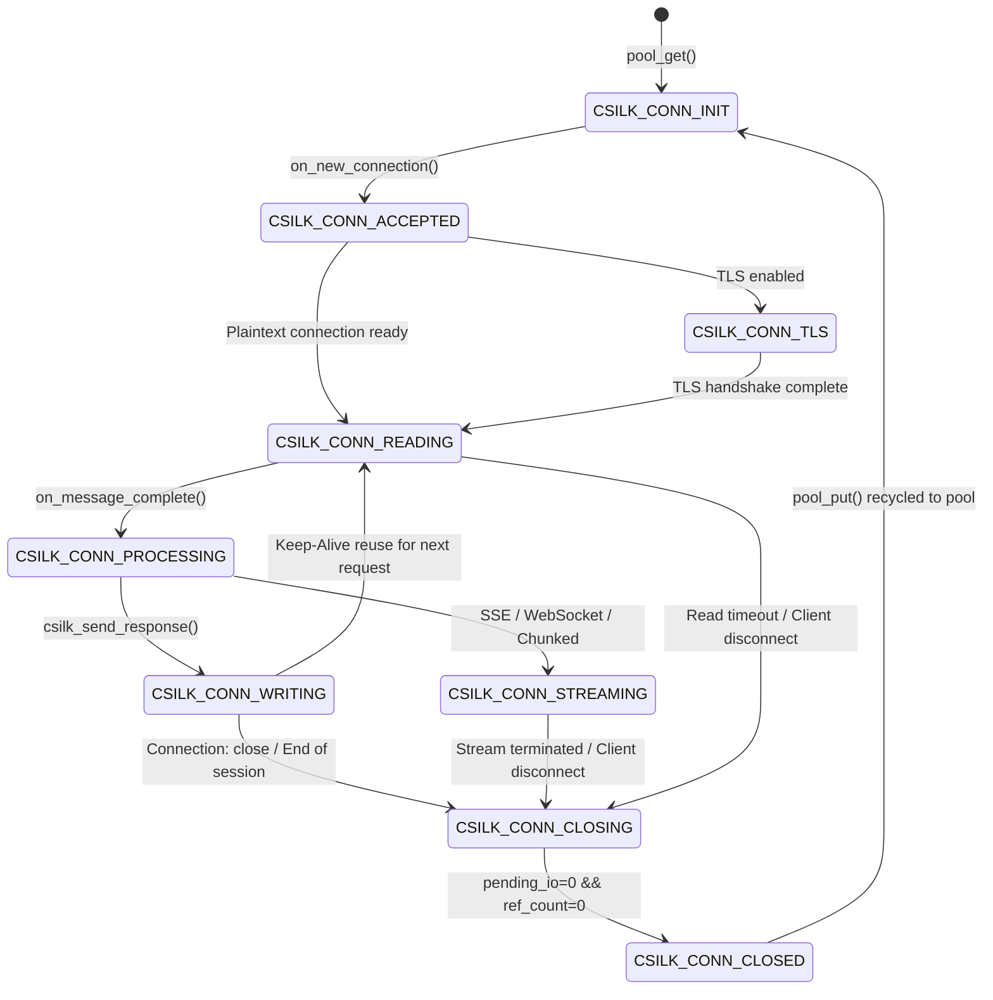

# Connection Management Deep Dive

> **Version**: 0.5.0 | **Last updated**: 2026-08-21

The csilk connection management subsystem is responsible for TCP connection acceptance, lifecycle state transitions, keep-alive reuse, backpressure flow control, and clean asynchronous teardown.

---

## 1. Architecture Overview



---

## 2. Connection Structure (csilk_client_t)

```c
struct csilk_client_s {
    uint64_t           generation;   /**< ABA defense generation counter */
    csilk_conn_state_t state;        /**< 9-state connection lifecycle state machine */

    csilk_io_tcp_t handle;           /**< Underlying I/O socket handle (libuv / io_uring) */

    csilk_io_timer_t timer;          /**< Keep-Alive idle timeout timer */
    csilk_io_timer_t read_timer;     /**< Request read timeout timer */
    csilk_io_timer_t write_timer;    /**< Response write timeout timer */
    csilk_io_timer_t request_timer;  /**< Total request processing timeout timer */

    llhttp_t parser;                 /**< HTTP/1.1 llhttp parser instance */
    SSL*     ssl;                    /**< OpenSSL TLS session handle (HTTPS) */

    csilk_server_t* server;          /**< Parent server instance */
    worker_pool_t*  owner_pool;      /**< Owning worker thread pool (strictly confined) */

    _Atomic(int) ref_count;          /**< Context and async lease reference counter */
    _Atomic(int) pending_io;         /**< Active pending I/O and timer close counter */

    csilk_ctx_t ctx;                 /**< Active HTTP request context */
    csilk_h2_stream_map_t h2_stream_map; /**< HTTP/2 multiplexed stream hash map */
};
```

---

## 3. Connection Lifecycle State Machine (9 States)

```c
typedef enum csilk_conn_state_e {
    CSILK_CONN_INIT = 0,       /**< Initial state / pooled idle state */
    CSILK_CONN_ACCEPTED,       /**< TCP connection established and bound */
    CSILK_CONN_TLS,            /**< TLS handshake in progress */
    CSILK_CONN_READING,        /**< Actively reading HTTP request bytes */
    CSILK_CONN_PROCESSING,     /**< Request parsed; executing middleware & handler */
    CSILK_CONN_WRITING,        /**< Sending response headers and payload */
    CSILK_CONN_STREAMING,      /**< Chunked transfer / SSE / WebSocket active streaming */
    CSILK_CONN_CLOSING,        /**< Teardown in progress: draining I/O and stopping timers */
    CSILK_CONN_CLOSED          /**< Fully closed and returned to thread-local pool */
} csilk_conn_state_t;
```



---

## 4. Formal Ownership & ABA / UAF Destruction Defense

1. **Owner-Worker Confinement**: `client_destroy()` **strictly executes on the owning worker loop thread**.
2. **Cross-Thread Recycle Dispatching**: Non-owner threads requiring client teardown allocate a `csilk_recycle_task_payload_t` tagged with the client's current `generation` and enqueue it via a wait-free MPSC queue to the owner worker.
3. **Generation Tag Defense (ABA Prevention)**: When executing recycled tasks, the owner worker verifies `client->generation == gen && client->state == CSILK_CONN_CLOSING`. Stale tasks from recycled/reused clients are dropped safely.
4. **Reference and Pending I/O Invariants**:
   - Physical recycling only executes when `ref_count == 0` and `pending_io == 0` while in `CLOSING` or `CLOSED` state.
   - Atomic decrement operations clamp negative values to zero to guarantee no counter underflow.

---

## 5. Outbound Streaming Backpressure & Watermark Flow Control

```c
// Default Watermark Configurations
#define CSILK_WRITE_HWM_DEFAULT        (64 * 1024)       // High watermark: 64 KB
#define CSILK_WRITE_LWM_DEFAULT        (16 * 1024)       // Low watermark: 16 KB
#define CSILK_WRITE_MAX_BUFFER_DEFAULT (16 * 1024 * 1024)// Max queue buffer: 16 MB
```

- **High Watermark (Pause Output)**: When outbound unwritten bytes exceed `write_high_water_mark`, `csilk_response_write()`, `csilk_sse_send()`, and `csilk_ws_send()` return `0`, prompting producers to pause output.
- **Low Watermark (Drain Resume)**: When write completions drop the pending queue below `write_low_water_mark`, the registered `csilk_on_drain()` callback fires to resume producer writes.
- **Max Buffer Overflow Guard**: Writes exceeding `max_write_buffer_size` are rejected with `-1` to prevent slow clients from consuming unbounded server memory.

---

## 6. Source Files

| File | Purpose |
|------|---------|
| `src/core/server/connection.c` | Connection acceptance and lifecycle core |
| `src/core/server/connection_io.c` | TCP read, write, and timeout controls |
| `src/core/server/connection_close.c` | State machine transitions, ref counts, and cross-thread recycling |
| `src/core/server/connection_pool.c` | Worker-local lock-free connection pool and arena recycling |
| `tests/core/test_client_lifetime_stress.c` | 100,000-iteration formal client lifetime audit test suite |
