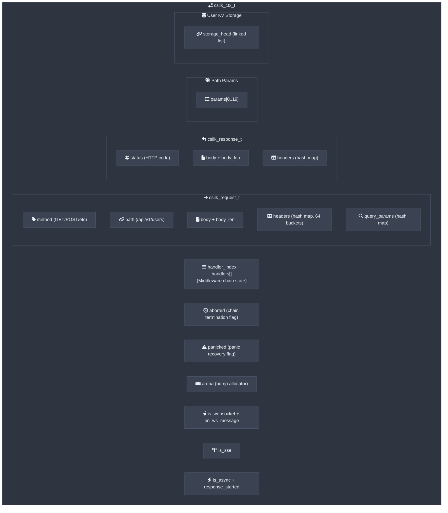
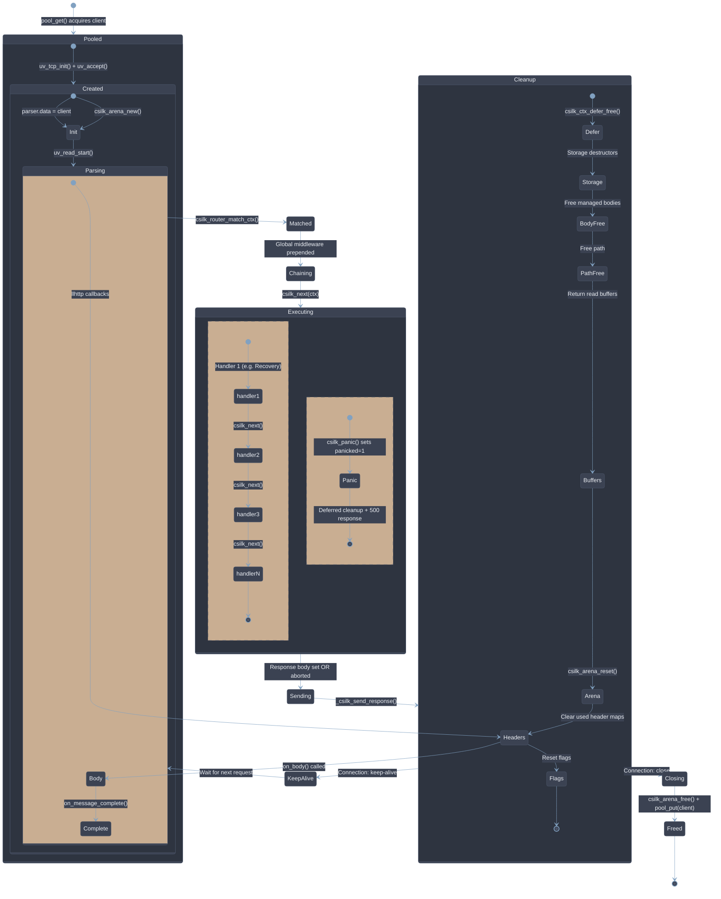
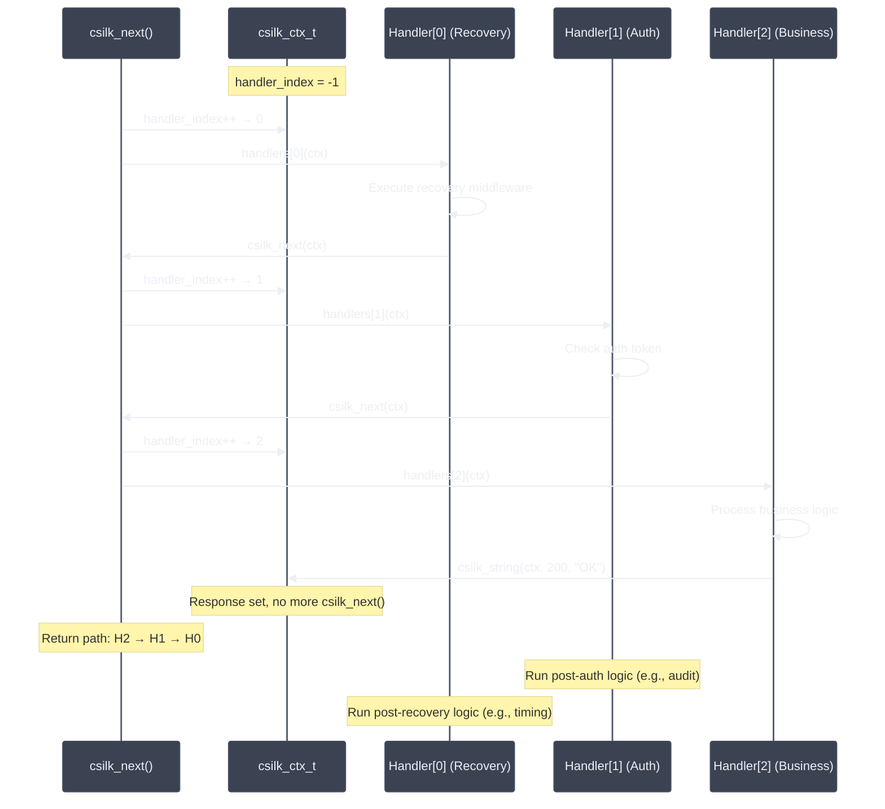
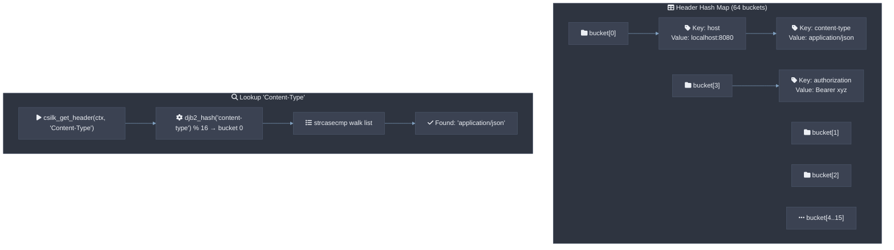

# Context Design

The `csilk_ctx_t` (request context) is the central object in csilk. It carries the request state, response buffer, handler chain, WebSocket callbacks, and an Arena allocator across the entire request lifecycle. All HTTP headers use **zero-copy** `csilk_str_view_t` references into raw recv buffers — no `malloc` per header. Context is reset between keep-alive requests in O(1) via arena pointer bump. Users **MUST NOT** hold `csilk_str_view_t` pointers across requests; data **SHOULD** be persisted via `csilk_arena_strdup()` if needed beyond the current request lifecycle.

## Context Structure



## Context Lifecycle



### Multi-Thread Safety

In multi-worker mode (configured via `worker_threads > 1`), csilk uses a **per-worker lock-free connection object pool** (`pool_get`/`pool_put`) that avoids mutex contention. Each worker thread manages its own pool, eliminating the data race previously present in the shared-mutex pool design.

## Handler Chain Execution

The handler chain uses a simple index-based iterator pattern:



## Header Hash Map

Headers use a case-insensitive DJB2 hash map with 16 fixed buckets and chaining:



## Zero-Copy String Views vs Owned Accessors

csilk provides dual accessors for maximum performance and explicit ownership semantics:

```c
typedef struct {
    const char* data; /**< Pointer to buffer (borrowed from parser/network buffer). */
    size_t      len;  /**< Byte length (not guaranteed to be NUL-terminated). */
} csilk_view_t;
```

| Scope | Zero-Copy Borrowed View | Owned / NUL-Terminated C-String |
|-------|-------------------------|--------------------------------|
| **Query Param** | `csilk_get_query_view(c, "key")` | `csilk_get_query(c, "key")` |
| **Path Param**  | `csilk_get_param_view(c, "id")`  | `csilk_get_param(c, "id")`  |
| **Header**      | `csilk_get_header_view(c, "Host")` | `csilk_get_header(c, "Host")` |
| **Body**        | `csilk_get_body_view(c)` | `csilk_get_body(c)` |

> [!IMPORTANT]
> `csilk_view_t` directly references raw network receive buffers with zero copying and zero allocations. It is valid only for the duration of the current request handler. If you require a NUL-terminated string or persistent copy, use the standard `csilk_get_*()` functions or duplicate via `csilk_arena_strndup()`.

## Unified Ownership Model (`csilk_ownership_t`)

To avoid ambiguous ownership semantics (like implicit `int managed` flags), csilk provides an explicit memory ownership model:

```c
typedef enum {
    CSILK_OWN_BORROWED = 0, /**< Caller/external holds buffer; framework does NOT free or copy. */
    CSILK_OWN_ARENA    = 1, /**< Memory is allocated from request arena; freed automatically on reset. */
    CSILK_OWN_HEAP     = 2, /**< Memory is heap allocated (malloc); framework calls free() on cleanup. */
    CSILK_OWN_TRANSFER = 3, /**< Ownership transferred to receiver; receiver is responsible for free(). */
    CSILK_OWN_SHARED   = 4  /**< Shared/driver-managed reference; managed by custom destructor/refcount. */
} csilk_ownership_t;
```

### Response Body Ownership API

```c
// Set response body with explicit ownership
csilk_set_response_body_ex(c, data, len, CSILK_OWN_HEAP);

// Query response body ownership
csilk_ownership_t own = csilk_get_response_body_ownership(c);
```

## Custom Storage Destructors (RAII)

For heap-allocated resources stored in `csilk_ctx_t` (such as cJSON objects, database handles, or third-party structures), `csilk_set_ex()` registers an automatic cleanup callback invoked during request cleanup:

```c
typedef void (*csilk_destructor_t)(void* value);

// Store heap object with automatic destructor
cJSON* payload = jwt_verify_internal(...);
csilk_set_ex(c, "jwt_payload", payload, (csilk_destructor_t)csilk_json_free);
```


## Outbound Streaming & Backpressure Flow Control

Streaming writes (`csilk_response_write()`, `csilk_sse_send()`, `csilk_ws_send()`) enforce connection-level outbound queue watermarks:

```c
// Configure connection watermarks (defaults: 64KB high, 16KB low, 16MB max)
csilk_set_write_watermarks(c, 128 * 1024, 32 * 1024, 32 * 1024 * 1024);

// Write data with backpressure detection
int status = csilk_response_write(c, data, len);
if (status == 0) {
    // High watermark exceeded — pause producer output
    csilk_on_drain(c, on_stream_drain, producer_state);
} else if (status < 0) {
    // Buffer overflow (exceeded max_write_buffer_size) or socket error
}
```

## Response Generation Flow

```mermaid
%%{init: {
  'theme': 'base',
  'themeVariables': {
    'background': '#2E3440',
    'primaryColor': '#81A1C1',
    'primaryBorderColor': '#4C566A',
    'primaryTextColor': '#ECEFF4',
    'secondaryColor': '#3B4252',
    'secondaryBorderColor': '#434C5E',
    'secondaryTextColor': '#D8DEE9',
    'lineColor': '#81A1C1',
    'textColor': '#ECEFF4',
    'mainBkg': '#3B4252',
    'nodeBorder': '#4C566A',
    'clusterBkg': '#2E3440',
    'clusterBorder': '#4C566A',
    'titleColor': '#ECEFF4',
    'edgeLabelBackground': '#3B4252',
    'nodeTextColor': '#ECEFF4'
  },
  'flowchart': {'htmlLabels': true, 'curve': 'basis'}
}}%%
flowchart TB
    subgraph sync_resp["fa:fa-bolt Sync Response"]
        SYNC_H["fa:fa-play Handler calls csilk_string/json/redirect"] --> SYNC_SET["fa:fa-cog ctx->response.status = 200\nctx->response.body = 'OK'"]
        SYNC_SET --> SYNC_RET["fa:fa-undo Handler returns without calling csilk_next()"]
        SYNC_RET --> SYNC_SEND["fa:fa-reply _csilk_send_response(ctx)\nSerializes HTTP + headers + body\ncsilk_io_write() to socket"]
    end

    subgraph async_resp["fa:fa-cloud Async / Streaming Response"]
        ASYNC_H["fa:fa-play Handler sets ctx->is_async = 1"] --> ASYNC_RET["fa:fa-undo Returns control to event loop"]
        ASYNC_RET --> ASYNC_WAIT["fa:fa-hourglass Later: csilk_response_write()"]
        ASYNC_WAIT --> ASYNC_SEND["fa:fa-file send_chunked_headers() (first call)\nwrite_chunk_frame() (per chunk)\ncsilk_response_end() (terminal chunk)"]
    end

    subgraph ws_resp["fa:fa-plug WebSocket Response"]
        WS_H["fa:fa-play Handler calls csilk_ws_handshake()"] --> WS_101["fa:fa-random Status 101 Switching Protocols\nctx->is_websocket = 1"]
        WS_101 --> WS_READ["fa:fa-sync-alt csilk_io_read_start() continues\nBut parser switches to csilk_ws_parse_frame()"]
    end
```



## Context Cleanup

### Regular Cleanup

Between requests (keep-alive), `csilk_ctx_cleanup()` efficiently resets state:

1. **Deferred callbacks (LIFO)** — `csilk_ctx_defer_free()` runs all registered cleanup functions.
2. **Storage destructors** — Run custom `csilk_destructor_t` on `csilk_set_ex()` objects and driver clear.
3. **Zero-copy file response** — Close `file_fd` if open, reset `file_offset` and `file_size`.
4. **Request body** — Free only when managed (`CSILK_OWN_HEAP`, `CSILK_OWN_TRANSFER`, or `body_is_managed`). Size-class cached buffers return to the TLS pool.
5. **Response body** — Same ownership logic; also resets `status = 0`.
6. **Path** — Always freed (malloc'd by `csilk_split_url`).
7. **Read buffers** — Return pool-backed buffers to the worker-local pool; free others. Reset array pointers to embedded storage.
8. **Arena reset** — `csilk_arena_reset()` reclaims all request-scoped allocations (headers, params, query/form, storage items, defer nodes) in O(1).
9. **Header maps** — `memset()` to zero ONLY for maps that were written this request (tracked via `used` flag).
10. **Handler chain** — Reset `handler_index = -1`, `handlers = NULL`, `handler_count = 0`, `current_handler = NULL`.
11. **Flow control** — Reset `aborted`, `panicked`, `is_websocket`, `is_sse`, `is_async`, `response_started`, `write_paused`, `on_drain`, `on_drain_data`, `on_ws_message`, `on_ws_send`.
12. **Request ID** — Clear only if set this request.

### Deferred Cleanup (Panic-Safe)

The deferred cleanup API (`csilk_ctx_defer` / `csilk_ctx_defer_free`) protects against resource leaks during panic recovery. When a handler panics via `csilk_panic()`, the context is marked with `panicked = 1` and `aborted = 1`, then deferred callbacks run immediately in LIFO order. This ensures heap allocations, open file descriptors, and mutex locks held by the handler are released before the recovery middleware sends a 500 response:

```c
char* buf = malloc(1024);
csilk_ctx_defer(c, free, buf);                 // free(buf) called on cleanup or panic
csilk_ctx_defer(c, (void(*)(void*))close, &fd);// close(fd) called on cleanup or panic
csilk_ctx_defer(c, (void(*)(void*))csilk_mutex_unlock, &mutex); // unlock called on cleanup or panic
```

