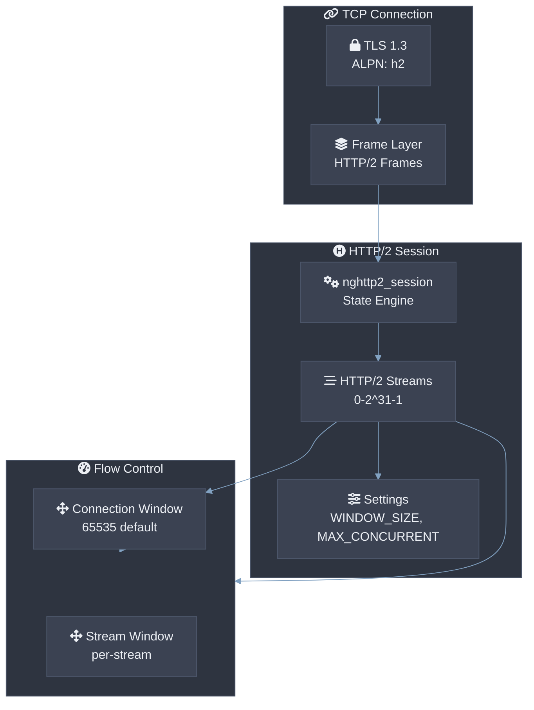

# HTTP/2 Protocol Stack Deep Dive

> **Version**: 0.5.3 | **Last updated**: 2026-08-27

csilk integrates the high-performance `nghttp2` library to provide native HTTP/2 capabilities, including connection multiplexing, binary framing, HPACK header compression, and flow control. This document details session management, stream hash-mapping, and lifecycle validation.

---

## 1. Core HTTP/2 Features

| Feature | Description |
|---------|-------------|
| **Multiplexing** | Concurrent request/response interleaving across a single TCP connection |
| **Binary Framing** | All protocol messages formatted as structured binary frames |
| **Header Compression** | HPACK table compression for request and response headers |
| **Server Push** | Proactive server push to preload client resources |
| **Stream Priorities** | Priority trees and weight allocation for stream scheduling |
| **Flow Control** | Dual-layer (connection-level and stream-level) backpressure |

---

## 2. Architecture Overview



---

## 3. Session & Stream Mapping

### 3.1 Stream Map Structure (csilk_h2_stream_map_t)

```c
#define CSILK_H2_INLINE_BUCKETS 16
#define CSILK_H2_STREAM_POOL_MAX 64

/**
 * @brief Adaptive HTTP/2 stream hash map and context recycling pool.
 */
typedef struct csilk_h2_stream_map_s {
    csilk_ctx_t** buckets;  /**< Active bucket array (points to inline or heap buffer) */
    uint32_t      capacity; /**< Bucket capacity (power of two) */
    uint32_t      mask;     /**< Fast bitwise AND mask (capacity - 1) */
    uint32_t      count;    /**< Active concurrent streams count */
    csilk_ctx_t*  inline_buckets[CSILK_H2_INLINE_BUCKETS]; /**< Fast-path 16 inline slots */
    csilk_ctx_t*  free_list;  /**< Linked list of reset, cached contexts */
    uint32_t      pool_count; /**< Cached context count in connection pool */
    uint32_t      pool_max;   /**< Pool capacity limit (default 64) */
} csilk_h2_stream_map_t;
```

HTTP/2 stream contexts (`csilk_ctx_t`) are managed directly inside the client's `h2_stream_map`.

### 3.2 Explicit Stream Ownership & Async Safety

To ensure zero use-after-free (UAF) and prevent ABA race conditions during asynchronous operations or early client resets (`RST_STREAM`), HTTP/2 streams follow an explicit reference-counted lifecycle:

1. **Active Map Reference**: On creation via `csilk_h2_get_or_create_stream()`, the stream receives `stream_ref = 1`.
2. **Async Operation Reference**: Any in-flight `csilk_async_op_t` increments `_csilk_stream_ref(c)` to hold the stream in memory.
3. **Logical vs Physical Teardown**:
   - When nghttp2 reports `on_stream_close_callback`, `csilk_h2_remove_stream()` unlinks the stream from active hash buckets, sets `stream_closed = 1`, and releases the active-map reference via `_csilk_stream_unref(c)`.
   - The stream context, request sequence, and arena remain intact while `stream_ref > 0`.
4. **Deferred Recycling**: When the last reference is released (`stream_ref == 0`), `csilk_ctx_cleanup()` and `csilk_arena_reset()` execute, returning the clean context to `map->free_list` (or freeing it if the pool limit is exceeded).

---

## 4. Flow Control & Backpressure

```c
#define H2_DEFAULT_WINDOW_SIZE 65535
#define H2_MAX_WINDOW_SIZE     0x7FFFFFFF  // 2^31 - 1
```

- **Window Sizing**: Connection and stream windows are dynamically replenished with `WINDOW_UPDATE` frames.
- **Write Backpressure**: DATA frames exceeding remaining stream or connection credits pause output and register drain watchers with libuv / io_uring.

---

## 5. Formal Verification & Stress Testing

`tests/protocols/test_h2_stream_lifecycle.c` formalizes stream safety:
- **RST_STREAM Mid-flight Destruction**: Proves that reset streams immediately invalidate in-flight callbacks with 0 UAF.
- **GOAWAY Graceful Draining**: Proves pending streams drain completely while new stream attempts are rejected.
- **10,000 Stream Recycling**: Proves high-throughput stream allocation, fast-path lookup, and `free_list` recycling under 100% zero-leak conditions.
- **Cascading Connection Teardown**: Confirms `csilk_h2_free_streams()` safely reclaims all child streams and context arenas when TCP connections close.

---

## 6. Source Files

| File | Purpose |
|------|---------|
| `include/csilk/http/h2.h` | Public HTTP/2 API definitions (`csilk_h2_*`) |
| `src/core/internal/srv_internal.h` | `csilk_h2_stream_map_t` internal struct & stream pool constants |
| `src/core/http/h2_session.c` | Session management, stream allocation, adaptive hashing, pool recycling |
| `src/core/http/h2_callbacks.c` | nghttp2 frame callbacks, zero-copy header materialization, trailer handling |
| `tests/protocols/test_h2_dispatch_lifecycle.c` | Exactly-once dispatch and trailer unit tests |
| `tests/protocols/test_h2_header_bench.c` | Header materialization latency and throughput benchmark |
| `tests/protocols/test_h2_stream_bench.c` | Stream scaling (1..10k) and pool recycling benchmark |
| `tests/protocols/test_h2_stream_lifecycle.c` | RST_STREAM / GOAWAY / 10k stream recycling formal audit |
| `docs/en/design/http2.md` | Architecture design specification |
