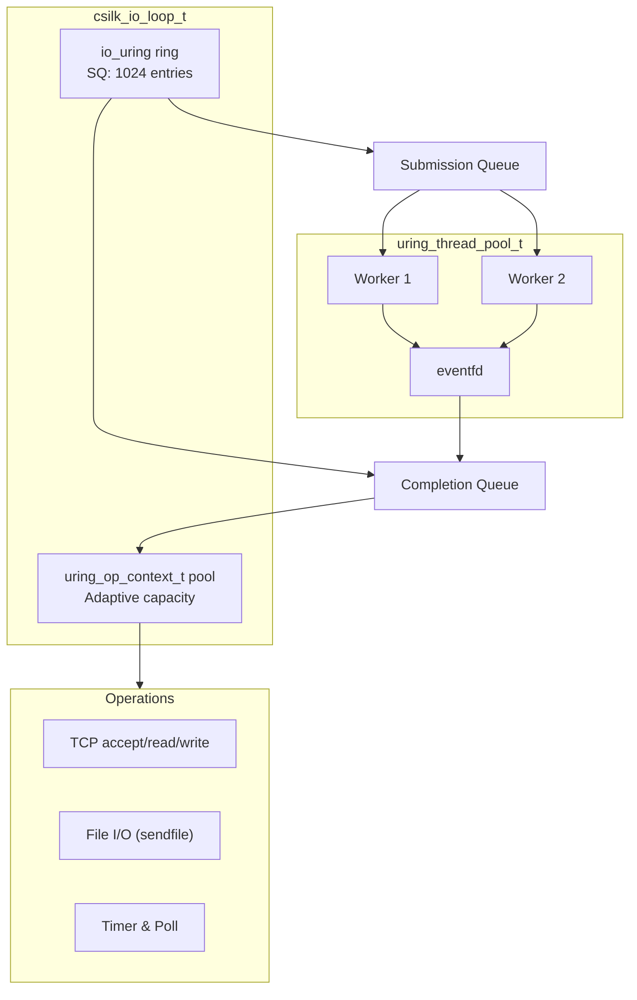

# io_uring Backend Deep Dive

> **Version**: 0.5.2 | **Last updated**: 2026-08-24

The csilk `io_uring` backend is a high-performance Linux-native asynchronous I/O driver designed to deliver sub-microsecond latency and ultra-high throughput under extreme concurrency.

---

## 1. Architecture Overview



---

## 2. Core Data Structures

### 2.1 io_uring Event Loop

```c
typedef struct csilk_io_loop_s {
    struct io_uring ring;              // Underlying io_uring ring
    
    // Operation context pool (adaptively sized to ring entries)
    uring_op_context_t* op_pool;
    uint32_t* op_free_stack;
    uint32_t op_free_head;
    uint32_t op_pool_capacity;         // entries * 2
    
    int stop_flag;
    uint64_t now_cache;
} csilk_io_loop_t;
```

### 2.2 Operation Context

```c
typedef struct uring_op_context_s {
    uint32_t slot_idx;       // Slot index in op_pool
    uint64_t generation;     // Generation counter for stale callback defense
    uint16_t type;           // Operation type
    uint16_t flags;
    void* owner;             // Owning handle
    void* data;              // Attached context payload
} uring_op_context_t;
```

---

## 3. Adaptive Sizing & Fallback Initialization

```c
int csilk_io_loop_init(csilk_io_loop_t* loop) {
    if (!loop) return -1;
    memset(loop, 0, sizeof(*loop));

    // Adaptive stepped queue fallback (1024 -> 512 -> 256 -> 128 -> 64) for constrained RLIMIT_MEMLOCK
    int entries = 1024;
    int rc = -1;
    while (entries >= 64) {
        rc = io_uring_queue_init((unsigned)entries, &loop->ring, 0);
        if (rc == 0) break;
        entries /= 2;
    }
    if (rc < 0) return rc;
    
    // Proportional operation context pool allocation
    loop->op_pool_capacity = (uint32_t)(entries * 2);
    loop->op_pool = calloc(loop->op_pool_capacity, sizeof(uring_op_context_t));
    loop->op_free_stack = malloc(loop->op_pool_capacity * sizeof(uint32_t));
    
    for (uint32_t i = 0; i < loop->op_pool_capacity; i++) {
        loop->op_free_stack[i] = loop->op_pool_capacity - 1 - i;
        loop->op_pool[i].slot_idx = i;
    }
    loop->op_free_head = loop->op_pool_capacity;
    
    return 0;
}
```

---

## 4. Generation-Tagged Callback Safety

To guard against stale completions on recycled handles, each submitted SQE carries an operation context with a monotonically increasing `generation` counter. The completion handler drops results whose `generation` does not match `handle->generation`.

---

## 5. Source Files

| File | Purpose |
|------|---------|
| `src/core/uring/uring_io.c` | Unified single-track io_uring driver |
| `src/core/uring/uring_thread_pool.c` | Non-blocking background thread pool |
| `src/core/uring/uring_internal.h` | Internal structures, operation pool, SQE helpers |
| `docs/design/io_uring.md` | Architecture design specification |
