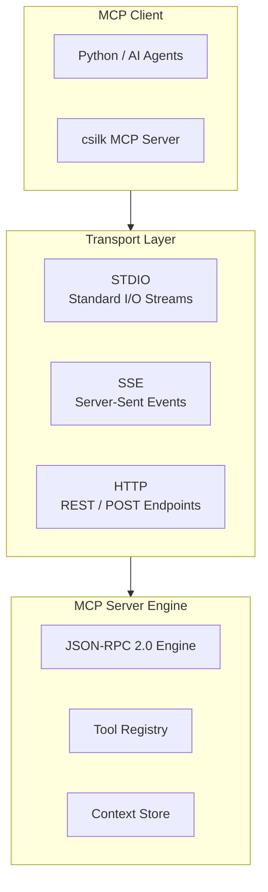

# Model Context Protocol (MCP) Deep Dive

> **Version**: 0.5.1 | **Last updated**: 2026-08-22

csilk provides first-class support for the Model Context Protocol (MCP), allowing AI agents and LLMs to interact with application tools and context over standard JSON-RPC 2.0 transports.

---

## 1. Protocol Architecture



---

## 2. Transports & JSON-RPC 2.0

csilk supports dual MCP transports:
- **STDIO Transport**: Pipe-based communication for local CLI subagents and spawned processes.
- **SSE Transport**: Asynchronous streaming over HTTP Server-Sent Events for networked web clients and remote agents.

---

## 3. Tool Registration & Execution

```c
typedef struct csilk_mcp_tool_s {
    char* name;                    // Tool name
    char* description;             // Tool description
    cJSON* input_schema;           // JSON Schema definition for arguments
    int (*execute)(csilk_mcp_session_t* session,
                   csilk_mcp_tool_call_t* call,
                   cJSON** result);
    void* user_data;
    void (*free)(void* data);
} csilk_mcp_tool_t;
```

---

## 4. Source Files

| File | Purpose |
|------|---------|
| `src/protocols/mcp/mcp_client.c` | MCP client implementation |
| `src/protocols/mcp/mcp_server.c` | MCP server implementation |
| `src/protocols/mcp/mcp_tools.c` | Tool registry and schema validation |
| `examples/mcp/example_mcp.c` | Working MCP server example |
