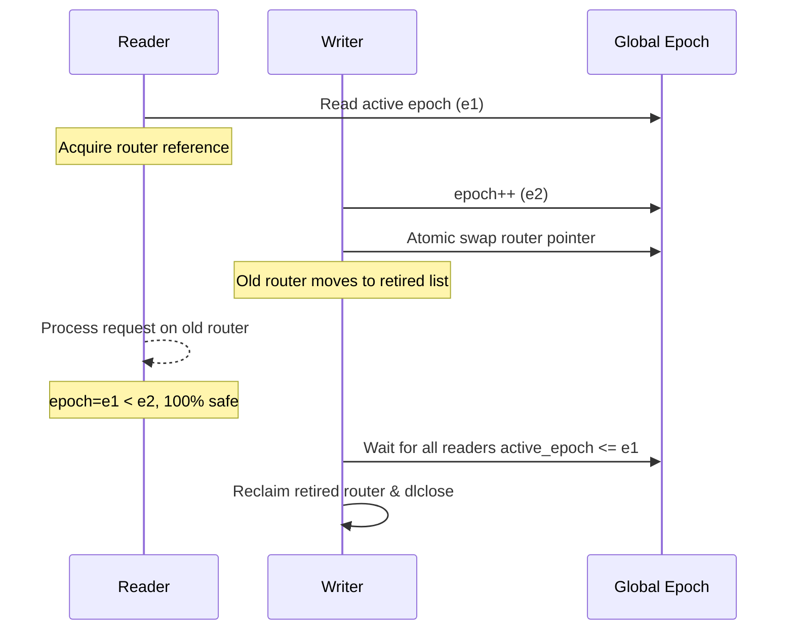

# RCU Hot-Reload Architecture Deep Dive

> **Version**: 0.5.1 | **Last updated**: 2026-08-22

The csilk RCU (Read-Copy-Update) / EBR (Epoch-Based Reclamation) hot-reload subsystem enables zero-downtime, wait-free routing tree swapping at runtime without disrupting active in-flight HTTP requests.

---

## 1. Design Objectives

| Goal | Description |
|------|-------------|
| **Zero Downtime** | Service continues handling requests uninterrupted during dynamic reload |
| **Wait-Free Readers** | Reader request dispatch path is 100% lock-free and wait-free |
| **Strict Memory Safety** | Retired routing structures and dynamic shared libraries are never freed prematurely |
| **Concurrent Writer Serialization** | Multi-threaded reload triggers are safely serialized under `server->config_mutex` |

---

## 2. Epoch Lifecycle Model



---

## 3. Core Data Structures

```c
// Reader RCU Slot
typedef struct csilk_rcu_slot_s {
    uintptr_t owner_tid;           // Owning thread ID
    uint64_t active_epoch;         // Active read epoch
    uint32_t nesting_depth;        // Re-entrant nesting depth
    csilk_reload_mgr_t* owner_mgr;
    uint64_t server_gen;
    struct csilk_rcu_slot_s* next_overflow;
    bool is_dynamic;
} csilk_rcu_slot_t;

// Hot-Reload Manager
typedef struct csilk_reload_mgr_s {
    uint64_t global_epoch;
    csilk_mutex_t reclaim_lock;
    csilk_rcu_slot_t reader_slots[256];
    csilk_rcu_slot_t* overflow_head;
    csilk_retired_router_t* retired_head;
    uint32_t retired_count;
} csilk_reload_mgr_t;
```

---

## 4. Read Path (Lock-Free & Wait-Free)

### 4.1 Fast Path

```c
static inline csilk_rcu_slot_t* acquire_rcu_slot(csilk_reload_mgr_t* mgr) {
    // Thread-Local Storage Fast Path
    if (__builtin_expect(
            g_tls_rcu.slot != NULL && 
            g_tls_rcu.mgr == mgr &&
            g_tls_rcu.server_gen == mgr->server_gen, 1)) {
        return g_tls_rcu.slot;
    }
    return acquire_rcu_slot_slow(mgr);
}
```

**Latency**: ~5 ns

### 4.2 Slow Path

```c
static csilk_rcu_slot_t* acquire_rcu_slot_slow(csilk_reload_mgr_t* mgr) {
    uintptr_t my_tid = (uintptr_t)pthread_self();
    
    // Attempt to acquire static reader slot via atomic CAS
    for (size_t i = 0; i < CSILK_RELOAD_MAX_READERS; i++) {
        uintptr_t expected = 0;
        if (atomic_compare_exchange_strong_explicit(
                &mgr->reader_slots[i].owner_tid, &expected, my_tid,
                memory_order_acq_rel, memory_order_relaxed)) {
            mgr->reader_slots[i].active_epoch = 0;
            g_tls_rcu.slot = &mgr->reader_slots[i];
            return g_tls_rcu.slot;
        }
    }
    
    // Fall back to dynamic overflow slot on slot exhaustion (>256 threads)
    csilk_rcu_slot_t* new_slot = calloc(1, sizeof(csilk_rcu_slot_t));
    // Atomic CAS insertion into overflow linked list...
}
```

---

## 5. Write Path (Writer Serialization & Monotonic Epoch)

```c
void csilk_server_set_router_full(csilk_server_t* server,
                                   csilk_router_t* router,
                                   void* dl_handle,
                                   const char* tmp_path) {
    if (!server || !router) return;

    if (server->middleware_count > 0) {
        csilk_router_compile(router, server->middlewares, (size_t)server->middleware_count);
    }

    csilk_reload_mgr_t* mgr = &server->reload_mgr;

    // 1. Acquire config mutex (strictly serializes multi-writer contention)
    csilk_mutex_lock(&server->config_mutex);

    // 2. Atomically swap active router
    csilk_router_t* old_router = 
        atomic_exchange_explicit(&server->router, router, memory_order_acq_rel);
    
    // 3. Monotonically increment global epoch
    uint64_t retired_epoch = atomic_fetch_add_explicit(
        &mgr->global_epoch, 1, memory_order_acq_rel);
    
    // 4. Prepend old router to retired epoch chain
    if (old_router || dl_handle || tmp_path) {
        csilk_retired_router_t* rec = calloc(1, sizeof(csilk_retired_router_t));
        rec->router = old_router;
        rec->dl_handle = dl_handle;
        rec->tmp_path = tmp_path ? strdup(tmp_path) : NULL;
        rec->retired_epoch = retired_epoch;
        atomic_init(&rec->retired_next, NULL);
        
        csilk_retired_router_t* old_head = 
            atomic_load_explicit(&mgr->retired_head, memory_order_relaxed);
        do {
            atomic_store_explicit(&rec->retired_next, old_head, memory_order_relaxed);
        } while (!atomic_compare_exchange_weak_explicit(
            &mgr->retired_head, &old_head, rec, 
            memory_order_release, memory_order_relaxed));
        
        atomic_fetch_add_explicit(&mgr->retired_count, 1, memory_order_relaxed);
    }
    
    // 5. Opportunistic non-blocking reclamation
    _csilk_reload_try_reclaim(server);

    csilk_mutex_unlock(&server->config_mutex);
}
```

**Writer Execution**: ~150 ns (Readers remain completely wait-free)

---

## 6. Epoch-Based Memory Reclamation

### 6.1 Safety Invariant

```
retired_epoch < min_active_epoch
```

### 6.2 Reclamation Algorithm

```c
void _csilk_reload_try_reclaim(csilk_server_t* server) {
    // 1. Non-blocking acquisition of reclamation lock
    uint32_t expected = 0;
    if (!atomic_compare_exchange_strong_explicit(
            &mgr->reclaim_lock, &expected, 1,
            memory_order_acquire, memory_order_relaxed)) {
        return;
    }
    
    // 2. Scan all reader slots to determine the minimum active epoch
    uint64_t min_active_epoch = UINT64_MAX;
    
    for (size_t i = 0; i < CSILK_RELOAD_MAX_READERS; i++) {
        uint64_t r_epoch = atomic_load_explicit(
            &mgr->reader_slots[i].active_epoch, memory_order_acquire);
        if (r_epoch != 0) {
            min_active_epoch = min(min_active_epoch, r_epoch);
        }
    }
    
    // 3. Isolate safe-to-reclaim entries
    csilk_retired_router_t* list = 
        atomic_exchange_explicit(&mgr->retired_head, NULL, 
                                  memory_order_acq_rel);
    
    while (list) {
        if (list->retired_epoch < min_active_epoch) {
            // Safe to free
            csilk_router_free(list->router);
            if (list->dl_handle) dlclose(list->dl_handle);
            free(list);
        } else {
            // Retain for future epochs
            retain_list = list;
        }
        list = next;
    }
    
    // 4. Release reclamation lock
    atomic_store_explicit(&mgr->reclaim_lock, 0, memory_order_release);
}
```

---

## 7. Thread-Local Storage Confinement

```c
typedef struct {
    csilk_rcu_slot_t* slot;
    csilk_reload_mgr_t* mgr;
    uint64_t server_gen;
} tls_rcu_t;

static _Thread_local tls_rcu_t g_tls_rcu = {NULL, NULL, 0};
```

---

## 8. Formal Verification & Stress Testing

`tests/core/test_rcu_lifecycle_stress.c` covers comprehensive formal validation scenarios:

1. **512 Concurrent Readers**: 256 static slots + 256 dynamic overflow slots under high reader contention, proving zero data races.
2. **10,000 Short-Lived Threads**: High-frequency thread creation and exit, verifying `rcu_thread_exit_destructor` automatically unregisters TIDs with 0 dynamic slot leaks.
3. **10,000 Rapid Hot Reloads**: Verifies monotonic epoch progression and steady memory RSS without unbounded growth.
4. **Concurrent Hot-Reload & Server Shutdown**: Verifies memory safety during graceful draining and final cleanup.
5. **Concurrent Route Lookup During Swaps**: Proves old readers observe consistent routing while new readers seamlessly match newly registered endpoints.

---

## 9. Source Files

| File | Purpose |
|------|---------|
| `src/core/server/server_lifecycle.c` | `csilk_server_router_acquire`, `csilk_server_router_release`, `csilk_server_set_router_full`, `_csilk_reload_try_reclaim` |
| `include/csilk/core/hot_reload.h` | Dynamic hot reload public API |
| `tests/core/test_rcu_lifecycle_stress.c` | 512-reader and 10k short-lived thread formal stress suite |
