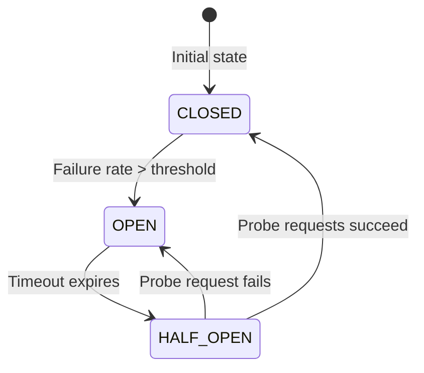

# Security Middleware Deep Dive

> **Version**: 0.5.2 | **Last updated**: 2026-08-22

This document provides deep architectural analysis of csilk's security middleware stack: Circuit Breaker, Sliding Window Rate Limiter, Web Application Firewall (WAF), and eBPF XDP kernel-level firewall.

---

## 1. Circuit Breaker

### 1.1 State Machine



### 1.2 Core Data Structure

```c
typedef struct csilk_circuit_breaker_s {
    cb_state_t state;              // CLOSED / OPEN / HALF_OPEN
    uint64_t last_failure_time;    // Timestamp of last failure
    atomic_uint_fast64_t failures; // Consecutive failures
    atomic_uint_fast64_t successes;// Half-open successes
    atomic_uint_fast64_t total;    // Total requests
    uint32_t failure_threshold;    // Tripping threshold
    uint32_t success_threshold;    // Recovery threshold
    uint64_t timeout_ms;           // Reset timeout
    csilk_sliding_window_t window; // Window counter
} csilk_circuit_breaker_t;
```

---

## 2. Sliding Window Rate Limiter

Weighted sliding-window algorithm combines discrete historical buckets with fractional weighting of the active sub-window to eliminate traffic spikes at window boundaries.

---

## 3. Web Application Firewall (WAF) & eBPF XDP

- **Application WAF**: Regex-based inspection for SQL injection, XSS, and path traversal across request paths and payloads.
- **eBPF XDP Firewall**: Kernel-bypass IP filtering running directly inside the network driver layer for sub-microsecond DDoS mitigation.

---

## 4. Source Files

| File | Purpose |
|------|---------|
| `src/middleware/circuit_breaker.c` | Circuit breaker state machine |
| `src/middleware/ratelimit.c` | Fixed-window token bucket limiter |
| `src/middleware/sliding_ratelimit.c` | High-precision sliding window limiter |
| `src/middleware/waf.c` | Application-level WAF rules engine |
| `src/middleware/xdp_waf.c` | eBPF XDP kernel packet filter |
