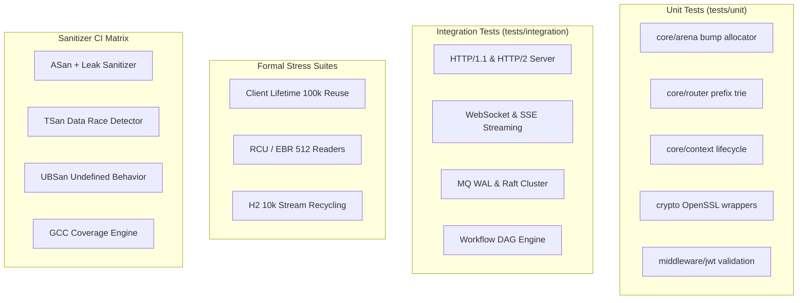

# Testing Architecture Deep Dive

> **Version**: 0.5.3 | **Last updated**: 2026-08-27

csilk features a 200+ test suite covering unit tests, integration tests, fuzzing, OOM fault injection, formal lifecycle stress suites, and sanitizer jobs (ASan, TSan, UBSan).

---

## 1. Test Taxonomy



---

## 2. Test Execution Commands

```bash
# Run unit and stress tests (with timeout and failure logs)
ctest --test-dir build -E test_integration -j$(nproc) --timeout 30 --output-on-failure

# Run integration tests
ctest --test-dir build -R test_integration --timeout 30 --output-on-failure

# Run ASan memory check build
cmake -B build_asan -S . -DCMAKE_BUILD_TYPE=Debug -DUSE_ASAN=ON -DENABLE_OOM_TEST=ON
ctest --test-dir build_asan --timeout 30 --output-on-failure

# Run TSan thread race detection
cmake -B build_tsan -S . -DCMAKE_BUILD_TYPE=Debug -DUSE_TSAN=ON
ctest --test-dir build_tsan --timeout 30 --output-on-failure
```

---

## 3. Source Organization

| Directory | Scope |
|-----------|-------|
| `tests/core/` | Arena, Context, Router, Server, Connection, io_uring, RCU formal stress |
| `tests/crypto/` | SHA-256, HMAC, Base64, bcrypt, crypto drivers |
| `tests/middleware/` | Auth, CORS, CSRF, JWT, Rate limiting, WAF |
| `tests/messaging/` | MPSC queue, Pub/Sub, WAL persistence, Raft consensus |
| `tests/protocols/` | HTTP/2 multiplexing, WebSocket, SSE, MCP |
| `tests/workflow/` | Agent DAG scheduler, DSL parser, AST evaluation |
| `tests/integration/`| End-to-end full server and workflow execution |
