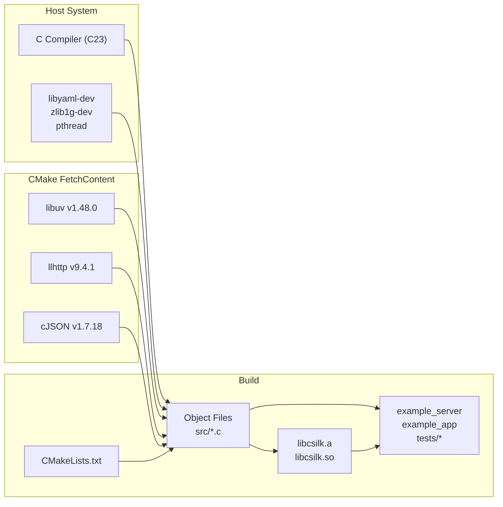
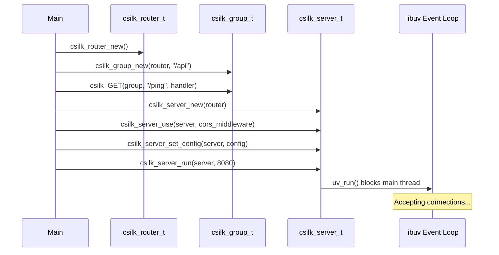

# Getting Started

## Prerequisites

- CMake 3.11+ (**MUST** be available in `$PATH`)
- C compiler with C23 support (GCC 13+, Clang 19+)
- Git
- libyaml-dev
- zlib1g-dev (for gzip middleware)
- libssl-dev (for HTTPS/TLS, JWT, cipher drivers — **MUST** be OpenSSL 1.1.1+)
- libcurl-dev 7.80.0+ (for AI driver HTTP transport)
- libuv (auto-fetched via CMake if not present)
- Optional: libmysqlclient-dev, libpq-dev, libmongoc-dev (for database drivers)

## Build & Dependency Flow



## Build from Source

```bash
git clone https://github.com/username/csilk.git
cd csilk
mkdir build && cd build
cmake .. -DCMAKE_BUILD_TYPE=Release
make -j$(nproc)
```

### Build Options

| Option | Default | Description |
|--------|---------|-------------|
| `CMAKE_BUILD_TYPE` | - | `Debug`, `Release`, `RelWithDebInfo` |
| `CSILK_BUILD_SHARED` | OFF | Build shared library (`libcsilk.so`) |
| `USE_ASAN` | OFF | Enable AddressSanitizer |
| `USE_FUZZER` | OFF | Build fuzz test harness |
| `USE_COVERAGE` | OFF | Enable gcov coverage reporting |
| `CSILK_USE_MYSQL` | OFF | Enable MySQL database driver |
| `CSILK_USE_POSTGRES` | OFF | Enable PostgreSQL database driver |
| `CSILK_USE_MONGODB` | OFF | Enable MongoDB database driver |
| `ENABLE_OOM_TEST` | OFF | Enable out-of-memory simulation tests |

## Create a New Project

Csilk provides a scaffolding tool `csilkskel` to quickly generate a new project with a professional, layered architecture and built-in Swagger UI and Admin Dashboard.

```bash
# Generate a new project (interactive Python tool)
python3 scripts/csilkskel -n my-service

# Build and run the new project
cd my-service
mkdir build && cd build
cmake ..
make
./my-service
```

The generated project includes:
- **Layered Architecture**: Dedicated directories for API handlers, service logic, and data models.
- **Interactive Documentation**: Built-in Swagger UI available at `http://localhost:8080/`.
- **Admin Dashboard**: Real-time monitoring at `http://localhost:8080/admin/`.
- **Reflection Example**: A complete User service demonstrating automatic JSON binding.

## Run Example
...

```bash
# Low-level API demo
./build/example_server

# High-level app API demo
./build/example_app
```

## Example Server Walkthrough



## Running Tests

```bash
cd build && ctest --output-on-failure
```

## Minimal Server Program

```c
#include "csilk/csilk.h"

void ping(csilk_ctx_t* c) {
    csilk_string(c, 200, "pong");
}

int main() {
    csilk_router_t* r = csilk_router_new();
    csilk_router_add(r, "GET", "/ping", (csilk_handler_t[]){ping, NULL}, 1);

    csilk_server_t* s = csilk_server_new(r);
    csilk_server_run(s, 8080);

    csilk_router_free(r);
    csilk_server_free(s);
    return 0;
}
```

## Python Bindings Quickstart

If you prefer Python, you can write `csilk` applications in Python using the `ctypes` wrapper package:

1. Compile the `csilk` shared library:
```bash
cmake .. -DCSILK_BUILD_SHARED=ON
make
```

2. Install the python package in development mode:
```bash
pip install -e ./python
```

3. Create a simple `app.py` script:
```python
from csilk import App, Context

app = App()

@app.get("/ping")
def ping(ctx: Context):
    ctx.string(200, "pong")

if __name__ == "__main__":
    app.run(8080)
```

4. Run the application:
```bash
python3 app.py
```
