# csilk Documentation

> **Version**: 0.5.0-dev | **Last updated**: 2026-06-29

csilk is a lightweight (~150KB static binary, < 2MB RSS per 10K keep-alive connections) HTTP web framework written in C, delivering **P99 latency ≤ 5ms under 10K QPS** on commodity hardware. Built on **libuv (default) or io_uring (optional, Linux-only)**, llhttp, nghttp2, and cJSON, it achieves ~50K QPS throughput (4-core single worker) with linear scaling to ~200K QPS on 16-core multi-worker mode. Developers **MUST** compile with C23 support (GCC 13+ or Clang 19+). Public API **MUST** be used through the `csilk_ctx_t*` opaque handle — direct struct access is **NOT** part of the stable ABI. All resource management **SHOULD** prefer arena allocation (~3 CPU instructions per alloc, ≤ 5ns reset) over heap `malloc`/`free`.

## Project Architecture Overview

```mermaid
%%{init: {'theme': 'base', 'themeVariables': {'background': '#2E3440','primaryColor':'#81A1C1','primaryBorderColor':'#4C566A','primaryTextColor':'#ECEFF4','secondaryColor':'#3B4252','secondaryBorderColor':'#434C5E','secondaryTextColor':'#D8DEE9','lineColor':'#81A1C1','textColor':'#ECEFF4','mainBkg':'#3B4252','nodeBorder':'#4C566A','clusterBkg':'#2E3440','clusterBorder':'#4C566A','titleColor':'#ECEFF4','edgeLabelBackground':'#3B4252','nodeTextColor':'#ECEFF4'}, 'flowchart': {'htmlLabels': true, 'curve': 'basis'}}}%%
graph TB
    subgraph Application
        H["fa:fa-code Business Handlers"]
        APP["fa:fa-cube csilk_app_t (High-Level API)"]
    end

    subgraph Middleware_Layer["fa:fa-shield Middleware Layer"]
        REC["fa:fa-medkit Recovery"]
        LOG["fa:fa-pencil Logger"]
        AUTH["fa:fa-key Auth"]
        CORS["fa:fa-globe CORS"]
        RT["fa:fa-clock-o Rate Limit"]
        CSRF["fa:fa-shield CSRF"]
        ST["fa:fa-folder-open Static Files"]
        GZ["fa:fa-archive Gzip"]
        SSE["fa:fa-bullhorn SSE"]
        MP["fa:fa-upload Multipart"]
        JWT["fa:fa-tag JWT"]
        MET["fa:fa-bar-chart Metrics"]
        RID["fa:fa-tag RequestID"]
        SES["fa:fa-cookie Session"]
        VAL["fa:fa-check-square Validate"]
        WAF["fa:fa-fire WAF"]
    end

    subgraph Core_Framework["fa:fa-cogs Core Framework"]
        S["fa:fa-server Server (libuv / io_uring backend)"]
        R["fa:fa-sitemap Router (Radix Tree)"]
        G["fa:fa-folder Group (prefix routing)"]
        C["fa:fa-exchange Context (req/res lifecycle)"]
        AR["fa:fa-database Arena Allocator"]
        WS["fa:fa-plug WebSocket"]
        CFG["fa:fa-cog Config (YAML)"]
        RF["fa:fa-search Reflection Engine"]
        AI_ENG["fa:fa-robot AI Unified Engine"]
    end

    subgraph Dependencies
        UV["fa:fa-cogs libuv / io_uring (async I/O)"]
        LL["fa:fa-file-code llhttp (HTTP/1.1 parser)"]
        NG["fa:fa-code-fork nghttp2 (HTTP/2 parser)"]
        JSON["fa:fa-code cJSON"]
        YAML["fa:fa-file-text libyaml"]
        Z["fa:fa-archive zlib"]
        CURL["fa:fa-download libcurl"]
    end

    S --> CFG
    S --> UV
    S --> LL
    RF --> JSON
    AI_ENG --> CURL
    AI_ENG --> JSON
    GZ --> Z
    C --> JSON

    CORS --> C
    RT --> C
    CSRF --> C
    ST --> C
    GZ --> C
    SSE --> C
    MP --> C
    S --> R
    S --> C
    G --> R
    C --> AR
    S --> WS
```



## Key Resources

| Document                                        | Description                                                                                                                                                                                                                                                                                                                                                                                                                                                                                                                                                                                                                                                                        |
| ----------------------------------------------- | ---------------------------------------------------------------------------------------------------------------------------------------------------------------------------------------------------------------------------------------------------------------------------------------------------------------------------------------------------------------------------------------------------------------------------------------------------------------------------------------------------------------------------------------------------------------------------------------------------------------------------------------------------------------------------------- |
| [Getting Started](getting-started.md)           | Build, install, and run your first server                                                                                                                                                                                                                                                                                                                                                                                                                                                                                                                                                                                                                                          |
| [Architecture](architecture.md)                 | High-level architecture, core design principles, and component dependency map                                                                                                                                                                                                                                                                                                                                                                                                                                                                                                                                                                                                      |
| [Performance Tuning](performance-tuning.md)     | Comprehensive guide to optimizing P99 latency and maximizing throughput                                                                                                                                                                                                                                                                                                                                                                                                                                                                                                                                                                                                            |
| [Module Design](module-design/)                 | Deep dives into core module internals: [Server](module-design/server.md), [App Layer](module-design/app.md), [Router](module-design/router.md), [Context](module-design/context.md), [Arena](module-design/arena.md), [Middleware](module-design/middleware.md), [Data](module-design/data.md), [Messaging](module-design/messaging.md), [Security](module-design/security.md), [Protocols](module-design/protocols.md), [Drivers](module-design/drivers.md), [Metrics](module-design/metrics.md), [AI](module-design/ai.md), [Workflow](module-design/workflow.md), [Reflection](module-design/reflection.md), [Crypto](module-design/crypto.md), [Hooks](module-design/hooks.md) |
| [User Manual](user-manual/)                     | Configuration, middleware development, security, AI engine, workflows, database, MQ, deployment, hooks, reflection, admin dashboard, and Python bindings                                                                                                                                                                                                                                                                                                                                                                                                                                                                                                                                                                                                                          |
| [Python Bindings Manual](user-manual/python.md) | Installation, classes reference, and AI workflow orchestration guides                                                                                                                                                                                                                                                                                                                                                                                                                                                                                                                                                                                                              |
| [API Reference](html/index.html)                | Doxygen-generated API documentation                                                                                                                                                                                                                                                                                                                                                                                                                                                                                                                                                                                                                                                |

## Quick Start

```c
#include "csilk/csilk.h"

void hello(csilk_ctx_t* c) {
    csilk_string(c, 200, "Hello World!");
}

int main() {
    csilk_router_t* r = csilk_router_new();
    csilk_router_add(r, "GET", "/hello", (csilk_handler_t[]){hello, NULL}, 1);

    csilk_server_t* s = csilk_server_new(r);
    csilk_server_run(s, 8080);

    csilk_router_free(r);
    csilk_server_free(s);
    return 0;
}
```
