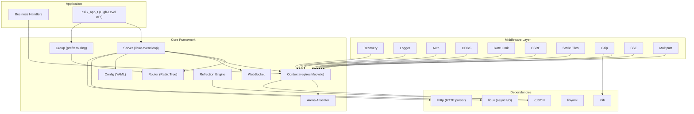

# csilk Documentation

> **Version**: 0.2.1 | **Last updated**: 2026-05-25

csilk is a lightweight, high-performance HTTP web framework written in C, inspired by Gin (Golang) and built on top of libuv, llhttp, and cJSON.

## Project Architecture Overview



## Key Resources

| Document | Description |
|----------|-------------|
| [Getting Started](getting-started.md) | Build, install, and run your first server |
| [Architecture](architecture.md) | High-level architecture and design principles |
| [ARCH Whitepaper](ARCH.md) | Detailed architecture whitepaper |
| [Module Design](module-design/) | Deep dives into core module internals |
| [User Manual](user-manual/) | Configuration, middleware, and advanced usage |
| [API Reference](html/index.html) | Doxygen-generated API documentation |

## Quick Start

```c
#include "csilk.h"

void hello(csilk_ctx_t* c) {
    csilk_string(c, 200, "Hello World!");
}

int main() {
    csilk_router_t* r = csilk_router_new();
    csilk_router_add(r, "GET", "/hello", (csilk_handler_t[]){hello, NULL}, 1);

    csilk_server_t* s = csilk_server_new(r);
    csilk_server_run(s, 8080);

    csilk_router_free(r);
    csilk_server_free(s);
    return 0;
}
```
