# csilk 编码规范（面向 AI 代码生成/修改）

> **目标**: 确保 AI 模型生成或修改的代码与项目现有风格、模式和约束完全一致。
> **版本**: 0.3.0 | 最后更新: 2026-05-31

---

## 1. 项目架构总览

```mermaid
%%{init: {'theme': 'base', 'themeVariables': {'background': '#2E3440','primaryColor':'#81A1C1','primaryBorderColor':'#4C566A','primaryTextColor':'#ECEFF4','secondaryColor':'#3B4252','secondaryBorderColor':'#434C5E','secondaryTextColor':'#D8DEE9','lineColor':'#81A1C1','textColor':'#ECEFF4','mainBkg':'#3B4252','nodeBorder':'#4C566A','clusterBkg':'#2E3440','clusterBorder':'#4C566A','titleColor':'#ECEFF4','edgeLabelBackground':'#3B4252','nodeTextColor':'#ECEFF4'}, 'flowchart': {'htmlLabels': true, 'curve': 'basis'}}}%%
graph TB
    subgraph public_api["fa:fa-book Public API Layer (include/)"]
        MAIN["fa:fa-file-code csilk.h (umbrella)"]
        CORE_API["fa:fa-file-code csilk/core/ (server, router, ctx)"]
        APP_API["fa:fa-cube csilk/app/ (app, admin, workflow)"]
        DRV_API["fa:fa-plug csilk/drivers/ (AI, cipher, DB, perm)"]
        REFL_API["fa:fa-tag csilk/reflection/ (reflect.h)"]
        TEST_API["fa:fa-check-square-o csilk/test/ (OOM test framework)"]
    end

    subgraph app_layer["fa:fa-cogs Application Layer (src/)"]
        APP["fa:fa-cube app/ (csilk_app_t facade)"]
        AI["fa:fa-robot ai/ (Unified AI engine)"]
        DATA["fa:fa-database data/ (DB abstraction)"]
        WORKFLOW["fa:fa-code-fork app/workflow (DAG scheduler)"]
    end

    subgraph core["fa:fa-gears Core Engine (src/core/)"]
        SRV["fa:fa-server server (libuv event loop)"]
        RTR["fa:fa-sitemap router (Radix Tree + SIMD)"]
        CTX["fa:fa-exchange context (csilk_ctx_t)"]
        ARENA["fa:fa-database arena (bump allocator)"]
        CFG["fa:fa-cog config (YAML parser)"]
    end

    subgraph extension["fa:fa-puzzle-piece Extensions"]
        MID["fa:fa-shield middleware/ (16 modules)"]
        PROTO["fa:fa-plug protocols/ (WebSocket, Swagger)"]
        MSG["fa:fa-envelope messaging/ (Event bus)"]
        SEC["fa:fa-lock security/ (RBAC, JWT)"]
        CRYPTO["fa:fa-key crypto/ (AES, RSA, SHA, HMAC)"]
        REFL["fa:fa-tag reflection/ (struct ↔ JSON)"]
        DRV["fa:fa-hdd drivers/ (OpenAI, SQLite, MySQL, ...)"]
    end

    subgraph testing["fa:fa-flask Testing"]
        TESTS["fa:fa-check-circle tests/ (120+ tests)"]
        EXMPL["fa:fa-code examples/"]
    end

    MAIN --> CORE_API
    MAIN --> APP_API
    MAIN --> DRV_API
    MAIN --> REFL_API
    MAIN --> TEST_API
    APP_API --> APP
    APP --> SRV
    APP --> AI
    APP --> DATA
    APP --> WORKFLOW
    SRV --> RTR
    SRV --> CTX
    CTX --> ARENA
    SRV --> MID
    SRV --> PROTO
    SRV --> MSG
    SRV --> SEC
    SRV --> REFL
    DRV_API --> DRV
    DRV --> CRYPTO
```



```
include/                        # 公共 + 内部头文件（14 个文件）
include/csilk.h                 # 主入口（包含 csilk/csilk.h）
include/csilk/csilk.h           # 核心公共 API（类型、函数声明、宏）
include/csilk/app/app.h         # 高层 csilk_app_t API
include/csilk/app/admin.h       # 统一管理面板 API
include/csilk/app/workflow.h    # 工作流引擎 API
include/csilk/app/workflow_wal.h # 工作流 WAL 日志
include/csilk/core/ctx_types.h # csilk_ctx_s 结构体 (src/core/ 内部使用，隐藏)
include/csilk/core/internal.h   # 内部接口伞（→ hash.h/codec.h/ws_frame.h/crypto_dispatch.h/mq_types.h）
include/csilk/drivers/ai.h      # AI 驱动接口
include/csilk/drivers/cipher.h  # 密码驱动接口（AES/RSA）
include/csilk/drivers/db.h      # 数据库驱动接口
include/csilk/drivers/perm.h    # 权限驱动接口
include/csilk/reflection/reflect.h # 反射引擎（struct <-> JSON）
include/csilk/test/test.h       # OOM 模拟测试框架
src/core/                       # 核心引擎（server/router/context/arena/logger/config）
src/app/                        # 高层 app 封装 + 管理面板 + 工作流引擎
src/middleware/                  # 15 个内置中间件
src/protocols/                  # 协议扩展（WebSocket, Swagger）
src/messaging/                  # 内部事件总线（Message Queue）
src/drivers/perm/               # 权限驱动实现（manager + simple 后端）
src/reflection/                 # 反射引擎实现
src/crypto/                     # 密码驱动实现（AES/RSA 加解密，已合并至 src/drivers/cipher/）
src/drivers/db/                       # 数据库抽象层（连接池管理）
src/drivers/                    # 具体驱动实现（OpenAI, Ollama, SQLite, MySQL, PostgreSQL, MongoDB）
src/drivers/ai/                         # AI 统一接口引擎
tests/                          # 单元测试（98+ 个测试文件）
examples/                       # 示例程序
```

### 关键依赖

| 库 | 用途 | 引入方式 |
|----|------|----------|
| libuv 1.48 | 异步事件循环、TCP、定时器 | FetchContent |
| llhttp 9.4 | HTTP/1.1 解析 | 优先系统，回退 FetchContent |
| cJSON 1.7 | JSON 解析/序列化 | FetchContent |
| libyaml | YAML 配置解析 | 系统库 |
| zlib | Gzip 压缩 | 系统库 |
| OpenSSL | TLS/SSL + JWT + 密码驱动 | 系统库 |
| libcurl | AI 驱动 HTTP 传输 | 系统库 |
| sqlite3 | SQLite 数据库驱动 | 系统库 |
| libmysqlclient | MySQL 数据库驱动（可选） | 系统库 |
| libpq | PostgreSQL 数据库驱动（可选） | 系统库 |
| libmongoc | MongoDB 数据库驱动（可选） | 系统库 |
| hiredis | Redis 数据库驱动（可选） | 系统库 |

---

## 2. 代码风格（clang-format 已配置）

运行 `make format` 自动格式化。手动编码时遵循以下规则：

### 2.1 缩进与格式

- **缩进**: 2 空格，不用 Tab
- **列宽**: 80 字符上限
- **大括号**: 附加风格（`BreakBeforeBraces: Attach`）
  ```c
  // 正确
  void func(void) {
    if (cond) {
      do_something();
    }
  }
  ```
- **指针**: 左对齐（`int* p` 而非 `int *p`）
- **函数定义返回类型**: 不单独成行
- **一元运算符后无空格**: `c->field`, `!cond`
- **控制语句括号前有空格**: `if (cond)`, `while (cond)`, `switch (x)`
- **函数调用/定义括号前无空格**: `func()`, `func(a, b)`
- **行尾注释**: 2 空格前缀，`/**< ... */` 风格用于结构体字段

### 2.2 命名约定

| 类别 | 约定 | 示例 |
|------|------|------|
| 公共函数 | `csilk_` 前缀 + 下划线小写 | `csilk_router_new()`, `csilk_get_header()` |
| 内部/静态函数 | 下划线小写 | `match_node()`, `free_headers()` |
| 公共类型 | `csilk_` 前缀 + `_t` 或 `_s` | `csilk_ctx_t`, `csilk_router_s` |
| 内部类型 | 下划线小写 | `csilk_client_t`, `ip_entry_t` |
| 枚举常量 | `CSILK_` 前缀 + 大写 | `CSILK_LOG_INFO`, `CSILK_TYPE_INT32` |
| 宏 | `CSILK_` 前缀 + 大写 | `CSILK_MAX_PARAMS`, `CSILK_LOG_I()` |
| 结构体字段 | 下划线小写 | `handler_count`, `body_len` |
| 局部变量 | 下划线小写 | `result`, `full_path` |

### 2.3 Include 顺序

按以下优先级分组，组间空行分隔：

```c
// 1) 系统头文件
#include <stdio.h>
#include <stdlib.h>
#include <string.h>

// 2) 第三方库头文件
#include <uv.h>
#include <llhttp.h>

// 3) 项目头文件
#include "csilk.h"
#include "csilk_internal.h"
```

---

## 3. Doxygen 文档规范

所有公共 API**必须**有完整 Doxygen。内部函数建议有。

### 3.1 文件头

```c
/**
 * @file filename.c
 * @brief 一句话描述文件功能。
 * @copyright MIT License
 */
```

### 3.2 函数文档

```c
/**
 * @brief 一句话描述函数功能。
 * @param name 参数描述（使用第三人称）。
 * @param other 另一个参数。
 * @return 返回值描述，或 NULL/错误码说明。
 */
int csilk_some_function(csilk_ctx_t* c, const char* name);
```

**规则**:
- `@param` 和 `@return` 只在**头文件声明处**标注，实现文件(.c)中不重复标注（避免 Doxygen "multiple @param" 警告）— 当前已完成全量标准化
- 实现文件(.c)中若函数有其他需要说明的实现细节，可用 `/** @copydoc csilk_some_function */` 或普通 `/* */` 注释
- 单行的 Doxygen 注释可以用 `/** @brief ... */` 紧凑格式

### 3.3 结构体/枚举文档

```c
/** @brief 配置结构体。 */
typedef struct {
  int port;          /**< 服务端口（1-65535）。 */
  int timeout_ms;    /**< 超时毫秒数。 */
} csilk_config_t;

/** @brief 日志级别。 */
typedef enum {
  CSILK_LOG_INFO,   /**< 信息级别。 */
  CSILK_LOG_ERROR   /**< 错误级别。 */
} csilk_log_level_t;
```

---

## 4. 内存管理规则

### 4.1 Arena 分配器（首选）

请求级临时数据优先使用 arena：

```c
// 正确：使用 arena 分配
char* copy = csilk_arena_strdup(c->arena, source);

// 正确：从 arena 分配任意大小
void* buf = csilk_arena_alloc(c->arena, size);

// 错误：对请求级数据使用 malloc
char* copy = strdup(source);  // 除非有特殊生命周期理由
```

**Arena 生命周期**: 随连接创建，随连接销毁。Keep-alive 长连接上的 arena **不会在请求间自动重置**，因此不要在 arena 中分配随请求数线性增长的数据。

### 4.2 何时用 malloc

- 跨请求生命周期（如路由表、配置字符串、全局注册表）
- 需要在请求完成前手动释放的大块数据
- `strdup` 用于运行时构建的 header field/value（server.c 中的 parser 回调）

### 4.3 分配检查

**所有** `malloc` / `calloc` / `realloc` / `strdup` 调用**必须**检查返回值：

```c
// 正确
char* buf = malloc(size);
if (!buf) return -1;

// 正确：realloc 使用临时变量
char* new_buf = realloc(old_buf, new_size);
if (!new_buf) {
  // old_buf 仍然有效
  return -1;
}
old_buf = new_buf;

// 错误：直接赋值（realloc 失败后丢失原指针）
old_buf = realloc(old_buf, new_size);
```

### 4.4 body_is_managed 语义

`csilk_response_t.body_is_managed` 控制响应体的所有权：
- `0`: 不由框架管理（通常 arena 分配），不需要 free
- `1`: 由框架管理，`csilk_ctx_cleanup` 中调用 `free()`

**覆盖 body 前必须先释放旧的 managed body**:
```c
if (c->response.body && c->response.body_is_managed) {
  free((void*)c->response.body);
}
c->response.body = new_body;
c->response.body_is_managed = 1;
```

---

## 5. 错误处理模式

### 5.1 返回码约定

- 初始化/创建函数返回 `0` 成功 / `-1` 失败，或返回 `NULL` 失败
- 资源分配失败时立即 return，不部分执行
- 错误路径**必须**清理已分配的资源

### 5.2 libuv 错误处理

```c
// 正确：检查 uv_* 返回值
int r = uv_tcp_init(loop, &handle);
if (r < 0) {
  fprintf(stderr, "uv_tcp_init: %s\n", uv_strerror(r));
  return -1;
}
```

### 5.3 参数校验

公共函数的入口参数**必须**校验 NULL：

```c
void csilk_some_func(csilk_ctx_t* c, const char* key) {
  if (!c || !key) return;  // 或 return -1;
  // ... 正常逻辑
}
```

---

## 6. 线程安全规则

### 6.1 当前模型

框架是**单线程事件循环**。所有回调在同一个线程执行。

### 6.2 全局状态保护

如果引入新全局/静态可变状态，**必须**加锁：

```c
static uv_mutex_t g_mutex;
static uv_once_t g_once = UV_ONCE_INIT;

static void ensure_mutex_init(void) {
  uv_once(&g_once, init_mutex);
}
```

### 6.3 线程安全模式

- **可重入函数**: 纯函数、仅使用栈变量或参数
- **互斥保护**: 静态可变数据用 `uv_mutex_t` + `uv_once_t`
- **跨线程通信**: 用 `uv_async_t` 向事件循环投递

### 6.4 多 Worker 连接池保护

在 `SO_REUSEPORT` 多 Worker 模式下，`on_new_connection` 可能在任何
Worker 线程的 event loop 上执行。客户端连接对象池 (`pool_get`/`pool_put`)
必须使用专用 `uv_mutex_t` 保护：

```c
struct csilk_server_s {
    // ...
    csilk_client_t* client_pool[32]; /**< Connection object free list. */
    int client_pool_count;           /**< Number of free clients in pool. */
    uv_mutex_t pool_mutex;           /**< Mutex for connection pool access. */
};

static csilk_client_t*
pool_get(csilk_server_t* server)
{
    csilk_client_t* client;
    uv_mutex_lock(&server->pool_mutex);
    if (server->client_pool_count > 0) {
        client = server->client_pool[--server->client_pool_count];
    } else {
        client = calloc(1, sizeof(csilk_client_t));
    }
    uv_mutex_unlock(&server->pool_mutex);
    // ...
}
```

不保护 `pool_get`/`pool_put` 会导致两个 Worker 线程获取同一个
`csilk_client_t`，各自用 `uv_tcp_init` 将其绑定到自己的 event loop，
随后 `uv_accept` 因跨 loop 断言失败而崩溃。锁保护消除了这一数据竞争。

---

## 7. libuv 使用规则

### 7.1 句柄生命周期

```
uv_X_init() → uv_X_start()/uv_read_start() → uv_close() → close_cb
```

- `uv_close()` 是异步的，释放资源必须在 close callback 中
- `uv_is_closing()` 检查后调用 `uv_close()`

```c
if (!uv_is_closing((uv_handle_t*)&handle)) {
  uv_close((uv_handle_t*)&handle, on_close);
}
```

### 7.2 写操作

```c
uv_write_t* req = malloc(sizeof(uv_write_t));
if (!req) return;
req->data = write_buf;  // 在回调中 free
uv_write(req, stream, &buf, 1, on_write_cb);
```

### 7.3 定时器

```c
uv_timer_init(loop, &timer);
timer.data = client;
uv_timer_start(&timer, on_timeout, timeout_ms, 0);
```

### 7.4 事件循环

```c
uv_run(loop, UV_RUN_DEFAULT);         // 阻塞运行
uv_stop(loop);                        // 停止循环
uv_async_send(&async_handle);         // 跨线程唤醒
```

---

## 8. 添加新中间件的模板

### 8.1 头文件声明（`include/csilk.h`）

```c
/** @brief 新中间件功能描述。
 * @param c 请求上下文。
 * @param arg 配置参数说明。 */
void csilk_new_middleware(csilk_ctx_t* c, const char* arg);
```

### 8.2 实现文件（`src/middleware/new.c`）

```c
/**
 * @file new.c
 * @brief 新中间件实现。
 * @copyright MIT License
 */

#include <string.h>
#include "csilk.h"

void csilk_new_middleware(csilk_ctx_t* c, const char* arg) {
  if (!c) return;

  // 前置逻辑
  csilk_next(c);
  // 后置逻辑
}
```

### 8.3 CMakeLists.txt 注册

在 `CSILK_SOURCES` 列表中添加 `src/middleware/new.c`。

### 8.4 测试文件

```c
/**
 * @file test_new.c
 * @brief 新中间件测试。
 * @copyright MIT License
 */
```

---

## 9. 常见反模式（禁止）

| 反模式 | 说明 | 正确做法 |
|--------|------|----------|
| `ptr = realloc(ptr, new_size)` | realloc 失败泄漏原指针 | 用临时变量 |
| 不检查 malloc 返回值 | 潜在空指针解引用 | 始终检查 |
| `static` 局部缓冲区 | 不可重入、线程不安全 | 用 arena 或栈缓冲区 |
| 在事件循环中做阻塞 I/O | 阻塞所有连接 | 用 `uv_queue_work` 或异步版本 |
| 结构体值传递（大结构体） | 栈拷贝开销 | 用 `const*` |
| 中文注释 | 混合语言 | 统一用英文 |
| 硬编码魔数 | 不可维护 | 用 `#define` 命名常量 |
| 在 .c 中重复 .h 的 @param | Doxygen 警告 | 只在 .h 标注 |
| 不清理错误路径 | 资源泄漏 | 所有出口清理 |
| 忽略 uv_* 返回值 | 静默失败 | 检查并处理 |

---

## 10. 文件头模板

### .h 文件

```c
/**
 * @file csilk_feature.h
 * @brief 简短描述。
 * @copyright MIT License
 */

#ifndef CSILK_FEATURE_H
#define CSILK_FEATURE_H

#include "csilk.h"

/* ... 声明 ... */

#endif /* CSILK_FEATURE_H */
```

### .c 文件

```c
/**
 * @file feature.c
 * @brief 简短描述。
 * @copyright MIT License
 */

#include <stdlib.h>
#include <string.h>
#include "csilk.h"

/* ... 实现 ... */
```

---

## 11. 测试规范

- 测试文件：`tests/test_<模块名>.c`
- CMake 注册：`add_csilk_test(test_<name> tests/test_<name>.c)`
- 使用 `< 断言` 和 `printf` 做测试检查
- 测试失败时 `exit(1)`
- 测试**必须**覆盖正常路径和错误路径（NULL 参数、内存不足等）
- 测试数据在函数内局部定义，避免测试间耦合

---

## 12. 构建与验证

```bash
# 格式化
make format

# 编译
mkdir -p build && cd build && cmake .. && make

# 测试
make run_tests

# 文档
make docs

# 静态分析
make tidy
```

---

## 13. 关键常量与限制

| 常量 | 值 | 位置 |
|------|-----|------|
| `CSILK_MAX_PARAMS` | 20 | `include/csilk.h` |
| `CSILK_MAX_STORAGE` | 16 | `include/csilk.h` |
| `CSILK_MAX_CHILDREN` | 128 | `src/core/router.c` |
| `CSILK_DEFAULT_ARENA_SIZE` | 4096 | `src/core/server.c` |
| `CSILK_DEFAULT_MAX_BODY_SIZE` | 1MB | `src/core/server.c` |
| `CSILK_DEFAULT_MAX_HEADER_SIZE` | 64KB | `src/core/server.c` |
| `MAX_REG_STRUCTS` | 256 | `src/core/reflect.c` |
| `MAX_IP_ENTRIES` | 1024 | `src/middleware/ratelimit.c` |

---

## 14. 安全注意事项

1. **整数溢出**: `size + extra` 在 `malloc` 前必须做边界检查（`size <= SIZE_MAX - extra`）
2. **路径穿越**: 用 `realpath()` + `strncmp()` 验证文件路径在根目录内
3. **缓冲区溢出**: 用 `snprintf()` 而非 `sprintf()`
4. **请求体限制**: 用 `config.max_body_size` 限制 body 累积
5. **头大小限制**: 用 `config.max_header_size` 限制 header 累积
6. **URL 参数**: 检查 `malloc`/`strdup` 返回值
