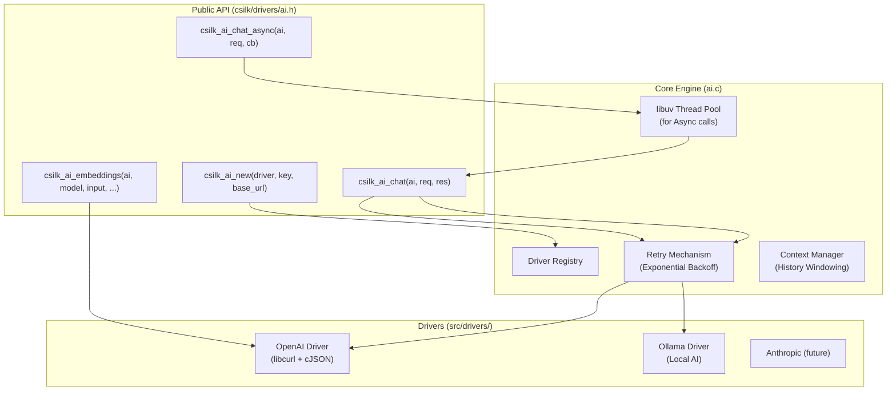

# AI Unified Interface

The AI module provides a provider-agnostic abstraction for integrating Large Language Models (LLMs) and other AI services into Csilk applications.

## Architecture



## Key Features

### 1. Unified Request/Response
Standardized structures for messages, chat completions, and embeddings ensure that your application logic remains decoupled from specific AI providers.

### 2. High-Performance Asynchronous I/O
Web applications should never be blocked by slow AI network calls. Csilk provides `csilk_ai_chat_async`, which leverages the framework's internal `libuv` thread pool to run AI requests in the background.

### 3. Native Streaming (SSE)
Support for Server-Sent Events (SSE) allows for "typewriter-style" real-time output.
- Set `stream = true` in the request.
- Provide an `on_chunk` callback to receive text deltas.

### 4. Function Calling (Tool Use)
Build autonomous agents by defining C function tools that the model can request to execute. Csilk automatically parses model-requested `tool_calls`.

### 5. Automated Robustness
- **Automatic Retry**: Built-in exponential backoff handles transient network errors (502, 503) and Rate Limiting (429).
- **History Management**: `csilk_ai_context_t` manages a FIFO sliding window for conversation history to respect model token limits.

## Driver Configuration

### OpenAI Driver
- **Name**: `"openai"`
- **Dependencies**: `libcurl`
- **Supported APIs**: Chat Completion, Embeddings, Streaming, Function Calling.

### Ollama Driver
- **Name**: `"ollama"`
- **Purpose**: Local private LLM integration.
- **Default Base URL**: `http://localhost:11434`

## Usage Example (Async Chat)

```c
void on_chat_complete(int status, csilk_ai_chat_response_t* res, void* data) {
    if (status == 0) {
        printf("AI: %s\n", res->content);
    }
    csilk_ai_chat_response_free(res);
}

// ... inside a handler ...
csilk_ai_t* ai = csilk_ai_new("openai", key, NULL);
csilk_ai_chat_request_t req = { .model = "gpt-4", .messages = msgs, .message_count = 1 };

csilk_ai_chat_async(ai, &req, on_chat_complete, NULL);
```

## Usage Example (Function Calling)

```c
csilk_ai_tool_t tools[] = {
    { .type = "function", .function = { .name = "get_weather", .description = "..." } }
};

req.tools = tools;
req.tool_count = 1;

csilk_ai_chat(ai, &req, &res);

if (res.tool_call_count > 0) {
    // Model wants to call a function!
    execute_local_function(res.tool_calls[0].name, res.tool_calls[0].arguments);
}
```
