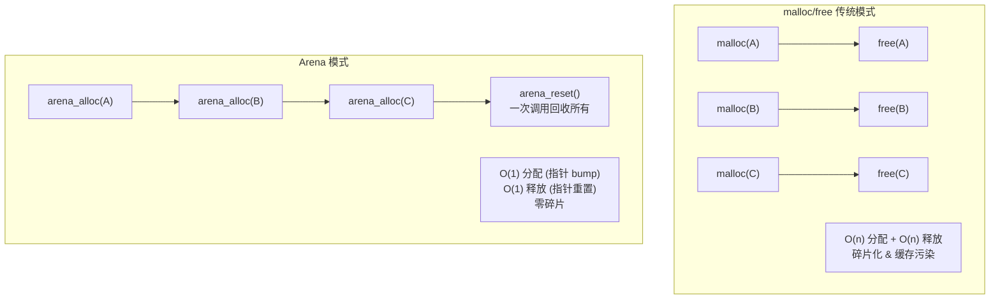
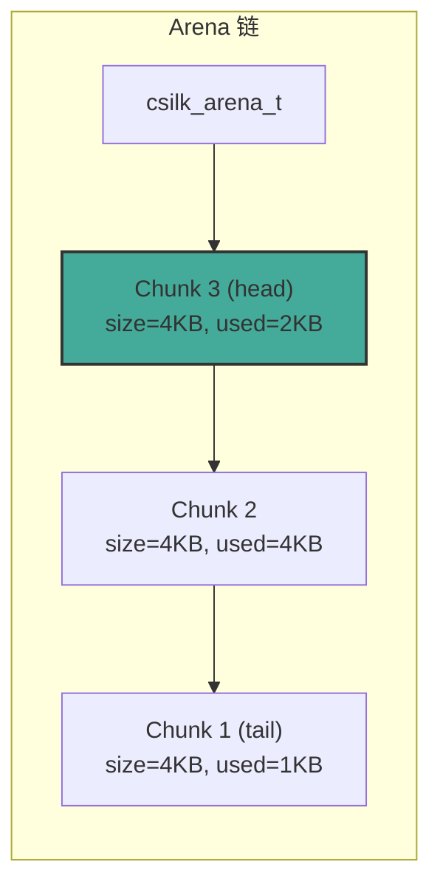
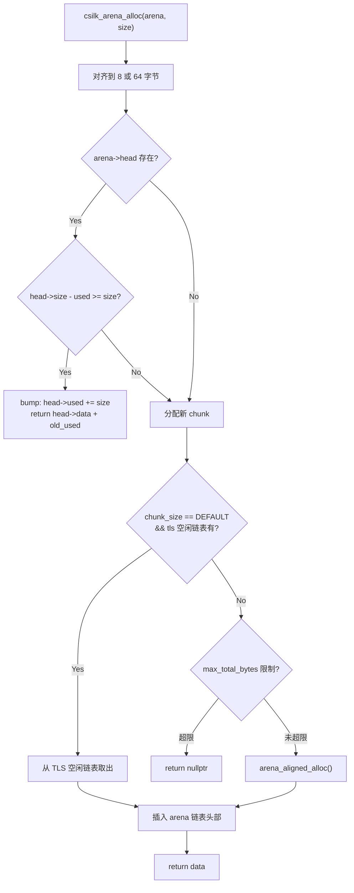
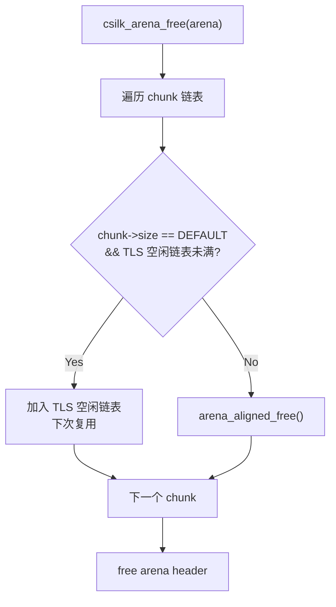
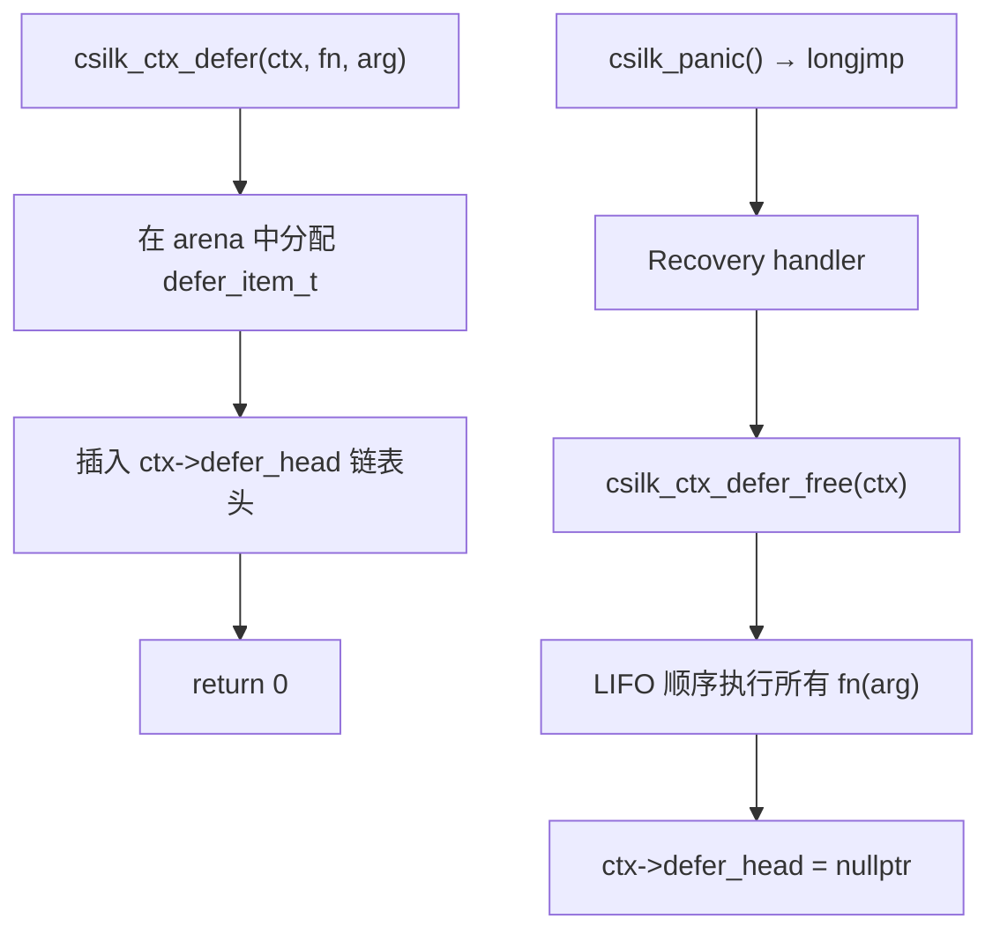
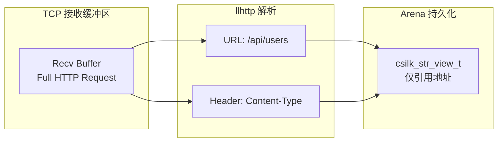

# Arena Allocator Design

> **Version**: 0.5.0-dev | **Last updated**: 2026-06-27

csilk 的 Arena Allocator（竞技场分配器）是整个框架零拷贝内存模型的基石。它通过 bump 指针分配和批量释放策略，消除了逐次 malloc/free 带来的碎片化和性能开销。

---

## 1. 设计哲学

**核心原则**：不在单个分配粒度上管理生命周期，而是在请求粒度上一次性回收所有内存。



### 优点

| 特性 | 说明 |
|------|------|
| **O(1) 分配** | 仅需检查剩余空间并移动指针，无空闲链表搜索 |
| **零碎片** | 连续分配，不存在释放空洞 |
| **缓存友好** | 顺序访问模式，CPU cache miss 率低 |
| **跨 panic 安全** | 结合 `setjmp/longjmp` 恢复机制，panic 后 arena 仍可回收 |
| **零拷贝支持** | HTTP 头部直接引用接收缓冲区，仅需记录在 arena 中 |

---

## 2. 核心数据结构

### 2.1 Arena 结构 (`csilk_arena_t`)

```c
typedef struct csilk_arena_s {
    csilk_arena_chunk_t* head;     // 块链表头（最新分配的块）
    size_t default_chunk_size;     // 新块的默认大小
    int align_64;                  // 是否启用 64 字节对齐
    size_t max_total_bytes;        // 最大总字节数 (0 = 不限)
    size_t total_allocated;        // 自上次 reset 后的总分配量
} csilk_arena_t;
```

### 2.2 块结构 (`csilk_arena_chunk_t`)

```c
typedef struct csilk_arena_chunk_s {
    struct csilk_arena_chunk_s* next;  // 下一个块（单向链表）
    size_t size;                       // 此块的总大小
    size_t used;                       // 已使用的字节数
    uint8_t data[];                    // 柔性数组成员——实际可用的内存
} csilk_arena_chunk_t;
```

**关键设计细节：**

- 块通过 `arena_aligned_alloc()` 分配，保证 **缓存行对齐**（64 字节），避免不同线程的 arena 头在同一缓存行上产生 false sharing
- 每个块使用柔性数组成员（`data[]`），块头部和数据在同一个分配中
- 新分配的块总是 **插入到链表头部**——所以分配总是在最近使用的块上发生，保持缓存热度



---

## 3. 分配流程



### 3.1 分配入口：`csilk_arena_alloc()`

```c
void* csilk_arena_alloc(csilk_arena_t* arena, size_t size);
```

1. **对齐处理**：默认 8 字节对齐；启用 `align_64` 后为 64 字节（缓存行对齐）
2. **零大小分配**：返回非空哨兵指针 `(void*)1`，避免创建零容量块
3. **快速路径**：当前块（`arena->head`）剩余空间 >= 需求 → 直接 bump
4. **慢速路径**：分配新块，优先从线程本地 TLS 空闲链表复用
5. **OOM 限制**：如果设置了 `max_total_bytes` 且超出，返回 nullptr

### 3.2 字符串辅助函数

```c
char* csilk_arena_strdup(csilk_arena_t* arena, const char* s);
char* csilk_arena_strndup(csilk_arena_t* arena, const char* s, size_t n);
```

标准的字符串复制函数，但使用 arena 代替 malloc。生命周期与 arena 绑定。

---

## 4. 释放与重置

### 4.1 `csilk_arena_free()` — 完全释放



**TLS 分块缓存**：
- 只有 `CSILK_DEFAULT_ARENA_SIZE`（4096 字节）的块会被缓存
- 每线程最多缓存 `MAX_TLS_ARENA_CHUNKS`（16）个块
- 当线程退出时，通过 `pthread_key` 析构函数自动清空（`csilk_arena_flush_free_list()`）

### 4.2 `csilk_arena_reset()` — 轻量重置

```c
void csilk_arena_reset(csilk_arena_t* arena);
```

将所有 chunk 的 `used` 置零。**无系统调用**，不释放任何内存。这是请求间复用的核心操作：

```
calloc + free  = 2 次系统调用
arena_reset    = 1 次指针赋值（per chunk）
```

### 4.3 `csilk_arena_flush_free_list()` — 线程清理

在线程退出时或测试中清空 TLS 空闲链表，配合 `csilk_arena_init()` 注册的 `pthread_key` 析构函数自动执行。

---

## 5. 调试模式

定义 `DEBUG_ARENA` 宏启用红区检测：

```c
// 在用户数据后填充 16 字节 0xBE 模式
arena_fill_redzone(data, chunk_size, alloc_offset);

// 释放时验证红区未被覆盖
arena_check_redzone(data, alloc_size);
```

红区损坏时，`csilk_arena_free()` 会打印错误并 `abort()`。

测试模式（`TEST_OOM`）支持模拟 OOM 失败，用于测试框架：
```c
// 第 N 次分配后失败
g_oom_fail_after = 10;
```

---

## 6. 状态查询

```c
void csilk_arena_get_stats(csilk_arena_t* arena,
                           size_t* total_size,  // 总分配大小
                           size_t* total_used); // 总使用字节数
```

遍历 chunk 链表，统计总大小和使用量。不会释放或修改状态。

---

## 7. 延迟清理（Deferred Cleanup）



**作用**：在 `setjmp/longjmp` 的 panic 恢复路径中安全释放资源。

```c
// 示例：注册文件描述符清理
int fd = open("/path/to/file", O_RDONLY);
if (fd < 0) {
    csilk_json_error(c, 500, "{\"error\":\"cannot open file\"}");
    return;
}
csilk_ctx_defer(c, (void(*)(void*))(intptr_t)close, (void*)(intptr_t)fd);
```

**规范**：
- 注册在 arena 内存中分配，随请求自动回收
- 以 **LIFO**（后进先出）顺序执行
- `csilk_panic()` 触发恢复后自动执行
- 也适用于正常请求结束的清理

---

## 8. 与零拷贝 I/O 的集成



**零拷贝策略**：

1. llhttp 解析回调 **不分配内存**，仅记录 `csilk_str_view_t`（指针 + 长度）引用接收缓冲区
2. 需要跨请求生命周期的头部会被复制到 arena 中（`_csilk_persist_header()`）
3. Arena 在请求结束后 `reset()`，所有内存一次性回收

```
普通框架：解析 → malloc每个头部 → 处理 → free每个头部
csilk：   解析 → str_view引用 → 需要时 arena_strdup → arena_reset
```

---

## 9. Worker 级 Arena 池

每个 worker 启动时预分配 `CSILK_CLIENT_POOL_SIZE`（32）个 arena：

```c
void _csilk_worker_init_arena_pool(worker_pool_t* wp) {
    for (int i = 0; i < CSILK_CLIENT_POOL_SIZE; i++) {
        csilk_arena_t* a = csilk_arena_new(CSILK_DEFAULT_ARENA_SIZE);
        // 预分配第一个 chunk，确保热路径总是走 bump
        csilk_arena_alloc(a, 1);
        csilk_arena_reset(a);
        wp->arena_pool[wp->arena_pool_count++] = a;
    }
}
```

- 每个连接创建时从池中取出 arena（`pool_get_arena()`）
- 连接关闭时归还（`pool_put_arena()`）
- **零分配热路径**：在 worker 本地直接取用

---

## 10. 性能特征

| 操作 | 复杂度 | 系统调用 |
|------|--------|----------|
| `csilk_arena_alloc()` 命中缓存块 | O(1) | 0 |
| `csilk_arena_alloc()` 新块 | O(1) | 1 (mmap/malloc) |
| `csilk_arena_strdup()` | O(n) 复制 | 0 |
| `csilk_arena_reset()` | O(k) k=chunk 数 | 0 |
| `csilk_arena_free()` 归还 TLS | O(k) | 0 |
| `csilk_arena_free()` 未缓存 | O(k) | k 次 free |

**典型使用场景**（单请求处理）：

```
arena_new() → 32 allocs → arena_reset() → 20 allocs → arena_free()
```
- 实际系统调用：2 次（初始 + 扩容）
- 等价 malloc/free 模式：52 次 malloc + 52 次 free

---

## 11. 关键文件参考

| 文件 | 职责 |
|------|------|
| `src/core/arena.c` | Arena 分配器：创建、分配、重置、释放、TLS 缓存 |
| `src/core/ctx_defer.c` | 延迟清理注册与执行 (`csilk_ctx_defer`) |
| `src/core/connection.c` | Worker 级 arena 池初始化 (`_csilk_worker_init_arena_pool`) |
| `src/core/srv_internal.h` | `worker_pool_t` 定义（包含 arena_pool 数组） |
| `src/core/ctx_internal.h` | `csilk_ctx_t` 定义（包含 `arena` 和 `defer_head`） |
