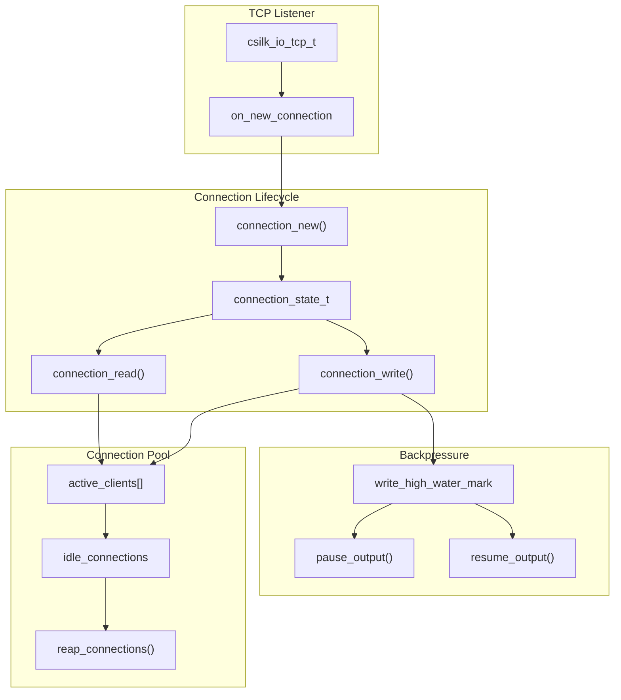
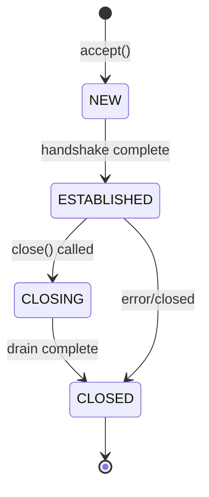

# 连接管理深度解析

> **Version**: 0.5.0 | **Last updated**: 2026-08-21

csilk 的连接管理系统负责 TCP 连接的接受、维护、复用和关闭。

---

## 1. 架构概览



---

## 2. 连接结构

```c
typedef struct csilk_client_s {
    // IO 句柄
    csilk_io_stream_t stream;
    csilk_io_tcp_t* tcp;
    
    // 生命周期
    uint64_t generation;
    connection_state_t state;
    
    // 内存
    csilk_arena_t* arena;
    csilk_buf_t* read_buf;
    
    // Worker 归属
    worker_pool_t* owner_pool;
    int worker_index;
    
    // 背压控制
    size_t write_queue_size;
    bool output_paused;
} csilk_client_t;
```

---

## 3. 状态机

```c
typedef enum connection_state_e {
    CONNECTION_STATE_NEW = 0,
    CONNECTION_STATE_ESTABLISHED,
    CONNECTION_STATE_CLOSING,
    CONNECTION_STATE_CLOSED
} connection_state_t;
```



---

## 4. 连接接受

```c
static void on_new_connection(csilk_io_tcp_t* server_handle, int status) {
    if (status < 0) return;
    
    worker_pool_t* wp = server_handle->data;
    csilk_server_t* server = wp->server;
    
    // 检查连接限制
    int active = atomic_load(&wp->active_clients_count);
    if (active >= server->config.max_connections && server->config.max_connections > 0) {
        csilk_io_tcp_close(server_handle, NULL);
        return;
    }
    
    // 创建新连接
    csilk_client_t* client = connection_new(wp, server_handle);
    if (!client) {
        csilk_io_tcp_close(server_handle, NULL);
        return;
    }
    
    // 添加到活跃列表
    atomic_fetch_add(&wp->active_clients_count, 1);
    
    // 设置读取回调
    csilk_io_read((csilk_io_stream_t*)client, on_read);
}
```

---

## 5. 背压控制

```c
ssize_t connection_write(csilk_client_t* client, const void* buf, size_t len) {
    // 检查高水位线
    if (client->write_queue_size >= client->config.write_high_water_mark) {
        if (!client->output_paused) {
            client->output_paused = true;
            csilk_on_drain(client);
        }
        return 0;
    }
    
    // 追加到队列
    output_queue_push(&client->output, buf, len);
    client->write_queue_size += len;
    
    connection_flush_output(client);
    return len;
}

static void on_write_done(csilk_client_t* client, ssize_t written) {
    client->write_queue_size -= written;
    
    // 检查低水位线
    if (client->output_paused && 
        client->write_queue_size < client->config.write_low_water_mark) {
        client->output_paused = false;
        csilk_on_resume(client);
    }
}
```

**默认水位线**:
- 高水位: 128 KB
- 低水位: 64 KB

---

## 6. Keep-alive 复用

```c
static void connection_finish_request(csilk_client_t* client) {
    // 清理请求资源
    csilk_ctx_cleanup(client->ctx);
    
    // 检查是否保持连接
    bool keep_alive = 
        !llhttp_was_upgrade(&client->http_parser) &&
        !client->close_after_response &&
        client->write_queue_size == 0;
    
    if (keep_alive) {
        csilk_buf_reset(client->read_buf);
        csilk_io_read((csilk_io_stream_t*)client, on_read);
    } else {
        connection_close(client, CSILK_CONN_CLOSE_GRACEFUL);
    }
}
```

---

## 7. 连接池管理

```c
typedef struct worker_pool_s {
    csilk_client_t** active_clients;
    int active_clients_count;
    int active_clients_capacity;
    
    csilk_client_t** idle_clients;
    int idle_clients_count;
    
    csilk_arena_t* arena_pool;
    csilk_buf_pool_t* read_buf_pool;
} worker_pool_t;
```

---

## 8. 参考文件

| 文件 | 作用 |
|------|------|
| `src/core/server/connection.c` | 连接创建/销毁 |
| `src/core/server/connection_state.c` | 状态机管理 |
| `src/core/server/connection_io.c` | IO 读写处理 |
| `src/core/server/connection_pool.c` | 连接池管理 |
| `src/core/server/connection_close.c` | 关闭流程 |
