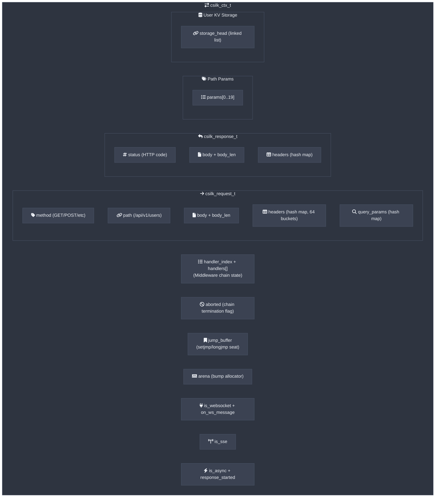
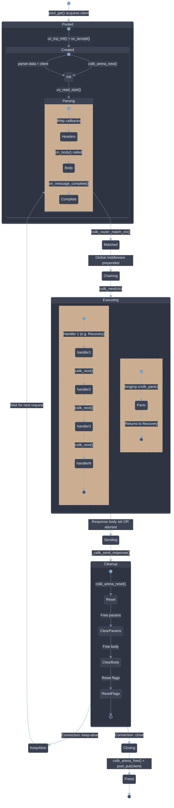
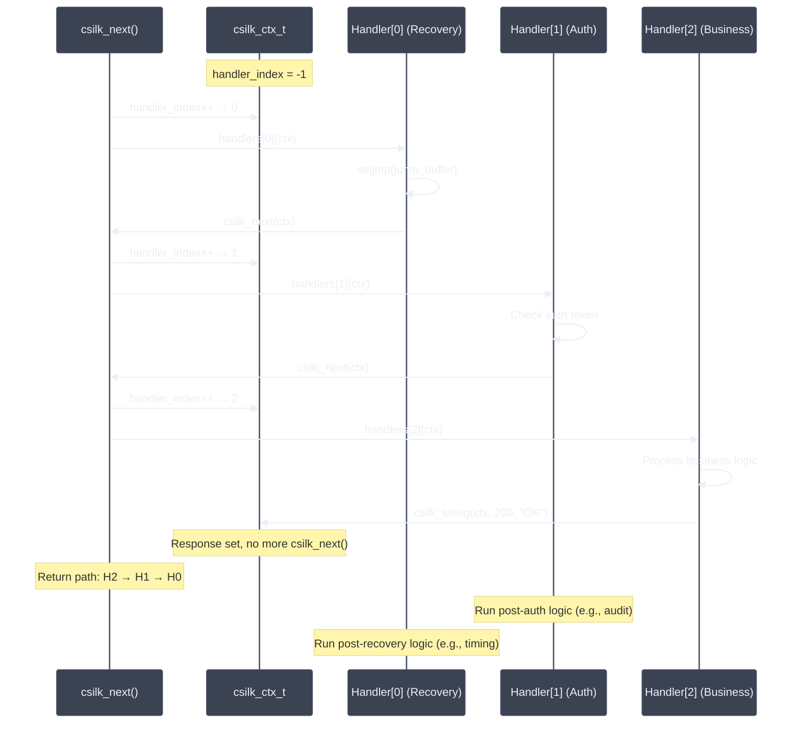
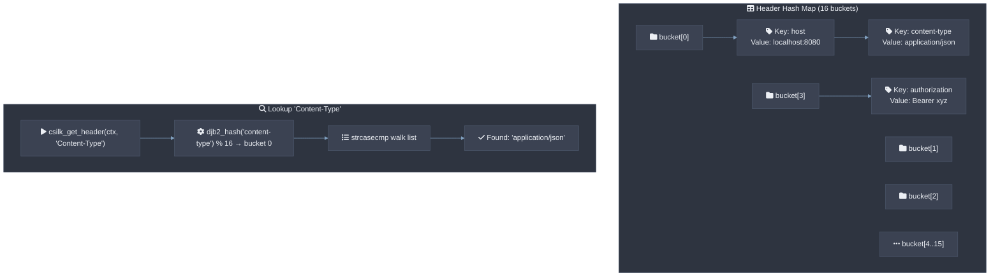

# Context Design

The `csilk_ctx_t` (request context) is the central object in csilk. It carries the request state, response buffer, handler chain, WebSocket callbacks, and an Arena allocator across the entire request lifecycle. All HTTP headers use **zero-copy** `csilk_str_view_t` references into raw recv buffers — no `malloc` per header. Context is reset between keep-alive requests in O(1) via arena pointer bump. Users **MUST NOT** hold `csilk_str_view_t` pointers across requests; data **SHOULD** be persisted via `csilk_arena_strdup()` if needed beyond the current request lifecycle.

## Context Structure



## Context Lifecycle



### Multi-Thread Safety

In multi-worker mode (configured via `worker_threads > 1`), csilk uses a **per-worker lock-free connection object pool** (`pool_get`/`pool_put`) that avoids mutex contention. Each worker thread manages its own pool, eliminating the data race previously present in the shared-mutex pool design.

## Handler Chain Execution

The handler chain uses a simple index-based iterator pattern:



## Header Hash Map

Headers use a case-insensitive DJB2 hash map with 16 fixed buckets and chaining:



## Response Generation Flow

```mermaid
%%{init: {
  'theme': 'base',
  'themeVariables': {
    'background': '#2E3440',
    'primaryColor': '#81A1C1',
    'primaryBorderColor': '#4C566A',
    'primaryTextColor': '#ECEFF4',
    'secondaryColor': '#3B4252',
    'secondaryBorderColor': '#434C5E',
    'secondaryTextColor': '#D8DEE9',
    'lineColor': '#81A1C1',
    'textColor': '#ECEFF4',
    'mainBkg': '#3B4252',
    'nodeBorder': '#4C566A',
    'clusterBkg': '#2E3440',
    'clusterBorder': '#4C566A',
    'titleColor': '#ECEFF4',
    'edgeLabelBackground': '#3B4252',
    'nodeTextColor': '#ECEFF4'
  },
  'flowchart': {'htmlLabels': true, 'curve': 'basis'}
}}%%
flowchart TB
    subgraph sync_resp["fa:fa-bolt Sync Response"]
        SYNC_H["fa:fa-play Handler calls csilk_string/json/redirect"] --> SYNC_SET["fa:fa-cog ctx->response.status = 200\nctx->response.body = 'OK'"]
        SYNC_SET --> SYNC_RET["fa:fa-undo Handler returns without calling csilk_next()"]
        SYNC_RET --> SYNC_SEND["fa:fa-reply _csilk_send_response(ctx)\nSerializes HTTP + headers + body\nuv_write() to socket"]
    end

    subgraph async_resp["fa:fa-cloud Async / Streaming Response"]
        ASYNC_H["fa:fa-play Handler sets ctx->is_async = 1"] --> ASYNC_RET["fa:fa-undo Returns control to libuv"]
        ASYNC_RET --> ASYNC_WAIT["fa:fa-hourglass Later: csilk_response_write()"]
        ASYNC_WAIT --> ASYNC_SEND["fa:fa-file send_chunked_headers() (first call)\nwrite_chunk_frame() (per chunk)\ncsilk_response_end() (terminal chunk)"]
    end

    subgraph ws_resp["fa:fa-plug WebSocket Response"]
        WS_H["fa:fa-play Handler calls csilk_ws_handshake()"] --> WS_101["fa:fa-random Status 101 Switching Protocols\nctx->is_websocket = 1"]
        WS_101 --> WS_READ["fa:fa-sync-alt uv_read_start() continues\nBut parser switches to csilk_ws_parse_frame()"]
    end
```



## Context Cleanup

### Regular Cleanup

Between requests (keep-alive), `csilk_ctx_cleanup()` efficiently resets state:

1. **Free registered read buffers** - All raw network read buffers accumulated during request parsing (and referenced by zero-copy string views) are freed.
2. `csilk_arena_reset()` - O(1) pointer reset; all per-request allocations (including persisted headers and query params) are freed.
3. `free()` path parameters (keys/values).
4. `free()` request body (if it was copied/allocated, otherwise it was zero-copy referenced and freed in step 1).
5. `free()` request path.
6. `memset()` header/query/response maps to zero.
7. Reset all flags: `aborted`, `is_websocket`, `is_sse`, `is_async`, `response_started`.
8. Reset `handler_index = -1`, `storage_head = NULL`, and `read_buffers_count = 0`.

### Deferred Cleanup (Panic-Safe)

The deferred cleanup API (`csilk_ctx_defer` / `csilk_ctx_defer_free`) protects against resource leaks across `setjmp`/`longjmp` boundaries. When a handler panics via `csilk_panic`, stack unwinding is skipped via `longjmp`, so heap allocations, open file descriptors, and mutex locks held by the handler would normally leak. The deferred cleanup list is processed in LIFO order before arena reset, ensuring all registered cleanup callbacks are invoked even on panic paths:

```c
char* buf = malloc(1024);
csilk_ctx_defer(c, free, buf);       // free(buf) called on cleanup or panic
csilk_ctx_defer(c, close, &fd);      // close(fd) called on cleanup or panic
csilk_ctx_defer(c, uv_mutex_unlock, &mutex);  // unlock called on cleanup or panic
```

Items are arena-allocated and auto-freed on arena reset. Callbacks are invoked automatically by `csilk_ctx_cleanup` and by the panic recovery path.
