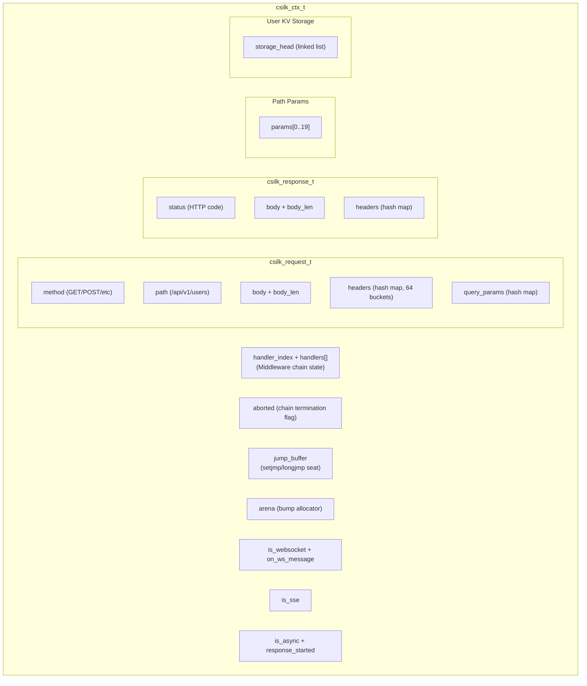
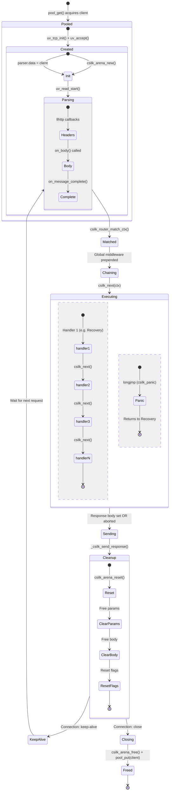
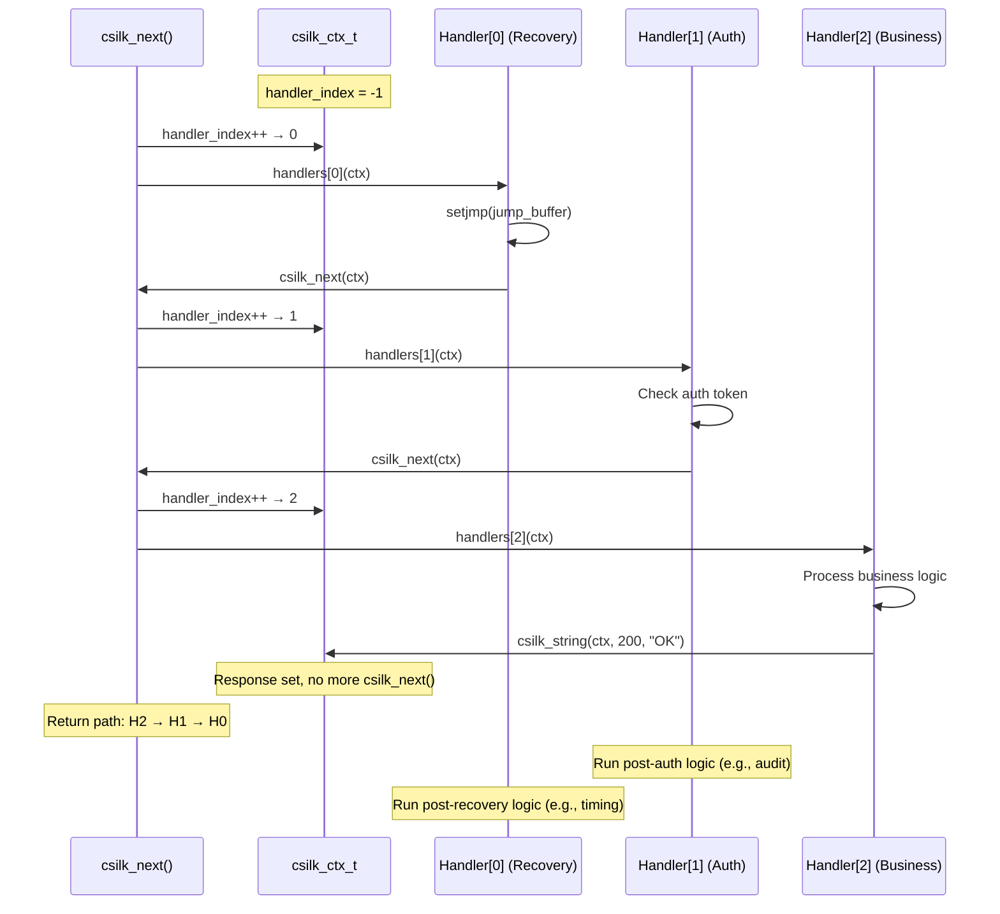
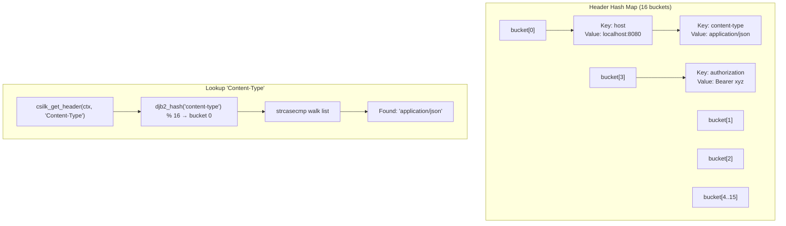

# Context Design

The `csilk_ctx_t` (request context) is the central object in csilk. It carries the request state, response buffer, handler chain, WebSocket callbacks, and an Arena allocator across the entire request lifecycle.

## Context Structure



## Context Lifecycle



### Multi-Thread Safety

In multi-worker mode (configured via `worker_threads > 1`), csilk uses a **per-worker lock-free connection object pool** (`pool_get`/`pool_put`) that avoids mutex contention. Each worker thread manages its own pool, eliminating the data race previously present in the shared-mutex pool design.

## Handler Chain Execution

The handler chain uses a simple index-based iterator pattern:



## Header Hash Map

Headers use a case-insensitive DJB2 hash map with 16 fixed buckets and chaining:



## Response Generation Flow

```mermaid
flowchart TB
    subgraph "Sync Response"
        SYNC_H["Handler calls csilk_string/json/redirect"] --> SYNC_SET["ctx->response.status = 200\nctx->response.body = 'OK'"]
        SYNC_SET --> SYNC_RET["Handler returns without calling csilk_next()"]
        SYNC_RET --> SYNC_SEND["_csilk_send_response(ctx)\nSerializes HTTP + headers + body\nuv_write() to socket"]
    end

    subgraph "Async / Streaming Response"
        ASYNC_H["Handler sets ctx->is_async = 1"] --> ASYNC_RET["Returns control to libuv"]
        ASYNC_RET --> ASYNC_WAIT["Later: csilk_response_write()"]
        ASYNC_WAIT --> ASYNC_SEND["send_chunked_headers() (first call)\nwrite_chunk_frame() (per chunk)\ncsilk_response_end() (terminal chunk)"]
    end

    subgraph "WebSocket Response"
        WS_H["Handler calls csilk_ws_handshake()"] --> WS_101["Status 101 Switching Protocols\nctx->is_websocket = 1"]
        WS_101 --> WS_READ["uv_read_start() continues\nBut parser switches to csilk_ws_parse_frame()"]
    end
```



## Context Cleanup

### Regular Cleanup

Between requests (keep-alive), `csilk_ctx_cleanup()` efficiently resets state:

1. `csilk_arena_reset()` - O(1) pointer reset; all per-request allocations freed
2. `free()` path parameters (keys/values)
3. `free()` request body
4. `free()` request path
5. `memset()` header/query/response maps to zero
6. Reset all flags: `aborted`, `is_websocket`, `is_sse`, `is_async`, `response_started`
7. Reset `handler_index = -1`, `storage_head = NULL`

### Deferred Cleanup (Panic-Safe)

The deferred cleanup API (`csilk_ctx_defer` / `csilk_ctx_defer_free`) protects against resource leaks across `setjmp`/`longjmp` boundaries. When a handler panics via `csilk_panic`, stack unwinding is skipped via `longjmp`, so heap allocations, open file descriptors, and mutex locks held by the handler would normally leak. The deferred cleanup list is processed in LIFO order before arena reset, ensuring all registered cleanup callbacks are invoked even on panic paths:

```c
char* buf = malloc(1024);
csilk_ctx_defer(c, free, buf);       // free(buf) called on cleanup or panic
csilk_ctx_defer(c, close, &fd);      // close(fd) called on cleanup or panic
csilk_ctx_defer(c, uv_mutex_unlock, &mutex);  // unlock called on cleanup or panic
```

Items are arena-allocated and auto-freed on arena reset. Callbacks are invoked automatically by `csilk_ctx_cleanup` and by the panic recovery path.
