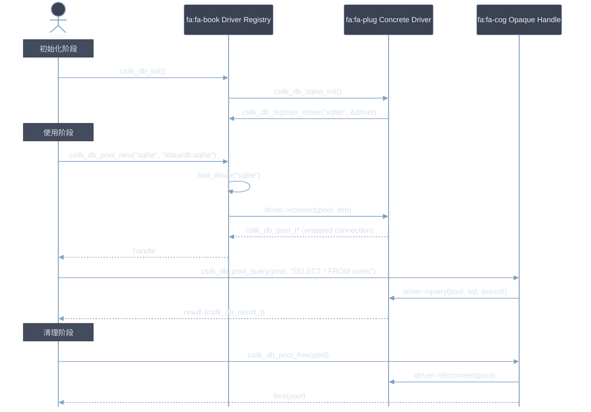

# Drivers Architecture

> **Version**: 0.3.0 | **Last updated**: 2026-06-27

csilk 的 Drivers 层是**可插拔后端抽象**——通过统一的虚函数表（vtable）接口，让 AI、Cipher、DB、Perm、Vector、Crypto、Storage 等功能支持多种后端实现。每种驱动类型都有其独立的注册表、生命周期和查找机制，但遵循相同的"注册 → 查找 → init → 使用 → free"模式。驱动注册 **MUST** 在 `csilk_server_run()` 调用之前完成 —— 运行时注册 **SHOULD** 由热加载机制触发。驱动表查找时间 ≤ 50ns（线性扫描，≤ 64 个已注册驱动）。

---

## 1. 整体架构

```mermaid
%%{init: {'theme': 'base', 'themeVariables': {'background': '#2E3440','primaryColor':'#81A1C1','primaryBorderColor':'#4C566A','primaryTextColor':'#ECEFF4','secondaryColor':'#3B4252','secondaryBorderColor':'#434C5E','secondaryTextColor':'#D8DEE9','lineColor':'#81A1C1','textColor':'#ECEFF4','mainBkg':'#3B4252','nodeBorder':'#4C566A','clusterBkg':'#2E3440','clusterBorder':'#4C566A','titleColor':'#ECEFF4','edgeLabelBackground':'#3B4252','nodeTextColor':'#ECEFF4'}, 'flowchart': {'htmlLabels': true, 'curve': 'basis'}}}%%
graph TB
    subgraph types["fa:fa-plug Driver Types"]
        AI["fa:fa-robot AI Drivers<br/>csilk_ai_driver_t<br/>chat, embeddings"]
        CIPHER["fa:fa-key Cipher Drivers<br/>csilk_cipher_driver_t<br/>encrypt, decrypt, sign, jwt"]
        DB["fa:fa-database DB Drivers<br/>csilk_db_driver_t<br/>connect, query, exec, txn"]
        PERM["fa:fa-shield Perm Drivers<br/>csilk_perm_driver_t<br/>check"]
        VECTOR["fa:fa-search Vector DB Drivers<br/>csilk_vector_db_driver_t<br/>upsert, search"]
        CRYPTO["fa:fa-lock Crypto Drivers<br/>csilk_crypto_driver_t<br/>sha256, hmac, uuid, random"]
        STORAGE["fa:fa-hdd-o Storage Drivers<br/>csilk_storage_driver_t<br/>set, get, incr"]
    end

    subgraph registry["fa:fa-book Registration Pattern"]
        REG["fa:fa-list Global Static Registry<br/>Array[DRIVER_MAX] + count"]
        INIT["fa:fa-rocket Lazy Init on First Use<br/>register built-in defaults"]
        NEW["fa:fa-wrench Factory: * _new(name, ...)<br/>lookup -%gt; driver-&gt;init -%gt; handle"]
        FREE["fa:fa-trash Destructor: * _free(handle)<br/>driver-&gt;free(state) + free"]
    end

    subgraph backends["fa:fa-cogs Built-in Backends"]
        AI_BACKEND["fa:fa-cloud OpenAI, Ollama"]
        DB_BACKEND["fa:fa-database SQLite, MySQL,<br/>PostgreSQL, MongoDB, Redis"]
        PERM_BACKEND["fa:fa-check-circle Simple RBAC"]
        VECTOR_BACKEND["fa:fa-cubes Qdrant, Milvus"]
    end

    REG --> NEW --> FREE
    INIT --> NEW
    AI --> AI_BACKEND
    DB --> DB_BACKEND
    PERM --> PERM_BACKEND
    VECTOR --> VECTOR_BACKEND
    CIPHER --> CRYPTO
```



### 驱动类型一览

| 驱动类型 | 虚表结构体 | 注册函数 | 工厂函数 | 后端数 | 注册位置 |
|----------|-----------|----------|----------|--------|----------|
| AI | `csilk_ai_driver_t` | `csilk_ai_register_driver` | `csilk_ai_new` | 2+ | 懒加载（首次使用） |
| Cipher | `csilk_cipher_driver_t` | 服务器 setter | `csilk_server_set_cipher_driver` | 1 (OpenSSL) | 用户调用 |
| DB | `csilk_db_driver_t` | `csilk_db_register_driver` | `csilk_db_pool_new` | 5 | `csilk_db_init` 显式初始化 |
| Perm | `csilk_perm_driver_t` | `csilk_perm_register_driver` | `csilk_perm_set_default` | 1 (simple) | `csilk_perm_init` 显式初始化 |
| Vector DB | `csilk_vector_db_driver_t` | `csilk_vector_db_register_driver` | `csilk_vector_db_new` | 2+ | 懒加载（首次使用） |
| Crypto | `csilk_crypto_driver_t` | 服务器 setter | `csilk_server_set_crypto_driver` | 1 (OpenSSL) | 用户调用 |
| Storage | `csilk_storage_driver_t` | 服务器 setter | `csilk_server_set_storage_driver` | 1 (Redis) | 用户调用 |

---

## 2. 通用模式

所有驱动类型遵循相同的四阶段生命周期：

### 2.1 注册表

```c
// 示例：AI Driver 注册表
#define MAX_DRIVERS 8
static const csilk_ai_driver_t* g_drivers[MAX_DRIVERS];
static size_t g_driver_count = 0;
```

- 固定大小的静态全局数组 + 计数
- 所有注册操作在数组满时静默忽略（log warning/error）
- 无锁——注册通常发生在单线程启动阶段

### 2.2 注册

```c
void csilk_ai_register_driver(const csilk_ai_driver_t* driver) {
    if (g_driver_count < MAX_DRIVERS) {
        g_drivers[g_driver_count++] = driver;
    }
}
```

- 存储的是 vtable 指针（非拷贝），调用者保证 vtable 的生命周期
- 通常由具体驱动实现的 `*_init_driver()` 函数调用：

```c
void csilk_db_sqlite_init(void) {
    csilk_db_register_driver("sqlite", &csilk_db_sqlite_driver);
}
```

### 2.3 查找

```c
// 线性扫描（最多 MAX_DRIVERS 次 strcmp）
static const csilk_ai_driver_t* find_driver(const char* name) {
    for (size_t i = 0; i < g_driver_count; i++) {
        if (strcmp(g_drivers[i]->name, name) == 0) {
            return g_drivers[i];
        }
    }
    return nullptr;
}
```

### 2.4 延迟初始化（Lazy Init）

大部分驱动子系统在第一次工厂调用时注册内置后端：

```c
csilk_ai_t* csilk_ai_new(const char* driver_name, ...) {
    static int initialized = 0;
    if (!initialized) {
        csilk_ai_openai_init_driver();   // 注册 "openai"
        csilk_ai_ollama_init_driver();   // 注册 "ollama"
        initialized = 1;
    }
    // ... 查找 driver，调用 driver->init(...)
}
```

**例外**：DB 驱动需要用户显式调用 `csilk_db_init()`，因为条件编译（`#ifdef HAS_MYSQL` 等）可能导致某些驱动不可用。

### 2.5 工厂模式

```c
csilk_ai_t* csilk_ai_new(const char* driver_name, const char* api_key, const char* base_url) {
    // 1. Lazy init 默认驱动
    // 2. 查找 driver
    // 3. driver->init(api_key, base_url) → 后端状态
    // 4. 分配 opaque handle，存储 driver vtable + state
    // 5. 返回 handle（失败时清理中间状态）
}
```

### 2.6 销毁

```c
void csilk_ai_free(csilk_ai_t* ai) {
    if (ai) {
        ai->driver->free(ai->driver_state);
        free(ai);
    }
}
```

---

## 3. 各驱动详解

### 3.1 AI Driver

**文件**: `include/csilk/drivers/ai.h` | `src/ai/ai.c` | `src/drivers/ai/`

**虚表**:

```c
typedef struct {
    const char* name;   // "openai", "ollama"
    void* (*init)(const char* api_key, const char* base_url);
    int   (*chat)(void* state, const csilk_ai_chat_request_t* req, csilk_ai_chat_response_t* res);
    int   (*embeddings)(void* state, const char* model, const char** input, size_t count,
                        csilk_ai_embeddings_response_t* res);
    void  (*free)(void* state);
} csilk_ai_driver_t;
```

**内置后端**:
- **OpenAI** (`csilk_ai_openai_init_driver`): HTTP REST API via `libcurl`
- **Ollama** (`csilk_ai_ollama_init_driver`): Local HTTP API

**注册方式**: 懒加载——`csilk_ai_new()` 首次调用时自动注册两个默认驱动。

**数据流**:
```
用户 → csilk_ai_new("openai", key, url) → ai->driver->chat(ai->driver_state, req, res)
                                                                    ↓
                                                     libcurl HTTP POST → OpenAI API
```

### 3.2 Cipher Driver

**文件**: `include/csilk/drivers/cipher.h`

**虚表**:

```c
typedef struct {
    int (*symmetric_encrypt)(key, key_len, plaintext, pt_len, iv, iv_len,
                             ciphertext, *ct_len, tag, tag_len);
    int (*symmetric_decrypt)(...);
    int (*generate_keypair)(pub, *pub_len, priv, *priv_len);
    int (*asymmetric_encrypt)(pub_key, pub_len, plaintext, pt_len, ciphertext, *ct_len);
    int (*asymmetric_decrypt)(priv_key, priv_len, ciphertext, ct_len, plaintext, *pt_len);
    int (*sign)(priv_key, priv_len, data, data_len, signature, *sig_len);
    int (*verify)(pub_key, pub_len, data, data_len, signature, sig_len);
    int (*jwt_sign)(key, key_len, data, data_len, signature, *sig_len, algorithm);
    int (*jwt_verify)(key, key_len, data, data_len, signature, sig_len, algorithm);
} csilk_cipher_driver_t;
```

**注册方式**: 非 registry 模式——直接 set 到 server 实例：
```c
csilk_server_set_cipher_driver(server, &my_cipher_driver);
```

**传递方式**：Cipher driver 引用从 server → context 传播，内置函数通过 `_csilk_symmetric_encrypt` 等间接调用自动分发。

### 3.3 DB Driver

**文件**: `include/csilk/drivers/db.h` | `src/data/db.c` | `src/drivers/*.c`

**虚表**:

```c
struct csilk_db_driver_s {
    const char* name;   // "sqlite", "mysql", "postgres", "mongodb", "redis"
    int (*connect)(csilk_db_pool_t* pool, const char* dsn);
    int (*disconnect)(csilk_db_pool_t* pool);
    int (*query)(csilk_db_pool_t* pool, const char* sql, csilk_db_result_t* result);
    int (*exec)(csilk_db_pool_t* pool, const char* sql);
    int (*transaction_begin)(csilk_db_pool_t* pool);
    int (*transaction_commit)(csilk_db_pool_t* pool);
    int (*transaction_rollback)(csilk_db_pool_t* pool);
    void (*free_result)(csilk_db_result_t* result);
};
```

**连接池** (`csilk_db_pool_t`):
- 单连接模型（非连接池——每个 pool 只有一个底层连接）
- 通过 `csilk_db_pool_get_connection` / `csilk_db_pool_set_connection` 访问 driver-specific 连接句柄
- Mutex-guarded 查询执行

**DSN 格式**（driver 特定）:
- SQLite: 文件路径（`/data/mydb.sqlite`）
- MySQL: `host:port:user:password:dbname`
- PostgreSQL: `host:port:user:password:dbname`
- MongoDB: `mongodb://host:port/dbname`

**条件编译**:
```c
void csilk_db_init(void) {
    csilk_db_sqlite_init();        // 始终可用
    #ifdef HAS_MYSQL
        csilk_db_mysql_init();
    #endif
    #ifdef HAS_POSTGRES
        csilk_db_postgres_init();
    #endif
    // ...
}
```

**结果转换**：查询结果通过 `csilk_db_result_to_json()` 转换为 cJSON，供上层处理。

### 3.4 Perm Driver

**文件**: `include/csilk/drivers/perm.h` | `src/security/perm.c`

**虚表**:

```c
struct csilk_perm_driver_s {
    const char* name;  // "simple"
    int (*check)(csilk_ctx_t* c, const char* permission, const char* resource);
};
```

**内置后端**:
- **simple** (`csilk_perm_simple_init`): 内存 RBAC，规则为 `(role, permission, resource)` 三元组
  - `csilk_perm_simple_allow("admin", "write", "orders:123")` 授予权限
  - `csilk_perm_simple_clear()` 清空全规则
  - `csilk_perm_auto_middleware` 自动从路由元数据读取权限声明并检查

**中间件集成**:
```c
// 注册时声明权限
csilk_router_add_perm(router, "GET", "/admin/users", handler, "read", "users:*");

// 自动检查中间件
void csilk_perm_auto_middleware(csilk_ctx_t* c) {
    // 从路由元数据读取 perm_required + perm_resource
    // 调用 csilk_perm_check(c, perm, resource)
    // 拒绝时 → csilk_abort(403)
}
```

### 3.5 Vector DB Driver

**文件**: `include/csilk/drivers/vector.h` | `src/drivers/vector/vector.c`

**虚表**:

```c
typedef struct {
    const char* name;  // "qdrant", "milvus"
    void* (*init)(const char* endpoint, const char* api_key);
    int   (*upsert)(void* state, const char* collection,
                    const csilk_vector_point_t* points, size_t count);
    int   (*search)(void* state, const char* collection,
                    const float* vector, size_t dimension, int limit,
                    csilk_vector_search_response_t* res);
    void  (*free)(void* state);
} csilk_vector_db_driver_t;
```

**内置后端**:
- Qdrant (`csilk_vector_qdrant_init`)
- Milvus (`csilk_vector_milvus_init`)

**注册方式**: 懒加载——`csilk_vector_db_new()` 首次调用时注册两个默认驱动。

### 3.6 Crypto Driver

**文件**: `include/csilk/types.h`

**虚表**:

```c
typedef struct {
    void (*sha256)(const uint8_t* data, size_t len, uint8_t out[32]);
    void (*hmac_sha256)(const uint8_t* key, size_t key_len,
                        const uint8_t* data, size_t data_len, uint8_t out[32]);
    void (*generate_uuid)(char buf[37]);
    int  (*fill_random)(void* out, size_t len);
} csilk_crypto_driver_t;
```

**注册方式**: 直接 set 到 server：
```c
csilk_server_set_crypto_driver(server, &csilk_crypto_openssl_driver);
```

**用途**: SHA-256 哈希、HMAC-SHA256、UUID v4 生成、安全随机数。用于 JWT 签名、CSRF token 生成、日志追踪 ID。

### 3.7 Storage Driver

**文件**: `include/csilk/types.h`

**虚表**:

```c
typedef struct {
    void (*set)(csilk_ctx_t* c, const char* key, void* value);
    void* (*get)(csilk_ctx_t* c, const char* key);
    void (*clear)(csilk_ctx_t* c);
    int  (*set_string)(csilk_ctx_t* c, const char* key, const char* value, int ttl_sec);
    char* (*get_string)(csilk_ctx_t* c, const char* key);
    long long (*incr)(csilk_ctx_t* c, const char* key, int ttl_sec);
} csilk_storage_driver_t;
```

**内置实现**: Redis-backed (`csilk_redis_storage_driver_new(pool)`)
- `SET key value` / `GET key` / `DEL key`
- `SET key value EX ttl` (带 TTL)
- `INCR key`（原子递增）
- `FLUSHDB` 被故意省略（共享 Redis 环境风险）

---

## 4. 注册对比

| 特性 | AI / Vector DB | DB | Perm | Cipher / Crypto / Storage |
|------|---------------|-----|------|---------------------------|
| 注册表 | 静态数组 | 静态数组 + mutex | 静态数组 | 无 registry（server 字段） |
| 注册时机 | 懒加载 | 显式 `csilk_db_init()` | 显式 `csilk_perm_init()` | 用户调用 setter |
| 查找 | 线性扫描 | 线性扫描 + mutex | 线性扫描 | 直接通过 server 指针 |
| 工厂模式 | `*_new(name, ...)` | `*_pool_new(name, dsn)` | `*_set_default(name)` | `*_set_*_driver(server, drv)` |
| 后端子 | 2+ 内置 | 5 内置（条件编译） | 1 内置 | 1 内置（OpenSSL 软件实现） |

**为什么有差异？**
- **Registry 模式**（AI, DB, Perm, Vector）：支持多个后端共存，运行时按名称选择
- **Server setter 模式**（Cipher, Crypto, Storage）：没有"按名称选择"的需求，通常只有一个全局实现；直接在 server 结构体上存储指针更简单，避免了不必要的抽象

---

## 5. 条件编译

DB 驱动使用条件编译以最小化二进制体积：

```cmake
# CMakeLists.txt
option(HAS_MYSQL "Build with MySQL support" ON)
if(HAS_MYSQL)
    target_sources(csilk PRIVATE src/drivers/mysql.c)
    target_compile_definitions(csilk PRIVATE HAS_MYSQL)
endif()
```

```c
// src/data/db.c
void csilk_db_init(void) {
    csilk_db_sqlite_init();
#ifdef HAS_MYSQL
    csilk_db_mysql_init();
#endif
#ifdef HAS_POSTGRES
    csilk_db_postgres_init();
#endif
#ifdef HAS_MONGODB
    csilk_db_mongodb_init();
#endif
#ifdef HAS_REDIS
    csilk_db_redis_init();
#endif
}
```

AI 驱动（OpenAI 通过 `libcurl`）和 Vector DB 驱动（Qdrant/Milvus）则始终编译，因为它们通过 HTTP API 通信，无强链接依赖。

---

## 6. 生命周期



---

## 7. 相关文件

| 文件 | 角色 |
|------|------|
| `include/csilk/drivers/ai.h` | AI 驱动虚表定义 |
| `include/csilk/drivers/cipher.h` | Cipher 驱动虚表定义 |
| `include/csilk/drivers/db.h` | DB 驱动虚表定义 + 连接池 API |
| `include/csilk/drivers/perm.h` | Perm 驱动虚表定义 + RBAC API |
| `include/csilk/drivers/vector.h` | Vector DB 驱动虚表定义 |
| `include/csilk/types.h` | Crypto 和 Storage 驱动虚表定义 |
| `src/ai/ai.c` | AI 驱动注册表 + 工厂 + `chat`/`embeddings` 封装 |
| `src/data/db.c` | DB 驱动注册表 + 连接池核心 + 结果转换 |
| `src/security/perm.c` | Perm 驱动注册表 + 简单 RBAC 实现 |
| `src/drivers/ai/openai.c` | OpenAI 驱动实现 (libcurl) |
| `src/drivers/ai/ollama.c` | Ollama 驱动实现 (libcurl) |
| `src/drivers/sqlite.c` | SQLite 驱动实现 |
| `src/drivers/mysql.c` | MySQL 驱动实现 |
| `src/drivers/postgres.c` | PostgreSQL 驱动实现 |
| `src/drivers/mongodb.c` | MongoDB 驱动实现 |
| `src/drivers/redis.c` | Redis 驱动实现 + Storage 驱动 |
| `src/drivers/vector/vector.c` | Vector DB 注册表 + 工厂 |
| `src/drivers/vector/qdrant.c` | Qdrant 驱动实现 |
| `src/drivers/vector/milvus.c` | Milvus 驱动实现 |
| `src/core/server.c` | Server setter 函数（crypto/cipher/storage） |
| `docs/module-design/ai.md` | AI 引擎设计文档 |
| `docs/module-design/data.md` | 数据库抽象层设计文档 |
| `docs/module-design/security.md` | 安全/权限设计文档 |

---

## 8. 设计权衡

### 为什么 registry 是固定大小的静态数组而非动态结构？

- **无分配失败**：静态数组在编译时分配，运行时不会 `malloc` 失败
- **无锁初始化**：注册阶段通常发生在单线程启动期，不需要复杂的数据结构
- **简单可靠**：对于最大 8~16 种驱动的场景，线性扫描的开销可忽略
- 如果未来需要大量动态注册，可以用链表或哈希表替换，但当前需求已充分满足

### 为什么有些驱动用 registry、有些用 server setter？

- **Registry 模式**：适合"有多个后端，运行时按名称选择"的场景（AI: OpenAI vs Ollama; DB: SQLite vs MySQL）
- **Server setter 模式**：适合"只有一个全局实现，通常不切换"的场景（Crypto: OpenSSL; Cipher: OpenSSL）。直接将指针存在 server 结构体上避免了额外的间接层

### 为什么 DB 驱动需要显式初始化而 AI 驱动用懒加载？

- DB 驱动依赖条件编译（`#ifdef HAS_MYSQL`），需要在用户可见的初始化点报告哪些驱动可用
- AI 驱动始终编译（`libcurl` 是硬依赖），懒加载更简单且无需用户操心

### 为什么所有 handle 都是 opaque 的？

- 与 `csilk_app_t` 相同的理由：ABI 稳定性、封装安全性、重构自由度
- 用户通过 API 函数与 handle 交互，无法直接访问内部 driver state

### 为什么连接池是单连接非池化？

- csilk 是单线程事件循环模型（libuv），同一时间只有一个协程访问连接
- 单连接避免了同步复杂性和连接池管理开销
- 对于需要多连接的场景，用户可自行创建多个 `csilk_db_pool_t` 实例
