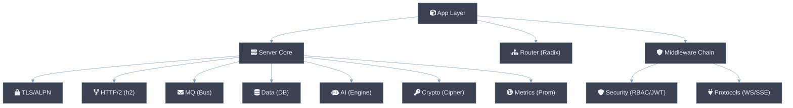

# Module Design Documents

Deep-dive architectural documentation for each core subsystem of csilk.

## Core Engine

| Document | Focus |
|----------|-------|
| [Server Core](server.md) | libuv (default) / io_uring (optional, Linux-only) event loop, TLS/ALPN, HTTP/2, worker pool, graceful shutdown |
| [Router](router.md) | Radix tree (Patricia trie), SIMD-accelerated matching, param extraction |
| [Context](context.md) | Request/response lifecycle, opaque API, deferred cleanup |
| [Arena](arena.md) | Bump allocator, zero-copy headers, SIMD-accelerated memcpy |
| [Hooks](hooks.md) | Server/Connection/Request lifecycle hook system |
| [Reflection](reflection.md) | Runtime type introspection, JSON binding |

## App & Middleware

| Document | Focus |
|----------|-------|
| [App Layer](app.md) | `csilk_app_t` facade, bootstrap sequence, route group matching, admin dashboard, workflow engine |
| [Middleware](middleware.md) | Onion model, chain assembly, 16 built-in middleware modules |

## Protocols & Messaging

| Document | Focus |
|----------|-------|
| [Protocols](protocols.md) | WebSocket, SSE, Swagger UI, WebSocket Rooms |
| [Messaging](messaging.md) | Event bus, pub/sub, `uv_async_t` dispatch, WAL persistence |

## Data & AI

| Document | Focus |
|----------|-------|
| [Data](data.md) | DB abstraction, pluggable drivers, connection pool, cJSON results |
| [AI Engine](ai.md) | Unified chat/embeddings, tool calls, streaming |
| [Workflow](workflow.md) | DAG scheduler, hot reload, WAL resume, interactive nodes |
| [Drivers](drivers.md) | AI/Cipher/DB/Perm/Vector DB pluggable driver lifecycle |

## Security & Cryptography

| Document | Focus |
|----------|-------|
| [Security](security.md) | RBAC, JWT, CSRF, CORS, WAF, rate limiter |
| [Crypto](crypto.md) | SHA-256, HMAC, UUID, random number generation |

## Observability

| Document | Focus |
|----------|-------|
| [Metrics](metrics.md) | Prometheus exposition, lock-free counters, latency histograms |

---

## How to Read

1. Start with **Server Core** and **Context** for the foundation.
2. Read **Router** and **Middleware** to understand how requests flow.
3. Choose deeper docs based on your focus area (data, AI, security, protocols).

## Relationship Overview

See also: [Architecture Overview](../architecture.md), [Getting Started](../getting-started.md).
