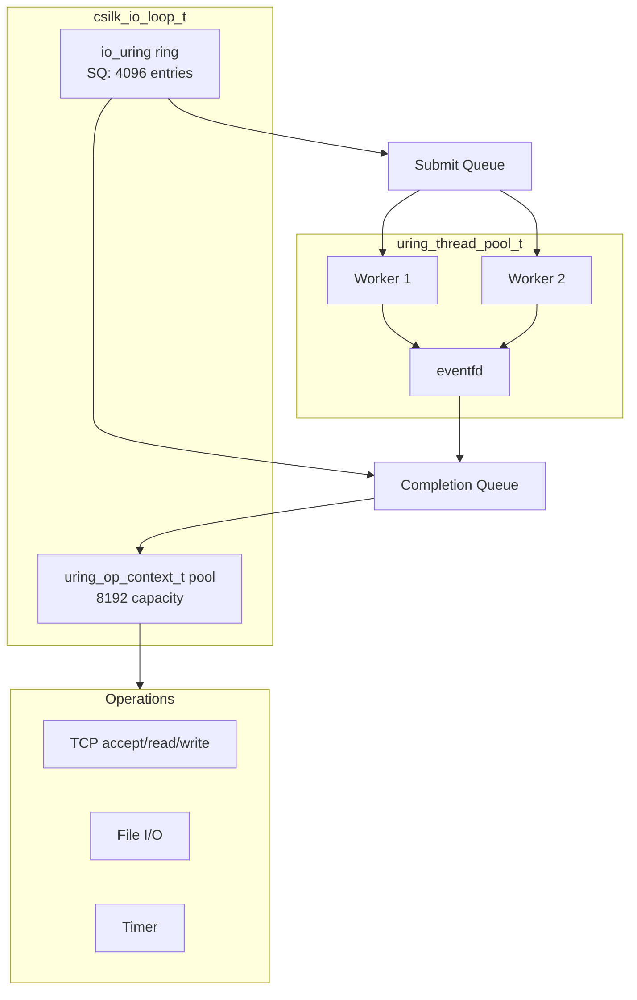
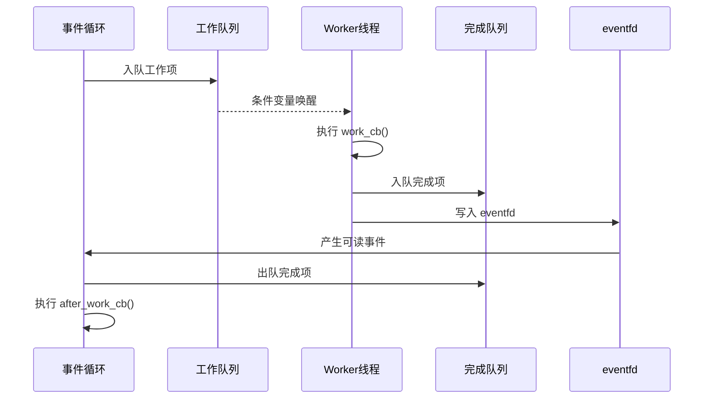

# io_uring 后端深度解析

> **Version**: 0.4.0 | **Last updated**: 2026-08-21

csilk 的 io_uring 后端是 Linux 原生异步 I/O 的高性能实现，提供超越 libuv 的极低延迟和更高吞吐量。

---

## 1. 架构概览



---

## 2. 核心数据结构

### 2.1 io_uring 事件循环

```c
typedef struct csilk_io_loop_s {
    struct io_uring ring;              // io_uring 底层 ring
    
    // 操作上下文池 (根据 ring entries 自适应等比分配)
    uring_op_context_t* op_pool;
    uint32_t* op_free_stack;
    uint32_t op_free_head;
    uint32_t op_pool_capacity;         // entries * 2 (例如 2048)
    
    int stop_flag;
    uint64_t now_cache;
} csilk_io_loop_t;
```

### 2.2 操作上下文

```c
typedef struct uring_op_context_s {
    uint32_t slot_idx;       // 在 op_pool 中的索引
    uint64_t generation;     // 世代编号，防陈旧回调
    uint16_t type;           // 操作类型
    uint16_t flags;
    void* owner;             // 所有者
    void* data;              // 附加数据
} uring_op_context_t;
```

---

## 3. 事件循环流程

### 3.1 初始化 (自适应阶梯与资源回退)

```c
int csilk_io_loop_init(csilk_io_loop_t* loop) {
    if (!loop) return -1;
    memset(loop, 0, sizeof(*loop));

    // 1. 自适应阶梯降级初始化 (1024 -> 512 -> 256 -> 128 -> 64)，适应受限 RLIMIT_MEMLOCK 环境
    int entries = 1024;
    int rc = -1;
    while (entries >= 64) {
        rc = io_uring_queue_init((unsigned)entries, &loop->ring, 0);
        if (rc == 0) break;
        entries /= 2;
    }
    if (rc < 0) return rc;
    
    // 2. 等比分配操作上下文池
    loop->op_pool_capacity = (uint32_t)(entries * 2);
    loop->op_pool = calloc(loop->op_pool_capacity, sizeof(uring_op_context_t));
    loop->op_free_stack = malloc(loop->op_pool_capacity * sizeof(uint32_t));
    
    // 3. 初始化空闲栈
    for (uint32_t i = 0; i < loop->op_pool_capacity; i++) {
        loop->op_free_stack[i] = loop->op_pool_capacity - 1 - i;
        loop->op_pool[i].slot_idx = i;
    }
    loop->op_free_head = loop->op_pool_capacity;
    
    return 0;
}
```

### 3.2 主循环

```c
int csilk_io_run(csilk_io_loop_t* loop, int flags) {
    // 提交待处理的操作
    io_uring_submit(&loop->ring);
    
    // 等待完成事件
    struct io_uring_cqe* cqe;
    int ret = io_uring_wait_cqe(&loop->ring, &cqe);
    
    if (ret == 0) {
        uring_process_cqe(loop, cqe);
        io_uring_cqe_advance(&loop->ring, cqe);
    }
    
    // NOWAIT 模式批量处理
    if (flags & CSILK_IO_RUN_NOWAIT) {
        while (io_uring_peek_cqe(&loop->ring, &cqe) == 0) {
            uring_process_cqe(loop, cqe);
            io_uring_cqe_advance(&loop->ring, cqe);
        }
    }
    
    return ret;
}
```

---

## 4. Generation 追踪机制

### 4.1 问题背景

io_uring 使用 `user_data` 关联提交和完成。handle 复用时，旧完成事件可能在新生命周期内到达。

### 4.2 解决方案

```c
// 每次提交递增 generation
void csilk_io_timer_start(csilk_io_timer_t* tmr, ...) {
    tmr->generation++;  // 递增世代
    
    uring_op_context_t* ctx = uring_op_alloc(loop);
    ctx->generation = tmr->generation;
    
    __u64 user_data = (__u64)(uintptr_t)ctx;
    io_uring_prep_timeout(&sqe, ...);
    io_uring_submit_sqe(ring, sqe, user_data);
}

// 完成回调验证
static void on_timer_complete(csilk_io_loop_t* loop, struct io_uring_cqe* cqe) {
    uring_op_context_t* ctx = (uring_op_context_t*)(uintptr_t)cqe->user_data;
    csilk_io_timer_t* tmr = (csilk_io_timer_t*)ctx->owner;
    
    if (tmr->generation != ctx->generation) {
        // 陈旧完成，忽略
        uring_op_free(loop, ctx);
        return;
    }
    
    tmr->cb(tmr);
    uring_op_free(loop, ctx);
}
```

---

## 5. 线程池集成

### 5.1 架构



### 5.2 实现

```c
typedef struct uring_thread_pool_s {
    int thread_count;
    volatile bool running;
    pthread_t* threads;
    
    // 工作队列
    uring_tp_entry_t queue[4096];
    volatile int queue_head, queue_tail;
    csilk_mutex_t queue_mutex;
    csilk_cond_t queue_cond;
    
    // 完成队列
    uring_tp_entry_t done[4096];
    volatile int done_head, done_tail;
    csilk_mutex_t done_mutex;
    
    int wakeup_fd;  // eventfd
} uring_thread_pool_t;
```

---

## 6. 性能基准

| 指标 | 数值 |
|------|------|
| 解码开销 | ~1 ns/op |
| 操作分配 | O(1) |
| 操作回收 | O(1) |
| 线程池延迟 | ~10 μs |

---

## 7. 参考文件

| 文件 | 大小 | 作用 |
|------|------|------|
| `src/core/uring/uring_run.c` | 17KB | 主事件循环 |
| `src/core/uring/uring_internal.h` | 9KB | 内部数据结构 |
| `src/core/uring/uring_thread_pool.c` | 13KB | 线程池实现 |
| `src/core/uring/uring_tcp.c` | 5KB | TCP 操作 |
