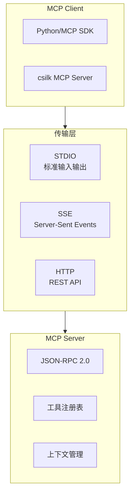
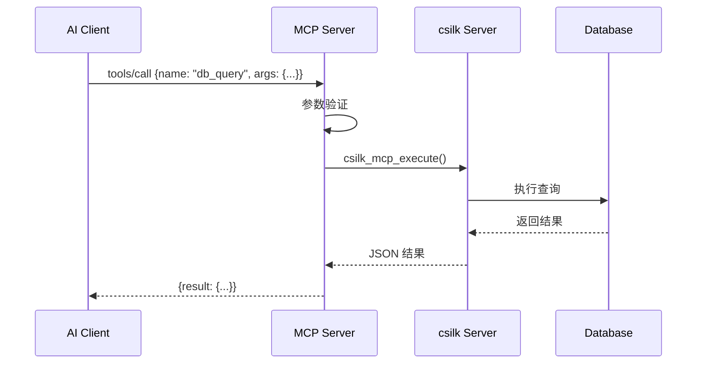

# MCP 协议支持深度解析

> **Version**: 0.5.0 | **Last updated**: 2026-08-21

csilk 支持 Model Context Protocol (MCP)，允许 AI 模型通过标准协议访问外部工具和上下文。本文档深入解析 MCP 传输层、工具注册和客户端实现。

---

## 1. MCP 协议概览



---

## 2. 传输层实现

### 2.1 STDIO 传输

```c
// src/protocols/mcp/mcp_stdio.c
typedef struct csilk_mcp_stdio_s {
    int stdin_fd;
    int stdout_fd;
    FILE* input;
    FILE* output;
    csilk_mcp_session_t* session;
} csilk_mcp_stdio_t;

int csilk_mcp_client_connect_stdio(csilk_mcp_client_t* client, 
                                    const char* command,
                                    char** args) {
    int pipe_in[2], pipe_out[2];
    
    // 创建管道
    pipe(pipe_in);
    pipe(pipe_out);
    
    pid_t pid = fork();
    if (pid == 0) {
        // 子进程: 重定向 IO
        dup2(pipe_in[0], STDIN_FILENO);
        dup2(pipe_out[1], STDOUT_FILENO);
        close(pipe_in[0]);
        close(pipe_out[1]);
        
        execvp(command, args);
        exit(1);
    }
    
    // 父进程
    client->stdin_fd = pipe_out[0];
    client->stdout_fd = pipe_in[1];
    client->pid = pid;
    
    return 0;
}
```

### 2.2 SSE 传输

```c
// src/protocols/mcp/mcp_sse.c
typedef struct csilk_mcp_sse_s {
    csilk_io_loop_t* loop;
    csilk_io_tcp_t* server;
    csilk_mcp_session_t* session;
    csilk_buf_t* buffer;
} csilk_mcp_sse_t;

static void on_sse_connection(csilk_io_tcp_t* handle, int status) {
    csilk_mcp_sse_t* sse = handle->data;
    
    csilk_client_t* client = connection_new(sse->loop, handle);
    client->is_mcp = true;
    client->mcp_session = sse->session;
    
    // 设置 SSE 响应头
    csilk_set_response_header(client->ctx, "Content-Type", "text/event-stream");
    csilk_set_response_header(client->ctx, "Cache-Control", "no-cache");
    csilk_set_response_header(client->ctx, "Connection", "keep-alive");
    
    csilk_io_read((csilk_io_stream_t*)client, on_mcp_message);
}
```

---

## 3. JSON-RPC 2.0 实现

### 3.1 消息格式

```c
// MCP 使用 JSON-RPC 2.0 作为序列化协议
typedef struct csilk_mcp_jsonrpc_s {
    char* jsonrpc;        // "2.0"
    char* method;         // 方法名
    union {
        cJSON* params;    // 参数
        void* empty;
    } u;
    cJSON* id;            // 请求 ID
    
    // 响应字段
    cJSON* result;
    struct {
        int code;
        char* message;
    } error;
} csilk_mcp_jsonrpc_t;
```

### 3.2 请求处理

```c
static void on_mcp_request(csilk_mcp_session_t* session, 
                            const char* json, size_t len) {
    cJSON* root = cJSON_Parse(json);
    if (!root) return;
    
    csilk_mcp_jsonrpc_t* req = calloc(1, sizeof(csilk_mcp_jsonrpc_t));
    req->jsonrpc = cJSON_GetStringValue(cJSON_GetObjectItem(root, "jsonrpc"));
    req->method = cJSON_GetStringValue(cJSON_GetObjectItem(root, "method"));
    req->params = cJSON_GetObjectItem(root, "params");
    req->id = cJSON_GetObjectItem(root, "id");
    
    // 分发到处理器
    if (strcmp(req->method, "initialize") == 0) {
        mcp_handle_initialize(session, req);
    } else if (strcmp(req->method, "tools/list") == 0) {
        mcp_handle_tools_list(session, req);
    } else if (strcmp(req->method, "tools/call") == 0) {
        mcp_handle_tools_call(session, req);
    }
    
    cJSON_Delete(root);
    free(req);
}
```

---

## 4. 工具注册

### 4.1 工具描述

```c
typedef struct csilk_mcp_tool_s {
    char* name;                    // 工具名称
    char* description;             // 工具描述
    cJSON* input_schema;           // JSON Schema 参数定义
    
    // 回调
    int (*execute)(csilk_mcp_session_t* session,
                   csilk_mcp_tool_call_t* call,
                   cJSON** result);
    
    // 元数据
    void* user_data;
    void (*free)(void* data);
} csilk_mcp_tool_t;
```

### 4.2 工具注册 API

```c
int csilk_mcp_register_tool(csilk_mcp_session_t* session,
                             const char* name,
                             const char* description,
                             cJSON* schema,
                             mcp_tool_callback_t callback,
                             void* user_data) {
    csilk_mcp_tool_t* tool = calloc(1, sizeof(csilk_mcp_tool_t));
    tool->name = strdup(name);
    tool->description = strdup(description);
    tool->input_schema = schema;
    tool->execute = callback;
    tool->user_data = user_data;
    
    // 添加到工具列表
    cJSON_AddItemToArray(session->tools, cJSON_CreateStringReference(name));
    
    return 0;
}

// 示例：注册数据库查询工具
void register_db_tools(csilk_mcp_session_t* session) {
    cJSON* schema = cJSON_ParseString("{\"type\":\"object\","
        "\"properties\":{"
            "\"query\":{\"type\":\"string\"},"
            \"limit\":{\"type\":\"integer\"}"
        "},\"required\":[\"query\"]}");
    
    csilk_mcp_register_tool(session,
        "db_query",
        "Execute a database query",
        schema,
        db_query_callback,
        NULL);
}
```

---

## 5. 工具调用流程



### 5.1 调用处理器

```c
static void mcp_handle_tools_call(csilk_mcp_session_t* session,
                                   csilk_mcp_jsonrpc_t* req) {
    cJSON* name = cJSON_GetObjectItem(req->params, "name");
    cJSON* arguments = cJSON_GetObjectItem(req->params, "arguments");
    
    // 查找工具
    csilk_mcp_tool_t* tool = mcp_find_tool(session, cJSON_GetStringValue(name));
    if (!tool) {
        mcp_send_error(req->id, -32601, "Tool not found");
        return;
    }
    
    // 执行工具
    cJSON* result = NULL;
    int ret = tool->execute(session, tool, arguments, &result);
    
    if (ret == 0) {
        mcp_send_response(req->id, result);
    } else {
        mcp_send_error(req->id, ret, "Tool execution failed");
    }
}
```

---

## 6. 与 csilk 集成

### 6.1 路由注册

```c
// 在 csilk 应用中注册 MCP 端点
void csilk_app_mcp_init(csilk_app_t* app) {
    // STDIO 模式 (用于 CLI 工具)
    csilk_mcp_stdio_t* stdio = csilk_mcp_stdio_new();
    csilk_mcp_session_t* session = csilk_mcp_session_new(stdio);
    
    // 注册工具
    register_db_tools(session);
    register_ai_tools(session);
    
    // SSE 模式 (用于 Web 客户端)
    csilk_mcp_sse_t* sse = csilk_mcp_sse_new(app->loop);
    csilk_app_register_route(app, "POST", "/mcp", mcp_sse_handler);
}
```

### 6.2 请求处理

```c
static void mcp_sse_handler(csilk_ctx_t* c) {
    csilk_mcp_sse_t* sse = c->app->mcp_sse;
    
    // 检查是否是 SSE 连接
    if (csilk_get_header(c, "Accept") && 
        strstr(csilk_get_header(c, "Accept"), "text/event-stream")) {
        // 建立 SSE 连接
        connection_sse_upgrade(c, sse->session);
        return;
    }
    
    // 否则处理 JSON-RPC 请求
    const char* body = csilk_get_body_str(c);
    csilk_mcp_session_handle_message(sse->session, body, strlen(body));
    
    csilk_string(c, 200, "OK");
}
```

---

## 7. 安全考虑

### 7.1 工具访问控制

```c
typedef enum {
    MCP_TOOL_PUBLIC,      // 公开访问
    MCP_TOOL_AUTHED,      // 需要认证
    MCP_TOOL_ADMIN        // 仅管理员
} mcp_tool_access_t;

typedef struct csilk_mcp_tool_s {
    // ... 原有字段
    mcp_tool_access_t access;
} csilk_mcp_tool_t;

// 调用前检查权限
if (tool->access == MCP_TOOL_AUTHED && !csilk_is_authenticated(c)) {
    mcp_send_error(req->id, -32000, "Authentication required");
    return;
}
```

### 7.2 速率限制

```c
// MCP 请求速率限制
#define MCP_DEFAULT_RATE_LIMIT 60  // 每分钟 60 次

static bool mcp_check_rate_limit(csilk_mcp_session_t* session, 
                                  const char* client_id) {
    // 使用滑动窗口限流
    return csilk_sliding_limiter_check(session->rate_limiter, client_id);
}
```

---

## 8. 性能优化

### 8.1 批处理

```c
// 批量工具调用
typedef struct {
    cJSON* id;
    char* tool_name;
    cJSON* arguments;
} mcp_batch_call_t;

static void mcp_handle_batch_call(csilk_mcp_session_t* session,
                                   cJSON* calls) {
    cJSON_ArrayForEach(call, calls) {
        mcp_handle_tools_call(session, call);
    }
}
```

### 8.2 结果缓存

```c
// 工具结果缓存
typedef struct {
    char* key;
    cJSON* result;
    time_t expires;
} mcp_cache_entry_t;

// LRU 缓存实现
csilk_lru_cache_t* mcp_result_cache = NULL;

static cJSON* mcp_cached_execute(csilk_mcp_tool_t* tool, cJSON* args) {
    char* key = mcp_cache_key(tool->name, args);
    cJSON* cached = csilk_lru_cache_get(mcp_result_cache, key);
    
    if (cached) {
        free(key);
        return cached;
    }
    
    cJSON* result = tool->execute(...);
    csilk_lru_cache_set(mcp_result_cache, key, result, 300);  // 5 分钟 TTL
    return result;
}
```

---

## 9. 参考实现

| 文件 | 作用 |
|------|------|
| `src/protocols/mcp/mcp_client.c` | MCP 客户端实现 |
| `src/protocols/mcp/mcp_server.c` | MCP 服务器实现 |
| `src/protocols/mcp/mcp_tools.c` | 工具注册表 |
| `examples/mcp/example_mcp.c` | 使用示例 |
