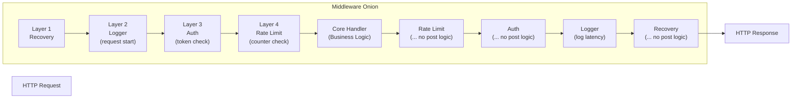
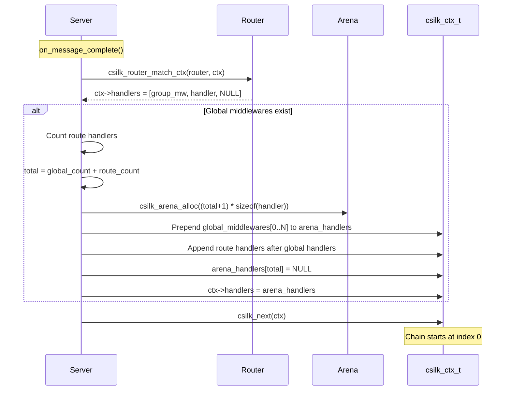
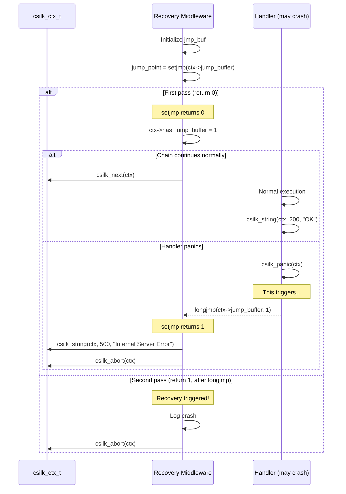
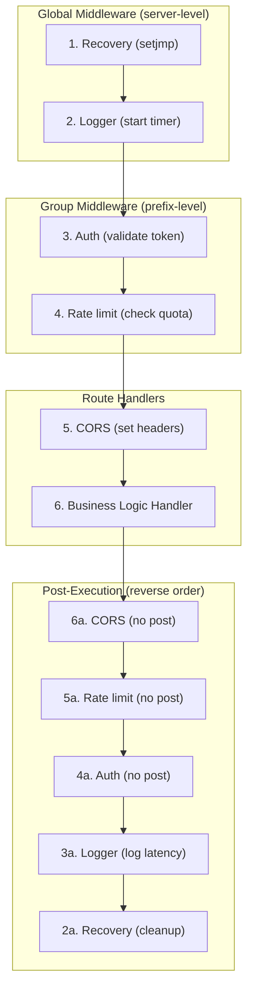

# Middleware Design

Middleware in csilk forms a bidirectional chain following the **onion model**. Each middleware can execute logic both on the way "in" (before `csilk_next()`) and on the way "out" (after `csilk_next()` returns).

## Onion Model

## Handler Chain Assembly

When a route matches, the full handler chain is assembled dynamically:

## Panic Recovery via setjmp/longjmp

## Built-in Middleware Catalog

| Middleware | File | Purpose |
|-----------|------|---------|
| **Recovery** | `src/middleware/recovery.c` | Catch crashes via setjmp/longjmp, return 500 |
| **Logger** | `src/middleware/logger.c` | Log method, path, status, latency |
| **Auth** | `src/middleware/auth.c` | Token-based authentication via validator callback |
| **CORS** | `src/middleware/cors.c` | CORS headers and OPTIONS preflight |
| **Rate Limit** | `src/middleware/ratelimit.c` | IP-based sliding window rate limiting |
| **CSRF** | `src/middleware/csrf.c` | Stateless CSRF token generation and validation |
| **Static Files** | `src/middleware/static.c` | Async static file serving via thread pool |
| **Gzip** | `src/middleware/gzip.c` | Response compression via zlib + thread pool |
| **SSE** | `src/middleware/sse.c` | Server-Sent Events initialization/send/close |
| **Multipart** | `src/middleware/multipart.c` | Multipart/form-data parsing with part callback |

## Middleware Execution Order

