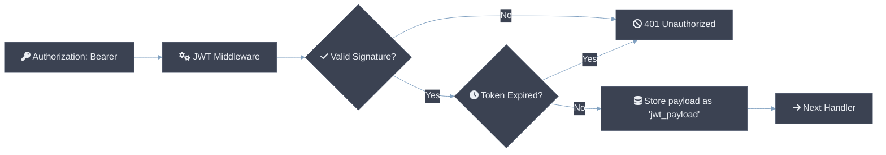

# Middleware Design Overview

csilk ships with 15 built-in middleware handlers covering authentication, security, observability, performance, and developer experience — all with **~0 allocs per request** on the hot path (headers parsed via zero-copy string views into the per-request arena). Middleware **MUST NOT** block the event loop; long-running operations **SHOULD** use the deferred work API or offload to worker threads. Each middleware **MAY** access and modify the request context (`csilk_ctx_t`) through the opaque API (`csilk_get`/`csilk_set`/`csilk_string`). The table below lists all middleware handlers exposed through `csilk/middleware.h`:

| Middleware | File | Description |
|-----------|------|-------------|
| Recovery | `src/core/primitives/recovery.c` | Crash recovery via setjmp/longjmp |
| Logger | `src/middleware/logger.c` | Structured request logging |
| Auth | `src/middleware/auth.c` | Token-based authentication |
| CORS | `src/middleware/cors.c` | Cross-origin resource sharing |
| CSRF | `src/middleware/csrf.c` | Cross-site request forgery protection |
| RateLimit | `src/middleware/ratelimit.c` | Sliding window rate limiting |
| Static | `src/middleware/static.c` | Static file serving with Range support |
| Gzip | `src/middleware/gzip.c` | Response compression |
| SSE | `src/middleware/sse.c` | Server-Sent Events |
| Multipart | `src/middleware/multipart.c` | File upload parsing |
| JWT | `src/middleware/jwt.c` | JSON Web Token auth (HS256) |
| Metrics | `src/middleware/metrics.c` | Prometheus metrics |
| RequestID | `src/middleware/request_id.c` | UUID v4 request tracing |
| Session | `src/middleware/session.c` | Cookie-based session management |
| Validate | `src/middleware/validate.c` | Request parameter validation |
| WAF | `src/middleware/waf.c` | Web Application Firewall (SQLi, XSS, Path Traversal) |

---

# JWT Middleware Design

The JWT (JSON Web Token) middleware provides a secure way to handle stateless authentication in csilk. It follows the HS256 (HMAC with SHA-256) signing algorithm.

## Features

- **HS256 Support**: Uses the framework's internal high-performance HMAC-SHA256 implementation.
- **Base64URL Encoding**: Follows RFC 4648 for URL-safe token transmission.
- **Expiration Validation**: Automatically checks the `exp` claim.
- **Automatic Storage**: Successful verification stores the payload JSON in context storage for easy access.

## Architecture



## API Reference

### 1. Token Generation

```c
char* csilk_jwt_generate(csilk_ctx_t* c, cJSON* payload, const char* secret);
```
- Generates a signed JWT string.
- The caller is responsible for `free()`-ing the returned string.

### 2. Token Verification

```c
cJSON* csilk_jwt_verify(csilk_ctx_t* c, const char* token, const char* secret);
```
- Verifies and parses a token.
- Returns a `cJSON` object of the payload, or `NULL` if verification fails.

### 3. Middleware Usage

```c
void csilk_jwt_middleware(csilk_ctx_t* c, const char* secret);
```

## Integration Example

```c
#include "csilk/csilk.h"

// 1. Issuing a token (e.g., on login)
void login_handler(csilk_ctx_t* c) {
    cJSON* payload = cJSON_CreateObject();
    cJSON_AddStringToObject(payload, "sub", "user_123");
    cJSON_AddNumberToObject(payload, "exp", (double)time(NULL) + 3600);

    char* token = csilk_jwt_generate(c, payload, "my_secret");
    
    cJSON* res = cJSON_CreateObject();
    cJSON_AddStringToObject(res, "token", token);
    csilk_json(c, 200, res);

    free(token);
    cJSON_Delete(payload);
}

// 2. Protecting routes
int main() {
    // ...
    csilk_group_t* api = csilk_group_new(router, "/api");
    csilk_group_use(api, (csilk_handler_t)csilk_jwt_middleware, "my_secret");
    
    csilk_GET(api, "/me", profile_handler);
}
```

## Internal Implementation

The middleware uses a **Pluggable Crypto Driver**. By default, it uses the built-in HMAC-SHA256 implementation located in `src/core/utils.c`. You can replace this with hardware-accelerated or system-provided libraries using `csilk_server_set_crypto_driver()`.
