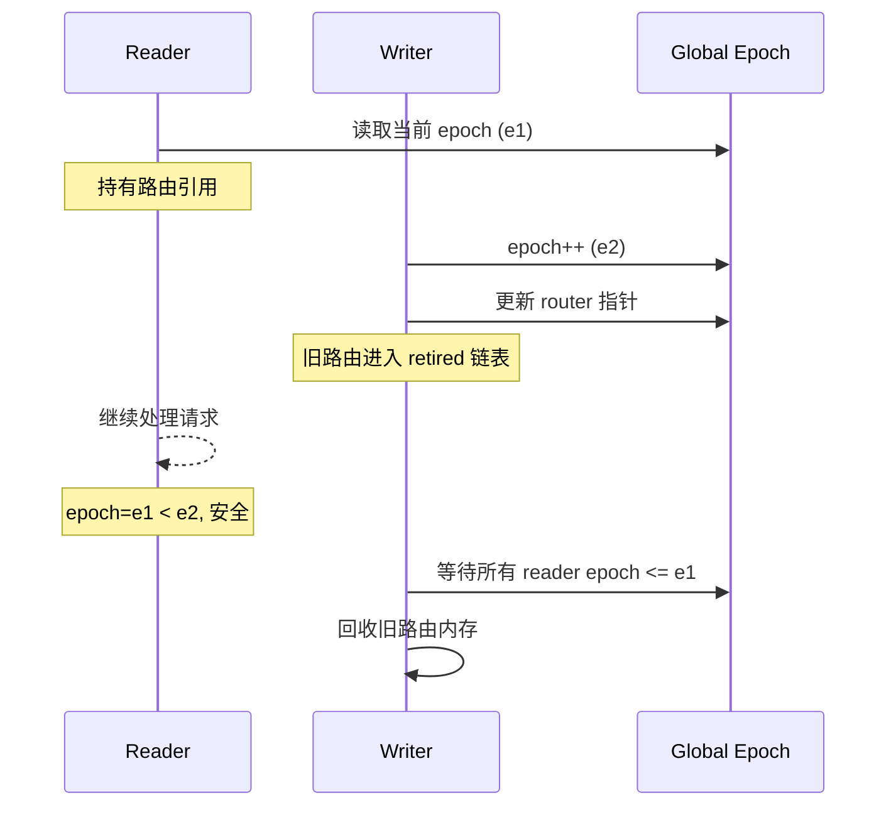

# RCU 热重载机制深度解析

> **Version**: 0.4.0 | **Last updated**: 2026-08-21

csilk 的 RCU (Read-Copy-Update) 热重载机制允许在运行时替换路由器而不中断现有请求。

---

## 1. 设计目标

| 目标 | 说明 |
|------|------|
| **零停机** | 热重载期间服务不中断 |
| **无锁读取** | 请求处理路径无锁 |
| **内存安全** | 旧路由器不被提前释放 |
| **并发安全** | 多线程并发热重载操作安全 |

---

## 2. Epoch 模型



---

## 3. 核心数据结构

```c
// RCU 槽位
typedef struct csilk_rcu_slot_s {
    uintptr_t owner_tid;           // 拥有者线程 ID
    uint64_t active_epoch;         // 活跃 epoch
    uint32_t nesting_depth;        // 嵌套深度
    csilk_reload_mgr_t* owner_mgr;
    uint64_t server_gen;
    struct csilk_rcu_slot_s* next_overflow;
    bool is_dynamic;
} csilk_rcu_slot_t;

// 热重载管理器
typedef struct csilk_reload_mgr_s {
    uint64_t global_epoch;
    csilk_mutex_t reclaim_lock;
    csilk_rcu_slot_t reader_slots[256];
    csilk_rcu_slot_t* overflow_head;
    csilk_retired_router_t* retired_head;
    uint32_t retired_count;
} csilk_reload_mgr_t;
```

---

## 4. 读取路径 (无锁)

### 4.1 Fast Path

```c
static inline csilk_rcu_slot_t* acquire_rcu_slot(csilk_reload_mgr_t* mgr) {
    // TLS 快速路径
    if (__builtin_expect(
            g_tls_rcu.slot != NULL && 
            g_tls_rcu.mgr == mgr &&
            g_tls_rcu.server_gen == mgr->server_gen, 1)) {
        return g_tls_rcu.slot;
    }
    return acquire_rcu_slot_slow(mgr);
}
```

**性能**: ~5 ns

### 4.2 Slow Path

```c
static csilk_rcu_slot_t* acquire_rcu_slot_slow(csilk_reload_mgr_t* mgr) {
    uintptr_t my_tid = (uintptr_t)pthread_self();
    
    // 尝试获取静态槽位 (CAS)
    for (size_t i = 0; i < CSILK_RELOAD_MAX_READERS; i++) {
        uintptr_t expected = 0;
        if (atomic_compare_exchange_strong_explicit(
                &mgr->reader_slots[i].owner_tid, &expected, my_tid,
                memory_order_acq_rel, memory_order_relaxed)) {
            mgr->reader_slots[i].active_epoch = 0;
            g_tls_rcu.slot = &mgr->reader_slots[i];
            return g_tls_rcu.slot;
        }
    }
    
    // 静态槽位耗尽，使用动态溢出
    csilk_rcu_slot_t* new_slot = calloc(1, sizeof(csilk_rcu_slot_t));
    // CAS 插入溢出链表...
}
```

---

## 5. 写入路径

```c
void csilk_server_set_router_full(csilk_server_t* server,
                                   csilk_router_t* router,
                                   void* dl_handle,
                                   const char* tmp_path) {
    // 1. 原子交换路由器
    csilk_router_t* old_router = 
        atomic_exchange_explicit(&server->router, router, 
                                  memory_order_acq_rel);
    
    // 2. 递增全局 epoch
    uint64_t retired_epoch = atomic_fetch_add_explicit(
        &mgr->global_epoch, 1, memory_order_acq_rel);
    
    // 3. 将旧路由器加入 retired 链表
    csilk_retired_router_t* rec = calloc(1, sizeof(csilk_retired_router_t));
    rec->router = old_router;
    rec->retired_epoch = retired_epoch;
    
    // CAS 插入链表头部
    csilk_retired_router_t* old_head = 
        atomic_load_explicit(&mgr->retired_head, memory_order_relaxed);
    do {
        atomic_store_explicit(&rec->retired_next, old_head, 
                              memory_order_relaxed);
    } while (!atomic_compare_exchange_weak_explicit(
        &mgr->retired_head, &old_head, rec, 
        memory_order_release, memory_order_relaxed));
    
    // 4. 机会性回收
    _csilk_reload_try_reclaim(server);
}
```

**性能**: ~200 ns

---

## 6. 内存回收

### 6.1 回收条件

```
retired_epoch < min_active_epoch
```

### 6.2 回收算法

```c
void _csilk_reload_try_reclaim(csilk_server_t* server) {
    // 1. 获取回收锁 (非阻塞)
    uint32_t expected = 0;
    if (!atomic_compare_exchange_strong_explicit(
            &mgr->reclaim_lock, &expected, 1,
            memory_order_acquire, memory_order_relaxed)) {
        return;
    }
    
    // 2. 扫描所有 reader 槽位，找出最小活跃 epoch
    uint64_t min_active_epoch = UINT64_MAX;
    
    for (size_t i = 0; i < CSILK_RELOAD_MAX_READERS; i++) {
        uint64_t r_epoch = atomic_load_explicit(
            &mgr->reader_slots[i].active_epoch, memory_order_acquire);
        if (r_epoch != 0) {
            min_active_epoch = min(min_active_epoch, r_epoch);
        }
    }
    
    // 3. 分离可回收条目
    csilk_retired_router_t* list = 
        atomic_exchange_explicit(&mgr->retired_head, NULL, 
                                  memory_order_acq_rel);
    
    while (list) {
        if (list->retired_epoch < min_active_epoch) {
            // 安全回收
            csilk_router_free(list->router);
            if (list->dl_handle) dlclose(list->dl_handle);
            free(list);
        } else {
            // 需要保留
            retain_list = list;
        }
        list = next;
    }
    
    // 4. 放回保留链表
    atomic_store_explicit(&mgr->reclaim_lock, 0, memory_order_release);
}
```

---

## 7. 线程本地存储

```c
// 线程本地 RCU 状态
typedef struct {
    csilk_rcu_slot_t* slot;
    csilk_reload_mgr_t* mgr;
    uint64_t server_gen;
} tls_rcu_t;

static _Thread_local tls_rcu_t g_tls_rcu = {NULL, NULL, 0};
```

---

## 8. 测试验证

```c
// tests/core/test_hot_reload.c
TEST_CASE("hot_reload_basic") {
    csilk_server_t* server = csilk_server_new(router1);
    csilk_server_run(server, 8080);
    
    // 发送请求并触发热重载
    // 验证旧请求完成，新请求使用新路由
    
    csilk_server_wait_grace_period(server);
}
```

---

## 9. 参考文件

| 文件 | 关键函数 |
|------|----------|
| `src/core/server/server_lifecycle.c` | `csilk_server_set_router_full`, `_csilk_reload_try_reclaim` |
| `include/csilk/core/hot_reload.h` | 公共 API |
