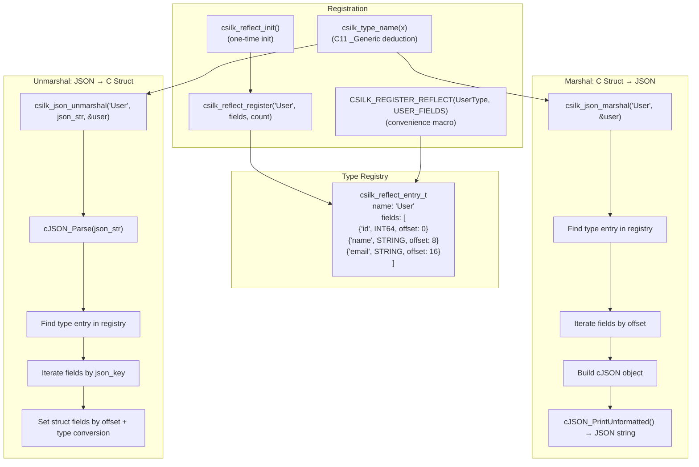
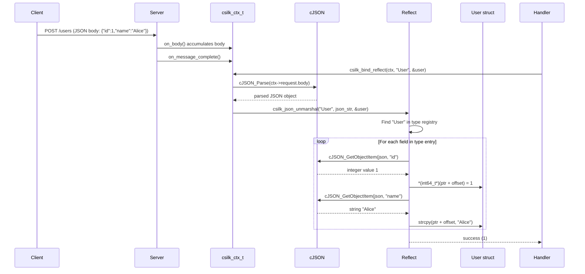
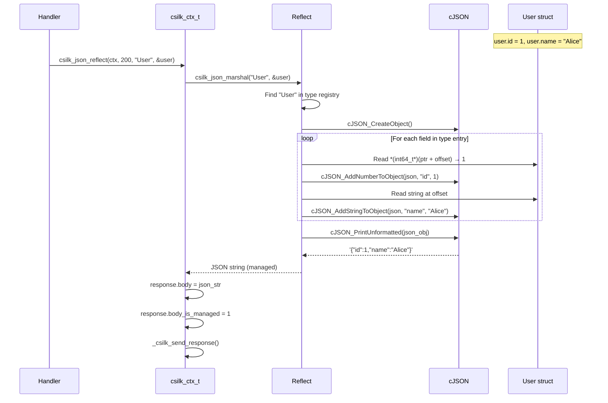
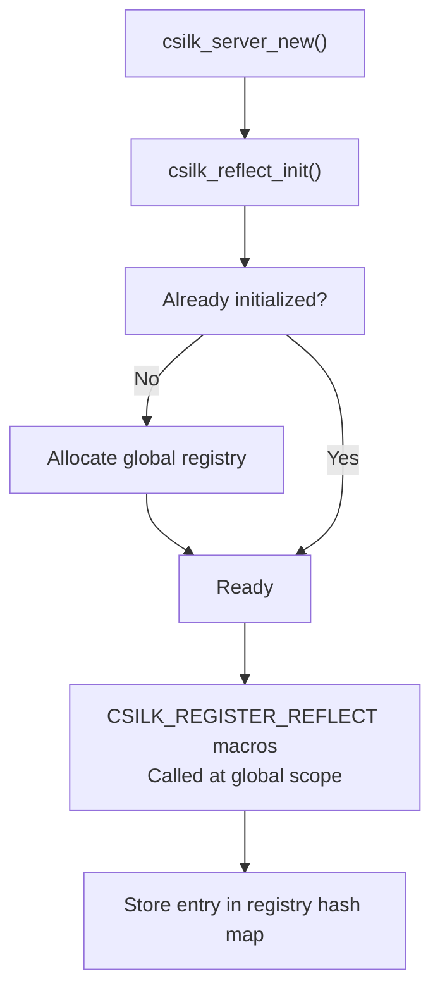

# Reflection Engine

The reflection engine bridges C structs and JSON, enabling automatic serialization and deserialization without manual JSON parsing code.

## Architecture



## Automatic Type Deduction (C11 _Generic)

Csilk uses C11 `_Generic` to automatically determine the type name string at compile time. This allows for a much cleaner API:

```c
// Instead of:
csilk_json_marshal("User", &user);

// You can use:
csilk_marshal(&user); // Macro deduces "User"
```

### Supported Basic Types

The following types are supported natively by `csilk_type_name` and the reflection engine:
- `bool`
- `int8`, `uint8`, `int16`, `uint16`, `int32`, `uint32`, `int64`, `uint64`
- `float`, `double`
- `string` (`char*` or `const char*`)

### Custom Type Mapping

To enable automatic deduction for user-defined structs, extend the `CSILK_USER_TYPE_MAP` **before** including `csilk.h`:

```c
#undef CSILK_USER_TYPE_MAP
#define CSILK_USER_TYPE_MAP , struct User_s: "User"
#include "csilk/csilk.h"
```

## Top-Level Basic Type Reflection

The engine supports reflecting basic types directly without a surrounding struct:

```c
int count = 42;
char* json = csilk_marshal(&count); // Result: "42"

bool active = true;
char* json_b = csilk_marshal(&active); // Result: "true"

char* msg = "hello";
char* json_s = csilk_marshal(&msg); // Result: "\"hello\""
```

## Data Flow: JSON Binding



## Data Flow: JSON Response via Reflection



## Supported Field Types

| Field Type | C Type | JSON Type |
|-----------|--------|-----------|
| `CSILK_TYPE_INT8` | `int8_t` | Number |
| `CSILK_TYPE_INT16` | `int16_t` | Number |
| `CSILK_TYPE_INT32` | `int32_t` | Number |
| `CSILK_TYPE_INT64` | `int64_t` | Number |
| `CSILK_TYPE_FLOAT` | `float` | Number |
| `CSILK_TYPE_DOUBLE` | `double` | Number |
| `CSILK_TYPE_BOOL` | `bool` | Boolean |
| `CSILK_TYPE_STRING` | `char[N]` or `char*` | String |
| `CSILK_TYPE_STRUCT` | nested struct | Object |

## Registration Example

```c
#include "csilk/csilk.h"

// Define struct
typedef struct {
    int64_t id;
    char name[64];
    char email[128];
    bool active;
} User;

// Define field descriptions macro
#define USER_FIELDS(_) \
    _(User, id, CSILK_TYPE_INT64, 0, 0, false, NULL) \
    _(User, name, CSILK_TYPE_STRING, 64, 0, false, NULL) \
    _(User, email, CSILK_TYPE_STRING, 128, 0, false, NULL) \
    _(User, active, CSILK_TYPE_BOOL, 0, 0, false, NULL)

// Register type (done once at startup)
CSILK_REGISTER_REFLECT(User, USER_FIELDS);
```

## Init Flow



## Deep Freeing & Cyclic Reference Detection

To support complex nested structure graphs, the reflection engine includes mechanisms for safe deep memory cleanup and validation against loop structures.

### Deep Struct Freeing (`csilk_struct_free_reflect`)

When unmarshaling JSON into a nested structure, pointers to child structures and strings may be dynamically allocated. Standard sequential `free()` calls would miss these nested dynamic structures, leading to leaks.

`csilk_struct_free_reflect` recursively traverses registered struct fields using their metadata:
- Checks if the field is a pointer to another registered struct (`CSILK_TYPE_STRUCT`).
- Checks if the field is a pointer to a string (`CSILK_TYPE_STRING`).
- Frees child structs recursively, then frees the parent struct pointers.
- Employs a **maximum recursion depth limit** (currently `32`) to prevent stack overflow on extremely deep nested layouts.

### Cyclic Reference Detection

If two structures reference each other (either directly or transitively in a loop), recursive marshaling, unmarshaling, or deep freeing will result in infinite recursion and stack overflow.

Csilk prevents this by performing **Static Cyclic Reference Detection** (using a Depth-First Search cycle-finding algorithm) at type registration time:
- When a new type is registered via `CSILK_REGISTER_REFLECT`, the registry builds a dependency directed graph of types.
- If a cycle is detected (e.g. `A -> B -> A`), a compile-time or startup warning/error is logged.
- At runtime, APIs like marshal/unmarshal respect the recursion limit to fail gracefully rather than crashing the process.

