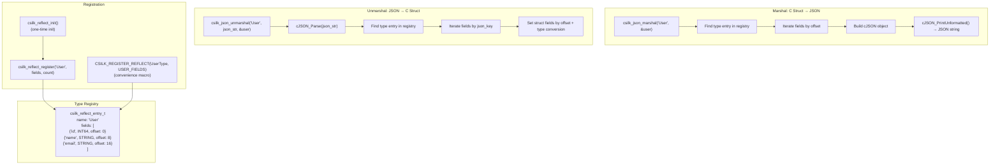
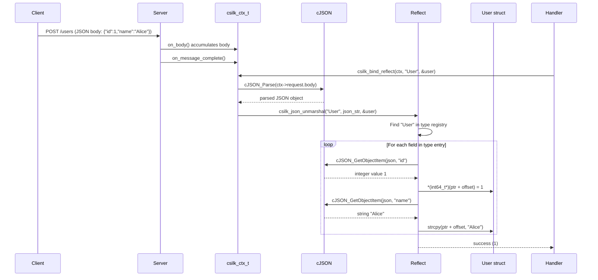
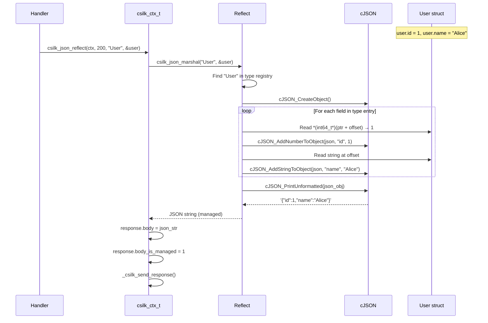
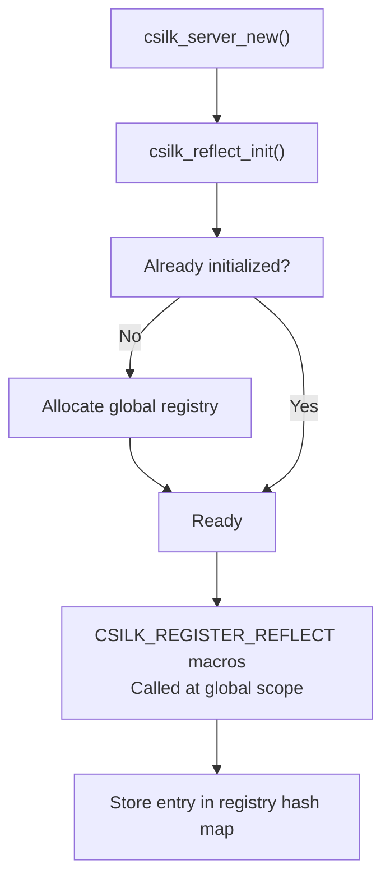

# Reflection Engine

The reflection engine bridges C structs and JSON, enabling automatic serialization and deserialization without manual JSON parsing code.

## Architecture



## Data Flow: JSON Binding



## Data Flow: JSON Response via Reflection



## Supported Field Types

| Field Type | C Type | JSON Type |
|-----------|--------|-----------|
| `CSILK_FIELD_INT8` | `int8_t` | Number |
| `CSILK_FIELD_INT16` | `int16_t` | Number |
| `CSILK_FIELD_INT32` | `int32_t` | Number |
| `CSILK_FIELD_INT64` | `int64_t` | Number |
| `CSILK_FIELD_FLOAT` | `float` | Number |
| `CSILK_FIELD_DOUBLE` | `double` | Number |
| `CSILK_FIELD_BOOL` | `int` (0/1) | Boolean |
| `CSILK_FIELD_STRING` | `char[N]` | String |
| `CSILK_FIELD_STRUCT` | nested struct | Object |
| `CSILK_FIELD_ARRAY` | array | Array |

## Registration Example

```c
// Define struct
typedef struct {
    int64_t id;
    char name[64];
    char email[128];
    int active;
} User;

// Define field descriptions macro
#define USER_FIELDS \
    CSILK_FIELD(id, CSILK_FIELD_INT64, 0) \
    CSILK_FIELD(name, CSILK_FIELD_STRING, sizeof(((User*)0)->name)) \
    CSILK_FIELD(email, CSILK_FIELD_STRING, sizeof(((User*)0)->email)) \
    CSILK_FIELD(active, CSILK_FIELD_BOOL, 0)

// Register type (done once at startup)
CSILK_REGISTER_REFLECT(User, USER_FIELDS);
```

## Init Flow


