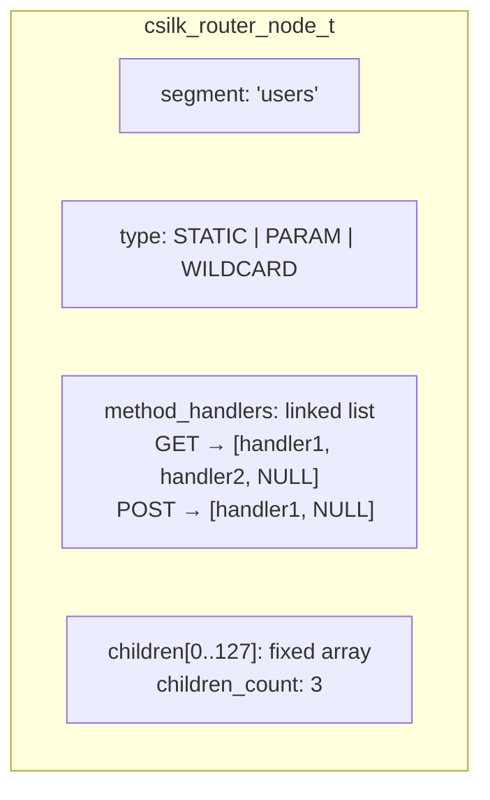
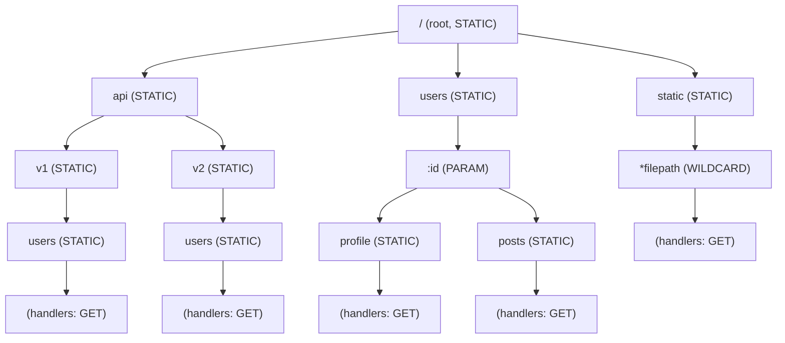
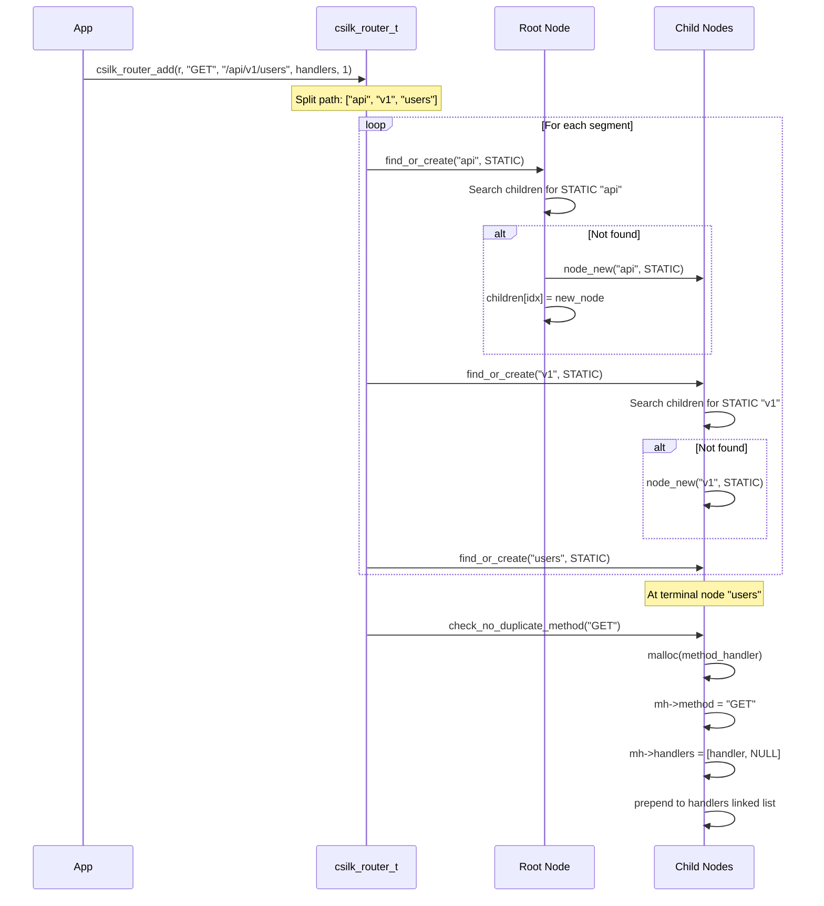
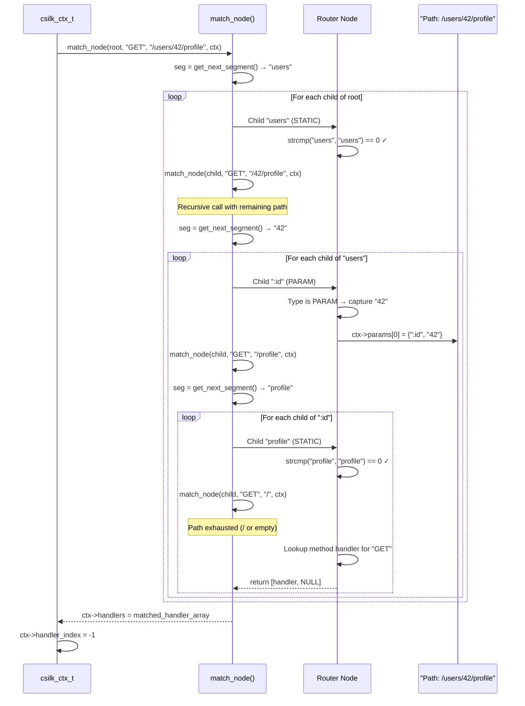
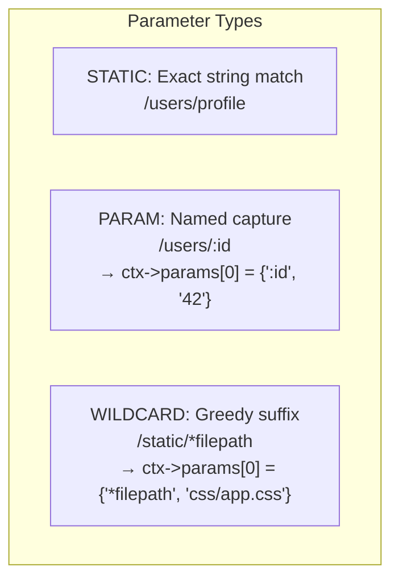

# Router Design

csilk uses a **Radix Tree** (compact prefix tree) for efficient route matching. The router supports static routes, named parameters (`:param`), and wildcards (`*wildcard`).

## Node Structure

## Radix Tree Visualization

## Route Registration Flow

## Route Matching Flow

## Parameter Matching

- **STATIC** nodes match exact path segments (case-sensitive).
- **PARAM** nodes match any single path segment and capture the value. Backtracking is supported if the match fails deeper in the tree.
- **WILDCARD** nodes greedily match the entire remaining path. The router stops traversal at the wildcard node and checks for a handler.

## Performance Characteristics

| Operation | Complexity | Notes |
|-----------|-----------|-------|
| Route Insertion | O(L) | L = path segment count |
| Route Matching (best) | O(S) | S = segment count, exact static match |
| Route Matching (worst) | O(N + P) | N = static children, P = param branches |
| Memory per Route | O(S) | One node per path segment |

The fixed-size children array (`CSILK_MAX_CHILDREN = 128`) trades some memory for CPU cache locality, ensuring fast linear scans over child nodes.
