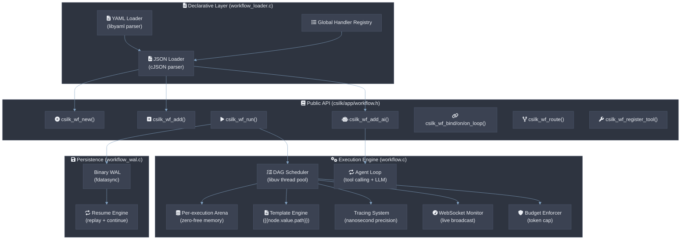

# AI Workflow & Agentic Engine

The workflow module provides a graph-based orchestration engine for building AI pipelines and autonomous agents on top of the csilk AI unified interface. Each workflow **MUST** be a Directed Acyclic Graph (DAG) — cycles are detected at registration and **MUST** be rejected with an error code. Node scheduling **MUST** complete within ≤ 1µs per node; the full DAG scheduler overhead for 100 nodes **SHOULD** be ≤ 100µs. Hot-reload **MUST NOT** drop in-flight workflow executions.

## Architecture



## Core Concepts

### Workflow Graph

A workflow is a **directed acyclic graph (DAG)** where:

- **Nodes** are execution units (C functions or built-in AI nodes).
- **Edges** define data flow and control flow between nodes.
- **Entry nodes** start execution (nodes with 0 incoming edges or marked explicitly).
- **Data** flows along edges as `csilk_data_t` containers (type + value + metadata).

```c
csilk_wf_t* wf = csilk_wf_new("ResearchPipeline");

// Add nodes
csilk_wf_node_t* n1 = csilk_wf_add(wf, "search", search_handler, NULL);
csilk_wf_node_t* n2 = csilk_wf_add_ai(wf, "summarize", &ai_config);

// Connect
csilk_wf_bind(n1, n2);

// Run
csilk_wf_run(wf, &input, on_complete);
```

### Node Types

| Type | Creation API | Behavior |
|------|-------------|----------|
| **Custom Handler** | `csilk_wf_add()` | Executes a `csilk_wf_handler_t` C function |
| **AI Node** | `csilk_wf_add_ai()` | Built-in handler that calls LLM with template injection + tool loop |
| **Entry Node** | `csilk_wf_node_set_entry()` | Starts workflow execution (auto-detected by 0 incoming edges) |

### AI Nodes and Template Injection

AI nodes accept a `csilk_ai_config_t` with template-based prompts:

```c
csilk_wf_node_t* n = csilk_wf_add_ai(wf, "formatter", &(csilk_ai_config_t){
    .model = "gpt-4",
    .system_msg = "You are a technical writer.",
    .prompt = "Summarize: {{search.value}}. Previous draft: {{draft.value.content}}",
    .temperature = 0.3,
    .max_tokens = 2048
});
```

**Template syntax**:
- `{{node_id.value}}` — inserts the full output value of another node
- `{{node_id.value.path.to.field}}` — JSONPath extraction from JSON output
- `{{input.value}}` / `{{input.value.path}}` — references the initial workflow input

### Edge Types

| API | Edge Type | Behavior |
|-----|-----------|----------|
| `csilk_wf_bind(from, to)` | **Default** | Always trigger `to` when `from` completes |
| `csilk_wf_on(from, "condition", to)` | **Conditional** | Trigger only when output type matches condition |
| `csilk_wf_on_loop(from, "cond", to)` | **Loop Back** | Same as conditional, but does NOT increment incoming count (prevents deadlock) |
| `csilk_wf_on_error(from, to)` | **Error Fallback** | Trigger if `from` handler returns NULL |

### Join Policies

When a node has multiple incoming edges:

| Policy | API | Behavior |
|--------|-----|----------|
| **AND** (default) | `CSILK_WF_JOIN_AND` | Execute only after ALL predecessors complete |
| **OR** | `CSILK_WF_JOIN_OR` | Execute after ANY predecessor completes |

```c
csilk_wf_node_set_join(node, CSILK_WF_JOIN_OR);
```

## Agentic Workflows

### Tool Calling Loop

The built-in AI node handler (`ai_node_handler()`) implements an autonomous agent loop:

1. Send prompt + registered tools to the LLM.
2. If the response contains `tool_calls`, execute them **in parallel** via libuv thread pool.
3. Inject tool results back as new messages.
4. Repeat (up to 10 iterations) until the LLM responds with content.

```c
// Register a tool
csilk_wf_register_tool(wf, "get_weather",
    "Get current weather for a location",
    "{\"type\":\"object\",\"properties\":{\"location\":{\"type\":\"string\"}}}",
    weather_fn, NULL);

// AI node will automatically use registered tools
csilk_wf_add_ai(wf, "agent", &ai_config);
```

### Dynamic Routing

Functional routing allows runtime decision of the next node:

```c
const char* my_router(csilk_data_t* output) {
    if (strstr(output->value, "ERROR")) return "fallback";
    if (strstr(output->value, "REJECT")) return "retry_node";
    return "next_node";
}

csilk_wf_route(node, my_router);
```

### Agentic Loop with Conditional Edges


```c
csilk_wf_bind(n1, n2);
csilk_wf_on_loop(n2, "fail", n1);  // loop back without incrementing count
csilk_wf_on(n2, "pass", n3);
```

## Memory Management

Each workflow execution creates a **per-execution arena allocator**:

- All node outputs, string duplications, and metadata are arena-allocated.
- The entire arena is freed at once when execution completes.
- No manual `free()` needed inside handlers.
- Arena is thread-safe (mutex-protected for parallel tool calls).

```c
csilk_data_t* my_handler(csilk_wf_ctx_t* ctx, csilk_data_t* input, void* user_data) {
    char* result = csilk_wf_strdup(ctx, "hello");
    return csilk_wf_data_new(ctx, "text/plain", result);
}
```

## Safety & Guardrails

### Token Budget

Enforces a maximum total token consumption (prompt + completion) across all AI nodes:

```c
csilk_wf_set_budget(wf, 10000);  // stop after 10K total tokens
```

### Node Timeout

Per-node timeout prevents hanging:

```c
csilk_wf_node_set_timeout(node, 5000);  // 5 second timeout
```

### Workflow TTL

Global time-to-live for the entire execution:

```c
csilk_wf_set_ttl(wf, 30);  // 30 second TTL
```

### Step Limit

Hard safety cap at `MAX_WORKFLOW_STEPS` (1000) total node executions per run.

## Observability

### Execution Tracing

Every node execution is recorded with nanosecond precision:

```c
csilk_wf_run_traced(wf, &input, on_complete_with_trace);
// Trace emitted as callback: void on_trace(csilk_data_t* result, csilk_wf_trace_t* trace)
```

Trace fields per node: `node_id`, `start_time`, `end_time`, `duration_us`, `input_dump`, `output_dump`, `model`, `prompt_tokens`, `completion_tokens`, `error`.

Export trace to JSON:

```c
char* json = csilk_wf_trace_to_json(trace);
```

### Admin Dashboard Integration

Live workflow execution status is exposed via the unified admin dashboard:

- **GET /admin/stats**: Returns workflow metrics (`workflow_count`, `node_count`, `active_executions`) as JSON.
- **GET /admin/ws**: WebSocket endpoint broadcasting real-time workflow lifecycle events.

### WebSocket Monitoring

Live workflow events broadcast via WebSocket:

```c
csilk_wf_register_monitor(wf, upgraded_ws_context);
```

Events: `workflow_start`, `node_queued`, `node_start`, `node_finish`, `workflow_end`.

### Mermaid Visualization

Export the workflow graph as a Mermaid diagram string:

```c
char* mermaid = csilk_wf_to_mermaid(wf);
// Output: "graph TD\n  search --> summarize\n  summarize -. error .-> fallback\n"
```

## Persistence & Resilience

### Write-Ahead Log (WAL)

Each workflow execution records a binary WAL file:

| Event Type | Recorded Data |
|-----------|---------------|
| `WF_EV_START` | Initial input |
| `WF_EV_NODE_START` | Node ID |
| `WF_EV_NODE_FINISH` | Node ID + output type + output value |
| `WF_EV_END` | (empty) |

WAL format (binary, packed header):

```
[MAGIC:4][TYPE:1][TIMESTAMP:4][PAYLOAD_LEN:4][PAYLOAD...]
```

### Resume

Interrupted executions can be resumed from the WAL:

```c
csilk_wf_set_persistence(wf, "/var/log/workflows");
// ... later, after crash:
csilk_wf_resume(wf, "execution-uuid", on_complete);
```

The resume engine replays the WAL to reconstruct state, then continues unfinished nodes.

## Declarative Workflow Definitions

### JSON Format

Workflows can be defined declaratively and loaded at runtime:

```json
{
    "name": "ResearchAssistant",
    "steps": [
        {"id": "search", "type": "handler", "handler": "web_search", "entry": true},
        {"id": "summarize", "type": "ai", "config": {
            "model": "gpt-4",
            "system_msg": "Summarize the following.",
            "prompt": "{{search.value}}"
        }},
        {"id": "fallback", "type": "handler", "handler": "default_response"}
    ],
    "connections": [
        {"from": "search", "to": "summarize"},
        {"from": "summarize", "to": "fallback", "condition": null}
    ]
}
```

```c
csilk_wf_register_handler("web_search", web_search_handler);
csilk_wf_t* wf = csilk_wf_from_json(json_string);
csilk_wf_run(wf, &input, on_complete);
```

### YAML Format

Same structure via YAML files:

```c
csilk_wf_t* wf = csilk_wf_load_yaml("workflow.yaml");
```

## Implementation Details

### Scheduler

The scheduler in `execute_node()` runs each handler via `uv_queue_work()` on libuv's thread pool:

1. **Pre-execution**: broadcast `node_queued`, log WAL start event, create trace node.
2. **Execution**: `worker_cb` runs the handler on a thread-pool thread.
3. **Post-execution**: `after_worker_cb` processes output, checks budget, evaluates edges, schedules downstream nodes.

### Agent Loop

The `ai_node_handler()` at `src/app/workflow.c:505` implements:

1. Resolve template placeholders via `resolve_templates()`.
2. Build message array (system + user).
3. Call `csilk_ai_chat()`.
4. If `tool_calls` present:
   - Dispatch each tool to `uv_queue_work()` for **parallel execution**.
   - Wait for all to complete via `uv_cond_wait()`.
   - Inject tool results as new messages.
   - Repeat (up to 10 iterations).
5. Return final content as `csilk_data_t`.

### WAL Append

The `_wf_wal_append()` function in `workflow_wal.c` uses raw POSIX I/O (`open`/`write`/`fdatasync`/`close`) with `O_APPEND` for crash-safe sequential logging.

## File Layout

| File | Purpose |
|------|---------|
| `include/csilk/app/workflow.h` | Public API (355 lines) |
| `include/csilk/app/workflow_wal.h` | WAL types and header format |
| `src/app/workflow.c` | Core engine (1163 lines) |
| `src/app/workflow_wal.c` | WAL implementation (44 lines) |
| `src/app/workflow_loader.c` | Declarative loader (268 lines) |
| `tests/test_workflow_agentic.c` | Agentic loop test |
| `tests/test_workflow_monitor.c` | Monitor integration test |
| `examples/example_ai_workflow.c` | Full workflow example |
