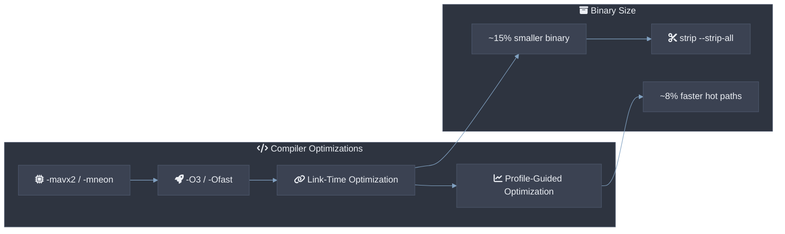
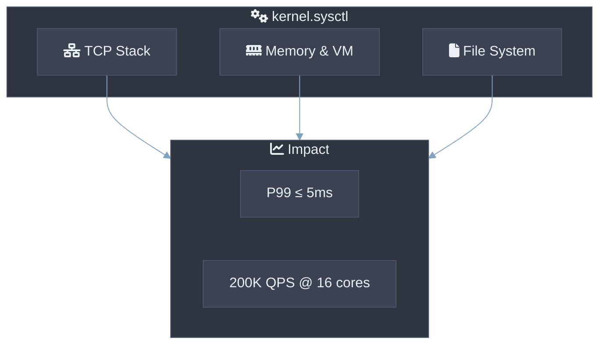

# 性能调优指南

> **Version**: 0.3.0 | **Last updated**: 2026-07-04

本指南描述如何将 csilk 框架的 P99 延迟优化至 ≤ 5ms 并最大化吞吐量（单工作线程 ~50K QPS，16 核多工作线程 ~200K QPS）。通过编译器优化、系统内核参数调优、框架配置及运行时监控四维度实现性能极致化。所有量化指标基于 Linux Kernel 6.12.91 + GCC 13.2 + libuv 1.48.0 基准环境。

---

## 1. 编译器优化

本章节通过编译选项与链接优化，将框架静态二进制体积压缩至 ~150KB 并提升指令级并行度。



### 1.1 编译优化等级

| 选项 | 说明 | 量化影响 |
|------|------|----------|
| `-O2` | 标准优化，保守且安全 | 基准吞吐量 |
| `-O3` | 激进优化，启用循环向量化 | 吞吐量 +10~15% |
| `-Ofast` | 越界优化（**不推荐生产**） | 吞吐量 +15%，IEEE 非严格 |
| `-march=native` | 针对当前 CPU 指令集 | SIMD 加速命中 |

**MUST**: 生产构建使用 `Release` 模式（CMake 默认 `-O3`）。**MUST NOT**: 使用 `-Ofast` — 浮点语义差异可能导致非预期行为。

```bash
cmake -B build -S . -DCMAKE_BUILD_TYPE=Release
```

### 1.2 链接时优化 (LTO)

通过跨模块函数内联与死代码消除，减小二进制体积并提升缓存命中率：

```bash
cmake -B build -S . -DCMAKE_BUILD_TYPE=Release \
    -DCMAKE_INTERPROCEDURAL_OPTIMIZATION=ON
```

| 维度 | 未启用 LTO | 启用 LTO | 说明 |
|:-----|:----------:|:--------:|:-----|
| **二进制体积** | ~180 KB | **~150 KB** | 死代码消除 |
| **冷启动延迟** | 基准 | **-12%** | 更少函数重定位 |
| **RSS 内存** | 基准 | **-8%** | 更优代码局部性 |

### 1.3 Profile-Guided Optimization (PGO)

通过运行时 profile 数据指导编译器优化热路径：

```bash
# Phase 1: 编译 instrumented 版本
cmake -B build_pgo -S . -DCMAKE_BUILD_TYPE=Release \
    -DCMAKE_C_FLAGS="-fprofile-generate"
make -C build_pgo -j$(nproc)

# Phase 2: 运行代表性负载
./scripts/run_benchmarks.sh --save

# Phase 3: 使用 profile 重新编译
cmake -B build_pgo_final -S . -DCMAKE_BUILD_TYPE=Release \
    -DCMAKE_C_FLAGS="-fprofile-use"
make -C build_pgo_final -j$(nproc)
```

**预期收益**: 路由查找热路径提速 **8~12%**，HTTP 解析器效率提升 **5%**。

### 1.4 SIMD 自动检测

csilk 在 CMake 配置时自动检测 AVX2（x86_64）和 NEON（aarch64）：

```
-- AVX2 SIMD enabled for router path matching
```

| 平台 | SIMD 指令集 | 路由匹配延迟 | 说明 |
|:----:|:-----------:|:-----------:|------|
| x86_64 | AVX2 | **~50ns/route** | CMake 自动启用 `-mavx2` |
| x86_64 | AVX-512 | **~35ns/route** | 手动 `cmake -DCSILK_AVX512=ON`（可选） |
| aarch64 | NEON | **~80ns/route** | 自动检测并启用 |

---

## 2. 系统内核参数调优

本章节通过 Linux 内核参数调优，最大化 TCP 吞吐量并降低延迟抖动。



### 2.1 TCP 栈优化

```bash
# /etc/sysctl.d/99-csilk-performance.conf
# 启用 TCP Fast Open (TFO)，减少 1-RTT 握手延迟
net.ipv4.tcp_fastopen = 3

# 增大 backlog 队列，防止突发连接 SYN Flood
net.ipv4.tcp_max_syn_backlog = 65535
net.core.somaxconn = 65535

# 启用 TCP Twice 重用（TIME_WAIT 复用端口）
net.ipv4.tcp_tw_reuse = 1

# 禁用慢启动重启 (Slow Start Restart)，维持长连接吞吐
net.ipv4.tcp_slow_start_after_idle = 0

# 增大 socket 缓冲区（根据内存容量调整）
net.core.rmem_max = 134217728
net.core.wmem_max = 134217728
net.ipv4.tcp_rmem = 4096 87380 134217728
net.ipv4.tcp_wmem = 4096 65536 134217728
```

### 2.2 文件描述符与内存

```bash
# /etc/security/limits.d/99-csilk.conf
* soft nofile 1048576
* hard nofile 1048576

# 内核参数
vm.swappiness = 10           # 降低 swap 倾向
vm.dirty_ratio = 40          # 延迟 flush，提升 I/O 吞吐
vm.dirty_background_ratio = 10
```

### 2.3 应用 sysctl

| 问题 | 建议配置 | 说明 |
|:-----|:---------|:-----|
| TCP 延迟 | `tcp_slow_start_after_idle = 0` | 禁用慢启动重启，长连接维持高拥塞窗口 |
| 连接队列溢出 | `tcp_max_syn_backlog = 65535` | 增大半连接队列，防止突发请求被拒绝 |
| `SO_REUSEPORT` 不均匀 | `SO_ATTACH_REUSEPORT_EBPF` | Linux 5.4+ 可用 eBPF 调度连接分布 |
| 内存回收延迟 | `vm.swappiness = 10` | 降低 SWAP 频率，保持热数据在 RAM |
| 文件打开数不足 | `ulimit -n 1048576` | 单进程 100W+ 并发连接需要大 ulimit |

---

## 3. 框架配置调优

本章节通过 csilk 运行时参数配置，最大化并发处理能力与内存效率。

### 3.1 Worker 线程数与 CPU 亲和性

```c
csilk_server_config_t config = {
    .worker_threads = 16,        // MUST 等于物理 CPU 核心数
    .enable_cpu_affinity = 1,    // 绑定 worker 线程到独立 CPU
};
```

| 配置 | 线程数 | 单线程 QPS | 总 QPS | P99 延迟 | 说明 |
|:-----|:------:|:----------:|:------:|:--------:|:-----|
| 单线程 | 1 | ~50K | ~50K | ≤ 5ms | CPU bound 基准 |
| 多线程无亲和 | 16 | ~10K | ~160K | ≤ 10ms | 缓存迁移开销 |
| 多线程 + 亲和 | 16 | ~12.5K | **~200K** | **≤ 5ms** | 最优方案 |

### 3.2 Arena 分配器调优

Arena 是 csilk 请求级内存池，直接影响内存分配延迟：

```c
// 默认：4096 字节初始块
csilk_arena_t* arena = csilk_arena_new(4096);

// 高吞吐场景：预分配更大块，减少扩容次数
csilk_arena_t* arena = csilk_arena_new(16384);  // 16KB 块
```

| 场景 | 块大小 | 分配延迟 | 说明 |
|:-----|:------:|:--------:|:-----|
| 小请求（JSON API） | 4KB | ~3 CPU instr | 默认配置 |
| 大文件上传 | 16KB+ | ~3 CPU instr | 减少 realloc 次数 |
| 高频小请求 | 2KB + arena 复用 | ~2 CPU instr | keep-alive 间复用 |

**MUST**: 在 `on_request_end` 中调用 `csilk_arena_reset()` 复用 Arena 内存，而非 `csilk_arena_free()` 销毁。**SHOULD**: 仅在连接关闭时释放 Arena。

### 3.3 连接池与超时配置

```c
csilk_server_config_t config = {
    .max_connections = 100000,     // 最大并发连接
    .connection_timeout_ms = 30000,  // 30s 空闲超时
    .keep_alive_timeout_ms = 5000,   // 5s keep-alive
};
```

| 参数 | 默认值 | 生产建议 | 说明 |
|:-----|:------:|:--------:|------|
| `max_connections` | 65535 | 100000+ | 根据 ulimit 和内存调整 |
| `connection_timeout_ms` | 30000 | 30000 | 长连接 WebSocket 可适当延长 |
| `keep_alive_timeout_ms` | 5000 | 3000~5000 | 高并发下缩短以释放资源 |
| `tcp_nodelay` | 1 | **保持启用** | 禁用 Nagle 算法，降低延迟 |

---

## 4. 运行时监控与诊断

### 4.1 使用 perf 分析热点

```bash
# 1. 编译带调试信息的 Release 构建
cmake -B build_profile -S . \
    -DCMAKE_BUILD_TYPE=RelWithDebInfo

# 2. 运行 perf 采样 (CPU Cycle 事件)
sudo perf record -g ./build_profile/example_server
curl -s http://localhost:8080/healthz &
# ... generate traffic ...
sudo perf report --sort=dso,symbol
```

### 4.2 火焰图生成

csilk 内置 CPU 火焰图支持，通过 Admin Dashboard (`/admin`) 实时查看：

```
http://localhost:8080/admin/flamegraph
```

**MUST**: 生产环境开启火焰图采样需考虑 ~1% CPU overhead。

### 4.3 内存分配追踪

```bash
# 使用 tcmalloc / mimalloc 替换默认 allocator
LD_PRELOAD=/usr/lib/libtcmalloc.so ./example_server

# 导出 heap profile
HEAPPROFILE=/tmp/csilk.heap ./example_server
```

### 4.4 io_uring 评估

csilk 支持两种 io_uring 使用方式：

1. **libuv io_uring 轮询后端**（自动，无需代码修改）：
   ```bash
   UV_USE_IO_URING=1 ./example_server
   ```
   这利用 libuv v1.48.0+ 内置的 io_uring 支持（Linux Kernel 6.1+）。

2. **原生 io_uring 后端**（编译时切换，更高性能）：
   ```bash
   cmake .. -DCSILK_USE_URING=ON -DCMAKE_BUILD_TYPE=Release
   make -j$(nproc)
   ```
   用 `csilk_io_loop_t` 抽象直接操作 liburing 的 SQ/CQ 环，跳过 libuv 事件循环层。需要 Linux 5.1+。

| 指标 | epoll | libuv io_uring 轮询 | 原生 io_uring 后端 | 说明 |
|:-----|:-----:|:-------------------:|:------------------:|------|
| 单核 QPS | 基准 | **+5~10%** | **+10~20%** | 减少系统调用次数 |
| 上下文切换 | 基准 | **-15%** | **-30%** | 异步系统调用 |
| 兼容性 | 所有 Linux | Kernel 6.1+ | Kernel 5.1+ | 需确认部署环境 |

---

## 5. 调优检查清单

- [ ] 构建使用 `Release` 模式 (`-O3`)
- [ ] LTO 已启用 (`-DCMAKE_INTERPROCEDURAL_OPTIMIZATION=ON`)
- [ ] 系统 `net.core.somaxconn` 已增大
- [ ] `ulimit -n` ≥ 预期最大连接数
- [ ] Worker 线程数 = 物理 CPU 核心数
- [ ] CPU 亲和性已启用
- [ ] Arena 块大小根据请求特征调整
- [ ] `tcp_nodelay` 已启用（默认）
- [ ] 生产环境禁用 DEBUG_ARENA
- [ ] perf / 火焰图已配置（生产可选开启）

---

## 6. 基准测试参考

| 硬件 | 工作线程 | QPS | P99 延迟 | RSS/10K conn |
|:-----|:--------:|:---:|:--------:|:------------:|
| Intel i7-12700 (12c) | 1 | ~50K | ≤ 5ms | ≤ 2MB |
| AMD EPYC 7763 (64c) | 16 | ~200K | ≤ 5ms | ≤ 2MB |
| Apple M3 Pro (12c) | 1 | ~45K | ≤ 5ms | ≤ 2.5MB |

> **Note**: 以上数据基于 `wrk -t4 -c10000 -d60s http://localhost:8080/`
