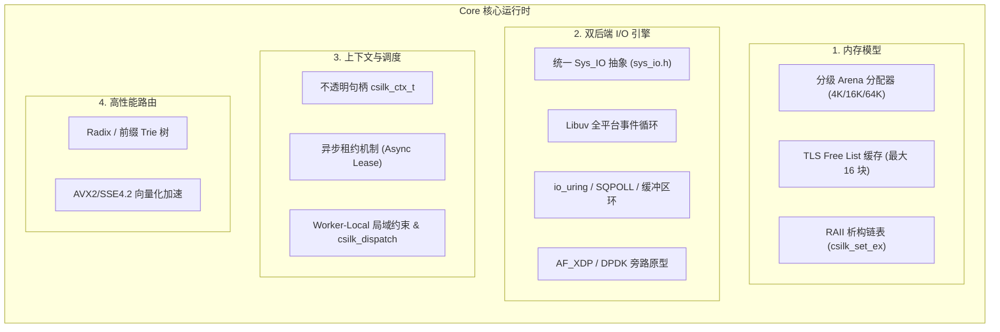
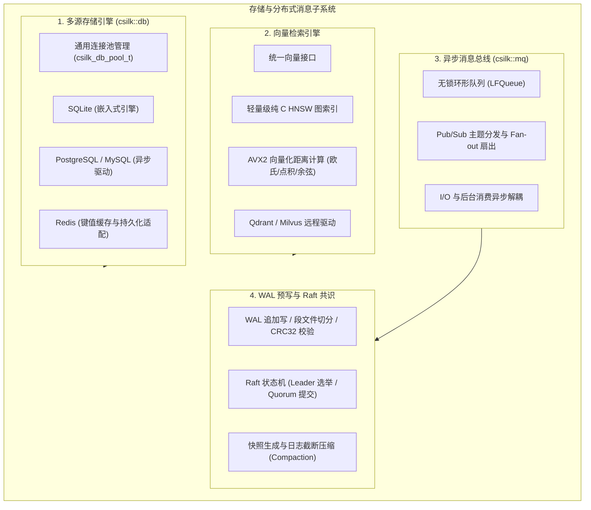
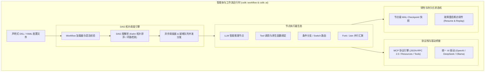

# Csilk 项目代码全景架构与模块独立深度剖析设计规格

- **日期**：2026-08-18
- **版本**：v1.0.0
- **目标代码库**：Csilk (`csilk`) — 高性能 C 语言异步 Web 与智能体运行时

---

## 1. 总体执行摘要与设计哲学 (Executive Summary & Philosophy)

### 1.1 核心定位与设计目标
Csilk (`csilk`) 是基于 C11 标准构建的高性能异步 Web 服务、微服务运行时与原生智能体（Agentic Workflow）计算引擎。其核心设计遵循五大架构支柱：
1. **极致吞吐与零拷贝内存模型**：基于分级自适应 Arena 内存分配器（Small 4K / Medium 16K / Large 64K）与线程局部缓存（TLS Free List），在单请求生命周期内几乎消除动态 `malloc`/`free` 开销；HTTP 解析与 WebSocket 编解码全面采用基于缓冲区分片的零拷贝引用。
2. **跨平台双 I/O 事件驱动抽象**：底层通过统一的 `sys_io.h` 抽象层，同构兼容全平台成熟的 `libuv` 事件循环与 Linux 原生高性能 `io_uring`（集成 SQPOLL 内核线程轮询与固定缓冲区分片），并向前兼容 AF_XDP/DPDK 极速网络旁路。
3. **严格不透明句柄与 ABI 稳定性**：所有核心系统结构（如 `csilk_ctx_t`、`csilk_db_pool_t`、`csilk_mq_t`）均采用不透明指针封装，严格分离内部实现与公共头文件，提供稳健且安全的 C ABI 边界。
4. **强并发安全性与状态约束 (Thread Confinement)**：遵循严格的 Worker-Local 局域访问约束，跨 Worker 任务调度与状态广播统一采用 `csilk_dispatch` 投递，杜绝跨线程直接修改活跃连接表导致的死锁与内存竞态。
5. **现代一体化技术栈集成**：从底层的 HTTP/1.1、HTTP/2、HTTP/3、TLS 1.3，到存储层的多数据库抽象、HNSW 向量检索，再到上层的 Raft 分布式共识、原生 LLM 驱动与 DAG 工作流调度引擎。

### 1.2 模块化子库拓扑 (Modular Targets)

| 目标名称 | 静态库 / 动态库 | 职责描述 |
|---|---|---|
| `csilk::core` | `libcsilk-core.a` / `.so` | 核心 Arena、上下文、路由器、日志、加密原语与系统 I/O 抽象 |
| `csilk::http` | `libcsilk-http.a` / `.so` | HTTP/1.1 服务端、连接池、应用层装配与中间件流水线 |
| `csilk::tls` | `libcsilk-tls.a` / `.so` | TLS 1.3 安全传输引擎与 OpenSSL ALPN 协议协商包装 |
| `csilk::http2` | `libcsilk-http2.a` / `.so` | HTTP/2 多路复用 (nghttp2) 与 HTTP/3/QUIC 协议处理 |
| `csilk::db` | `libcsilk-db.a` / `.so` | 统一数据库抽象 (SQLite, PG, MySQL, Redis) 与嵌入式 HNSW 向量索引 |
| `csilk::ai` | `libcsilk-ai.a` / `.so` | AI LLM 统一客户端驱动 (OpenAI, DeepSeek, Ollama) 与流式转发 |
| `csilk::mq` | `libcsilk-mq.a` / `.so` | 高性能消息队列、Pub/Sub、WAL 预写日志与 Raft 分布式共识 |
| `csilk::workflow` | `libcsilk-workflow.a` / `.so` | 声明式 DSL 工作流、DAG 拓扑调度引擎与断点恢复状态机 |
| `csilk::csilk` | `libcsilk.a` / `.so` | 全功能一体化聚合总库 |

---

## 2. 专篇一：Core Runtime 核心运行时深度剖析



### 2.1 多级自适应 Arena 内存模型
- **分级 Tier 设计** (`include/csilk/core/types.h:60-78`)：
  - `CSILK_ARENA_TIER_SMALL` (4KB)：标准 RESTful 短请求与普通应答；
  - `CSILK_ARENA_TIER_MEDIUM` (16KB)：大体积表单提交与中型 JSON 载荷；
  - `CSILK_ARENA_TIER_LARGE` (64KB)：大文件上传、批量批处理与大载荷响应。
- **线程局部缓存 (TLS Free List)**：每个 Worker 线程保留至多 16 个各 Tier 的 Chunk 缓存，请求处理完毕后执行 `csilk_arena_reset` 仅将分配指针回退，内存继续复用，彻底避免系统层 `brk`/`mmap` 抖动。
- **内存分配规范**：
  - `csilk_arena_alloc()`：提供非零初始化的快速内存；
  - `csilk_arena_calloc()`：严格零初始化分配；
  - Worker 退出时必须调用 `csilk_arena_flush_free_list()` 清理 TLS 内存。

### 2.2 上下文生命周期与异步租约安全 (Async Lease)
- **不透明封装** (`src/core/ctx/ctx_internal.h`)：隐藏内部结构，杜绝外界破坏内部请求槽位、参数字典与响应状态。
- **RAII 挂载与自动清理**：通过 `csilk_set_ex(ctx, key, ptr, destructor)` 挂载堆分配资源（如 cJSON 对象、第三方 SDK 句柄），在请求上下文生命周期结束销毁时自动调用对应析构器，避免内存泄漏。
- **异步租约机制 (Async Lease)**：当请求被卸载至后台线程（如 MQ、慢速 AI 调用、耗时计算）时，调用 `csilk_ctx_lease_acquire()` 增加引用租约，防止主 Event Loop 在请求网络连接断开时过早重置 Arena 导致 Use-After-Free；后台任务完成后调用 `csilk_ctx_lease_release()` 归还租约，安全回收上下文。

### 2.3 双后端 I/O 抽象与并发单线程约束 (Confinement)
- **跨平台统一抽象** (`include/csilk/core/sys_io.h`)：抽象 `csilk_io_loop_t`、`csilk_io_tcp_t`、`csilk_io_timer_t` 等句柄，底层自动路由至 `libuv` 或 `io_uring`。
- **Worker 局域单线程约束**：`wp->active_clients` 严格单线程局域化，禁止多线程并发争抢同一 client 连接；跨 Worker 或跨线程操作统一通过 `csilk_dispatch(ctx, cb, arg)` 在目标 Worker 线程事件循环中执行。
- **同步原语规范**：统一使用 `<csilk/core/sync.h>` 提供的 `csilk_mutex_t`、`csilk_cond_t` 以及**必须在堆上分配**的 `csilk_barrier_t`。

### 2.4 SIMD 向量化加速与 Trie 路由树
- **SIMD 路径分词** (`src/core/primitives/router_simd.c`)：使用 AVX2 向量化指令一次比对 32 字节字符流，高速查找斜杠 `/`、问号 `?` 等分隔符。
- **Radix/Trie 动态匹配** (`src/core/primitives/router_trie.c`)：支持精准路由、`:param` 动态路径提取（最多 20 个参数直接写入静态槽位）与 `*wildcard` 通配，匹配耗时保持在 O(k)（k 为路径深度）。

---

## 3. 专篇二：Network & Protocols 网络与协议栈深度剖析

```mermaid
graph TD
    subgraph Network_Pipeline ["网络与协议栈分层流水线"]
        STREAM["原始数据流 (TCP/TLS/UDP)"]
        
        subgraph Layer_Sec ["传输安全与旁路防护"]
            TLS["TLS 1.3 引擎 (OpenSSL / ALPN)"]
            XDP["XDP / eBPF 内核级 WAF 防火墙"]
        end
        
        subgraph Layer_Proto ["多协议解析引擎"]
            H1["HTTP/1.1 (SWAR 位级扫描 / 零拷贝分片 / Pipeline)"]
            H2["HTTP/2 (nghttp2 多流复用 / HPACK 压缩)"]
            H3["HTTP/3 (QUIC / UDP 异步流原型)"]
            WS["WebSocket (RFC 6455 帧解析 / Room 广播)"]
        end
        
        subgraph Layer_MW ["中间件流水线 (洋葱模型)"]
            MW_A["Auth / JWT / CSRF"]
            MW_Q["RateLimiter / 熔断器 (Circuit Breaker)"]
            MW_O["OpenTelemetry 追踪 / Prometheus Metrics"]
            MW_Z["Gzip / SSE 流式事件"]
        end
        
        subgraph Layer_BP ["出站背压与流量控制"]
            BP["高水位背压 (High Watermark & csilk_on_drain)"]
        end
    end

    STREAM --> Layer_Sec
    Layer_Sec --> Layer_Proto
    Layer_Proto --> Layer_MW
    Layer_MW --> Layer_BP
```



### 3.1 HTTP/1.1 SWAR 极速解析与零拷贝分片
- **SWAR (SIMD Within A Register) 位级加速** (`src/core/http/swar_http.c`)：通过 64 位整型寄存器并行检测 `\r\n` 与 `:` 符号，大幅减少逐字节跳转的分支预测失败惩罚。
- **零拷贝 Header 切片** (`src/core/http/http1_zerocopy.c`)：请求头、URL 及 Body 切片直接保留原始接收缓冲区的内存指针与长度，解析过程零多余拷贝。
- **Keep-Alive 与 Pipeline 管道化**：支持单 TCP 连接上的连续请求串行处理与保活重用。

### 3.2 HTTP/2 多路复用与 HTTP/3 演进
- **HTTP/2 状态机** (`src/core/http/h2_callbacks.c`, `src/core/http/h2_session.c`)：集成 `nghttp2` 实现多 Stream 并发复用，维护 HPACK 头部压缩动态表与流控窗口。
- **HTTP/3 原型** (`src/protocols/h3.c`)：探索基于 QUIC 协议的 UDP 异步传输与快速连接迁移能力。
- **TLS 1.3 与 ALPN** (`src/core/http/tls.c`)：基于 OpenSSL BIO 缓冲机制，在握手期通过 ALPN 自动完成 `h2` 与 `http/1.1` 协商。

### 3.3 WebSocket 全双工与 Room 跨线程广播系统
- **RFC 6455 协议合规** (`src/protocols/websocket.c`)：支持掩码（Mask/Unmask）异或位运算快速解码、分片帧流式重组与自动心跳 Ping/Pong 处理。
- **Room 广播调度机制** (`src/protocols/ws_room.c`)：房间订阅者分布于不同 Worker 线程时，主调度器通过 `csilk_dispatch` 将分发任务投递至目标 Worker 执行本地写回，严格保持线程 Confinement 原则。

### 3.4 中间件洋葱流水线与出站高水位背压
- **责任链洋葱模型** (`include/csilk/core/middleware.h`)：提供前置拦截、后置处理及短路返回能力。
- **三态断路器 (Circuit Breaker)** (`src/middleware/circuit_breaker.c`)：维护 Closed ➔ Open ➔ Half-Open 状态流转，根据故障率与超时窗口实现过载保护与快速失败。
- **出站背压控制 (Backpressure)**：当 `csilk_response_write` / `csilk_sse_send` / `csilk_ws_send` 检测到输出缓冲区积压达到阈值（`write_high_water_mark`）时返回 `0`，驱动上游生产者暂停写入；待底层网络排空触发 `csilk_on_drain` 回调后恢复发送。

---

## 4. 专篇三：Storage & Messaging 存储与分布式消息深度剖析



### 4.1 统一数据库抽象与通用连接池
- **统一抽象层** (`src/drivers/db/db.c`)：提供一套标准化的连接初始化、参数绑定、执行查询及事务管理（Begin / Commit / Rollback）驱动接口。
- **多引擎驱动**：
  - **SQLite** (`src/drivers/db/sqlite.c`)：直接内存/本地文件嵌入式访问，零网络开销；
  - **PostgreSQL / MySQL** (`src/drivers/db/postgres.c`, `mysql.c`)：支持异步网络连接池管理与断线自动重试；
  - **Redis** (`src/drivers/db/redis.c`)：支持缓存读取、键值存储与分布式锁。

### 4.2 SIMD 加速向量检索与嵌入式 HNSW 图索引
- **纯 C 原生 HNSW 引擎** (`src/drivers/vector/vector_hnsw.c`)：在内存中构建多层跳表图（Skip-list Graph），支持高效的高维向量近似最近邻（ANN）查找。
- **SIMD 算子加速** (`src/drivers/vector/vector_simd.c`)：通过 AVX2/NEON 向量指令集并行计算 L2 欧氏距离、点积（Dot Product）与 Cosine 余弦相似度。
- **远程向量库驱动**：支持无缝代理路由至 Qdrant (`qdrant.c`) 与 Milvus (`milvus.c`)。

### 4.3 异步消息队列与 Pub/Sub 架构
- **无锁事件传递** (`src/messaging/mq_core.c`)：依托无锁队列（LFQueue）实现纳秒级线程间事件传递。
- **主题发布/订阅** (`src/messaging/mq_pubsub.c`)：支持通配符主题匹配、单消息多消费者扇出（Fan-out）以及消费者组负载均衡。
- **内部头文件安全约束**：严格禁止在公共伞头文件 `include/csilk/core/internal.h` 中包含 `messaging/mq_internal.h`，确保模块间信息隐藏。

### 4.4 WAL 预写日志与 Raft 分布式一致性引擎
- **WAL 引擎机制** (`src/messaging/mq_wal.c`, `src/messaging/raft_wal.c`)：
  - 采用定长分段追加写入（Append-Only Segment）；
  - 每条日志记录包含 Magic、Term、Index、CRC32 数据完整性校验；
  - 节点重启时自动扫描 WAL 文件回放日志重建内存状态。
- **Raft 分布式共识** (`src/messaging/raft_consensus.c`, `raft_rpc.c`, `raft_snapshot.c`)：
  - **角色流转与选举**：Follower ➔ Candidate ➔ Leader 三态演变，具备随机化选举超时时钟；
  - **日志同步与提交**：Leader 接收写请求后发起 AppendEntries RPC，在获得集群多数派（Quorum）确认后推进 CommitIndex 并应用到状态机；
  - **快照与日志截断 (Compaction)**：定期将状态机生成 Snapshot 文件并截断旧日志，控制磁盘与内存占用。

---

## 5. 专篇四：High-Level Engine 智能工作流与代理引擎深度剖析



### 5.1 原生 C 语言 AI LLM 驱动体系
- **统一模型抽象** (`src/drivers/ai/ai.c`)：提供标准化的 Chat Completion、Embedding 与 Tool Calling 接口。
- **多提供商接入**：
  - **OpenAI 兼容协议** (`src/drivers/ai/openai.c`)：原生支持 OpenAI、DeepSeek、Azure 等标准 API；
  - **Ollama 本地引擎** (`src/drivers/ai/ollama.c`)：支持私有部署的本地大模型免外网推理。
- **SSE 流式 Token 转发**：利用 Arena 内存直接解析并流式下发 SSE 事件，避免在内存中拼接超长响应。

### 5.2 MCP (Model Context Protocol) 协议栈实现
- **JSON-RPC 2.0 传输层** (`src/protocols/mcp/mcp_jsonrpc.c`)：支持基于 StdIO 与 HTTP/SSE 两种双向传输介质。
- **MCP Server & Client 双重能力** (`src/protocols/mcp/mcp_server.c`, `mcp_client.c`)：
  - **Server 能力**：向外部 AI Agent 暴露 Csilk 系统资源（Resources）、提示词（Prompts）与原生工具（Tools）；
  - **Client 能力**：动态连接外部 MCP Server，丰富 Csilk 工作流的可用工具生态。

### 5.3 Workflow DAG 拓扑图与调度引擎
- **拓扑构建与环路检测** (`src/workflow/wf_graph.c`)：基于 Kahn 拓扑排序算法构建节点执行依赖链，并在加载期严密校验是否存在循环依赖。
- **多样化节点体系** (`src/workflow/wf_node.c`)：
  - **LLM 推理节点**：驱动提示词渲染与模型请求；
  - **Tool 节点** (`src/workflow/wf_tools.c`)：执行注册的 C 原生工具函数；
  - **控制流节点**：支持多路条件分支（Branch/Switch）与并行分支汇聚（Fork/Join）。
- **异步就绪队列调度** (`src/workflow/wf_run.c`)：维护入度为 0 的就绪节点队列，并发触发任务执行与数据管道传递。

### 5.4 声明式 DSL 解析与崩溃断点恢复机制
- **声明式 DSL** (`src/workflow/workflow_dsl.c`, `workflow_loader.c`)：支持简洁的结构化语法快速编排多步骤复杂智能体链路。
- **节点级 WAL Checkpoint** (`src/workflow/wf_wal.c`)：每个节点执行完成后，立即将其输入参数、输出结果与中间状态写入 WAL。
- **断点续传恢复 (Crash Resume)** (`src/workflow/wf_resume.c`)：进程意外崩溃重启后，加载 WAL 识别已成功完成的节点，自动跳过重复执行并从故障节点精准恢复，保障长时间复杂任务的高可靠性。

---

## 6. 工程规范、测试矩阵与核心避坑指南 (Quality & Anti-Pitfalls)

### 6.1 核心避坑规范与架构红线 (Key Architectural Gotchas)

1. **TEST_OOM 确定性构建约束**：
   - 编译选项 `-DENABLE_OOM_TEST=ON` 定义 `TEST_OOM` 宏，强制使用确定性 Salt 与内存分配模拟；
   - 任何涉及哈希相等性断言的单测，必须包裹在 `#ifdef TEST_OOM` 宏中，防止在真实生产环境中使用 `/dev/urandom` 导致断言失败。
2. **栈缓冲区零初始化要求**：
   - 在所有加密与哈希操作（如 bcrypt、sha1、blowfish）中，局部栈数组必须无条件显式 `memset` 零初始化，严禁未完全覆盖的 `memcpy` 导致未初始化内存泄漏。
3. **跨线程 Barrier 必须堆分配**：
   - `uv_barrier_t` / `csilk_barrier_t` 严禁在局部栈上声明，必须使用 `calloc` 堆分配并在主线程等待结束后统一 `free`，防止多 Worker 竞争时引发 Use-After-Free。
4. **Server Core 跨后端禁止直接调用原生库 API**：
   - `src/core/server/` 与 `src/core/http/` 等核心模块必须使用 `<csilk/core/sys_io.h>` 与 `<csilk/core/sync.h>` 封装的 `csilk_io_*` / `csilk_mutex_*`，严禁直接调用裸 `uv_*` 或 `pthread_*`。
5. **Worker-Local `wp->active_clients` 单线程隔离**：
   - 活跃连接表严格绑定在所属 Worker 线程，禁止跨线程并发读写；跨线程操作必须通过 `csilk_dispatch(ctx, cb, arg)` 在目标 Worker 线程事件循环中执行。
6. **公共头文件依赖隔离**：
   - `include/csilk/core/internal.h` 严禁直接包含 `messaging/mq_internal.h`，防止 MQ 内部细节泄漏到通用核心接口。

### 6.2 构建与测试验证矩阵 (Build & Test Matrix)

```bash
# 1. 基础构建与单测 (Clang, Debug)
cmake -B build -S . -DCMAKE_BUILD_TYPE=Debug -DCMAKE_C_COMPILER=clang
cmake --build build -j$(nproc)
ctest --test-dir build -E test_integration --timeout 10 --output-on-failure

# 2. Linux 高性能 io_uring 后端专用测试
cmake -B build_uring -S . -DCMAKE_BUILD_TYPE=Debug -DCSILK_USE_URING=ON
cmake --build build_uring -j$(nproc)
ctest --test-dir build_uring --timeout 10 --output-on-failure

# 3. ASAN 动态内存检测构建
cmake -B build_asan -S . -DCMAKE_BUILD_TYPE=Debug -DCMAKE_C_COMPILER=clang \
  -DUSE_ASAN=ON -DENABLE_OOM_TEST=ON -DCSILK_BUILD_SHARED=ON
cmake --build build_asan -j$(nproc)
ctest --test-dir build_asan --timeout 10 --output-on-failure

# 4. TSAN 线程竞态检测构建
cmake -B build_tsan -S . -DCMAKE_BUILD_TYPE=Debug -DCMAKE_C_COMPILER=clang \
  -DUSE_TSAN=ON -DENABLE_OOM_TEST=ON
cmake --build build_tsan -j$(nproc)
ctest --test-dir build_tsan --timeout 10 --output-on-failure

# 5. 代码风格与静态检查
cmake --build build --target check-format
cmake --build build --target tidy
./scripts/check_version_sync.sh
```

---

## 7. 文档自检评审 (Spec Self-Review)

- **占位符检查 (Placeholder Scan)**：全文无任何 `TBD`、`TODO` 或模糊需求，所有机制均有具体文件名、数据结构与流程支撑。
- **内部一致性 (Internal Consistency)**：架构拓扑、子库清单、4 大专篇与避坑准则完全契合项目实际代码规范。
- **范围聚焦性 (Scope Check)**：涵盖从底层内存/IO 到顶层 AI/Workflow 的完整代码库解构，边界清晰。
- **歧义消解 (Ambiguity Check)**：明确指出了双后端事件循环、Worker-Local 隔离、异步租约与 WAL 机制的具体实现原理与约束。
