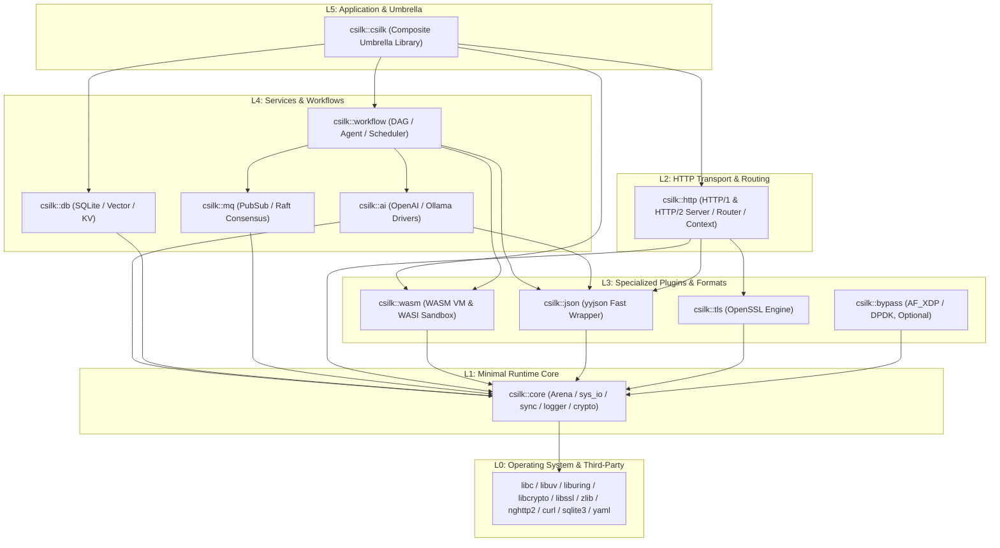

# csilk-core Dependency Boundary Decoupling and Minimal Runtime Architecture Specification

- **Date**: 2026-08-18
- **Status**: Approved
- **Author**: Antigravity & quintin

---

## 1. Executive Summary & Problem Statement

### 1.1 Context
`csilk-core` historically accumulated multiple cross-cutting concerns: memory allocators, request context, Radix-tree routing, JSON manipulation (yyjson wrappers), MVCC cache, io_uring I/O loops, WASM sandboxing, AF_XDP/DPDK kernel bypass networking, and cryptographic primitives (40+ source files in total).

### 1.2 Problems with the Previous Monolithic Core
1. **Lack of Minimal Runtime**: Downstream consumers desiring only memory arenas, logging, or cryptography were forced to link yyjson, HTTP routing tables, and WASM engines.
2. **Layer Inversion (Reverse Dependencies)**: Core request context (`ctx_json.c`) directly referenced reflection symbols (`csilk_json_unmarshal`), making the low-level core dependent on high-level serialization.
3. **Coarse Coupling**: Subsystems like WASM virtual machines and AF_XDP/DPDK hardware bypass drivers were bundled into `csilk_core`, hindering clean static library dead-code elimination and portability.

---

## 2. Target Multi-Tier Architecture & Dependency Graph

### 2.1 Layer Hierarchy & Strict Unidirectional Flow

Dependencies strictly flow downwards. No module may reference or depend on a higher or sibling layer:

---

## 3. Modular Target & Source File Breakdown

### 3.1 `csilk::core` (`libcsilk-core.a` / `libcsilk-core.so`) — Minimal Runtime
Contains only platform-agnostic runtime primitives (12 components):
- **Memory**: `src/core/primitives/arena.c`, `src/core/primitives/bounded_buf.c`
- **Data Structures**: `src/core/primitives/kv_store.c`, `src/core/cache/mvcc_cache.c`
- **Configuration & Logging**: `src/core/config/config.c`, `src/core/config/logger.c`, `src/core/config/hot_reload.c`, `src/core/config/hooks.c`
- **Diagnostics**: `src/util/flamegraph.c`
- **Cryptography & Encoding**: `src/crypto/base64.c`, `src/crypto/sha1.c`, `src/crypto/url.c`, `src/crypto/uuid.c`, `src/crypto/crypto.c`, `src/crypto/bcrypt.c`, `src/drivers/cipher/openssl.c`
- **I/O Loop (io_uring backend when enabled)**: `src/core/uring/uring_*.c`

### 3.2 `csilk::json` (`libcsilk-json.a` / `libcsilk-json.so`) — General JSON Engine
All 13 yyjson wrappers:
- `src/core/json/json_internal.c`, `src/core/json/json_factory.c`, `src/core/json/json_object.c`, `src/core/json/json_array.c`, `src/core/json/json_access.c`, `src/core/json/json_type.c`, `src/core/json/json_parse.c`, `src/core/json/json_serialize.c`, `src/core/json/json_free.c`, `src/core/json/json_copy.c`, `src/core/json/json_iterate.c`, `src/core/json/json_mutate.c`, `src/core/json/json.c`

### 3.3 `csilk::http` (`libcsilk-http.a` / `libcsilk-http.so`) — HTTP & Routing
- **Context & Primitives**: `src/core/ctx/context.c`, `src/core/ctx/ctx_accessors.c`, `src/core/ctx/ctx_defer.c`, `src/core/ctx/ctx_json.c`, `src/core/primitives/recovery.c`, `src/core/primitives/header_map.c`, `src/core/primitives/query.c`, `src/core/primitives/response.c`
- **Routing Engine**: `src/core/primitives/router.c`, `src/core/primitives/router_simd.c`, `src/core/primitives/router_trie.c`
- **Server Core**: `src/core/http/http1_*.c`, `src/core/http/swar_http.c`, `src/core/server/connection*.c`, `src/core/server/server*.c`, `src/app/app*.c`, `src/app/group.c`, `src/app/admin.c`, `src/middleware/*.c`

### 3.4 `csilk::wasm` (`libcsilk-wasm.a`) — WASM Sandbox & VM
- `src/core/plugin/wasm_plugin.c`, `src/core/plugin/wasm_vm.c`, `src/core/plugin/wasm_wasi.c`

### 3.5 `csilk::bypass` (`libcsilk-bypass.a`) — Kernel Bypass Acceleration
- `src/core/io/af_xdp.c`, `src/core/io/af_xdp_zerocopy.c`, `src/core/io/dpdk_pmd.c`, `src/core/io/io_perf_probe.c`

---

## 4. Header Hygiene & API Compatibility

1. **`include/csilk/core/internal.h` Sanitization**:
   `internal.h` declares exclusively L1 runtime primitives (`csilk_arena_*`, `csilk_mutex_*`, `csilk_io_*`, `csilk_logger_*`). All HTTP, Router, and JSON internal definitions are removed from `internal.h`.
2. **Backward Header Compatibility**:
   `<csilk/csilk.h>` continues to include all public subsystems. `<csilk/core/context.h>` and `<csilk/core/router.h>` remain supported as canonical headers while `<csilk/http/context.h>` and `<csilk/http/router.h>` aliases are introduced.
3. **Zero Reverse Dependency**:
   `libcsilk-core.so` and `libcsilk-core.a` have zero undefined symbols pointing to higher layers.

---

## 5. Build, pkg-config & Verification Matrix

### 5.1 pkg-config Templates
- `csilk-core.pc`: `Requires.private: libuv/liburing libcrypto yaml-0.1`, `Libs: -lcsilk-core`, `Libs.private: -lcrypto -lyaml -lm -lpthread`
- `csilk-json.pc`: `Requires: csilk-core`, `Libs: -lcsilk-json`, `Libs.private: -lyyjson`
- `csilk-wasm.pc`: `Requires: csilk-core`, `Libs: -lcsilk-wasm`
- `csilk-http.pc`: `Requires: csilk-core csilk-json csilk-http2 csilk-mq`, `Requires.private: zlib`, `Libs: -lcsilk-http`, `Libs.private: -lz -lllhttp -lssl -lcrypto`

### 5.2 Verification
- 100% CTest pass rate (169 unit & integration tests on Linux and macOS).
- 100% io_uring test suite pass rate.
- Static & shared downstream compilation tests for minimal standalone `csilk::core`, `csilk::json`, and `csilk::http`.
