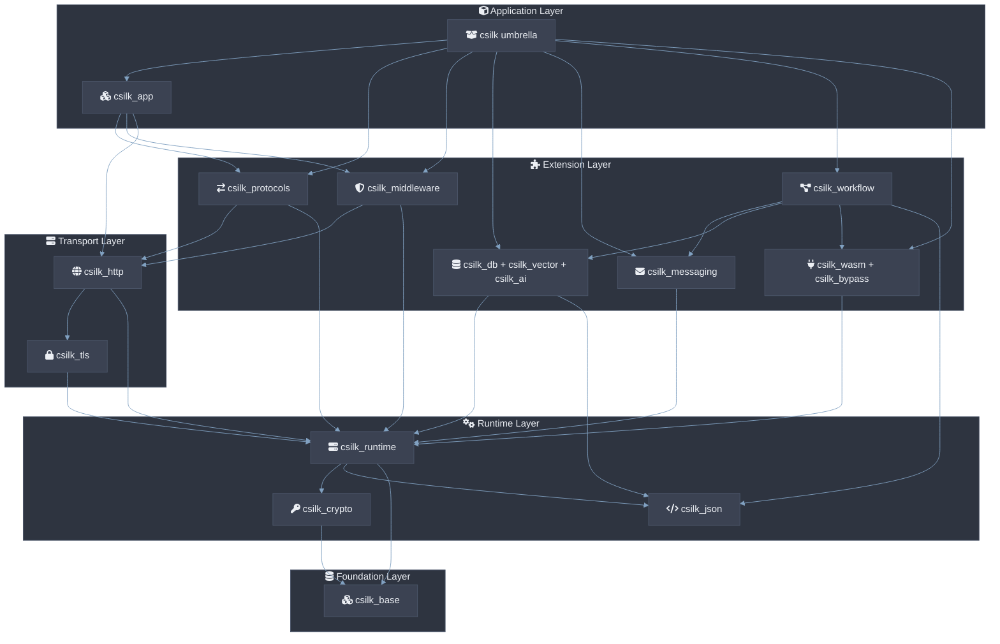

# CMake Target 拆分（第一阶段）设计说明

- **日期**：2026-08-31
- **状态**：已实现；CMake 构建与安装验证完成，Python test-support 兼容性待后续处理
- **范围**：仅调整 CMake source manifest、target 依赖、安装导出与兼容层
- **迁移策略**：渐进迁移
- **核心约束**：不移动 `src/` 文件、不改变 public API、不改变 Python 扩展入口、不修改版本号

## 1. 设计目标

第一阶段必须将构建系统中的职责边界与实际模块职责对齐，降低 `csilk_http` 与 `csilk_core` 的耦合。源码物理路径暂时保持不变，以减少 include 路径、Git 历史和构建风险。现有 `csilk` umbrella target、兼容 target 和公共头文件路径继续有效。

### 1.1 成功标准

- `csilk_http` 不再直接编译 app、middleware、reflection、permission、WebSocket 和 OpenAPI 实现。
- `csilk_core` 不再直接拥有 runtime 之外的 crypto 实现；新增 `csilk_runtime` 承担 context、router、server、config 和 backend runtime。
- `csilk_db` 与 `csilk_vector` 独立构建；`csilk::db` 继续指向数据库 target。
- 静态库、共享库、CMake package export 和 pkg-config 元数据保持可用。
- 既有测试仍可通过 umbrella target `csilk` 链接，不要求第一阶段移动测试文件。
- 默认 libuv、io_uring、静态库、共享库和可选数据库驱动构建路径均能通过验证；Python wrapper 对测试专用 context helper 的加载仍需后续适配。

## 2. 总体架构

本阶段按职责建立模块 target。`base` 提供最底层公共设施，`runtime` 提供框架运行时，`http` 提供 HTTP/1 与 TLS 适配，`protocols`、`middleware`、`app` 位于更高层。数据库、向量、AI、消息和插件作为 runtime 的旁路扩展。`csilk` 仅聚合 targets；`csilk_shared` 复用各模块 object library，避免 shared 构建重复编译实现源码。



### 2.1 组件拆解

- **`csilk_base`**：arena、bounded buffer、KV、header map、query、URL 等底层设施；不得依赖 HTTP、app、middleware 或具体 driver。
- **`csilk_crypto`**：密码学 primitive、crypto/cipher dispatch、bcrypt、UUID、SHA、Base64 以及 OpenSSL cipher driver。
- **`csilk_runtime`**：context、router、server lifecycle、connection lifecycle、config、cache 和 I/O backend glue。
- **`csilk_http`**：HTTP/1 parser、serializer、pipeline、response、zero-copy 和 HTTP-facing TLS 接口。
- **`csilk_protocols`**：HTTP/2、HTTP/3、WebSocket、OpenAPI/Swagger 与 MCP 的协议聚合层。
- **`csilk_middleware`**：认证、安全、流量控制、观测、流式响应和响应转换中间件。
- **`csilk_app`**：app builder、route/group、admin handlers。
- **`csilk_db` / `csilk_vector` / `csilk_ai` / `csilk_messaging` / `csilk_workflow` / `csilk_wasm` / `csilk_bypass`**：面向领域的旁路扩展。
- **`csilk`**：interface umbrella；只链接模块，不直接编译实现源码。
- **`csilk_shared`**：兼容 ABI shared library；复用模块 object library，不重复编译实现源码。

## 3. Target 与 source ownership

第一阶段只修改 `cmake/sources.cmake` 的 source ownership。源码文件继续留在当前路径，后续物理重组另行设计。

### 3.1 `csilk_base`

```cmake
set(CSILK_BASE_SOURCES
    src/core/primitives/arena.c
    src/core/primitives/bounded_buf.c
    src/core/primitives/kv_store.c
    src/core/primitives/header_map.c
    src/core/primitives/query.c
    src/core/primitives/url.c
)
```

依赖：`Threads::Threads`，以及非 Apple/Windows 平台的 `m`。

### 3.2 `csilk_crypto`

```cmake
set(CSILK_CRYPTO_SOURCES
    src/crypto/base64.c
    src/crypto/sha1.c
    src/crypto/cipher_dispatch.c
    src/crypto/uuid.c
    src/crypto/crypto.c
    src/crypto/bcrypt.c
    src/drivers/cipher/openssl.c
)
```

依赖：`csilk_base`、`OpenSSL::Crypto`、`Threads::Threads`。

如果当前树中尚未存在 `src/crypto/cipher_dispatch.c` 或 crypto 文件仍处于历史路径，实现前必须先以当前源码实际状态为准，不得在 source manifest 中声明不存在的文件。该设计只规定归属，不预先假设文件移动或拆分已完成。

### 3.3 `csilk_runtime`

```cmake
set(CSILK_RUNTIME_SOURCES
    src/core/ctx/context.c
    src/core/ctx/ctx_accessors.c
    src/core/ctx/ctx_async.c
    src/core/ctx/ctx_defer.c
    src/core/ctx/ctx_json.c

    src/core/config/config.c
    src/core/config/logger.c
    src/core/config/hooks.c
    src/core/config/hot_reload.c

    src/core/primitives/recovery.c
    src/core/primitives/response.c
    src/core/primitives/router.c
    src/core/primitives/router_simd.c
    src/core/primitives/router_trie.c

    src/core/server/connection_pool.c
    src/core/server/connection_state.c
    src/core/server/timer_lifetime.c
    src/core/server/connection_timer.c
    src/core/server/connection_close.c
    src/core/server/connection_io.c
    src/core/server/connection.c
    src/core/server/server_lifecycle.c
    src/core/server/server_driver.c
    src/core/server/server_rcu.c
    src/core/server/server_shutdown.c
    src/core/server/server_worker.c
)
```

固定 runtime I/O 源码：

```cmake
set(CSILK_RUNTIME_IO_SOURCES
    src/core/uring/uring_buf.c
    src/core/uring/uring_sqpoll.c
    src/core/uring/uring_vector.c
)
```

启用 io_uring 时追加其余 `uring_*.c` backend 实现。runtime 依赖 `csilk_base`、`csilk_crypto`、`csilk_json`、libuv 或 liburing、libyaml、`OpenSSL::Crypto` 和线程库。

`src/core/test_utils.c` MUST NOT 进入生产 `csilk_runtime` target；如果现有 source manifest包含它，第一阶段应将其移出生产 source list，并由测试 target 私有编译。

### 3.4 `csilk_tls`

保留现有 target 和源码：

```cmake
set(CSILK_TLS_SOURCES
    src/core/http/tls.c
)
```

依赖：`csilk_runtime`、`OpenSSL::SSL`、`OpenSSL::Crypto`。

### 3.5 `csilk_http`

仅保留 HTTP/1 实现：

```cmake
set(CSILK_HTTP_SOURCES
    src/core/http/http1_parse.c
    src/core/http/http1_serialize.c
    src/core/http/http1_write.c
    src/core/http/http1_pipeline.c
    src/core/http/http1_response.c
    src/core/http/http1_zerocopy.c
    src/core/http/swar_http.c
)
```

依赖：`csilk_runtime`、`csilk_json`、`csilk_tls`、llhttp、`ZLIB::ZLIB`（仅当 source list 中仍有 gzip implementation 时不应由 http 获得；gzip 将归 middleware）。

### 3.6 `csilk_http2` 与 `csilk_protocols`

保留 `csilk_http2` 作为可独立链接的协议 target：

```cmake
set(CSILK_HTTP2_SOURCES
    src/core/http/h2_callbacks.c
    src/core/http/h2_session.c
    src/core/http/h2_response.c
    src/core/http/h2.c
    src/protocols/h3.c
)
```

现有 `h3.c` 归入该 target 是兼容性过渡；第二阶段可将 HTTP/3 拆出 `csilk_http3`。

新增 `csilk_protocols` 聚合实现：

```cmake
set(CSILK_PROTOCOLS_SOURCES
    src/protocols/websocket.c
    src/protocols/ws_room.c
    src/protocols/swagger.c
    src/protocols/swagger_serve.c
    src/protocols/openapi_gen.c
    src/protocols/mcp/mcp_jsonrpc.c
    src/protocols/mcp/mcp_server.c
    src/protocols/mcp/mcp_client.c
)
```

依赖：`csilk_http`、`csilk_http2`、`csilk_runtime`、`csilk_json`、nghttp2（通过 `csilk_http2` 传递）。

MCP 当前包含 workflow internal header 的反向依赖，第一阶段 MUST 保持该实现不变并记录为后续边界修复项；不得为此让 `csilk_runtime` 依赖 workflow。

### 3.7 `csilk_middleware`

新增聚合 source list，内部按职责组织变量但第一阶段只生成一个库：

```cmake
set(CSILK_MIDDLEWARE_SECURITY_SOURCES
    src/middleware/auth.c
    src/middleware/csrf.c
    src/middleware/jwt.c
    src/middleware/waf.c
    src/middleware/xdp_waf.c
    src/middleware/security_headers.c
)

set(CSILK_MIDDLEWARE_TRAFFIC_SOURCES
    src/middleware/ratelimit.c
    src/middleware/sliding_ratelimit.c
    src/middleware/circuit_breaker.c
)

set(CSILK_MIDDLEWARE_OBSERVABILITY_SOURCES
    src/middleware/logger.c
    src/middleware/metrics.c
    src/middleware/request_id.c
    src/middleware/otlp_trace.c
    src/middleware/otlp_exporter.c
)

set(CSILK_MIDDLEWARE_STREAMING_SOURCES
    src/middleware/sse.c
)

set(CSILK_MIDDLEWARE_TRANSFORM_SOURCES
    src/middleware/cors.c
    src/middleware/gzip.c
    src/middleware/multipart.c
    src/middleware/session.c
    src/middleware/static.c
    src/middleware/validate.c
    src/middleware/grpc_gateway.c
)

set(CSILK_MIDDLEWARE_SOURCES
    ${CSILK_MIDDLEWARE_SECURITY_SOURCES}
    ${CSILK_MIDDLEWARE_TRAFFIC_SOURCES}
    ${CSILK_MIDDLEWARE_OBSERVABILITY_SOURCES}
    ${CSILK_MIDDLEWARE_STREAMING_SOURCES}
    ${CSILK_MIDDLEWARE_TRANSFORM_SOURCES}
)
```

依赖：`csilk_http`、`csilk_runtime`、`csilk_json`、`csilk_tls`（仅在实际实现需要时）、`ZLIB::ZLIB`、OpenSSL 和线程库。

`grpc_gateway.c` 在第一阶段暂时保留 middleware target 中以避免 adapter 拆分；第二阶段 SHOULD 移至协议层并保留 middleware adapter。

### 3.8 `csilk_reflection`

新增/保留 reflection target：

```cmake
set(CSILK_REFLECTION_SOURCES
    src/reflection/reflect.c
    src/reflection/reflect_marshal.c
    src/reflection/reflect_unmarshal.c
    src/reflection/reflect_free.c
)
```

依赖：`csilk_runtime`、`csilk_json`。

### 3.9 `csilk_app`

```cmake
set(CSILK_APP_SOURCES
    src/app/app.c
    src/app/app_routes.c
    src/app/group.c
    src/app/admin.c
)
```

依赖：`csilk_http`、`csilk_protocols`、`csilk_middleware`、`csilk_reflection`、`csilk_db`、`csilk_ai`。

`admin.c` 目前直接包含 DB/AI public headers，因此第一阶段允许 app 对 driver target 存在显式依赖；后续可将 dashboard provider 改为接口注入。

### 3.10 `csilk_db` 与 `csilk_vector`

数据库 target 只拥有数据库实现：

```cmake
set(CSILK_DB_SOURCES
    src/drivers/db/db.c
    src/drivers/db/sqlite.c
    src/drivers/db/mysql.c
    src/drivers/db/postgres.c
    src/drivers/db/redis.c
    src/drivers/db/redis_storage.c
    src/drivers/db/mongodb.c
)
```

Vector 独立：

```cmake
set(CSILK_VECTOR_SOURCES
    src/drivers/vector/vector.c
    src/drivers/vector/vector_simd.c
    src/drivers/vector/vector_hnsw.c
    src/drivers/vector/qdrant.c
    src/drivers/vector/milvus.c
)
```

依赖：

- `csilk_db` → `csilk_runtime`、`csilk_json`、SQLite、CURL 以及可选 DB client targets。
- `csilk_vector` → `csilk_runtime`、`csilk_json`、CURL。

`csilk::db` MUST 继续指向 `csilk_db`。`csilk_vector` 从 `csilk_db` 中分离属于构建边界变化；已有用户若依赖 `libcsilk-db` 间接获得 vector symbols，迁移说明 MUST 明确要求显式链接 `csilk::vector`。

### 3.11 既有扩展 target

以下 target 第一阶段保留名称，仅调整底层依赖：

```text
csilk_ai       → csilk_runtime + csilk_json
csilk_mq       → csilk_runtime
csilk_wasm     → csilk_runtime
csilk_bypass   → csilk_runtime
csilk_workflow → csilk_runtime + csilk_json + csilk_ai + csilk_mq + csilk_wasm
```

## 4. 兼容层与导出规则

### 4.1 CMake target 兼容

- `csilk::core` MUST 保留，指向新的 `csilk_runtime` 兼容层。
- `csilk::db` MUST 保留，指向 `csilk_db`。
- `csilk::http`、`csilk::http2`、`csilk::tls`、`csilk::ai`、`csilk::mq`、`csilk::workflow`、`csilk::wasm`、`csilk::bypass` MUST 保留。
- 新增 aliases：`csilk::crypto`、`csilk::runtime`、`csilk::protocols`、`csilk::middleware`、`csilk::reflection`、`csilk::app`、`csilk::vector`。
- shared targets 使用对应的 `_shared` 后缀，并保持现有 `csilk_shared` umbrella。

### 4.2 Umbrella target

`csilk` interface target MUST 链接所有公共模块，但不得重复引入同一组实现 source。推荐链接顺序：

```cmake
target_link_libraries(csilk INTERFACE
    csilk_app
    csilk_workflow
    csilk_messaging
    csilk_ai
    csilk_db
    csilk_vector
    csilk_protocols
    csilk_middleware
    csilk_reflection
    csilk_http
    csilk_http2
    csilk_tls
    csilk_wasm
    csilk_bypass
    csilk_runtime
    csilk_crypto
    csilk_json
    csilk_base
)
```

实际 CMake 链接顺序 MUST 以静态库符号解析结果和现有 target 传递依赖为准验证，不得仅凭文本顺序判断正确性。

### 4.3 Shared target

共享库 target MUST 与静态 target 使用相同 source ownership 和依赖图，不能继续用旧的 `${CSILK_SOURCES}` 直接把所有实现重新编译进 `csilk_shared` 后再链接模块 shared libraries，否则会造成重复符号和边界失真。

本阶段采用 object-library 方案：每个模块只有一个 object compilation owner；静态 archive、模块 shared library 和兼容 ABI 的 `csilk_shared` 均复用对应对象。模块 shared target 的依赖优先映射到对应 `_shared` provider，避免 shared target 意外回落到静态库。

## 5. 安装、pkg-config 与 Python 影响

### 5.1 CMake install/export

`cmake/install.cmake` MUST：

- 将 `csilk_crypto`、`csilk_runtime`、`csilk_protocols`、`csilk_middleware`、`csilk_reflection`、`csilk_app`、`csilk_vector` 加入静态安装 target 列表。
- 在 `CSILK_BUILD_SHARED` 时加入对应 `_shared` targets。
- 将新 aliases 随 `csilk-targets.cmake` 导出。
- 不改变 `include/` 安装路径。

### 5.2 pkg-config

每个新增模块 SHOULD 有独立 `.pc` 元数据，至少覆盖：

| 模块 | `Requires.private` | `Libs` |
|---|---|---|
| crypto | `csilk-base openssl` | `-lcsilk-crypto` |
| runtime | `csilk-base csilk-crypto csilk-json libuv` 或 `liburing` | `-lcsilk-runtime` |
| protocols | `csilk-http csilk-http2` | `-lcsilk-protocols` |
| middleware | `csilk-http csilk-runtime`、`zlib` | `-lcsilk-middleware` |
| reflection | `csilk-runtime csilk-json` | `-lcsilk-reflection` |
| app | `csilk-http csilk-protocols csilk-middleware` | `-lcsilk-app` |
| vector | `csilk-runtime csilk-json` | `-lcsilk-vector` |

如果当前 `.pc` 模板生成逻辑只支持固定模块列表，第一阶段 MUST 扩展该列表，而不是手工生成未被 CMake 安装的文件。

### 5.3 Python

Python CMake extension MUST 继续只构建 `csilk_shared`，不改变 `csilk._dummy_ext`、输出目录和 setuptools 入口。其验证目标为 `csilk_shared` 能通过新的 shared target 链完成构建。

## 6. 风险与处理

| 风险 | 严重度 | 处理 |
|---|:---:|---|
| 静态库循环依赖 | 高 | 先建立 source ownership，再按依赖图创建 targets；必要时使用 PRIVATE/PUBLIC 精确控制传递依赖 |
| shared library 重复编译实现 | 高 | 禁止新旧 `${CSILK_SOURCES}` 与模块 sources 双重聚合；每个实现源只能归属一个模块 |
| `csilk_core` 下游兼容性 | 中 | 保留 `csilk::core` alias/兼容 interface，保留公共头路径 |
| vector 用户链接行为变化 | 中 | 保留 API/header，文档明确显式链接 `csilk::vector` |
| MCP → workflow internal 反向依赖 | 中 | 第一阶段不扩大依赖范围；第二阶段改为 public adapter 或协议回调 |
| optional DB source 条件 | 中 | 保持现有 CMake 条件追加逻辑，只将追加源加入 `CSILK_DB_SOURCES` |
| 测试工具进入生产库 | 中 | `src/core/test_utils.c` MUST 从生产 source ownership 删除并移至测试 target |
| Python 构建链断裂 | 中 | 独立执行 `csilk_shared` 构建和 Python 测试 |

## 7. 验证矩阵

CMake 实现已执行并通过：

```bash
cmake --build build --target csilk_base csilk_crypto csilk_runtime
cmake --build build --target csilk_tls csilk_http csilk_http2 csilk_protocols
cmake --build build --target csilk_middleware csilk_reflection csilk_app
cmake --build build --target csilk_db csilk_vector csilk_ai csilk_mq csilk_workflow
cmake --build build --target csilk
cmake --build build --target csilk_shared
ctest --test-dir build -E test_integration --timeout 30 --output-on-failure
cmake --build build --target check-format
```

如果当前 `build` 目录未包含所需 target 或配置选项不匹配，MUST 使用新的 variant 目录配置，不得重复配置已有 build 目录。

额外验证：

- libuv 默认 backend 构建；
- 独立 io_uring build variant 构建；
- `CSILK_BUILD_SHARED=ON`；
- 可选 DB client source 条件；
- Python shared library 构建目标 `csilk_shared`；Python wrapper 的完整测试因其仍无条件绑定 test-only symbols，暂列为后续兼容工作；
- 安装导出的 CMake package 至少完成一个下游 compile smoke test；
- `python3 scripts/check_mermaid.py .`；
- `./scripts/check_version_sync.sh`。

## 8. 第二阶段遗留项

- 按目标结构实际移动 `src/` 文件；
- 重新组织 `include/csilk/`，同时保留兼容 wrapper；
- 将 `src/protocols/mcp/mcp_server.c` 与 workflow internal header 解耦；
- 将 `grpc_gateway.c` 移至协议层并保留 middleware adapter；
- 将 `csilk_http2` 与 HTTP/3 拆为独立 target；
- 将 middleware 聚合库进一步拆为 security/traffic/observability/streaming/transform 子库；
- 将 app admin 对 DB/AI 的硬依赖改成接口注入；
- 将测试按 unit/integration/stress/benchmark/fixtures 重新布局。
