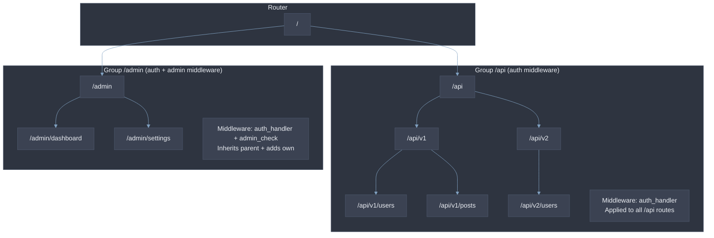
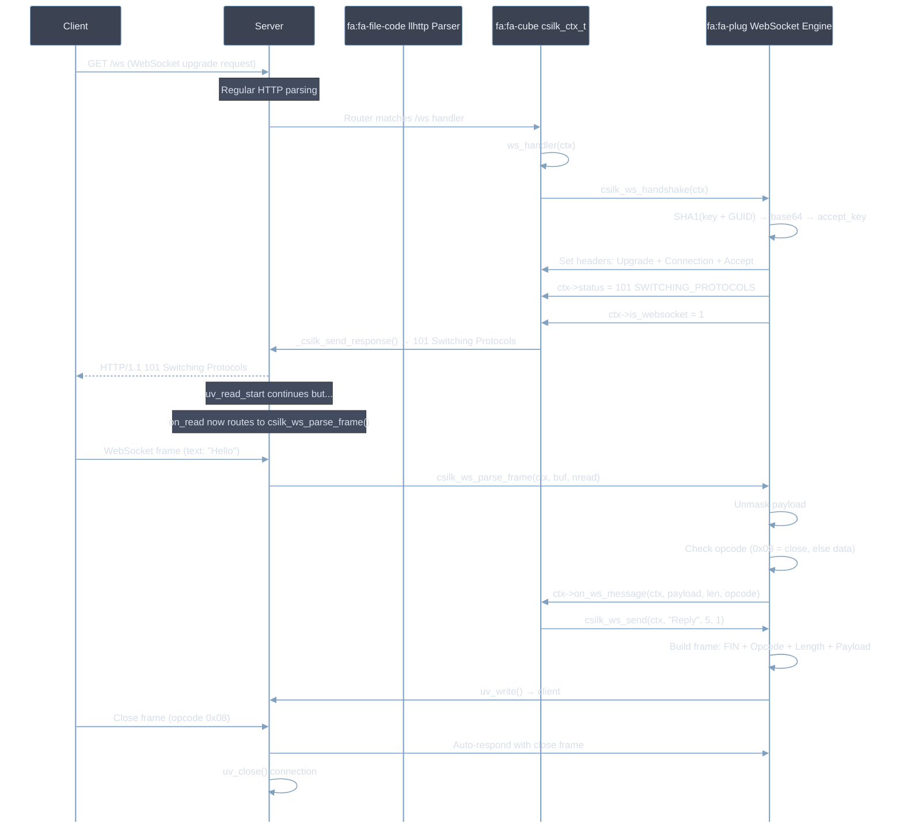
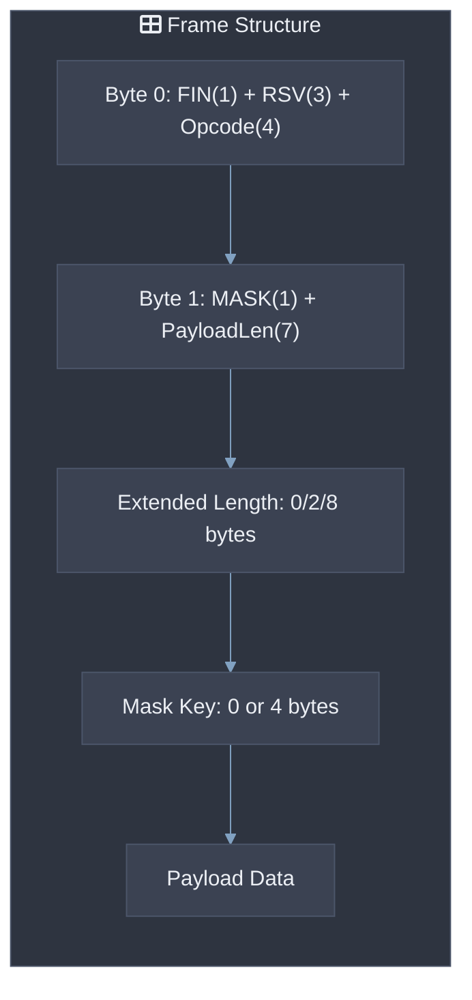
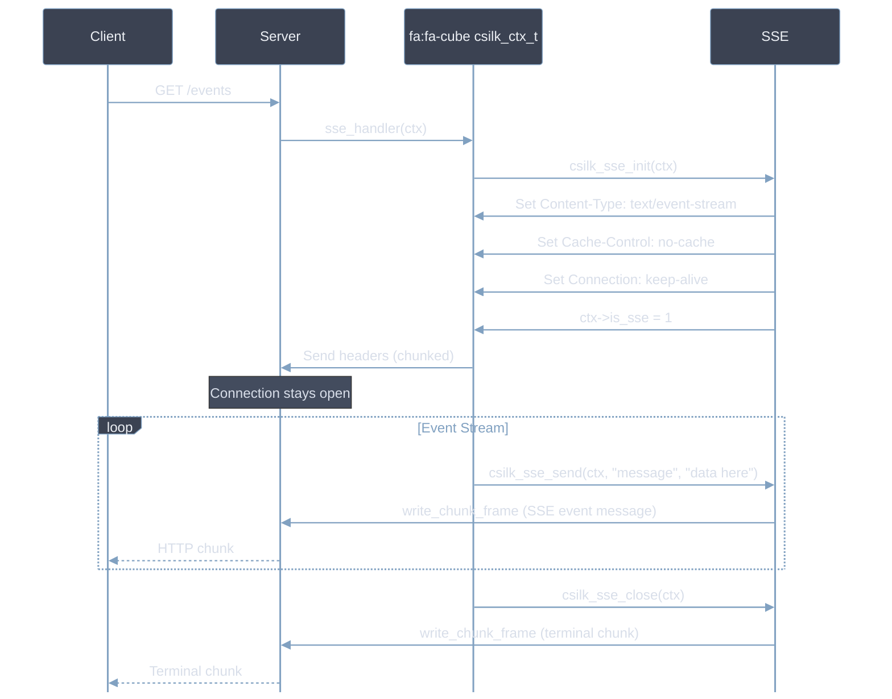
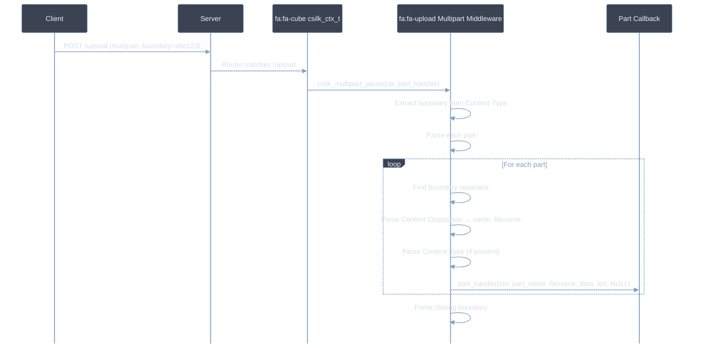
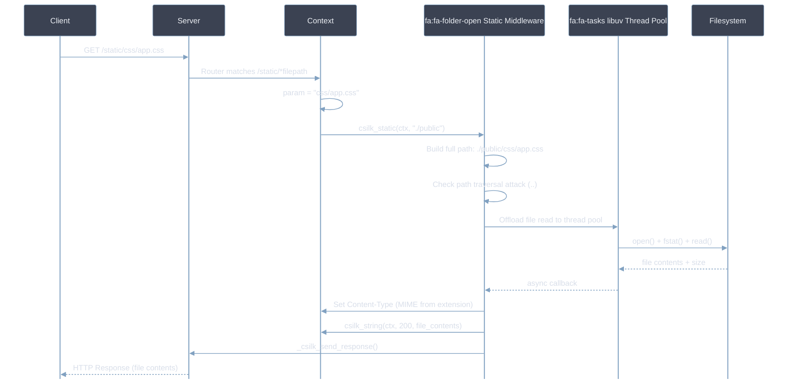
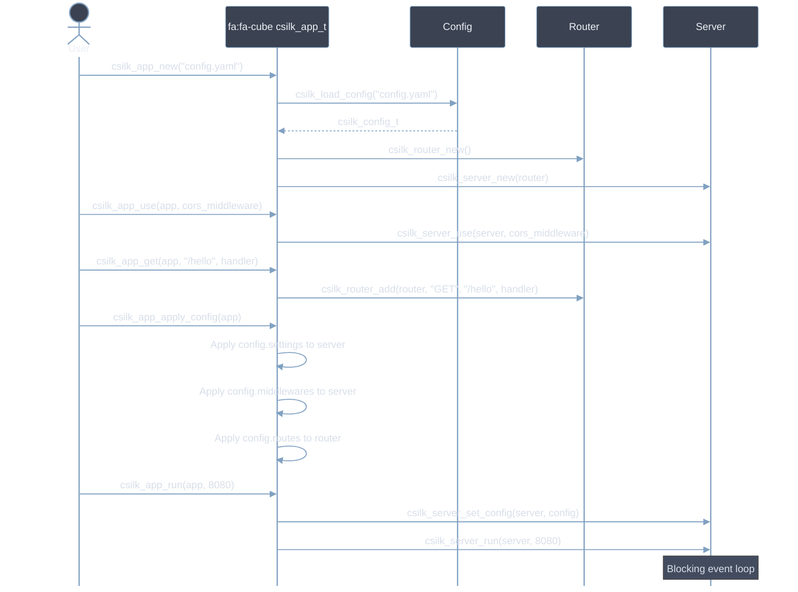

# Advanced Usage

This guide covers advanced csilk usage patterns: WebSocket, SSE, multipart uploads, gzip compression, static file serving, and multi-worker configuration. Code examples **SHOULD** be adapted to your specific use case. All middleware **MUST** be registered before `csilk_server_run()`.

## Route Groups

Route groups allow prefix-based route organization and middleware scoping:



### Group Code Example

```c
csilk_group_t* api = csilk_group_new(router, "/api");
csilk_group_use(api, auth_handler);     // All /api/* routes require auth
csilk_GET(api, "/users", list_users);

csilk_group_t* admin = csilk_group_group(api, "/admin");
csilk_group_use(admin, admin_handler);  // /api/admin/* requires auth + admin
csilk_GET(admin, "/dashboard", dashboard);
```

## WebSocket Protocol



### WebSocket Frame Format



## Server-Sent Events (SSE)



## Multipart Form Data



## Gzip Compression

```mermaid
%%{init: {'theme': 'base', 'themeVariables': {'background': '#2E3440','primaryColor':'#81A1C1','primaryBorderColor':'#4C566A','primaryTextColor':'#ECEFF4','secondaryColor':'#3B4252','secondaryBorderColor':'#434C5E','secondaryTextColor':'#D8DEE9','lineColor':'#81A1C1','textColor':'#ECEFF4','mainBkg':'#3B4252','nodeBorder':'#4C566A','clusterBkg':'#2E3440','clusterBorder':'#4C566A','titleColor':'#ECEFF4','edgeLabelBackground':'#3B4252','nodeTextColor':'#ECEFF4','actorBorder':'#81A1C1','actorBkg':'#3B4252','actorTextColor':'#ECEFF4','signalColor':'#81A1C1','signalTextColor':'#D8DEE9','noteBkgColor':'#434C5E','noteTextColor':'#D8DEE9','loopTextColor':'#81A1C1','sequenceNumberColor':'#ECEFF4'}, 'sequence': {'actorFontSize': 14, 'noteFontSize': 12, 'messageFontSize': 12, 'mirrorActors': false}}}%%
sequenceDiagram
    participant Client
    participant Server
    participant Context
    participant Gzip MW as fa:fa-archive Gzip Middleware
    participant TP as fa:fa-tasks libuv Thread Pool
    participant Zlib

    Client->>Server: GET /data (with Accept-Encoding: gzip)

    Note over Server: Middleware captures response

    Server->>Gzip MW: gzip_handler(ctx)
    Gzip MW->>Gzip MW: csilk_next(ctx)
    Note over Gzip MW: Wait for handler to set response body

    Gzip MW->>Gzip MW: Check Accept-Encoding header
    alt Client accepts gzip
        Gzip MW->>TP: Offload compression work
        TP->>Zlib: deflate(response.body)
        Zlib-->>TP: compressed data
        TP-->>Gzip MW: async callback
        Gzip MW->>Context: Set Content-Encoding: gzip
        Gzip MW->>Context: Replace response.body with compressed data
    end

    Gzip MW->>Server: _csilk_send_response()
    Server-->>Client: HTTP Response (compressed)
```

## Static File Serving



## Admin Dashboard

The unified admin dashboard provides real-time monitoring of your csilk application:

```c
#include "csilk/app/admin.h"

int main() {
    csilk_app_t* app = csilk_app_new("config.yaml");

    // Register admin dashboard under /admin
    csilk_admin_serve(app, "/admin");

    csilk_app_run(app, 8080);
    csilk_app_free(app);
    return 0;
}
```

The dashboard includes:
- **HTTP Metrics**: QPS, latency histogram, status code distribution, active connections.
- **Workflow Monitoring**: Live execution graph, node-level timing, token budget tracking.
- **MQ Monitoring**: Queue depth, message throughput, consumer lag.
- **Database Telemetry**: Connection pool status, query latency.
- **AI Telemetry**: Model call count, token usage, error rates.
- **Process Metrics**: RSS memory, CPU usage, uptime.

## Database Drivers

csilk supports four database backends through a unified driver interface:

```c
#include "csilk/drivers/db.h"

// Initialize database pool from config
csilk_db_pool_t* pool = csilk_db_pool_new("sqlite", "data/app.db", 10);

// Execute query
csilk_db_result_t* result = csilk_db_query(pool, "SELECT * FROM users WHERE id = ?", 1);
if (result && result->row_count > 0) {
    printf("User: %s\n", result->rows[0][1]); // column 1 = name
}
csilk_db_result_free(result);
csilk_db_pool_free(pool);
```

## High-Level App API

The `csilk_app_t` wrapper simplifies server creation:



## Multi-Worker Mode

When `worker_threads > 1`, csilk uses `SO_REUSEPORT` to bind multiple listener
sockets — one per worker thread plus the main thread. The kernel distributes
incoming connections across all listeners.

### Thread Safety

In multi-worker mode, connection callbacks (`on_new_connection`) can execute on
any event loop thread. All shared mutable state accessed during connection
establishment must be thread-safe:

- **Client connection pool** (`pool_get`/`pool_put`): Each worker thread manages its own lock-free connection object pool, avoiding mutex contention.
- **Active client list**: Protected by `clients_mutex`.
- **Connection counters**: Use atomic operations (`atomic_fetch_add`).

### Graceful Shutdown

`csilk_server_stop()` signals the main loop to close its listener and
connections, then signals each worker thread to do the same via per-worker
`uv_async_t` handles. The main thread joins all workers in
`csilk_server_free()` after the event loop exits.

---

## Further Reading

For deep-dive architectural details of features covered in this guide:

| Feature | Module Design Document |
|---------|----------------------|
| Route Groups & Router Internals | [Router](../module-design/router.md) |
| WebSocket Protocol | [Protocols](../module-design/protocols.md) |
| SSE Protocol | [Protocols](../module-design/protocols.md) |
| Message Queue / Event Bus | [Messaging](../module-design/messaging.md) |
| Admin Dashboard | [App Layer](../module-design/app.md) |
| Database Drivers | [Data Layer](../module-design/data.md) |
| Server Multi-Worker & Shutdown | [Server Core](../module-design/server.md) |
