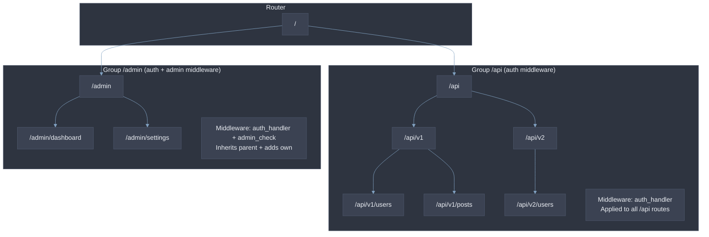
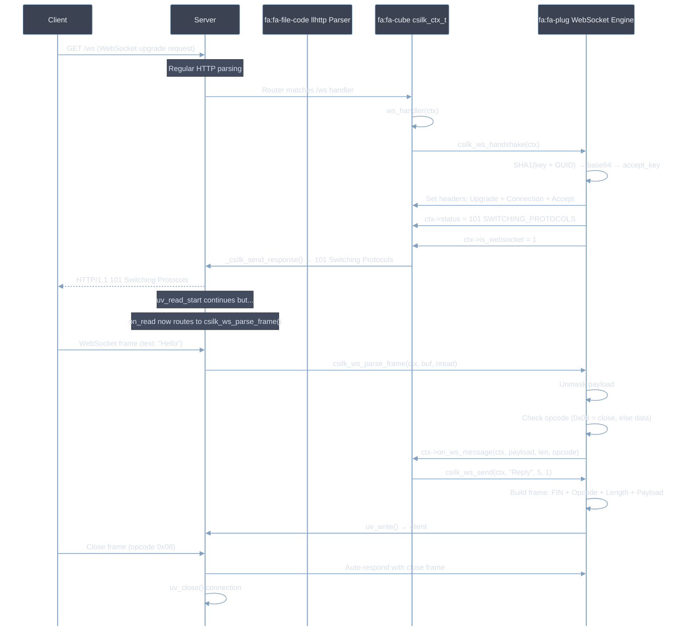
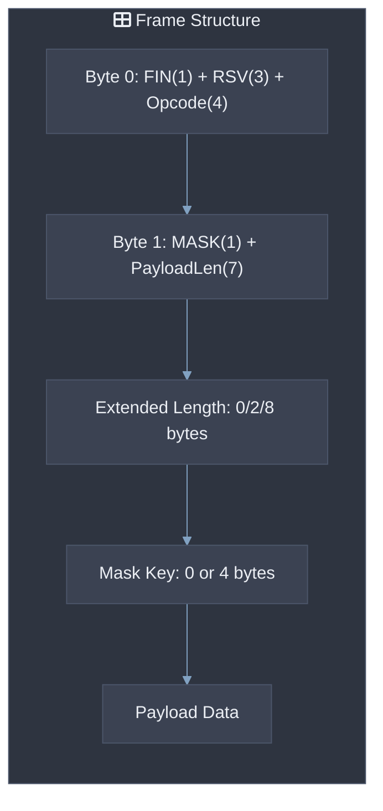
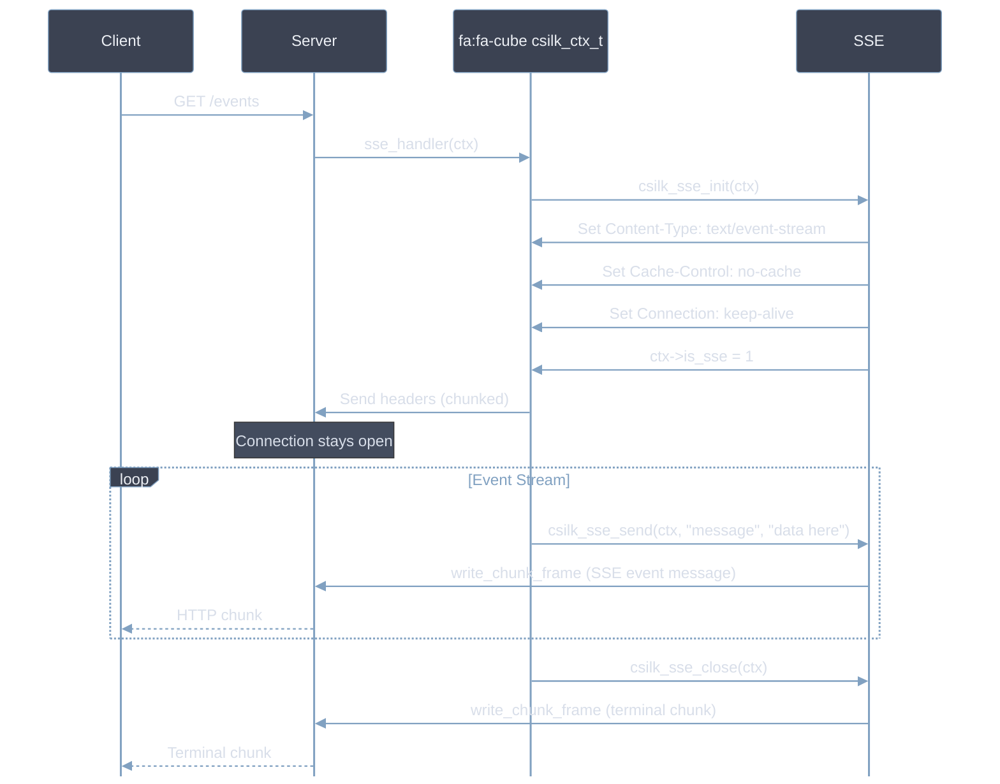
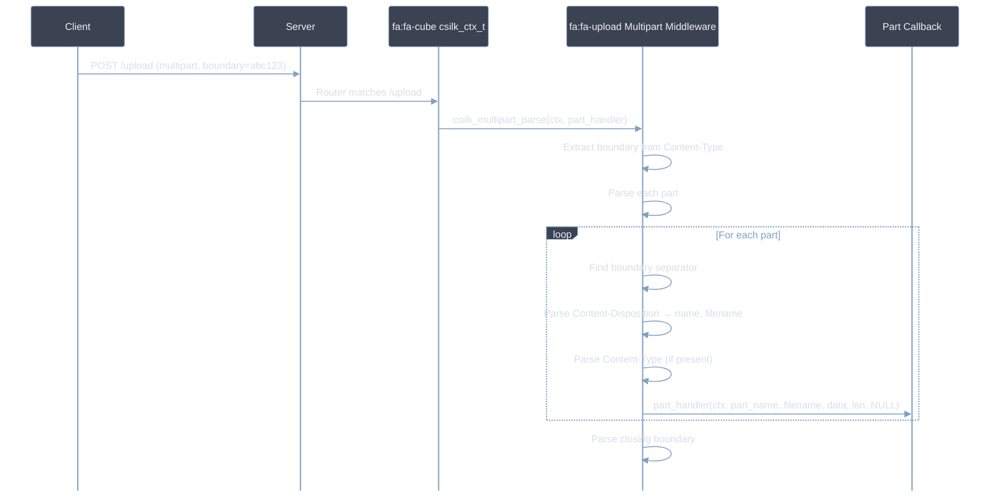
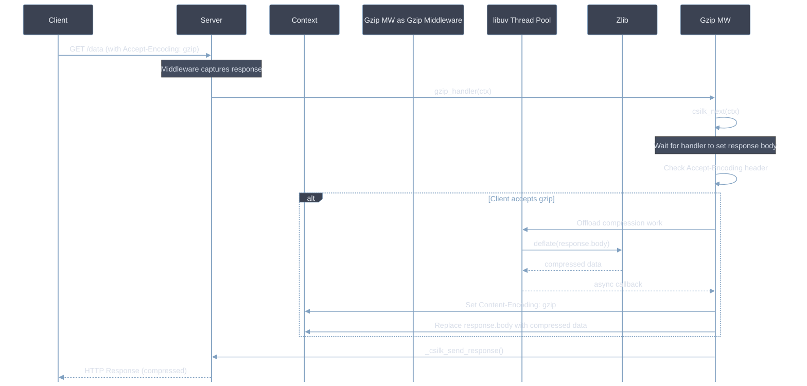
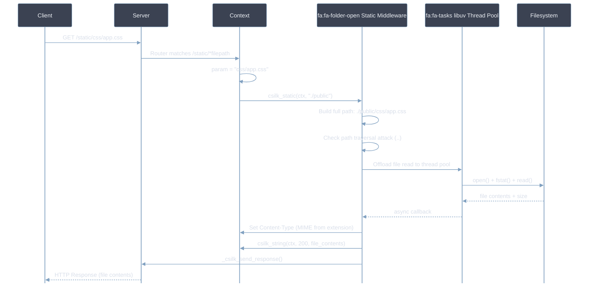
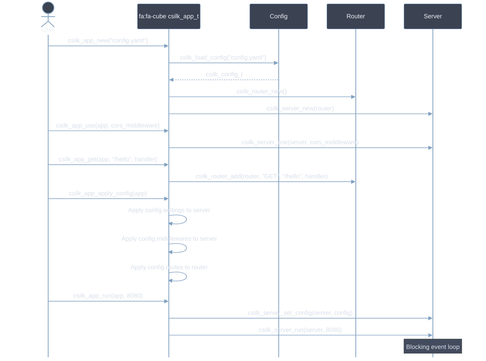

# Advanced Usage

This guide covers advanced csilk usage patterns: WebSocket, SSE, multipart uploads, gzip compression, static file serving, and multi-worker configuration. Code examples **SHOULD** be adapted to your specific use case. All middleware **MUST** be registered before `csilk_server_run()`.

## Route Groups

Route groups allow prefix-based route organization and middleware scoping:



### Group Code Example

```c
csilk_group_t* api = csilk_group_new(router, "/api");
csilk_group_use(api, auth_handler);     // All /api/* routes require auth
csilk_GET(api, "/users", list_users);

csilk_group_t* admin = csilk_group_group(api, "/admin");
csilk_group_use(admin, admin_handler);  // /api/admin/* requires auth + admin
csilk_GET(admin, "/dashboard", dashboard);
```

## WebSocket Protocol



### WebSocket Frame Format



## Server-Sent Events (SSE)



## Multipart Form Data



## Gzip Compression



## Static File Serving



## Admin Dashboard

The unified admin dashboard provides real-time monitoring of your csilk application:

```c
#include "csilk/app/admin.h"

int main() {
    csilk_app_t* app = csilk_app_new("config.yaml");

    // Register admin dashboard under /admin
    csilk_admin_serve(app, "/admin");

    csilk_app_run(app, 8080);
    csilk_app_free(app);
    return 0;
}
```

The dashboard includes:
- **HTTP Metrics**: QPS, latency histogram, status code distribution, active connections.
- **Workflow Monitoring**: Live execution graph, node-level timing, token budget tracking.
- **MQ Monitoring**: Queue depth, message throughput, consumer lag.
- **Database Telemetry**: Connection pool status, query latency.
- **AI Telemetry**: Model call count, token usage, error rates.
- **Process Metrics**: RSS memory, CPU usage, uptime.

## Database Drivers

csilk supports four database backends through a unified driver interface:

```c
#include "csilk/drivers/db.h"

// Initialize database pool from config
csilk_db_pool_t* pool = csilk_db_pool_new("sqlite", "data/app.db", 10);

// Execute query
csilk_db_result_t* result = csilk_db_query(pool, "SELECT * FROM users WHERE id = ?", 1);
if (result && result->row_count > 0) {
    printf("User: %s\n", result->rows[0][1]); // column 1 = name
}
csilk_db_result_free(result);
csilk_db_pool_free(pool);
```

## High-Level App API

The `csilk_app_t` wrapper simplifies server creation:



## Multi-Worker Mode

When `worker_threads > 1`, csilk uses `SO_REUSEPORT` to bind multiple listener
sockets — one per worker thread plus the main thread. The kernel distributes
incoming connections across all listeners.

### Thread Safety

In multi-worker mode, connection callbacks (`on_new_connection`) can execute on
any event loop thread. All shared mutable state accessed during connection
establishment must be thread-safe:

- **Client connection pool** (`pool_get`/`pool_put`): Each worker thread manages its own lock-free connection object pool, avoiding mutex contention.
- **Active client list**: Protected by `clients_mutex`.
- **Connection counters**: Use atomic operations (`atomic_fetch_add`).

### Graceful Shutdown

`csilk_server_stop()` signals the main loop to close its listener and
connections, then signals each worker thread to do the same via per-worker
`uv_async_t` handles. The main thread joins all workers in
`csilk_server_free()` after the event loop exits.

---

## Further Reading

For deep-dive architectural details of features covered in this guide:

| Feature | Module Design Document |
|---------|----------------------|
| Route Groups & Router Internals | [Router](../module-design/router.md) |
| WebSocket Protocol | [Protocols](../module-design/protocols.md) |
| SSE Protocol | [Protocols](../module-design/protocols.md) |
| Message Queue / Event Bus | [Messaging](../module-design/messaging.md) |
| Admin Dashboard | [App Layer](../module-design/app.md) |
| Database Drivers | [Data Layer](../module-design/data.md) |
| Server Multi-Worker & Shutdown | [Server Core](../module-design/server.md) |
| **Custom Middleware Development** | See below (本节新增) |
| **WebSocket Rooms 实现** | See below (本节新增) |
| **SSE 流式推送** | See below (本节新增) |
| **AI 工作流编排** | See below (本节新增) |
| **数据库事务管理** | See below (本节新增) |

---

## Custom Middleware Development (自定义中间件开发)

csilk 采用洋葱模型，请求自外向内经过中间件链。自定义中间件 MUST 遵循 `csilk_handler_t` 函数指针类型：

```c
typedef void (*csilk_handler_t)(csilk_ctx_t*, void*);

// 注册带参数的中间件
csilk_handler_t auth_handler = (csilk_handler_t)custom_auth_middleware;
csilk_set(c, "auth_role", "admin");  // 通过 Storage 传递参数

// 后续中间件可读取
csilk_str_view_t role = csilk_get(c, "auth_role");
```

**常见中间件模式**：

| 模式 | 用途 | MUST/SHOULD 规范 |
|:-----|------|-------------------|
| 认证 | JWT / Session 验证 | **MUST** 校验 Token 有效期和角色 |
| 验证 | 请求参数校验 | **SHOULD** 使用反射引擎（`csilk_bind_reflect`）自动绑定 |
| 限流 | 令牌桶算法 | **MUST** 设置 `Retry-After` Header |
| 日志 | 请求/响应记录 | **SHOULD** 记录 Request-Id 路径 |

### WebSocket Rooms 实现（基于 MQ）

WebSocket Rooms 实现跨连接的事件广播：

```c
// include/websocket/rooms.h
typedef struct {
    csilk_ws_t* ws;
    int client_fd;
    char room_id[64];
    bool is_active;
} ws_connection_t;

// 全局连接表（需加锁保护）
static struct {
    pthread_mutex_t lock;
    ws_connection_t* connections[4096];
    size_t count;
} rooms_ctx = {0};

int ws_rooms_join(csilk_ws_t* ws, const char* room_id) {
    pthread_mutex_lock(&rooms_ctx.lock);
    // 分配槽位、初始化连接、加入全局表
    // MUST 确保 thread-safe
    pthread_mutex_unlock(&rooms_ctx.lock);
    return 0;
}

int ws_rooms_broadcast(const char* room_id, const char* message, size_t len) {
    pthread_mutex_lock(&rooms_ctx.lock);
    // 遍历所有连接，查找属于该房间的连接
    // MUST 遍历时检查 is_active 标志
    pthread_mutex_unlock(&rooms_ctx.lock);
    return broadcast_count;
}
```

**路由注册**：
```c
csilk_handler_t ws_handlers[] = {ws_handler};
csilk_router_add(router, "GET", "/ws/{room_id}", ws_handlers, 1);
```

---

## SSE Stream Streaming (SSE 流式推送)

SSE 必须设置 `Content-Type: text/event-stream` 和 `Cache-Control: no-cache`：

```c
void sse_stream_handler(csilk_ctx_t* c) {
    csilk_sse_t* sse = csilk_sse_init(c);
    csilk_set_header(c, "Content-Type", "text/event-stream");
    csilk_set_header(c, "Cache-Control", "no-cache");
    csilk_set_header(c, "Connection", "keep-alive");

    csilk_sse_send(sse, "event: connected\ndata: connected\n\n", 24);

    for (int i = 0; i < 10; i++) {
        char buffer[512];
        int len = snprintf(buffer, sizeof(buffer),
            "event: update\ndata: {\"counter\": %d}\n\n", i);
        csilk_sse_send(sse, buffer, len);

        // 延长 keep-alive
        csilk_sse_extend_keepalive(sse, 5000);
        csilk_sleep(1000);
    }

    csilk_sse_close(sse);
}
```

**SSE 与 WebSocket 对比**：

| 维度 | SSE | WebSocket |
|:-----|:----:|:----------:|
| 协议 | HTTP | WebSocket |
| 双向通信 | 不支持 | **支持** |
| 兼容性 | 浏览器原生 | 浏览器原生 |
| 防火墙 | 常规 HTTP | 需手动配置 |
| 最佳场景 | 单向推送 | 双向实时通信 |

---

## AI Workflow Orchestration (AI 工作流编排)

csilk 的 AI 引擎支持工具调用（Function Calling），结合 Python 实现复杂工作流：

**C 端工具定义**：
```c
typedef int (*csilk_tool_fn_t)(csilk_ctx_t* c, const char* args, char* result, size_t result_size);

typedef struct {
    const char* name;
    const char* description;  // MUST 包含
    csilk_tool_fn_t fn;
} csilk_tool_t;
```

**Python 端调用示例**：
```python
tools = [
    Tool(
        name="weather",
        description="Get weather information for a city",
        fn=lambda args: subprocess.check_output(
            ["./csilk-tools", "weather", args]
        ).decode("utf-8")
    )
]

response = openai.ChatCompletion.create(
    model="gpt-4",
    messages=[{"role": "user", "content": user_message}],
    functions=[tool.to_openai_schema() for tool in tools],
    function_call="auto"
)

if response["choices"][0]["message"].get("function_call"):
    # 执行工具
    result = tool.fn(tool_args)
    # 生成最终响应
```

---

## Database Transaction Management (数据库事务管理)

使用 SQLite 事务保证数据一致性：

```c
int db_transaction_execute(sqlite3* conn, const char* sql) {
    // 1. 开始事务（MUST 使用 IMMEDIATE）
    sqlite3_exec(conn, "BEGIN IMMEDIATE TRANSACTION", NULL, NULL, NULL);

    // 2. 执行 SQL
    char* errmsg = NULL;
    int rc = sqlite3_exec(conn, sql, NULL, NULL, &errmsg);

    if (rc != SQLITE_OK) {
        // 回滚（MUST）
        sqlite3_exec(conn, "ROLLBACK TRANSACTION", NULL, NULL, NULL);
        fprintf(stderr, "SQL failed: %s\n", errmsg);
        sqlite3_free(errmsg);
        return -1;
    }

    // 3. 提交（SHOULD）
    sqlite3_exec(conn, "COMMIT TRANSACTION", NULL, NULL, NULL);
    return 0;
}
```

**批量事务**：
```c
int db_transaction_execute_json(sqlite3* conn, const char* queries) {
    // 1. 开始事务
    sqlite3_exec(conn, "BEGIN IMMEDIATE TRANSACTION", NULL, NULL, NULL);

    cJSON* json = cJSON_Parse(queries);
    cJSON* query_item = NULL;
    cJSON_ArrayForEach(query_item, json) {
        cJSON* sql_item = cJSON_GetObjectItem(query_item, "sql");
        if (sql_item && sql_item->valuestring) {
            // 逐条执行
            sqlite3_exec(conn, sql_item->valuestring, NULL, NULL, NULL);
        }
    }

    // 4. 提交或回滚
    if (success) {
        sqlite3_exec(conn, "COMMIT TRANSACTION", NULL, NULL, NULL);
    } else {
        sqlite3_exec(conn, "ROLLBACK TRANSACTION", NULL, NULL, NULL);
    }

    cJSON_Delete(json);
    return success ? 0 : -1;
}
```

---

## Performance Optimization Tips (性能优化技巧)

### Zero-Copy Processing (零拷贝)

**避免 JSON 解析时的内存复制**：
```c
// 传统方式（有拷贝）
cJSON* json = cJSON_Parse(body);
char* json_str = cJSON_PrintUnformatted(json);  // 分配新内存
csilk_set(c, "json", json_str);
cJSON_Delete(json);

// 零拷贝方式（引用 buffer）
csilk_str_view_t body = csilk_get_body(c);
cJSON* json = cJSON_ParseWithLength(body.data, body.len);
csilk_set(c, "json", json);  // 传递指针，不复制
cJSON_Delete(json);
```

### Deferred Cleanup (延迟释放)

在 Recovery Handler 中保护资源：
```c
void custom_recovery(csilk_ctx_t* c) {
    csilk_set(c, "defer_pool", my_resource_pool);
    csilk_set(c, "defer_fd", my_file_descriptor);
    csilk_panic_recovery(c);
}

void custom_handler(csilk_ctx_t* c) {
    void* pool = csilk_get(c, "defer_pool");
    int fd = (int)(intptr_t)csilk_get(c, "defer_fd");
    if (pool) csilk_free(pool);
    if (fd >= 0) close(fd);
}
```

### Connection Reuse (连接复用)

```c
void on_request_end(csilk_ctx_t* c) {
    // 复用 Arena 而非销毁（SHOULD）
    csilk_arena_reset(c->arena);

    // 重置 Context
    csilk_ctx_reset(c);
}

void on_connection_close(csilk_ctx_t* c) {
    // 连接关闭时销毁资源（MUST）
    csilk_arena_free(c->arena);
}
```

---

## Configuration & Error Handling (配置与错误处理)

### Dynamic Configuration Hot Reload (动态配置热更新)

```c
void on_config_watch(csilk_ctx_t* c) {
    csilk_config_t new_config = csilk_config_load("config.yaml");
    csilk_server_set_config(c->server, &new_config);
}
```

### Custom Error Handler (自定义错误处理器)

```c
void custom_error_handler(csilk_ctx_t* c) {
    int status = csilk_get_status(c);
    cJSON* error = cJSON_CreateObject();

    cJSON_AddStringToObject(error, "error", "Internal Server Error");
    cJSON_AddNumberToObject(error, "status", status);

    csilk_json(c, status, error);
    cJSON_Delete(error);
}
```

---

## Best Practices (最佳实践)

| 实践 | 说明 |
|:-----|------|
| **MUST** 使用 `csilk_next(c)` 传递请求 | 中间件链必需步骤 |
| **SHOULD** 避免在热路径中 `malloc` | 使用 Arena 或预分配 |
| **SHOULD** 在 Recovery Handler 中清理资源 | 防止泄漏 |
| **MUST NOT** 直接修改 `csilk_ctx_s` | 间接通过 Accessor API |
| **MAY** 使用 `csilk_get/c` 传递中间件参数 | 简化函数签名 |
| **SHOULD** 长期连接设置 `keep_alive_timeout_ms` | 防止资源泄漏 |
| **MUST** TLS 1.3 用于生产环境 | 安全合规 |
